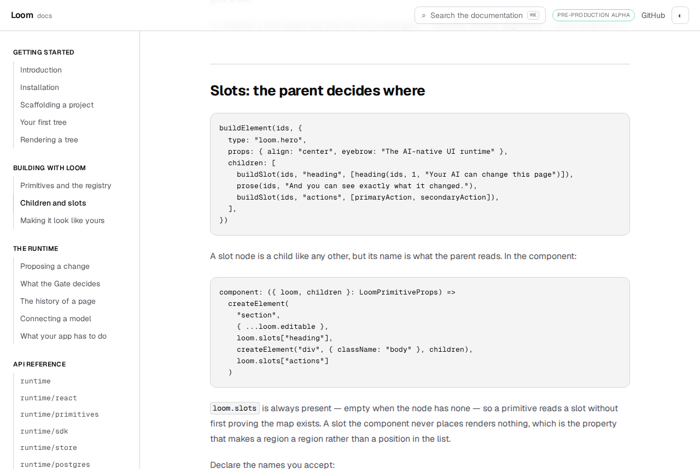
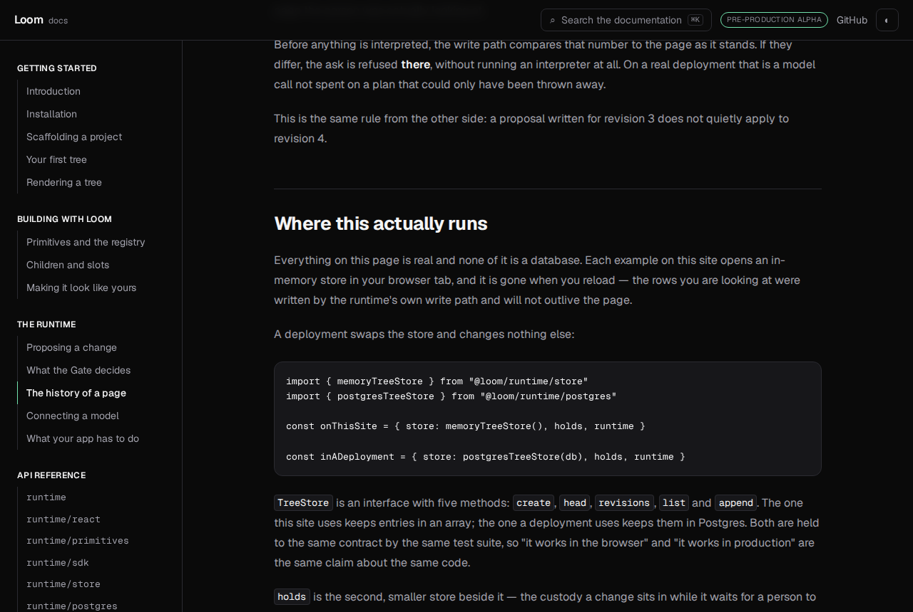
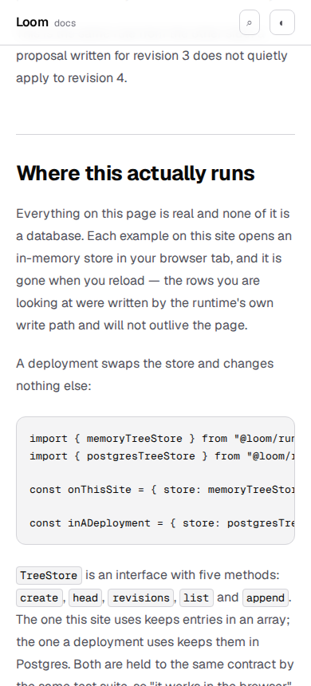

# 5 September 2026 — the code on the page compiles

**Routine:** `Loom docs` · **Branch:** `docs-21-the-code-on-the-page-compiles` ·
**Section:** §4c

Every rendered example on this site is a real `LoomTree` mounted through the
runtime. That is settled, and it buys something specific: an example that cannot
render is a failing test rather than a stale snippet.

The **code beside those examples** had no such guarantee. Thirty blocks of
TypeScript, each with a **copy** button on it, and nothing anywhere had ever
asked whether one of them would compile. A block naming a function the runtime
removed last month looks exactly as convincing as one that works.

One of them could not compile, and had never been able to.


## What was wrong with that block

Here is what `/docs/the-runtime/the-history-of-a-page` shipped, on the page that
explains where a page lives:

```ts
const path = {
  store: memoryTreeStore(),        // this site
  store: postgresTreeStore(db),    // a deployment
  holds,
  runtime,
}
```

Two properties with the same name. It reads perfectly well — that is the trouble.
A person scanning it sees a helpful either/or; a compiler sees `TS1117: An object
literal cannot have multiple properties with the same name`. A reader who copied
it got an error on their first paste.

Nothing on this site could have caught it. The search index skips fenced code by
design. `mdx.test.ts` compiles the *markdown*, which is why the pipe-table failure
was catchable, and never looks at the TypeScript inside a fence. `next build`
does not read a fence at all. It is the same shape of hole as the tables that
shipped as paragraphs of pipe characters for a fortnight, and it wants the same
treatment: something that reads the thing itself rather than the page around it.

## How it is checked

There is a bespoke way to do this — pull the fences out in a test, hand them to
the TypeScript compiler API, assert no diagnostics — and it is the worse one. It
would check the snippets against a compiler configured *here*, in a second place,
whose settings drift from the ones the application is really built with. What a
reader wants to know is whether the code compiles under the same strictness as
everything else: `strict`, `noUncheckedIndexedAccess`, `exactOptionalPropertyTypes`,
the lot.

So the pages' code is written out as **ordinary TypeScript files inside the
application**, one per page, and `tsc --noEmit` — which `pnpm verify` already runs
twice — reads them along with everything else. There is no second compiler and no
second configuration to keep true.

    pnpm --filter @loom/app docs:fences

writes them; `compiled.test.ts` regenerates and compares, so a page edited without
rerunning it is a red test rather than a program describing last week's page. The
committed-generated-file trade is the one `reference.generated.json` already
makes, for the same two reasons: a pull request that changes a snippet shows the
program that snippet became, and staleness is caught rather than assumed away.

## The unit is the page, not the block

A documentation page is a story, and its code is written the way a story is: the
first block builds a tree, a later one reads a field off that same tree, and
neither stands up alone. Compiling each block separately would report thirty
undefined names, none of them a real fault.

So every compiled block on a page is appended, in reading order, into one module
— which is exactly the claim the page makes: that a reader following along ends
up with something that works. Two repairs are needed along the way, both of them
consequences of prose being written for a person:

- **A page repeats an import.** *Your first tree* imports `sequentialIdFactory`
  once to build a tree and again forty lines later to compare it with the random
  one, so a reader arriving at the second block does not have to scroll up. Read
  as one module that is a duplicate identifier. Imports are hoisted and merged.
- **Nothing may be left unused.** The application compiles with `noUnusedLocals`,
  and a page's last block usually declares something the prose then discusses
  rather than uses. Every top-level name the program declares is exported at the
  foot of the file — which is true, a page's names *are* its surface.

## Four kinds of block, and one word

Not every block is a program, and a checker that demanded they all be one would
be demanding the pages be written worse. So a fence says which it is, in one word
after the language:

| Fence | What it is | On the site |
| --- | --- | --- |
| ` ```ts ` | a program | 19 |
| ` ```ts object-body ` | the inside of an object literal | 5 |
| ` ```ts function-body ` | the inside of a function | 3 |
| ` ```ts sketch ` | abridged on purpose, and not compiled | 3 |

Thirty blocks of TypeScript, of which **27 are compiled** into 10 page programs,
and two `bash` blocks that are not TypeScript and are not a program in this
sense.

The word is markdown *meta*. **MDX throws it away** — it reaches neither the
rendered page nor any plugin this site installs — so a reader sees exactly the
same highlighted block either way, and the page source is the only place it
survives. That is why the extractor scans the file rather than compiling it.

`sketch` is the only way out of the check and it costs something: **a sketch must
contain an ellipsis.** The only blocks that escape compilation are the ones
already telling the reader they are incomplete, which is what stops the word
becoming a place to hide a snippet that quietly stopped working.

A misspelling is a hard failure rather than a guess. `objectbody` silently meaning
"leave this one alone" would mean the check had stopped looking, and nobody would
notice.

## What a page is allowed to assume

*What your app has to do* is written from inside an application that already
exists: a `db`, a signed-in `session`, a `page` loaded from the store. Those are
the narrator's, and a program made of the page's code alone cannot see them. One
hand-written file per page names them, with `export declare` — TypeScript's own
way of saying *this exists elsewhere* — rather than fabricating a value.

The failure mode is obvious, and it is the one rule here that matters:

> A context file may **name** what the story assumes, and must **import**
> anything the runtime really provides.

Otherwise the same file declares `renderRequest`, and every snippet on the page
compiles against a definition nobody ships. `compiled.test.ts` refuses any context
file that declares a name appearing in the generated API reference — the same
reference the API section is built from, so **the rule tightens by itself** every
time the runtime exports something new. It also refuses a context file offering a
name its page never reaches for, so the files cannot fill up with scenery.

## The two pages that changed

Only two, and both changes are visible to a reader.

**`The history of a page`** — the duplicate key above. It now shows the two paths
as two objects, which is what the prose beside it already claims: the store
changes and nothing else does.

**`Children and slots`** — the component fragment now annotates its parameters,
`({ loom, children }: LoomPrimitiveProps)`. Without a type there is nothing to
check it against and `noImplicitAny` refuses it, and the page immediately before
it in the rail already writes exactly this. It reads as consistency rather than
noise.



Everything else that changed is the one declaring word on ten fences, which
nobody reading the site can see.

## Tests

`pnpm install && pnpm verify` at the repository root. **Green.** Nothing failed,
nothing was skipped, no test was weakened, and no budget was raised.

| Suite | Files | Tests |
| --- | --- | --- |
| `@loom/runtime` | 119 | 1860 passed — `src/` was not opened |
| `@loom/app` | 161 | 2531 passed |

**34 new tests** in three files, taking the application from `main`'s 2497 to
2531. Five claims were verified by mutation, because a test that has never failed
is a claim rather than a check:

- misspelling a runtime export inside a page's fence — `buildTextt` for
  `buildText` — fails `tsc` with *`"@loom/runtime"` has no exported member named
  `buildTextt`*, naming the generated file and, on the line above, the page and
  line it came from. This is the headline claim and it is the one that matters.
- editing a page without regenerating fails *say what the pages currently say*
- a context file declaring `parseTree`, which the runtime exports, fails *never
  declares a name the runtime already exports*
- removing the ellipsis from a sketch fails *says so, with an ellipsis a reader
  can see*
- deleting a fence's declaring word fails `tsc` outright with a syntax error,
  which is how the ten words were found in the first place

The claim I would defend hardest is derived rather than typed: the count of
copyable TypeScript is never written down. A page added next week raises it
without anyone editing a test, and what is asserted is the shape of the claim —
that every block is either compiled or visibly abridged, and that the compiled
ones are the large majority.



`document.documentElement.scrollWidth` is exactly 390 at a 390px viewport and 1280
at 1280.



## Scope

`apps/loom/app/(docs)/` and one line outside it.

**`apps/loom/package.json` gains a `docs:fences` script**, beside the `docs:api`
one that is already there for the same reason. This is the cross-lane line
`docs/routines.md` asks to be named in the report: a lane follows the content
rather than the location, and a script that regenerates a `(docs)` artefact is
the documentation site's own settings in the same sense the MDX pipeline is.
Nothing else outside the route group was opened. **`src/` was not opened**, and
the generated API reference was not regenerated because the runtime's surface did
not move.

No primitive was needed and none is missing — this is entirely build-time
machinery and two content edits. The generated programs are not a component
library; nothing imports them and nothing renders them.

## Open questions

**Three fence scanners now.** `search/headings.ts` skips fences, `search/prose.ts`
skips fences, and this one reads them. Three hand-written scanners of the same
syntax is one more than is comfortable; they want to be one reader that both
halves consume. Filed rather than done, because doing it while adding the first
consumer is how you get a shared abstraction with one real user.

**The cheapest fix will be the wrong one.** The day a snippet fails to compile,
the fastest way out is to declare the thing it wanted in the context file — and
that is the fix that turns this whole check into decoration. The rule and its
test exist; the finding is there so the next run knows why it is there.

**Still no preview URL that I opened.** `*.vercel.app` is off the sandbox egress
allowlist for the fifth documentation run running. The screenshots above are the
same commit's `next build && next start`, served locally.

**What I would write next.** Nothing on this site tells a reader what to do when
they have shipped and something looks wrong — an audit that disagrees with the
log, a hold nobody answered, a journal that is not shrinking. That was the
recommendation on 1 September and it is still the largest hole in the site.
