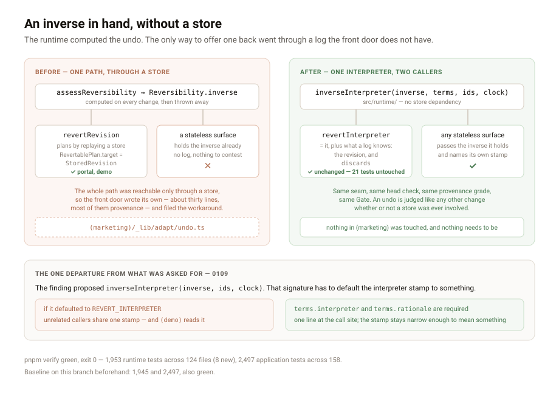

# An inverse in hand, without a store

**Routine:** `Loom daily build` · **Date:** 2026-09-05 (evening run) ·
**Section:** §2 · **Branch:** `framework-25-where-the-face-is` · **Pull request:** #230

## What was completed

**`inverseInterpreter` is public, and a surface with no store can now offer an
undo the Gate judges like any other change.**

The runtime has always computed the inverse of every change at assessment time —
`assessReversibility` hands it back on `Reversibility.inverse`. Until this run the
only way to *offer* one back was `revertRevision`, which plans an undo by
replaying a store. `revertInterpreter` was exported beside it, but it takes a
`RevertablePlan` whose `target` is a `StoredRevision`, so the whole path was
reachable only through a log.

`Loom marketing` hit that this morning making the front door's *Put it back* do
what its label says. That surface has no store and is not getting one (0081). It
composed the change and the undo in one request, so the inverse was already in
hand and nothing had been built on it. It wrote the missing piece by hand — about
thirty lines, most of them provenance — and filed the workaround as the finding.

Read side by side, that file and `revertInterpreter` were the same interpreter:
same empty interpretation seam, same head check, same `authoredBy: "runtime"`,
same confidence of 1. The differences were two, and both are things only a log
can supply.

So the shared part is now one function in `src/runtime/`, depending on no store,
and `revertInterpreter` is that function plus the rationale naming the revision
and the `discards` declaration. **`revertInterpreter`'s behaviour is unchanged and
its 21 tests pass untouched.**

## The decision that was not specified, and why

The finding recommended `inverseInterpreter(inverse, ids, clock)`. I shipped
`inverseInterpreter(inverse, terms, ids, clock)`, and the extra parameter is the
whole of what is worth reviewing here.

That three-argument signature has to default the interpreter stamp to something,
and there is no safe default. `REVERT_INTERPRETER` — `"loom/revert"` — is what
`revertRevision` stamps on a delta **it** planned off a log, and
`(demo)/_lib/undo.ts` reads that stamp back to decide whether a record in front
of a reader is an undo. That is the runtime saying so rather than a surface
pattern-matching English, and it only means anything while the stamp is narrow.
A shared default would put one name on undos planned by unrelated callers and
quietly turn a provenance field into a category label. Inventing a *new* default
like `loom/inverse` moves the same problem down one level.

A default rationale would be the same mistake in the other field: the runtime
writing a sentence about a provenance it does not know, on the one field the
person answering a hold actually reads (0019).

So both are required. It costs a caller one line, and the finding itself said
the interpreter id was "the one decision worth making deliberately rather than
inheriting" — this is that, enforced by the type rather than by a comment.

One smaller call, in the same spirit: an empty `discards` list is dropped rather
than declared, because absence has to keep meaning *nobody looked at a log*
rather than *a log was checked and was clean* (0035). Every stateless caller is a
caller with no log, so that corner case is now the common one.

## Records added

- **[0109](../decisions/0109-an-inverse-in-hand-is-proposable-without-a-store-and-it-is-never-stamped-loom-revert.md)**
  — an inverse in hand is proposable without a store, and the runtime never puts
  its own name on one it did not plan. Its *Alternatives considered* is mostly
  the argument against defaulting the stamp.

Nothing superseded. Index regenerated; it reports one hole at 0106, which is a
number claimed on a branch that has not merged, and is the note 0097 designed
rather than a failure.

**0109, not 0106.** The next free number depends on which branches you can see:
`main`'s next is 0106, this branch already carries 0103–0105 and 0107–0108, and
0106 itself is claimed on a branch that has not merged. I took the next number
free across every branch on the remote, which is the only reading that cannot
collide.

## Findings

**Closed:**

- `Loom marketing`, 5 September — *a stateless surface can compute an undo and
  cannot assemble one*. Closed by the export. Closed by a **new entry** rather
  than an edit, because the original is on `marketing-22-putting-it-back-is-a-change`
  and is not readable from this branch.

**Filed:**

- *The second half of the undo seam is a proposal field, and it is a unit of its
  own* — carrying forward `Loom demo`'s 2 September entry (a revert does not say
  which revision it reverts except in prose). Scoped and deliberately not built;
  see below.
- *A focus stop is not a target, and one primitive is not yet a pattern* —
  acknowledging `Loom primitives`' entry of this morning, agreeing with its own
  "nothing, yet", and making it visible from a merged `main` rather than only
  from the branch that filed it.

## What I deliberately did not build

`Loom demo`'s finding looks adjacent enough to fold in and is not the same size.
`inverseInterpreter` is generic over callers with no revision to name, so a
structured "which revision this undoes" belongs on what `revertInterpreter` alone
produces — which means `proposalSchema` grows an optional field and it has to be
plumbed through commit and disposition into the narrated events before the
portal's history screen can read it. That is a schema addition with a plumbing
tail. Folding it in would have made a reviewable change unreviewable, so it is
filed with its scope written down. It is cheaper than it was: one interpreter to
add it to instead of two.

I did not touch `(marketing)/_lib/adapt/undo.ts`. The finding is closed by the
export existing; replacing those thirty lines is that lane's call and timing.

## Test numbers

`pnpm verify` green, **exit 0**.

| | this run | baseline on this branch |
| --- | --- | --- |
| runtime tests | **1,953** across 124 files | 1,945 across 123 |
| application tests | **2,497** across 158 files | 2,497 across 158 |

**8 new tests**, all in `src/runtime/inverse-interpreter.test.ts`. Nothing failed
and nothing was skipped. One of the eight is the round trip that is the whole
point: a change composed with no store anywhere, its inverse taken from the
assessment, interpreted, and applied — and the tree comes back equal to the one
before the change.

`reference.generated.json` is in the diff. It is regenerated
(`pnpm build && pnpm --filter @loom/app docs:api`, in that order) and not
hand-edited; the diff is exactly the three new exports and nothing else. It is
the one file here outside this lane.

One error caught by the typecheck and not by the tests: the discards fixture read
`root.nodeId`, and a `LoomNode`'s id field is `id`. Worth a line only because it
is the second run in a row where `pnpm test` passed a file that `tsc` then
rejected — vitest does not typecheck, so a green test run is not evidence the
build is green.

## Open questions

- **The `terms` parameter is the one call worth a second opinion.** It is one
  more line for every caller, forever, to protect a stamp that one surface reads.
  The argument is in 0109 and I think it is right; it is also the kind of call
  that is cheap now and expensive to reverse once callers exist.
- **Seven open findings this lane owns, and four of them need your word rather
  than engineering** — whether `derivePalette`'s `clean` should widen, whether a
  palette carries semantic status slots, which of two fixes the failing pairings
  get, and 0096's anchor addressing. The oldest is fifteen days.
- **Twenty-seven pull requests are open and nothing has merged since 1 September.**
  Eighth run to report the count. `main` is green and has been for four days.

## Method note, for whoever runs next

Both findings this run acted on were **invisible from `main` and from this
branch**. I found them by diffing `FINDINGS.md` across every branch on the
remote — eight framework-owned findings are filed on other lanes' unmerged
branches right now. This morning's run of this lane made the same discovery and
the same point; it is repeated here because the fix is a merge, not a technique,
and until the queue moves every run of every lane has to do this or read a stale
queue. The command is a script over `git show <branch>:FINDINGS.md`, not
something in the repository, and that is arguably the finding.
