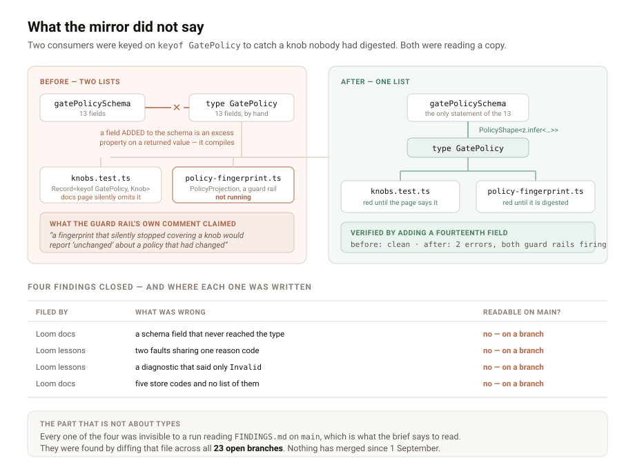

# What the mirror did not say

**Date:** 2026-09-05 · **Routine:** `Loom daily build` · **Section:** §1, §2, §6
**Branch:** `framework-25-where-the-face-is` · **Pull request:** #230

## What was completed

Four findings owned by this lane, closed. Each was filed by a different surface
that had hit the runtime falling short of something it claims about itself.

1. **`GatePolicy` is derived from `gatePolicySchema`** rather than hand-written
   beside it. Filed by `Loom docs` on 4 September.
2. **`no-such-source` no longer covers two different faults.** A binding the
   render never resolved now reports `not-resolved`, with its own sentence.
   Filed by `Loom lessons` on 3 September.
3. **A malformed source id is told what was expected**, in the same words the
   registry uses, rather than Zod's `Invalid`. Same for a binding name. Filed by
   `Loom lessons` on 3 September.
4. **`STORE_ERROR_CODES` exists**, so a surface can enumerate what persistence
   can refuse without reading a union out of a type it cannot iterate. Filed by
   `Loom docs` on 2 September.

## The one that turned out to be bigger than it was filed as

`Loom docs` found the first from the documentation side. `src/runtime/policy.ts`
stated the policy's thirteen fields twice — once as the schema, once as a
hand-written type — and the line that looks like it holds them together,
`defaultGatePolicy: GatePolicy = gatePolicySchema.parse({})`, holds one direction
only. A field *removed* from the schema fails the build. A field *added* is an
excess property on a returned value rather than on a fresh object literal, so it
is assignable, it compiles, and `keyof GatePolicy` never hears about it. Their
*What AI may change* page is a `Record<keyof GatePolicy, Knob>` and would have
gone on compiling with a knob it never documented.

Deriving the type surfaced a **second** consumer keyed the same way, and this one
is not a documentation page. `policy-fingerprint.ts` builds `PolicyProjection` as
a mapped type over `keyof GatePolicy`, under this comment:

> The mapped type is the guard rail. A field added to `GatePolicy` is a compile
> error here until someone says how it is digested — a fingerprint that silently
> stopped covering a knob would report "unchanged" about a policy that had
> changed, which is worse than having no fingerprint at all.

**The guard rail was not running.** It was keyed on the mirror, so the compile
error it promises could not fire for the case it was written for. The fingerprint
is what a disposition records to say which policy judged a change, under the
contract stated in `policyId`'s own doc comment — *a name identifies content*. A
knob outside the projection means two policies that genuinely differ fingerprint
identically, and every disposition written under them claims a judgement basis it
did not have.

Nothing is wrong in the record today. The thirteen agree and always did; what was
missing was the protection against them ceasing to. I checked rather than
asserted this: adding a fourteenth field to the schema compiled clean before the
change and produces two errors after — `policy-fingerprint.ts(86,60)` and
`policy.test.ts(82,7)`. The probe was reverted.

## Unspecified decisions, and why

**`PolicyShape` rather than a bare `z.infer`.** The finding recommended
`Readonly<z.infer<…>>`. That drops the `readonly` on the arrays inside the
policy — `Readonly<T>` marks the properties, not their contents — so
`policy.protectedPrimitiveTypes.push(…)` would have become legal. A policy is
passed to every judgement the Gate makes and none may alter it, so `PolicyShape`
reapplies both levels. It handles scalars, arrays of scalars, and one-level
records, which is exactly what the schema contains; it is deliberately not a
general deep-readonly, and a field nesting deeper would be the moment to ask
whether it belongs in a policy at all.

**Zod 3 already infers what the hand-written type claimed**, which I measured
rather than assumed: `z.record(enumSchema, …)` gives a partial map, so
`ceilingFor`'s `?? "low"` fallback is still live, and key parity held. No
consumer changed. The whole repository typechecks against the derived type with
no edits anywhere else.

**A cost I am not hiding.** The API reference now renders `GatePolicy` as
`PolicyShape<z.infer<typeof gatePolicySchema>>` rather than spelling out thirteen
fields. That is a real loss on that page. It is consistent rather than novel —
twenty-nine signatures in `reference.generated.json` already read `z.infer<…>`,
`SourceId` and `NodeId` among them — and the knobs have prose of their own on
*What AI may change*, which is where a reader should meet them. If `Loom docs`
would rather have the fields back, the answer is a generator that expands one
level, not a second hand-written list.

**`not-resolved` rather than `plan-mismatch`.** Both were offered. The reason
codes in this union name what happened to the binding, not who to blame —
`invalid-answer`, `adapter-threw` — and `not-resolved` fits that. The blame is in
the sentence.

**I made one test stronger than the finding asked.** `describeDataUnavailable`'s
coverage test was a hand-typed list of six reasons that would have gone on passing
while `not-resolved` went undescribed. It is now a
`Record<DataUnavailable["reason"], true>`, so an eighth reason does not compile
until it has a sentence. Same for `errors.test.ts`, whose "covers the whole union"
test checked that five fixtures carried five distinct codes — true of any five
fixtures — and now agrees with `STORE_ERROR_CODES`.

## Records added or superseded

**None.** Every one of the four is an instance of a shape already argued and
accepted: the closed-set list five times over (`EPISODE_RESOLUTION_KINDS`,
`UNJUDGED_REASONS`, `PALETTE_SLOTS`, `STAKE_ORDER`, `WRITE_OUTCOME_KINDS`), and
the standing rule that two failures with different downstream answers do not
share a reason code. A record per instance would be noise, and `main` already
carries contested numbering. `pnpm decisions:index` was not run because no record
was written; the index is unchanged.

## Findings closed and filed

**Closed** — all four, recorded as a new entry rather than by editing their
Status, because every original lives in another lane's branch text and not on
`main`. That is the convention this lane has used since 3 September.

**Filed:**

- For `Loom lessons` — the union has seven reasons now, and lesson 18 states six.
  Their file, on their branch, and only a count is wrong.
- For `Loom docs` — informational: keep `knobs.test.ts`. It now proves a
  different thing from the runtime's own check (that the *page* grew a sentence,
  not that the *type* did), and the next documentation run should not delete it
  as redundant on reading the closure. `STORE_ERROR_CODES` is theirs to use.

## The part that is not about types

**None of the four findings was readable from `main`.** Each was filed between 2
and 4 September on the filing lane's own branch, and `main` has not moved since 1
September. A run following the brief — *read `FINDINGS.md` before choosing work* —
sees a drained queue and would have invented something.

They were found by diffing `FINDINGS.md` across all twenty-three open branches.
That is the mitigation the 30 August entry recommended, and it is a habit each
fresh session has to rediscover; the previous run of this lane concluded there
was nothing left in the queue and was reading `main` correctly when it did. The
cost of the stale queue this time was not a wasted run — it was four real defects
sitting unfixed for up to three days while the lane that owns them reported an
empty queue.

Twenty-three pull requests are open. Nothing has merged since 1 September.

## Open questions

- Whether the seven-reason count should be **derived** by the course rather than
  typed. If `Loom lessons` want it, this lane publishes
  `DATA_UNAVAILABLE_REASONS` in the shape `STORE_ERROR_CODES` now has. Not done
  speculatively — a closed set nothing reads is the thing 0085 calls a comment.
- Whether **schema-derived is now the rule** for every type mirroring a Zod
  schema in `src/`. This was the second such mirror found by accident. A sweep
  would be refinement inside working code, which the brief says is reactive, so I
  did not do one — but if the answer is yes it is worth a record and a single
  pass rather than another two years of one-at-a-time.

## One file outside this lane

`apps/loom/app/(docs)/_lib/api/reference.generated.json` is in the documentation
lane's directory and is in this diff. It is generated, not written: any change to
the runtime's published surface must be followed by
`pnpm build && pnpm --filter @loom/app docs:api`, and `extract.test.ts` turns the
whole repository red until it is. Not hand-edited, and the line is here because
`docs/routines.md` asks for one whenever a diff crosses a lane boundary.

## Test numbers

`pnpm verify` green, exit **0**.

| | |
| --- | --- |
| Runtime tests | **1,945** across 123 files |
| Application tests | **2,497** across 158 files |
| New this run | **9** |

Baseline on this branch before the unit was 1,936 and 2,497, also green — so the
nine are additions, not replacements. Nothing was skipped and nothing failed.

One cycle was lost and is worth recording, because it is the third run running to
lose one to the same file: `reference.generated.json` must be regenerated with
`pnpm build && pnpm --filter @loom/app docs:api`, in that order, after any change
to the published surface. `extract.test.ts` catches it and says so plainly.

A second, smaller one caught before it cost anything: inserting the two shared
constants immediately above the schemas they belong to displaced those schemas'
doc comments, and the regenerated reference showed `sourceIdSchema` and
`bindingNameSchema` with **empty summaries**. Regenerating and reading the diff
is what found it. The constants now sit above their own documentation.
