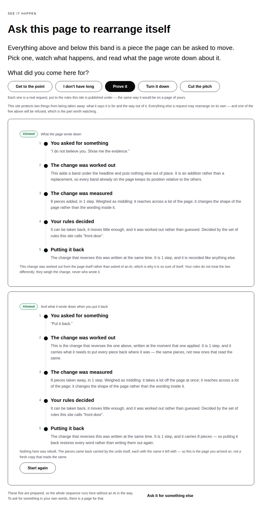
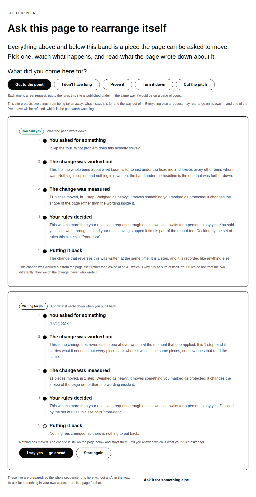
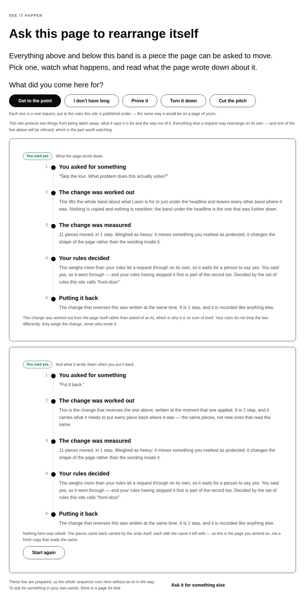
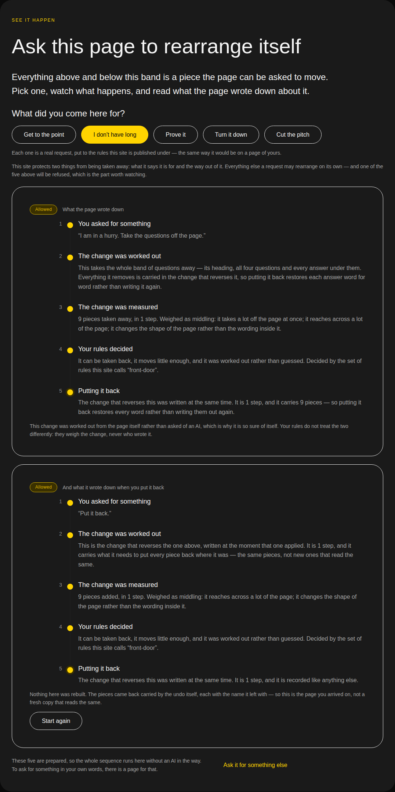
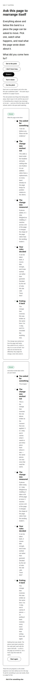
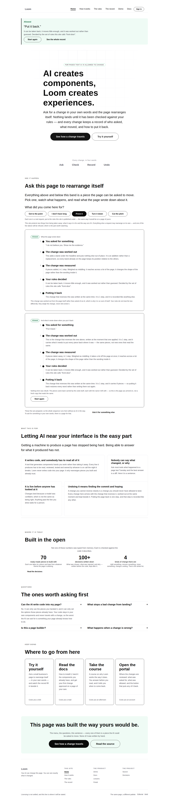

# 2026-09-05 — marketing: putting it back is a change too

The front door has offered a button reading **Put it back** since 20 August. It
was a link to `/`.

Pressing it dropped `?ask=` from the address and the page was rebuilt from its
source. The result looked exactly right, which is the entire reason nothing
caught it in sixteen runs: **a landing page rebuilt from source and a page
restored by its own undo render identically.** The difference between those two
things is what this product is.

Three sentences on the same page said it was the second one:

| where | what it says |
| --- | --- |
| the panel's fifth rung | *"The change that reverses this was written at the same time… so putting it back restores every word rather than writing them out again."* |
| the questions band | *"Every change is stored together with the change that reverses it, and undoing is checked against your rules and written down like anything else."* |
| the hero | *"…every change keeps a record of who asked, what moved, **and how to put it back**."* |

All three were true of the runtime and none of them was true of the button. The
recorded positioning is that **the differentiator is not adaptation, it is the
record** — and the half of the record a competitor cannot copy is the half that
was being asserted rather than shown.

---

## What shipped

**The button now does what it says.** The inverse the runtime writes at the
moment a change applies is put back through the same sequence the change went
through — interpreted, measured, weighed by the same named rules, applied only
if they allow it — and the panel gains a second record.

A visitor presses *Put it back* and reads what the page wrote down about that.

### The demonstration this bought, which was not arranged

The interesting one is *Get to the point*. It moves the band this site protects,
so the rules hold it and the visitor answers. Putting it back **moves that same
protected band again** — so the rules hold the undo too, and there is no way
round it but the same yes.

Nothing was arranged to produce that. It falls out of running the undo through
the rules the site already publishes, and the only way to lose it would be to
exempt an undo to make the band tidier. `undo.test.ts` asserts it in both
directions so nothing ever does.

What the five choices now do, measured this run:

| choice | the change | putting it back |
| --- | --- | --- |
| Get to the point | held, then approved | **held**, then approved — 11 pieces moved |
| I don't have long | allowed | allowed — 9 pieces added back |
| Prove it | allowed | allowed — 8 pieces taken away |
| Turn it down | allowed | allowed — 2 settings on 1 piece |
| Cut the pitch | refused | nothing to put back, and the panel says so |

### The sentence the second card is allowed to say, and the one it is not

Under a landed undo the card reads:

> Nothing here was rebuilt. The pieces came back carried by the undo itself, each
> with the name it left with — so this is the page you arrived on, not a fresh
> copy that reads the same.

Under a **held** undo it must not, and the first draft of this change printed it
there anyway. Nothing had been put back; the change was still on the page. That
is the same defect this run exists to remove, reintroduced one card lower and in
the state that is most interesting to read, so it has its own sentence and its
own test.

### Two parameters, and the reason there are two

`?ask=proof&back=1` is the front door with a change made and put back.
`?back-yes=1` is the visitor answering a hold on the undo. Two questions asked at
two moments, so two answers in the address — and the page still keeps nothing
between one request and the next (0081). The whole state of that demonstration
can be copied, sent to somebody and reloaded a week later.

The `-yes` suffix is the record page's own convention for approval, so the two
pages name it the same way.

## Tests

`pnpm install && pnpm verify` — **green, exit 0. Nothing failed, nothing skipped,
no test weakened.**

| suite | before | after |
| --- | --- | --- |
| `@loom/runtime` | 1860 / 119 files | **1860 / 119 files** — `src/` was not opened |
| `@loom/app` | 158 files | **2533 passed / 159 files** |
| marketing, within it | **827 passed** | **863 passed** |

Both marketing figures are measured on the two trees. The app total before is
not: `main`'s own `pnpm verify` was run first and came back **exit 0**, and its
tail is what this branch's numbers are held against — 2,533 less this branch's
36 is 2,497, which is the figure #237 reported on `main` yesterday. Said as a
derivation because that is what it is.

Thirty-six new tests in one new file, all asserted against the published tree
rather than against the module under them.

**Four assertions verified by mutation**, because a test that has never failed is
a claim rather than a check:

| mutation | result |
| --- | --- |
| the panel's control points at `/` again — *the exact behaviour this run replaced* | **4 failed**, 858 passed |
| the undo interpreter drops its head check | **1 failed** — the stale-inverse test alone |
| a held undo applies without the visitor's yes | **2 failed** — the hold, and the link that carries the yes |
| the undo's sentence written in our own vocabulary | **4 failed** — the register test, once per choice |

The first of those is the one worth reading. **The first version of that test
passed under the mutation**, because it looked for the address anywhere on the
page and found it in the notice at the top rather than in the panel. It now reads
the hrefs off the band it is about, and it follows the address it finds back
through the route to check that an undo comes out. A negative assertion written
against rendered markup has the same problem in a worse form — HTML escapes the
`&` between two parameters, so `not.toContain` passes whatever the page holds —
and one of these was written that way before it was caught.

## Findings

**Three filed, one of them against this lane.**

- **A stateless surface can compute an undo and cannot assemble one**, for
  `Loom daily build`. `revertRevision` and `revertInterpreter` already do this and
  are reachable only through a store, because the plan they take carries a
  `StoredRevision`. The front door has no store and is not getting one (0081).
  What is missing is the short piece between *here is an inverse* and *here is a
  proposal the rules can weigh*, and it was written here in about thirty lines.
  Recommendation: export `inverseInterpreter(inverse, ids, clock)` and let
  `revertInterpreter` be it plus the rationale a store can write.

- **`loom.milestone`'s marker gutter now costs a 7,299px band on a phone**, for
  `Loom primitives` — an instance on their 1 September entry, with the
  measurements above.

- **`/the-record` calls dropping a request "putting one back"**, for this lane.
  It is defensible there and it was not on the front door — a history is a list
  in the address, and replaying it without its last entry honestly renders the
  page as of before that change. What is now inconsistent is the language: one
  page reports an undo as a change with a verdict, and the other uses the same
  words for dropping a token. Recommending the larger fix (run the inverse there
  too), not taken this run because the address grammar is the interesting half of
  it and bolting it on would have made a pull request nobody can review.

## Open questions

- **Positioning, audience and the licence line** (#96, restated on every
  marketing pull request since #134). Still the site's one placeholder and still
  the Phase 2 gate. Untouched.
- **The eight-item menu** (#166, #182). Untouched, and worth naming as the reason
  this run added no fifth page: the work went into the band the site's own
  argument rests on rather than into another entry in the bar.
- **`loom.embed` cannot frame this deployment's own application** (#237). Still
  the thing blocking §4d's *"embeds the demo rather than describing it"*, and
  still one decision of the maintainer's away.

## What it costs, measured

Under the bold palette, with no colour named anywhere in this diff:

And the price of the second card, off `next start` on the production build:

| band height | 1440px | 390px |
| --- | --- | --- |
| nothing asked | 949px | 2,090px |
| one record | 1,351px | 4,097px |
| two records | **2,114px** | **7,299px** |

`scrollWidth` is exactly 1440 at 1440 and exactly 390 at 390; nothing scrolls
sideways at either.

**The phone column is the honest bad news and it is not this lane's to fix.**
`loom.milestone` reserves `5.5rem` for its marker column at every viewport, so a
rung's prose gets 101px of the 390 and each line becomes three or four. The
1 September run filed that with the wrapped heading as its example. Two records
turn it into a band five screens tall, so it is re-filed with the number rather
than the anecdote. The alternative inside this lane is to stop showing the second
record on a narrow viewport, which is hiding the thing the band exists for from
every visitor on a phone.

Nothing scheduled and nothing armed.
