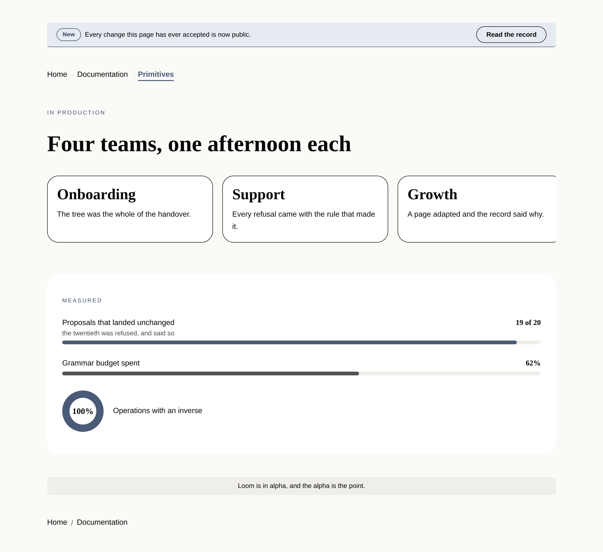

# The furniture between the bands

**Routine:** `Loom primitives` · **Date:** 2026-09-05 · **Branch:**
`primitives-24-the-chrome-a-page-carries` · **Section:** §4b

## What shipped

Four primitives, and the library is **74**.

| | What it is | Why it could not be composed |
| --- | --- | --- |
| `loom.banner` | The strip above everything: a short message, and one thing to do about it | The action is a *region* it places, not the last child |
| `loom.link-trail` | The way back out — `loom.link` arranged a second way | Separators sit *between* children, which no single node knows |
| `loom.carousel` | The fifth general arranger: a row that scrolls and snaps | `overflow` and `scroll-snap` are not a stack with a gap |
| `loom.meter` | A proportion drawn against its whole | A track with a fill in it is markup no arrangement of stats produces |

They are one unit: **what a page does that none of its bands do** — announce,
orient, run past the edge, and show how much of a thing there is.

## Why these, and not the two Hermes pairs that are left

The port map has two pairs outstanding — a book shelf and a property listing —
and this run did not build them, for the second time running and for the same
reason: *"when we demo this it really needs to pop"* plus the brief's *prefer
the primitives the demo and the marketing site will actually stand on*. No
version of Loom's own site is an estate agent's grid. Every version of it has a
strip at the top, a trail through the documentation, a row of cards on a phone,
and a number that means more against a ceiling than on its own.

The stronger argument is that three of the four are the **page chrome** gap the
port map already named and did not finish. Hermes was a creator-profile toolkit
whose app shell owned the top of the window, so nothing in its seventy blocks is
a nav, a footer, an announcement or a breadcrumb. `loom.nav` and `loom.footer`
closed the first half of that on 19 August. This is the second half, and it is
the kind of gap that is invisible from the ledger because the ledger counts
Hermes blocks.

**Findings first, as the brief requires: no finding owned by this lane was open
when this run started**, and no maintainer comment was outstanding on #222, #229
or #235 — the only comments on all three are this lane's own and Vercel's. So
this is a breadth run rather than a queue run, which alternates correctly with
#229.

## Which fields became nodes, and which stayed props

None of the four ports a Hermes block, so 0052's question was asked against the
content model rather than against a field list. It is still the question that
decided every one of them:

**`loom.banner` — the whole primitive is the answer.** The obvious shape is
`message`, `ctaLabel`, `ctaHref`, which is the exact mistake
`docs/primitive-granularity.md` names: four props impersonating four nodes, and
*"move the button above the message"* unreachable forever. The message is
**children**. The action is a **region** (0051), because the strip puts it at
the far edge on a laptop and under the message on a phone — *"the last child is
the button"* is a rule no schema states and every `move` breaks. What is left is
three fixed fields: `tone`, `align`, `label`.

**`loom.link-trail` — no new child type.** A breadcrumb is `loom.link` in a
second arrangement, which is 0054, and the record's own consequence is the
reason there is no `loom.crumb`: one link primitive must not become two that
differ by the element they render. `separator` is a prop by 0052's display-mode
clause — three renderings of one arrangement, changing no node.

**`loom.carousel` — the state that is deliberately absent.** No `activeIndex`,
no dots, no arrows. Which item a reader is looking at is the reader's, not the
page's: a render is a pure function of the tree (0008), so a tree-carried index
is a band that starts on the fourth card for everyone at once. `item` is a floor
for each item's width and never a count — the near-miss the granularity doc
warns about — and its names are local rather than `COLUMN_NAMES` for
`loom.offering-grid`'s reason: `two` and `three` are counts across a page, and a
carousel has no such number.

**`loom.meter` — the one that had to be argued against a primitive that already
exists.** `loom.stat` is a figure typeset; a meter is a proportion drawn. The
port map's collapse rule is the test — two blocks that want different *markup*
rather than different words are two primitives — and everything else follows
0052's fixed-field half. `shape` is the prop worth naming: bar or ring is two
renderings of identical content, and changing it changes no node.

## Four things worth reading the code for

**1. One number fills two shapes, and a registered custom property is why.**
A bar's width and a ring's conic stop are the same proportion, so they are the
same declaration — `--loom-meter-sweep`, inline, once per node. `@property`
registers it as a `<percentage>`, which is the whole reason a single keyframe
can animate both from nothing; an unregistered custom property interpolates
discretely, so the bar would jump from empty to full in one frame. A browser
without `@property` renders the right proportion and does not animate it, which
is the correct way to fail. The width lives in the stylesheet rather than on the
element, because an inline value would beat the reduced-motion rule that stops
it (0055).

**2. The ring's middle is cut out, not covered.** `loom.hero`'s aurora
reasoning, one primitive later: a disc painted over the centre has to be the
colour of whatever is behind the band, and the same ring sits on the canvas,
inside a card and on a tinted section. A `mask-image` removes the middle
instead, so the page shows through under every palette and every parent.

**3. The trail's separators are on a wrapper, and that is not tidiness.** A
`::before` on the anchor is *inside* the link, so its glyph joins the link's
accessible name and a reader hears "slash Documentation". On a wrapper the
container makes, it is beside the link instead. The default separator is a
rotated corner with `content: ""` — a shape with nothing to announce at all,
which is the same thing on every reader's machine, where a typed `/` is
announced by some screen readers and skipped by others.

**4. The carousel does not fade at its edges, and refusing that is the
interesting half.** `loom.marquee` dissolves at both ends and is right to: its
content there is always mid-travel. A scroller is the opposite case at the one
position every reader starts from — at rest the first item is flush against the
leading edge, and the same mask washes out content that has fully arrived. A
scroll-linked mask would say the true thing and is not the static CSS 0055
requires. So the affordance is the honest one: **an item is never wider than 82%
of the band**, which cuts the next one off visibly at every width.

## What the pictures found and no assertion could

**Tenth run running.** One real defect and one confirmed judgement.

- **`19 of 20` broke after `of`.** The bar's readout sits opposite its label, and
  on a phone a long label squeezes the figure until it wraps — a figure over two
  lines stops reading as a figure. `textWrap: "nowrap"`, which is `loom.tier`'s
  lesson about a price arriving in a second primitive. Every assertion in the
  diff passed before the fix and after it.
- **The peek is the affordance, and it had to be looked at to believe.** The
  cheap version of a carousel — one card per screen — passes every test in this
  diff and gives a reader no reason to swipe. The second card cut off at the
  edge is the whole difference, and it is a screenshot rather than an assertion.

Six shots, three palettes, two widths, each carrying a `scrollWidth ===
innerWidth` measurement: **six of six, no overflow.**

## Records

**None written, deliberately.** Every choice here applies a record that is
already `Accepted` — 0051 for the banner's region, 0052 for the enums and the
fixed fields, 0054 for both container names, 0055 for the fill, 0063 for the two
strings the primitives own, 0008 for the state the carousel does not keep.

The one naming call worth flagging is `loom.link-trail`: 0054 says the
arrangement word is *"descriptive and drawn from a small set"* and lists five,
and `trail` is not among them. `carousel` is. The alternatives are worse by the
record's own rules — `loom.breadcrumbs` is the bare plural it forbids, and
`loom.crumb-trail` invents a child that is a link. It is argued in the file. If
a record is wanted for the vocabulary, it is one file and I will write it.

## Findings

**Closed — none.** None owned by this lane was open.

**Filed — two:**

1. **The picture harness, rebuilt a second time**, with the four lines that
   would stop the third — where the browser is, why `npx playwright` resolves
   nothing, and why a `file://` URL over static markup is the honest shot. Owned
   by `Loom daily build`; every surface lane has now written this privately.
2. **A primitive that is a focus stop is not a target, and nothing can say so.**
   `loom.carousel` takes a `tabindex` because a scroll region is focusable in
   some browsers and not others, and `interactive` (0064/0068) has no word for
   it. Filed with an explicit recommendation to do **nothing yet** — one
   primitive is not a pattern — so that the second one finds the diagnosis.

**Not re-filed: `21st.dev` is blocked for the fourteenth time**, seventh lane.
`docs/routines.md` lists it under `permissions.allow`; `WebFetch` returns
`EGRESS_BLOCKED`. The visual bar the brief names has never once been consulted
by the routine told to consult it, and the entry is already open.

## The cross-lane lines

Two files outside this lane, both instructed by their own tests, and both the
same shape as #235's:

- `apps/loom/app/(marketing)/_lib/copy.ts` — `FACTS.primitives` `"70"` → `"74"`.
  A derived count with a test that fails until it is right.
- `apps/loom/app/(docs)/_lib/api/reference.generated.json` — regenerated with
  `pnpm --filter @loom/app docs:api`, which is what its own failure message says
  to run.

## Test numbers

`pnpm verify` **green**, end to end.

| Suite | Files | Tests | Skipped |
| --- | --- | --- | --- |
| Runtime | 119 | 1,872 | 0 |
| Application | 158 | 2,497 | 0 |

Twelve tests added to `src/primitives/library.test.ts` (200 → 212), over a new
`furniturePage` fixture that renders every prop whose value changes the markup —
two banners, two separators, both meter shapes, both snap positions — because
the conformance probe asks a primitive what it does under every closed choice
(0075) and a fixture that only renders defaults leaves half of each schema
unseen.

**Nothing was weakened.** Three existing assertions changed their expectation
rather than their strength: the registration list is 74 rather than 70 and names
the four in their registration positions, the leaves list gains `loom.meter`
with the reason it is one, and the coverage test gains the new fixture — which
is the test that would have failed if any of the four had been registered and
never rendered.

## What the library still cannot express

- **A carousel cannot bleed past the padding of the band it is in.** The
  full-bleed row a phone actually wants needs a negative margin equal to its
  parent's padding, and a primitive cannot know that number. It is a real
  design question — a `bleed` prop that lies, or a page-level seam — and it
  should be answered against a page rather than guessed at here.
- **A tab strip.** Unchanged, and the diagnosis from #235 stands: `disclose`
  publishes one boolean per control, which is an accordion. A `select` member of
  the behaviour vocabulary is the framework lane's and needs a record.
- **A page cannot say which of its bands the reader is currently in.** The trail
  and the anchors between them get a reader *to* a place; nothing marks the place
  they are in as they scroll, because that is client-side state.
- **A palette still has no shadow slot**, and after #235, no `bg-overlay` any
  primitive may read. Both are `src/theme/`'s.
