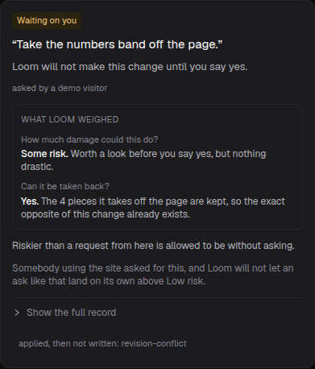
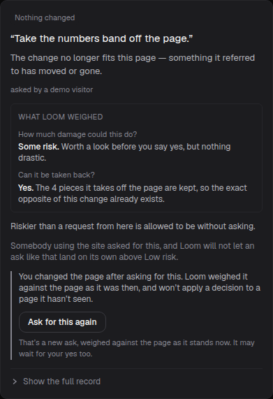
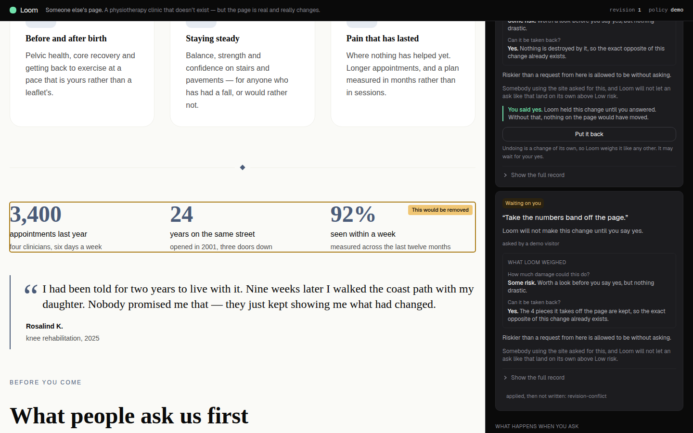
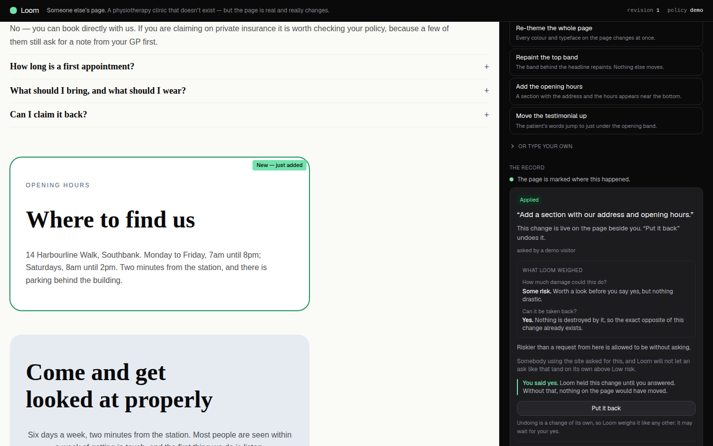
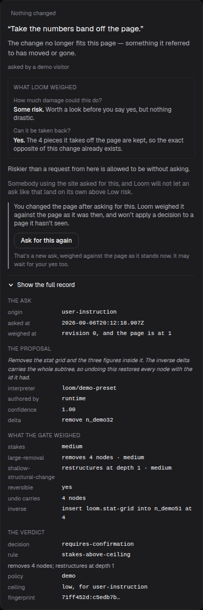
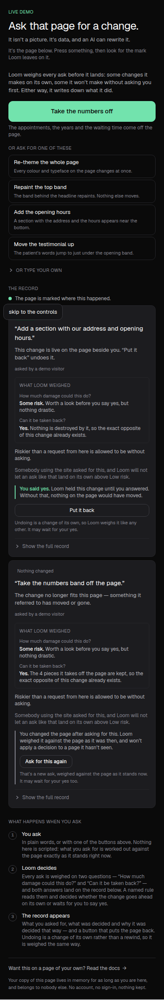

# The demo's own primary button, on a card it could never land

**Routine:** `Loom demo` · **Branch:** `demo-12-what-allowing-it-would-do` · **6 September 2026**

The sixth unit on this branch, and the second chosen from the live diagnosis
rather than from the 28 August backlog. Yesterday's run named it in *Found while
building* and left it for today:

> **Two holds can be outstanding at once and only one is marked.** Press two
> presets without answering the first and both cards say *Waiting on you*, while
> the rail's single line reads *"The page is marked where this would happen, if
> you say yes."* A stranger with five buttons and no instruction to answer one at
> a time reaches this easily.

Driving it turned out to be worse than the note. **It is not an under-marked
state, it is a dead end that eats a press and blames nothing.**

---

## What a stranger could not understand before this run

Four presses, at 1440×900 and 390×844, no `ANTHROPIC_API_KEY` in the
environment — the supported state the brief names, and the state every frame
below was taken in.

1. **Take the numbers off** → the Gate holds it. The band is ringed amber.
2. **Add the opening hours** → the Gate holds that too. Two cards now read
   *Waiting on you*, each with **Apply this change** and **No thanks** on it.
3. **Apply this change** on the top card → the section lands, the page moves to
   revision 1.
4. **Apply this change** on the other card → **nothing**.

The page does not move. The two buttons vanish with nothing in their place. The
card still says **Waiting on you** and *"Loom will not make this change until you
say yes"* — false in both halves, because it is not waiting and no yes will ever
land it. And the only account of what happened is a line of runtime shorthand in
the smallest type on the card:

> `applied, then not written: revision-conflict`

Meanwhile the page is still ringing the numbers band in amber, labelled *This
would be removed*, which is this surface's colour for **a question it is still
asking you**. It is not asking.

| the card, before | the card, now |
| --- | --- |
|  |  |

### Nothing in the runtime is wrong, and it is not even quiet about it

`confirmHeld` says exactly what happened, in its own doc comment:

> A hold names a revision, so a hold whose tree has moved on can never apply
> again — **it is not stale pending a retry, it is dead.** Confirming one
> therefore releases it and reports the conflict, rather than leaving a proposal
> in the queue that will refuse every time it is answered.

And `HeldProposal.baseRevision` exists for the express purpose of letting a
surface notice before it gets there:

> Held separately from the delta **so a reader can tell a hold is stale without
> parsing the delta**, and because it is the intent's promise, not the delta's.

A field put on the type for a reader, which no surface had ever read. So this is
the lane's standing diagnosis in its cleanest form yet: **the machinery was right
and did not reach the screen.**

### Why it is a card rather than a guard

The tidy fix is to stop a visitor holding two changes at once — grey the other
asks out until the open one is answered. That removes the failure, and the
lesson with it.

A verdict in Loom belongs to **one version of the page**. The Gate weighed this
delta against the tree as it stood and will not carry that verdict onto a tree it
never saw. It is the same property `0028` protects for undo, it is a real
difference between this and a text box that edits a page, and it had never been
on this surface in any form. Said plainly, at the moment it bites, it is one of
the better sixty seconds this demo has — and it costs the visitor nothing,
because they get the ask back.

## What a stranger can understand now

**The card says what became of it.** `no-change` — *"Nothing changed. The change
no longer fits this page — something it referred to has moved or gone."* Those
are the shared table's words, from `(portal)/_lib/vocabulary`, so the demo and
the review queue still cannot end up calling one state two things.

**And why, in the sentence rather than in a code:**

> You changed the page after asking for this. Loom weighed it against the page as
> it was then, and won't apply a decision to a page it hasn't seen.

*You changed the page*, not *the page changed*: on this surface the visitor is
the only thing that can have moved it, and an ask that fails because of something
you did is a different thing to be told from one that fails for no visible reason.

**And the way out.** **Ask for this again** posts the same suggestion against the
revision the page is actually at, through `askForChange` — the identical path the
button in the panel takes, so the Gate weighs it from nothing and may hold it
again. The caption says so before the press, which is the rule `AskPanel` and
`UNDO_CAUTION` already follow on this rail. Pressing it puts the visitor back on
the demo's main path: a live hold, and the band ringed amber again.

**And the page stops pointing at it.** The mark falls through to the change
actually on the stage:

| the page, before | the page, now |
| --- | --- |
|  |  |

**Nothing is removed.** The whole weighing stays on the card — both axes, the
rule, the ceiling — and the two revisions behind the plain sentence are one click
down, in a row labelled `weighed at`:

At 390×844 both cards fit the rail and are told apart by their badge and by the
colour of the rule beside them — amber for a question still open, grey for one
that is shut:

## What was built

Eight source files and six test files, all in `app/(demo)/`.

- **`_lib/moved.ts`** (new) — `movedOn(baseRevision, revision)`, and the three
  strings. Absent when the two agree, so no caller has to ask whether the note it
  was handed means anything.
- **`_lib/record.ts`** — `commit-failed` now clears custody. Both places the
  runtime narrates it have already released the hold (`persist` is only reached
  after `confirmHeld` took it; the conflict branch releases first), so a record
  that kept `held` set was outliving the custody it described. This is what makes
  the late path — a second tab, a press that crosses another — land on the same
  `no-change` state the demo reaches pre-emptively. **One sentence, whichever way
  a visitor gets there.**
- **`_lib/record.ts` / `_lib/presets.ts` / `demo/actions.ts`** — `presetId`,
  stamped by the action that read the form, in the shape `undoOf` established.
  The runtime is handed `preset.utterance` and nothing that says a button produced
  it, so nothing in the log can give this back; matching the utterance against the
  table afterwards would be the surface pattern-matching a string to recover
  something it knew and threw away.
- **`_lib/spotlight.ts`** — `spotlitChange` takes the set of records the page has
  moved past, and a hold in it no longer wins the mark.
- **`demo/page.tsx`** — the one place the tree and the holds are in hand
  together, so it computes the notes once and hands them to all three consumers.
  It also stops computing `describeProposalEffect` and `plainChange` for a dead
  hold: both resolve a delta against the tree in front of them, and a dead hold's
  delta was planned against a tree that is gone.
- **`demo/_components/page-moved-on.tsx`** (new) — what stands where the two
  buttons were.

### Two decisions taken here that were not specified

**No new `RecordOutcome`.** `(portal)/_lib/vocabulary.ts` imports `RecordOutcome`
from this lane and switches on it exhaustively, so a sixth member would turn the
portal red from a demo pull request. It also turned out to be unnecessary:
`did-not-apply` → `no-change` already reads *"The change no longer fits this
page — something it referred to has moved or gone"*, which is the truth. The
shared table had the right words before this surface needed them.

**No button where a preset cannot be named.** A free-text ask cannot be replayed
without a model, which may be absent or out of budget; a held undo already has its
own control on the applied card above it (`undoOffer`). Neither gets a button here
that could fail for a second, unrelated reason. The sentence still says what
happened, and the five asks are two inches up the rail.

## Tests

`pnpm install && pnpm verify` — **green, exit 0**, first attempt.

- `@loom/runtime` — 119 files, **1860** tests.
- `@loom/app` — 164 files, **2607** tests, up from 163 / 2583 on `main`.
- **24 new** across the unit, all in this lane. Nothing skipped, no test weakened.

Where they are, and what each is holding:

| file | new | what would rot without it |
| --- | --- | --- |
| `_lib/moved.test.ts` | 5 | the predicate turning on equality rather than on which number is larger; the revisions staying out of the light |
| `_lib/record.test.ts` | 5 | a released hold going on claiming to wait; `presetId` surviving a fold |
| `_lib/spotlight.test.ts` | 3 | the page marking a change that can never happen |
| `_lib/presets.test.ts` | 2 | the stamp naming an id the table can still resolve — which is what the form posts back |
| `_lib/pipeline.test.ts` | 2 | **the two halves of the claim, end to end** |
| `record-card.test.tsx` | 7 | the badge, the sentence, the buttons that must not be offered, the one that must |

The two in `pipeline.test.ts` are the ones worth naming, because they are the
only ones that would notice if the *runtime* stopped behaving this way: they
press two presets over the real write path, answer one, and assert that the
other's `baseRevision` really does go stale and that confirming it afterwards
really does fail with a conflict. A unit test of `movedOn` alone would keep
passing if either half stopped being true.

Measured rather than asserted. Reverting the three behavioural changes — the
`commit-failed` branch of `record.ts`, `spotlitChange`'s new argument, and the
card's whole `moved` branch — with the tests left in place turns **10 of the 24
red**, across four files: 6 on the card, 2 on the mark, 1 on the fold, 1 end to
end.

The other 14 are not padding, and it is worth saying what they are for, because
they are the half that would survive this unit being *rewritten* rather than
removed:

- **5 on `movedOn` itself**, which the revert leaves standing — the predicate
  turning on equality, and the revisions staying out of the light.
- **5 on `presetId`**, which is a fact carried through a fold rather than a
  behaviour: it fails silently and only at the moment somebody needs it.
- **1 — *"leaves a live hold with both of its buttons"*** — the test that catches
  this unit going *too far* and calling a live hold dead. That is the failure the
  rest of the suite could not see, and it is the one a future refactor is most
  likely to cause.
- **1 — *"goes dead the moment the first one is answered"*** — the claim about
  the runtime rather than the surface: two presets over the real write path, and
  `baseRevision` really does go stale. It keeps passing here because nothing about
  the runtime was reverted, which is the point of it.

No file outside `apps/loom/app/(demo)/` is touched, beyond `FINDINGS.md` and
`reports/`. No model was called and none could be: everything above is the preset
path, assessed, gated, logged and inverted exactly like a model's
([0057](../decisions/0057-a-preset-is-a-deterministic-interpreter.md)).

## Open questions

- **Two live holds still draw one mark.** The state before press 3 above is
  honest but under-explained: two cards ask a question and the page points at one
  of them, under a single rail line reading *"The page is marked where this would
  happen, if you say yes."* This unit deliberately did not touch it, because
  `spotlitChange` gives a real reason for one mark — *"two marks in two colours on
  one page is a quiz rather than an explanation"* — and two amber marks may or may
  not be exempt from it. Filed with the diagnosis and three shapes.
- **The 1 September question stands**, unasked-about since: should a primitive
  type ever get a friendly name on this surface? Recommendation unchanged: keep
  the refusal.

## Findings

Filed:

- Two live holds draw one mark, and the rail's single line does not say which
  card it belongs to (`Loom demo`, with the design left open).
- `21st.dev` `EGRESS_BLOCKED` for `WebFetch` — eleventh filed from this lane,
  twelfth attempt; `docs/routines.md` still lists it as allowed.
- The `Loom demo` brief still opens with the move off `/portal/demo`, landed
  sixteen days ago.

Closed: none this run.
