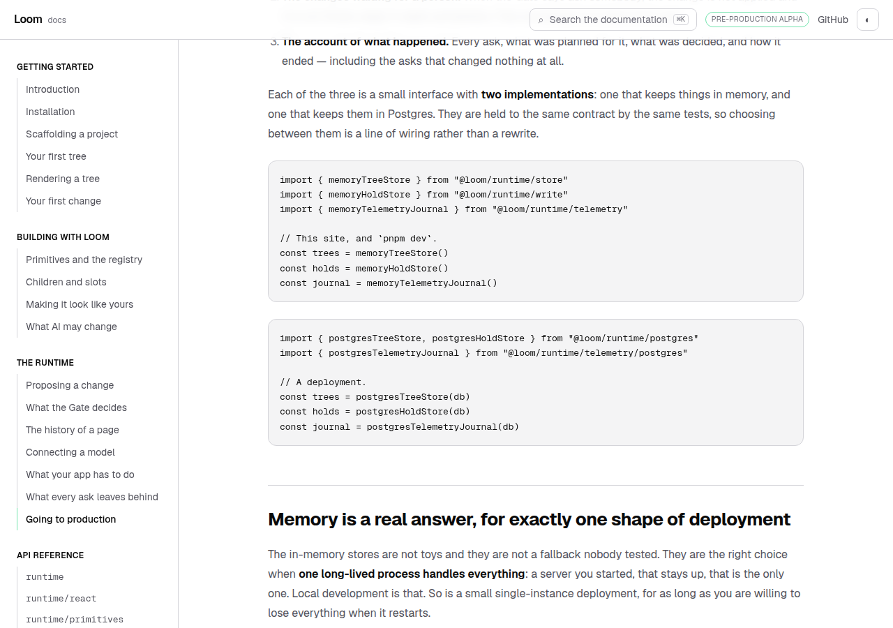
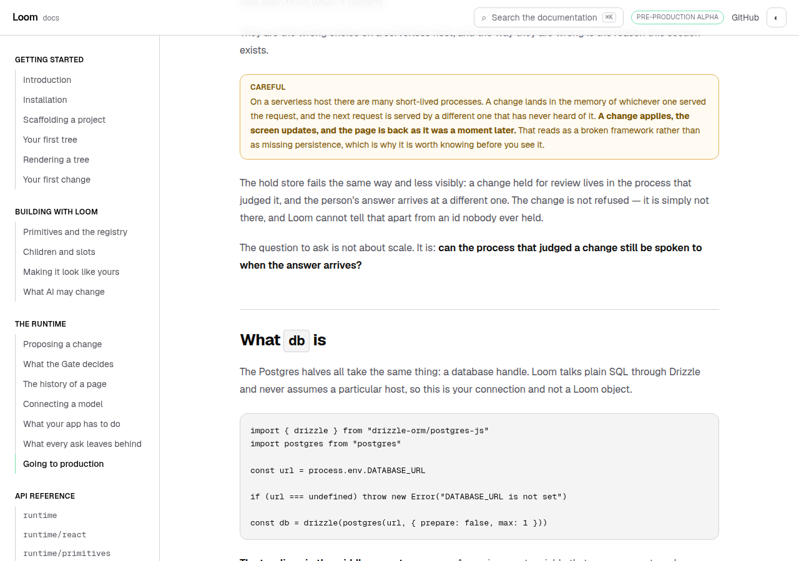
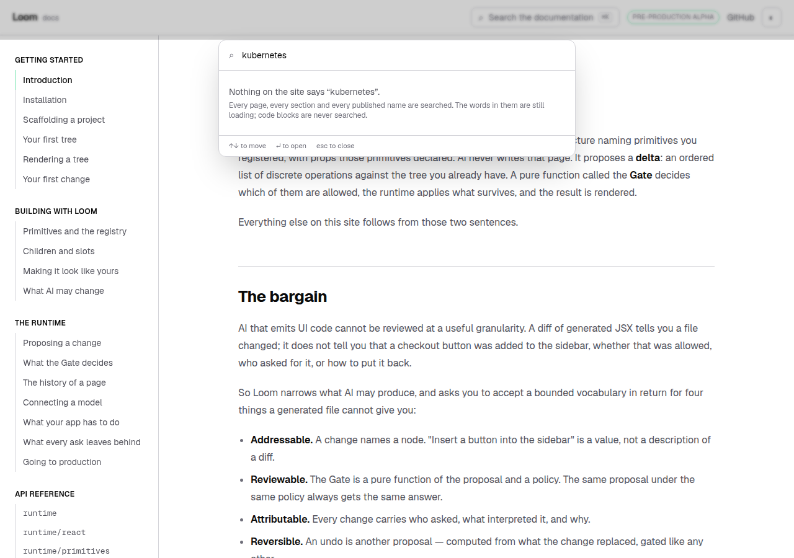
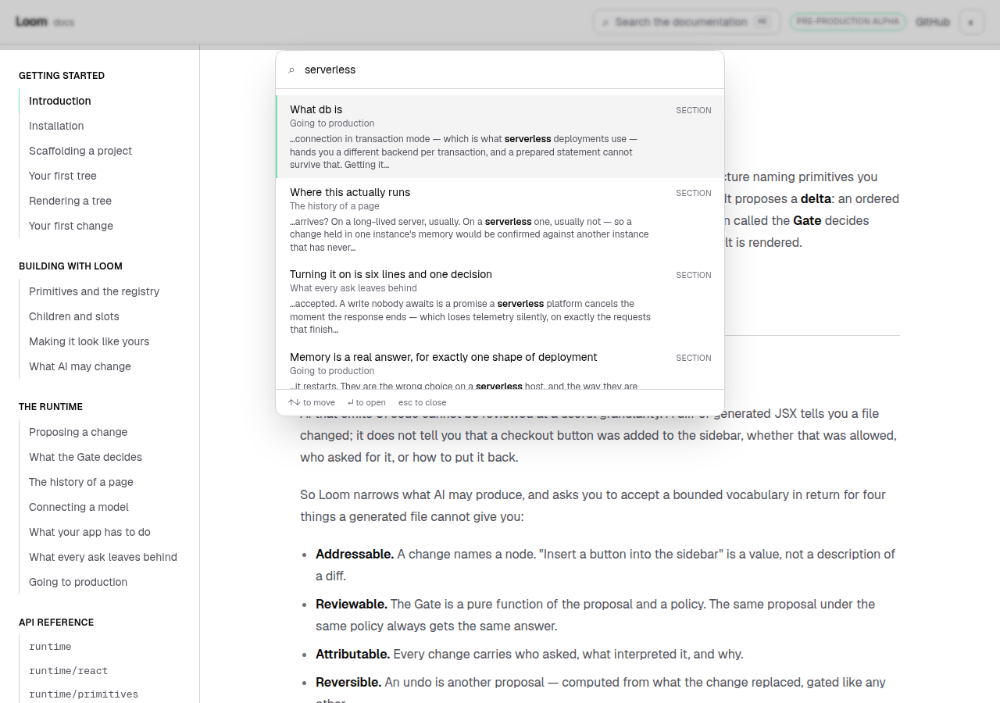
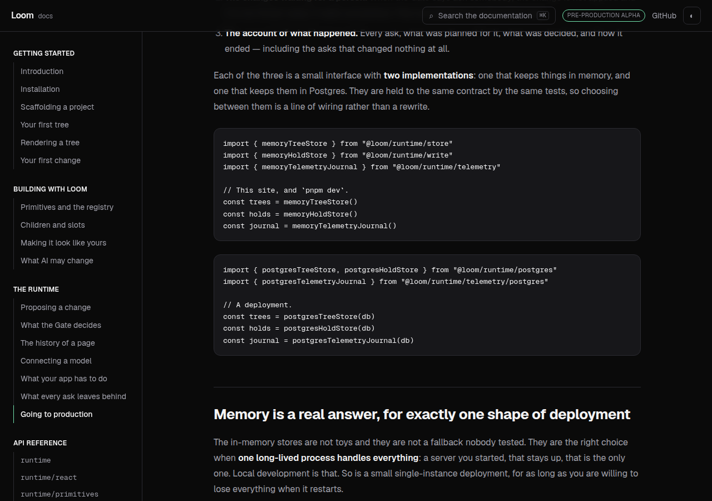
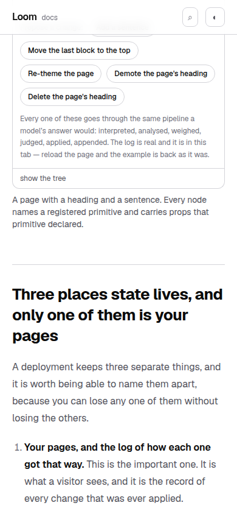

# 6 September 2026 — four pages, one compiler, and an index that had to come apart

**Routine:** `Loom docs` · **Branch:** `docs-21-the-code-on-the-page-compiles` ·
**Section:** §4c

This lane had **four pull requests open at once** — #225, #232, #238 and #243 —
every one of them cut from `d7375ef`, three of them editing `_lib/nav.ts`, three
of them editing `FINDINGS.md`. That is the configuration the maintainer described
on 28 August when he closed sixteen pull requests unmerged.

So this run built no fifth page. It merged the four into one tree, and then dealt
with what the merge turned up — which was not the conflicts.



**The conflicts took ten minutes.** There were three: two appends to
`FINDINGS.md`, and one fence that two branches had corrected differently. #243
had declared it `ts function-body`, because the block is the inside of a request
handler and opens with `return`. #238 had changed it to `tsx`, because the block
contains `<main>`. Both were right about their own half and the resolution is
`tsx function-body` — a JSX fragment that is the inside of a function, which the
fence vocabulary could already say and which neither branch could see.

**What the merge cost was everything after that**, and it is the argument for
merging a lane more often rather than for these runs producing less. Two things
were true of the four branches together and of no branch alone.

## The four new pages had code on them that nobody had ever compiled

#243 shipped the check that reads every code block on the site as one TypeScript
program and hands it to `tsc`. It ran against the ten pages that existed on its
own branch. The other three branches were carrying **four more pages**, and every
one of them failed.

Some of it was ordinary and welcome: a snippet calling `commitIntent` without
ever showing a reader where `commitIntent` comes from, four pages' worth of names
the narrative assumes and the code cannot see. Those are context files and
imports, and the machinery #243 built handled them.

Three were not ordinary.

### `process.env.DATABASE_URL` is `string | undefined`, and the page handed it straight to a connection

The second block on this site that could never have compiled, found the same way
as the first — by compiling it.

```ts
const db = drizzle(postgres(process.env.DATABASE_URL, { prepare: false, max: 1 }))
```

A reader pasting that into a strict TypeScript project — which is the only kind
Loom's own documentation describes — gets an error on the line the page told them
to copy. The fix is two lines and it is not ceremony, which the page now says:
an unset environment variable reaches the connection as `undefined` and surfaces
much later, on the first request, phrased as though the database were down.

### A page that shows two ways to do one thing cannot be one program

This is the interesting one, and it is filed as well as fixed.

*Going to production* names three stores, wires them to memory, and then wires
**the same three names** to Postgres. That the choice is a line of wiring rather
than a rewrite is the whole lesson of that section. Read as one program it is
three redeclarations.

The vocabulary had exactly one word that would have made it green: `sketch`,
which skips compilation and requires an ellipsis. Taking it would have meant the
**deployment** half of the page — the half a reader actually pastes into a real
project — was the one part of the site nothing checked. A checker whose escape
hatch is the natural way to write a common page is one people learn to route
around.

So the vocabulary gained a fifth word instead:

```` md
```ts alternative
````

The word is markdown *meta*: it never reaches the page, so the two blocks in the
screenshot above look exactly as they did — same three names, one line of wiring
apart — and are two programs to `tsc`.

*The same job as the block above, done differently.* The block is compiled, in a
module of its own, inheriting the imports the page had already made — so a page
does not have to repeat `import { gatePolicySchema }` beside a block whose whole
point is that one line changed. Both halves of a choice are checked and neither
is written off.

Two rules keep it from becoming the new escape hatch:

- **It cannot be the first block on a page.** The word means *the block above*,
  and a page opening with one would be silently read as two programs where the
  writer meant one — nothing red, and the page's real program quietly missing its
  opening. `extract.ts` refuses it.
- **It is still compiled.** That is the entire difference from `sketch`, and it
  is why adding a word to the vocabulary was worth doing rather than reaching for
  the one that was already there.

### Ten marker comments were being dropped, and nothing was red

Each generated program carries a `// page.mdx:83` above each block, so that a
compiler error names a place on the page rather than a place in a file nobody
wrote. **Ten of them were missing**, sitewide, and I found it by writing a test
for the new kind and watching it fail for the wrong reason.

The cause is the rule that makes the whole design work. A page's imports are
hoisted and merged, because a page repeats an import so a reader arriving halfway
down knows where a name came from. A marker written *above* a block is the
leading trivia of that block's first statement — so where the block opened with
an import, the marker went into the discard with it.



The blocks that lost their marker were therefore exactly the copy-me-whole ones.
`what-your-app-has-to-do` had one marker of three. The fix is to put the marker
under the block's own imports, where there is a statement left for it to belong
to; the site went from 29 markers to 39.

It is worth naming because of how it failed: the check went on working, and
simply stopped saying where.

## The search index hit the cap I set five days ago, and the cap said what to do

On 1 September this routine indexed the site's prose and capped the payload —
48 KB gzipped, 240 KB raw — with a note under the numbers:

> *five more pages fit under it, fifty do not, and the run that hits the cap
> should split the index rather than raise it again.*

Four pages arrived at once. The index came out at **46.7 KB gzipped against the
48**, and 251.8 KB raw against the 240. Two runs, not five.

So it was split rather than raised. The line to split on was already there — the
two halves grow at different speeds, for different reasons:

| | Uncompressed | gzip | grows when |
| --- | --- | --- | --- |
| Titles, sections, summaries, 863 names | 159 KB | **14.6 KB** | a page is added or an export published |
| The words under them | 107 KB | 35.1 KB | anybody writes a paragraph |

**A reader waits for the first and not for the second.** The box opens on the
table of contents and the runtime's surface, which answers the top three bands of
the ranking — title, then section, then summary. The words land a moment later
and turn on the fourth. Typing in between gets the same results in the same
order, minus the prose band; if the words never arrive at all, the box behaves
exactly as it did before this site indexed its prose, rather than failing.

The number worth keeping is **14.6 KB, against 46.7 the day before** — and it is
the half that grows slowly.

The prose travels as `[href, words]` pairs rather than as entries, because `href`
already identifies an entry uniquely and repeating the rest would cost five times
as much. That seam is the one thing a split can break silently: an href the index
does not carry leaves a body empty, with nothing red anywhere. Two tests hold it —
the halves put back together must equal what the builder said in the first place,
and every href in the prose file must name exactly one entry.

### The empty state says which half it has read

*"Nothing on the site says X"* is a strong enough claim that the sentence under
it says how much was looked at. That sentence was only true once the prose was
indexed — and for the moment before the second file lands, it is not true again.
So it says less:

> Every page, every section and every published name are searched. The words in
> them are still loading; code blocks are never searched.



Getting that wrong would have been the exact overclaim the sentence was written to
end. The shot above is the real state, forced by holding the prose request open:
the box is working, and it is saying what it has not read yet.



## Tests

`pnpm install && pnpm verify` at the repository root, green, exit 0.

| Suite | Files | Tests |
| --- | --- | --- |
| `@loom/runtime` | 119 | 1860 passed — `src/` was not opened |
| `@loom/app` | 175 | 2672 passed |

`main` stood at 2497. The four branches together and this run's work take it to
**2672**: 51 tests were added here, across five files. Nothing failed, nothing
was skipped, no test was weakened — **including the one whose cap I hit**, which
is the one it would have been easiest to weaken.

Six claims were checked by mutation, because a test that has never failed is a
claim rather than a check:

- putting the marker back above the imports fails *marks a block that opens with
  an import*, *says in its own words what it is*, and the staleness check
- dropping the rule that the story stands back from a name the page declares
  fails *stands back from a name the page declares for itself*, plus four more —
  and, outside vitest, `tsc`, because the main program of *Going to production*
  then imports a `db` it also declares
- reading an alternative as part of the page's one program fails the staleness
  check, and `tsc`, with the three redeclarations the design exists for
- allowing a leading alternative fails both of the rules that refuse one
- never merging the words in the dialog fails *finds a word that only the prose
  carries* and *shows the sentence a result was found by*
- keying the prose by title rather than href fails *comes apart and goes back
  together without losing a word*

The last two are the split's seam from both ends, which is the pair I would
defend hardest: one of them fails if the browser stops merging, the other if the
server stops emitting something the browser can merge.

## Dark and 390px, before the pull request



`document.documentElement.scrollWidth` is exactly 390 at a 390px viewport. The
code blocks scroll inside their own box rather than the page, which is what they
already did.



## Scope

`apps/loom/app/(docs)/` only. `src/` was not opened and the generated API
reference was not regenerated, because the runtime's surface did not move. No
other route group was touched. No primitive was needed and none is missing — the
search dialog and its two files are docs-site chrome in 0067's sense, furniture
rather than content, which is the footing they have been on since search shipped.

The merge brought three other branches' diffs with it. Those are theirs, reviewed
on their own pull requests, and unchanged here apart from the one fence both #238
and #243 had corrected.

## Open questions

**Nothing blocking.**

**The pile is the finding.** Four branches, three conflicts, ten minutes — and
both of the things worth finding today were invisible on every one of the four.
The brief's step 3 says to branch from `main`, which is what produced them; a
routine cannot edit its own brief. `Loom marketing` filed the same thing the same
day from four of its own. The recommendation is one sentence in the seven briefs
and in `docs/routines.md`: *if this lane already has an open pull request, push
onto its branch instead.*

**Fenced code is still not searchable**, unchanged from 1 September, and now the
prose lives in a file of its own — which is where a decision to index it would
go, and it would roughly double the half nobody waits for rather than the half
they do. That is a cheaper trade than it was this morning.

**What I would write next** is still the page for the reader who has shipped and
something looks wrong — an audit that disagrees with the log, a hold nobody
answered, a journal that is not shrinking. It wants *Going to production* and
*What every ask leaves behind* on `main` first, and after today they are both in
one branch with everything else this lane has written.
