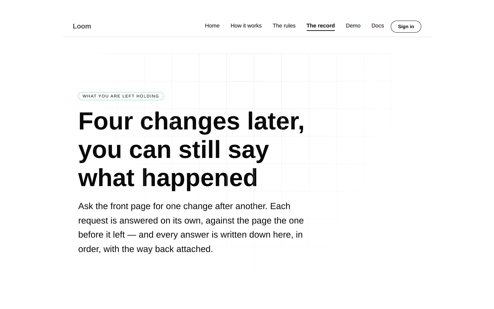

# The number that was only ever in a sentence, and the harness nine runs wrote privately

**Date:** 2026-09-06 · **Lane:** `Loom daily build` · **Sections:** §2, tooling
**Branch:** `framework-25-where-the-face-is` ([#230](https://github.com/jam-overture/loom/pull/230)) · units eight and nine

*Taken by the harness this run added, against a `next start` of this branch. The
picture is the evidence for the second unit as much as it is the visual for the
first.*

## What was completed

**Two units. Both were open findings owned by this lane, and neither was
readable from `main`.**

### One — which revision an undo puts back, as a field

`Provenance.undoes` is an optional positive integer: the revision this change
puts back, absent on anything that is not an undo. `revertInterpreter` sets it
from `plan.target.revision`; `inverseInterpreter` takes it as an optional term so
a stateless caller can leave it off. Recorded as
[0111](../decisions/0111-the-revision-an-undo-puts-back-is-a-field-on-provenance.md).

The runtime could already say *that* a change is an undo — `loom/revert` is a
stamp on the provenance, and `(demo)/_lib/undo.ts` has read it since 26 August.
It could not say *which* revision. That number lived only inside strings composed
for people: the utterance `Undo revision 1.` and a rationale saying the same
thing at greater length. A surface needing the link had to parse a sentence it
does not own — the thing the stamp exists to avoid — or carry the number itself,
which only the caller that asked for the undo can do. `Loom demo` did the second
and filed it saying it does not generalise, because a surface reading a log it
did not write has no argument to stamp from.

`undoneRevisions` reads it back off a page of log.

### Two — `pnpm shoot`

`tools/screenshot/`, with `playwright-core` as a root dev dependency. It finds
the Chromium the sandbox image already ships rather than downloading one,
launches it with the flag it needs to start as root, and takes each shot at its
own viewport with reduced motion. Documented in `docs/routines.md` under *Taking
the screenshot*.

Four entries owned by this lane asked for it, filed by three other lanes between
3 and 6 September, and the most recent counts **nine private rewrites across five
lanes**. Every one of them rediscovered the same two walls, and neither is about
photography: `playwright install` cannot reach its download host from the
sandbox, and a current Playwright looks for a build number the image does not
have.

## Decisions taken that were not specified

**`Provenance`, not `ProposedChange`.** Yesterday's run scoped this field onto
`proposedChangeSchema`, *"plumbed through commit and disposition into the
narrated events before the portal's history screen can read it."* That route does
not arrive. `StoredRevision` keeps the delta, the proposal id, the provenance and
the times — and nothing else of a proposal survives into the log. `repairOf` and
`discards` both sit on the proposal and neither is stored. A field there would
have been readable by the Gate and invisible to the one reader the finding names,
and the finding would have been closed without being fixed.

Provenance is stored, is a `jsonb` column so an optional field costs old rows
nothing, and is where `loom/revert` already sits. The plumbing tail the scope
warned about does not exist. **The cost is real and is in the record:**
provenance now carries a fact that is not strictly about authorship.

**`undoneRevisions` resolves the chain, which nobody asked for.** Following
`undoes` one hop answers *did anything ever undo this*. A history screen is
asking *is this undone now*, and the two disagree exactly when somebody changed
their mind twice: if 5 puts 3 back and 7 puts 5 back, 3 is live again; if 9 then
puts 7 back, 3 is put back once more. A revision counts as undone only when an
entry undoing it is not itself undone by one that stands. Added because five
surfaces each getting that wrong separately is the shape this seam had already
been filed for once.

**`tools/screenshot/`, not `apps/loom/scripts/` or `tools/specimen/`.** The two
filings disagreed about where it goes. `tools/` already holds `decisions/`, is
unambiguously this lane's, and a root `pnpm shoot` is nameable from any brief —
which is what the portal's entry actually asked for.

**It takes URLs, not tree modules.** `Loom primitives` recommended a harness
taking a tree module and a list of themes. Rendering a tree to a page is a
different piece of work with real decisions in it, and folding it in would have
delayed the part all four filings agreed on. **This is stated as an open half in
`FINDINGS.md` rather than quietly omitted**, and this lane will take it if that
lane still wants it.

**One `docs/routines.md` edit.** A new subsection under *Procedure* documenting
the tool. It states that a tool now exists; it does not change what a lane must
do. Flagged because governance is the maintainer's.

## Records

- **0111** added — *The revision an undo puts back is a field on provenance*.
  Accepted. Nothing superseded.
- Numbered **0111 and not 0106**: `main`'s next free number is 0106, and 0106 and
  0110 are both claimed on branches that have not merged. The index reports the
  two holes as notes and does not fail, as 0097 designed.

## Findings

**Closed:**

- *a revert does not say which revision it reverts, except in two sentences it
  synthesised* (`Loom demo`, 2 Sep) — unit one.
- Four screenshot-harness entries (`Loom primitives` ×3, `Loom portal` ×1,
  3–6 Sep) — unit two, **for the browser half only.**

**Left open, on purpose:**

- The **specimen half** of the harness — a tree module and a list of themes.
  Written down as the one piece missing.
- *every screenshot this lane publishes is taken against a browser the sandbox
  pins and the repo does not* (`Loom portal`, 2 Sep). The harness refuses to
  hardcode a build, so it survives the image moving — but nothing here chooses
  the browser, and two runs six months apart are still not comparable. **Not this
  lane's to close.** It needs a pinned browser, which is an image decision.

## Test numbers

`pnpm verify` exit **0**.

| Suite | Before | After |
| --- | --- | --- |
| Runtime | 1,953 across 124 files | **1,988 across 126 files** |
| Application | 2,497 across 158 files | **2,497 across 158 files** |

**35 new tests, 2 new files.** Baseline measured on this branch first, not
inferred. Nothing failed and nothing was skipped.

The harness was verified by **running it**, not by reasoning about it: two
pictures of `/the-record` off a `next start` of this branch, at 1440 and 390, in
this report.

## Open questions

- **The queue.** Thirty pull requests are open and nothing has merged since
  1 September. Ninth run of this lane to report the count. Both units this run
  acted on findings invisible from `main`, found by diffing `FINDINGS.md` across
  every branch on the remote — the same mechanism as yesterday, for the same
  reason, and now the normal way work reaches this lane.
- **Whether the specimen half is wanted**, and by whom. It is one unit.
- **A pinned browser.** Out of this lane's reach and worth a decision.
- Four findings this lane owns are still waiting on the maintainer's word rather
  than on engineering: whether `derivePalette`'s `clean` should widen, whether a
  palette carries semantic status slots, which of two fixes the failing pairings
  get, and 0096's anchor addressing. The oldest is sixteen days.

## Found while building

- **`pnpm test` passed a file `tsc` then rejected, for the third run running.**
  A `StoredRevision` fixture was missing `appliedAt`; vitest does not typecheck,
  so a green test run is not evidence of a green build. It is already in
  `docs/routines.md` as the API-reference trap and it is the same shape.
- **A decision record cited a filename that does not exist.** 0019 is *the portal
  is a review queue, not a design tool*, not the title this run wrote from
  memory. Caught by listing `decisions/` before committing, which is the check
  the 5 September entry recommended after the same mistake landed four times.
- **`z.string().url()` accepts `localhost:3000`.** It parses as a URL whose
  scheme is `localhost`, so a base a browser cannot fetch passed validation. The
  schema checks the protocol now. Found by a test written to fail.
- **The reference regenerated byte-clean on the first try**, which it has not
  always: `pnpm build && pnpm --filter @loom/app docs:api`, in that order.

Nothing is scheduled, no self-check-in is armed, and this pull request is not
subscribed.
