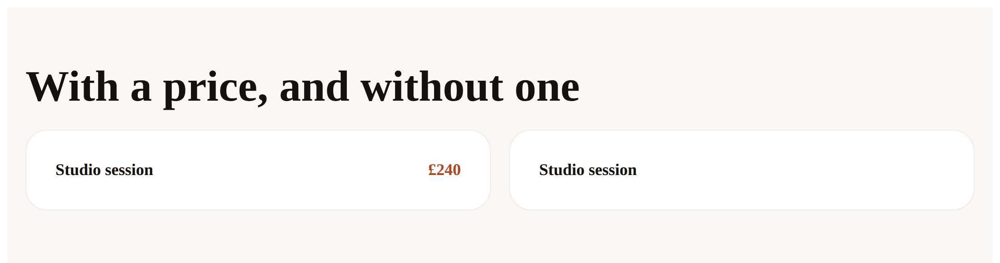

# 2026-09-06 — the queue over every page, and the pairing the probe cannot see

**Routine:** `Loom daily build` · **Branch:** `framework-25-where-the-face-is` ·
**Pull request:** [#230](https://github.com/jam-overture/loom/pull/230) ·
**Sections:** §5 and §4b

Two units, both open findings this lane owned, both filed by other surfaces on
branches that have not merged. Tenth and eleventh on this branch.

---

## What was completed

### One — `HoldStore.waiting`: the portal's front door in one query (§5)

`HoldStore` had a single listing, `forTree`, and its own comment said why: a
review queue looks at one page at a time. The portal's front door stopped being
that. It is now the queue over **every** page — the screen that answers *does
anything need me?* before a reader has a tree in mind — and the only way to build
it was `TreeStore.list` for a page of trees, then `HoldStore.forTree` once per
tree on it.

Two things wrong with that, and the second is worse:

- **O(pages) queries for a question with a one-row answer.** Fifty round trips to
  learn that nothing is waiting. It is also why the *Waiting on you* badge in the
  portal's rail is deliberately absent: a badge in the shell would pay that cost
  on every screen rather than on one.
- **It cannot be complete, and nothing fails when it isn't.** A listing is
  bounded by contract, so a deployment with more pages than the bound has holds
  the screen never looks for — and it prints the same confident *"Nothing is
  waiting for you."* it prints when it has swept everything.

`waiting` is that read. Scoped by the handle exactly as `forTree` is, bounded and
cursored like every other read in the contract, oldest first.

**The part the filing did not anticipate is the cursor.** `TreeStore.list` orders
by `treeId`, which is unique, so 0020 never had to tell a key from a position.
`heldAt` is neither unique nor close to it — the Gate holding two changes in one
judgement writes one instant twice, and every fixture in the contract suite shares
one by default. A cursor naming only an instant repeats a hold or skips one
depending on which side of the comparison it falls, which is the one failure a
cursor exists to prevent. So the cursor is `(heldAt, proposalId)`, and **`forTree`
gained the same tiebreak**: two listings in one store sorting ties differently is
a bug waiting for the first duplicate instant.

`compareHolds` states the order once. `postgresHoldStore` is the one caller that
cannot use it — ordering has to be in the statement for an index to serve it — so
its `ORDER BY` names it, its `WHERE` is the row-value comparison
`(held_at, proposal_id) > (…, …)`, and the contract suite is what holds the two to
the same answer. `HOLD_STORE_DDL` gains the index that makes the read a seek
rather than a sort over everything held.

### Two — a painted pairing declared as the softer composed (§4b)

`loom.offering` writes its price in `accent-strong` on the `bg-surface` of the
card it drew itself. Both ends are one primitive's, so by 0089 that is a
**painted** pairing and a palette failing it is refused. The row said
`composed` — measured and reported, not asserted — so a palette whose
`accent-strong` failed on `bg-surface` would have shipped with the audit noting a
page nobody can read instead of refusing it.

The reason is the picture below.

The left card is what a reader sees. The right card is what the probe sees.
`registryPairings` renders each primitive under `probeConfigurations` — the empty
configuration plus one per closed choice — so the price element, guarded on
`given.price === undefined`, never exists, and its ink is never derived.

Two things shipped:

1. **The row is promoted to `painted`**, on a reading of the component rather
   than of the probe, with `where` naming `loom.offering price` beside
   `loom.field inside a card`. Every registered palette already clears it, so
   `audit.failures` stays empty for all of them; what changed is that the next
   palette to fail it is refused.
2. **`RegistryPairings.unprobedProps`** names, per primitive, the declared props
   no configuration sets. A list whose comment says it is read off
   `src/primitives` can now say which part of them it read.

---

## Decisions taken that were not specified

**The `heldAt` tiebreak, and taking it into `forTree` as well.** The finding asked
for a listing "ordered by `heldAt` ascending the way `forTree` already is", which
is not a total order. Extending rather than replacing it keeps the queue in the
order a reviewer wants; adding the tiebreak to `forTree` was not asked for and is
the smaller half of the same defect.

**Rows, not a count.** The filing noted a count would be cheaper and would serve
the rail badge. The queue wants the rows, and a count is derivable from a page in
a way a page is not derivable from a count.

**The probe does not invent values.** The finding left this open: fill optional
props with placeholders, or state the gap. A price, a date and a URL all have to
be invented to be valid, and a pairing derived from an invented value is a fact
about the invention — the same silence 0089 exists to prevent, one level along.
The gap is reported instead, with the reopening condition written into 0113: if a
probe can ever take values from a primitive's own schema without choosing them,
this is worth revisiting.

**The unprobed set is not pinned by a test.** A test over the whole set would
churn on every optional prop any lane adds, which trains people to update a test
without reading it. What is pinned is the single case that produced the false row.

**A sharper statement than the finding's, and it changes the answer.** The
entry said the probe "never renders an optional prop". It renders *no* props,
including required ones — `loom.event`'s required date was derived immediately.
The ink is hidden only when a component **guards an element** on the prop, which
optional props get and required ones do not. That is why the reported set is
"optional and not a closed choice" rather than "optional".

---

## Records

- **0112** — *A hold store lists what the handle can see, and its cursor is two
  columns because an instant is not a key.* Accepted.
- **0113** — *The pairings probe reports where it stops looking, rather than
  inventing a price.* Accepted.

Neither supersedes anything. Both are the next number free **across every branch
on the remote**, not on `main`: `main`'s next free is 0106, and 0106 and 0110 are
claimed on branches that have not merged. The index reports those two as notes
and does not fail, as 0097 designed.

---

## Findings

**Closed, two, both by this run:**

- *a hold store has no deployment-wide read, so the portal's headline screen
  costs one query per page* (`Loom portal`, 1 Sep, on
  `portal-23-four-units-one-tree`)
- *the pairings probe cannot see an ink behind an optional prop, and one declared
  row is already wrong because of it* (`Loom primitives`, 2 Sep, on
  `primitives-21-forty-minutes-and-a-date`)

Neither was readable from `main` or from this branch. Both were found by diffing
`FINDINGS.md` across every branch on the remote, which is now the normal way work
reaches this lane.

**Filed: none.** Nothing outside this lane got in the way.

---

## Test numbers

Measured, not inferred. Baseline taken on this branch before any edit:

| | baseline | after |
| --- | --- | --- |
| runtime tests | 1,988 across 126 files | **2,015 across 126 files** |
| application tests | 2,497 across 158 files | **2,497 across 158 files** |
| `pnpm verify` | green, exit 0 | **green, exit 0** |

**27 new tests**, 22 for the hold store and 5 for the probe report. Nothing
failed, nothing was skipped, and no test was weakened. The hold-store contract
suite runs the new behaviour against both implementations, the Postgres one
against an embedded database — so the row-value comparison and the ordering are
checked against a real query planner rather than argued about.

---

## Open questions

- **`HoldStore` is a five-method interface now**, which is a breaking change to a
  published seam. Both implementations here are updated; a host outside this
  repository that wrote its own no longer compiles until it adds the method.
  Pre-production alpha is when that is cheapest, and it is written into 0112
  rather than glossed.
- **Lexicographic order over `heldAt` is exact only at a fixed precision.**
  `z.string().datetime()` accepts both `…:00Z` and `…:00.000Z`, and the second
  sorts before the first for the same instant. Paging is correct regardless —
  both implementations compare the same strings the same way, so nothing repeats
  or is skipped — but "oldest first" can be off by a hair between two writers that
  format differently. Pre-existing in `forTree`. Written down rather than fixed,
  because narrowing the schema would refuse holds already stored.
- **A row may now be `painted` where the derivation reaches only `composed`.**
  The checks permit that direction and refuse the other, which is the asymmetry
  that makes it safe — but "derived" is no longer the whole story for
  `PALETTE_TEXT_PAIRINGS`, and a reader has to know it. It is written beside the
  rows rather than only in the record.
- **Four findings this lane owns are waiting on the maintainer's word rather than
  on engineering** — whether `derivePalette`'s `clean` should widen, whether a
  palette carries semantic status slots, which of two fixes the failing pairings
  get, and 0096's anchor addressing. The oldest is seventeen days.

---

## Found while building

- **The screenshot above is the first specimen anybody has photographed**, and it
  took no new tool: `renderLoomTree` with `createStarterPrimitiveRegistry` and
  `createThemeRegistry`, `renderToStaticMarkup`, one HTML file, `python3 -m
  http.server`, `pnpm shoot`. About forty lines, thrown away rather than
  committed. That is worth knowing for `Loom primitives`, whose `tools/specimen/`
  ask this lane deferred this morning: the hard part is not the rendering, it is
  deciding what a specimen page *is* — which themes, which props, what the
  surround looks like. This proves the rendering half is cheap.
- **A decision record cited a filename that does not exist**, for the second run
  running: 0089 is *the text ramp is held to four grounds*, not the long title
  written from memory. Caught by listing `decisions/` before committing, which is
  the check the 5 September entry recommended. Every link in both new records was
  then resolved against the directory rather than read.
- **The finding was right about the palettes, and it was checked rather than
  believed.** `loom.offering`'s `price` is `z.string().min(1).max(32).optional()`,
  its element is guarded on `undefined`, its colour is `accent-strong`, and
  `SURFACES.plain`'s background is `bg-surface`. All four read in the component
  before the row was moved.
- **`reference.generated.json` needed regenerating twice**, once per unit, because
  each added a public export — `pnpm build && pnpm --filter @loom/app docs:api`,
  in that order. Fourth run in a row this file has been in the diff for that
  reason. It is not hand-edited and is the one file here outside this lane.
- **`pnpm test` did not disagree with `tsc` this run**, which breaks a streak of
  three. Both were run before either was trusted.

Nothing is scheduled, no self-check-in is armed, and this pull request is not
subscribed.
