
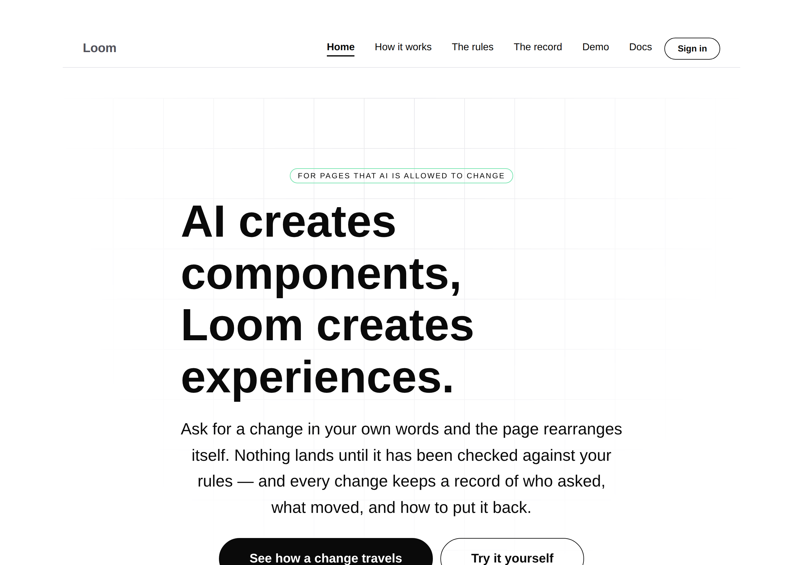


# 2026-09-06 — marketing: four units, one front door

This lane had **four pull requests open at once**, every one of them branched
from the same commit, three of them rewriting the same file. That is the exact
configuration the maintainer described on 28 August when he closed sixteen pull
requests unmerged.

So this run built no fifth thing. It merged the four into one branch, resolved
the conflicts by hand, and got it green.

---

## Why this and not a new unit

The maintainer's record on `main` (`a289988`, merged 1 September) is explicit:

> Before starting a unit, check whether you already have an open pull request. If
> you do, **continue it rather than branching again from `main`** — push onto that
> branch.

The marketing brief's procedure, step 3, says *"Branch `marketing-NN-<slug>` off
`main`."* Every marketing run since the instruction landed followed step 3:

| run | PR | branch | merge-base |
| --- | --- | --- | --- |
| 2 Sep | #224 | `marketing-19-the-record-of-your-ask` | `d7375ef` |
| 3 Sep | #231 | `marketing-20-the-page-showing-itself` | `d7375ef` |
| 4 Sep | #237 | `marketing-21-the-product-on-the-page` | `d7375ef` |
| 5 Sep | #242 | `marketing-22-putting-it-back-is-a-change` | `d7375ef` |

Same base, no stacking, four independent rewrites of one route group:

| file | branches touching it |
| --- | --- |
| `_lib/pages/home.ts` | **three** — #224, #231, #242 |
| `_lib/pages/see-it-happen.ts` | two — #224, #242 |
| `_lib/site.ts` | two — #224, #242 |
| `_lib/render.ts` | two — #224, #242 |
| `FINDINGS.md` | **all four** |

#224 is itself the rebuild of closed #198, which the 28 August entry names. It
has been open since 2 September while three later runs branched past it and
edited the same files underneath it.

## What was merged, and what the conflicts actually were

Merged onto `marketing-22-putting-it-back-is-a-change` (PR #242) in date order,
easiest first. **Four conflicts. Every one of them combined** — none was a case
of two changes wanting the same thing to be two different things.

| conflict | resolution |
| --- | --- |
| `FINDINGS.md` ×3 | Append collisions. Both entries kept, in date order. Mechanical and safe. |
| `_lib/site.ts` | #224 generalised `askHref` into `askedHref(origin, path, options)` so `/` and `/how-it-works` share one spelling; #242 added `back` and `backApprove`. Took #224's shape, added #242's two fields to `AskedFor`. The file's tail already expected both. |
| `_lib/pages/see-it-happen.ts` | Both sides rewrote the **doc comment** on one field, `approve?: boolean`, and both explanations were true and about different things. Kept both, joined. No code differed. |
| `_lib/pages/home.ts` | #242 spread `ask` and `approve` independently; #224 coupled them, so `approve` only travels with an `ask`. Took #224's: with no ask there is nothing to approve, and its tests assert the coupling. |

The closure record warned that resolving the sixteen mechanically produced code
that would not compile (`loom.nav.ts(197,4): error TS1109`). That is worth
separating from what happened here: **these four were not irreconcilable.** The
whole resolution was about twenty minutes and `tsc --noEmit` was clean on the
first attempt after it. The cost of a pile is not that it cannot be combined —
it is that nobody combines it until closing it is the only affordable move.

## Tests

`pnpm install && pnpm verify` — **green, exit 0. Nothing failed, nothing skipped,
no test weakened, no test deleted.**

| suite | target branch alone | consolidated |
| --- | --- | --- |
| `@loom/runtime` | 1860 / 119 files | **1860 / 119 files** — `src/` was not opened |
| `@loom/app` | 2533 / 159 files | **2584 / 161 files** |

Every file the four branches added is present and running:

- `_lib/pages/the-record-of-your-ask.test.ts` — #224
- `_lib/pages/as-data.ts`, `as-data.test.ts` — #231
- `_lib/facts.test.ts`, `copy.ts` — #237
- `_lib/adapt/undo.ts`, `undo.test.ts` — #242

Typecheck was run on the resolved tree **before** committing the merge, because
the failure mode the closure record names is a resolution that looks right and
does not compile.

## The page itself

The four units had never been rendered together. They are, and the combination
is better than any of them alone — the front door now runs a change, shows its
record, puts it back through the same rules, prints the raw record on a second
page, shows itself as data, and counts its own facts.

`/?ask=problem&approve=1&back=1` is the one to press: a change the rules held and
the visitor allowed, then an undo **the same rules also hold**, with both records
in the panel.

Measured on the running build, not assumed:

| viewport | `scrollWidth` | `scrollHeight` |
| --- | --- | --- |
| 1440 | 1440 | 7,646 |
| 1280 | 1280 | — |
| 390 | 390 | 17,236 |

No horizontal overflow at any width.

**The phone number is bad and it is the known primitive.** `loom.milestone`
reserves its marker column at every viewport, filed for `Loom primitives` on
5 September. Consolidating made it worse in the only way it could — there are now
more bands under it — so the entry stands with the consolidated figure rather
than being re-filed. The fix is in the primitive; the only fix available in this
lane is to hide the second record on a phone, which hides the thing the band
exists to show.

## Decisions and findings

**No record written.** Nothing here is a new constraint — it is four existing
units put on one branch. No Accepted record is touched, `src/` was not opened, no
other route group was touched, no primitive was added, no colour was named.

**One filed**, and it is the one worth your attention: the brief's step 3 and
your 28 August instruction cannot both be followed, and step 3 is what a run
reads first. A routine cannot edit its own brief, so the next marketing run will
branch from `main` again and this will be back to four. The same step 3 is in all
seven briefs.

**Nothing closed.** Nothing in the queue was answerable from this lane this run.

## Open questions

- **Positioning, audience and the licence line** (#96, restated on every
  marketing PR since #134). Still the site's one placeholder and still the
  Phase 2 gate. Untouched.
- **`loom.embed` and `allow-forms`** (#237) — the band that would embed the demo
  is built and withdrawn, waiting on a primitives decision.
- **`loom.milestone`'s marker gutter** (#242) — the phone height above.

Nothing scheduled and nothing armed.
