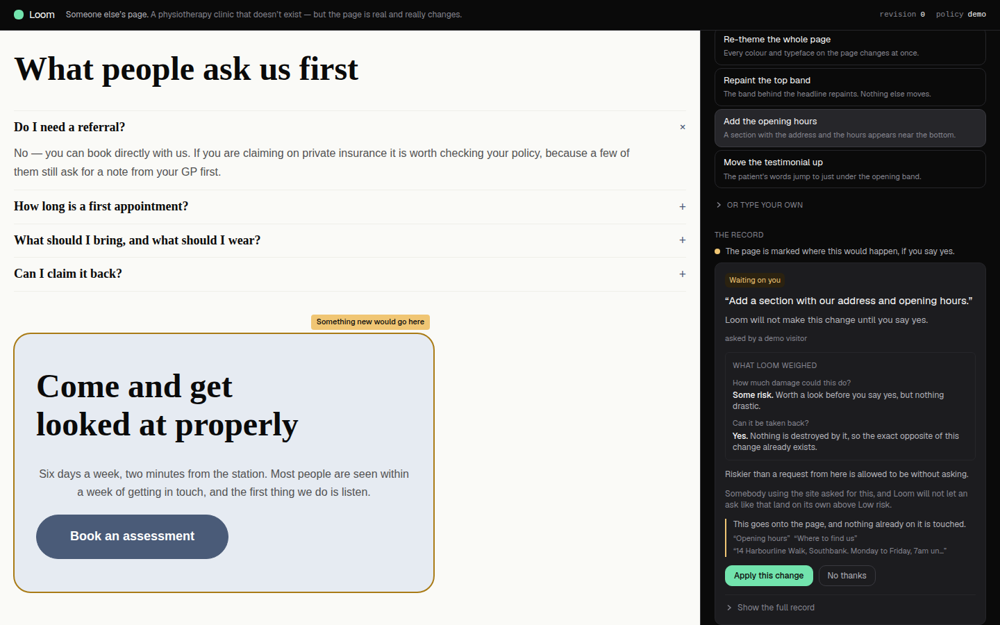
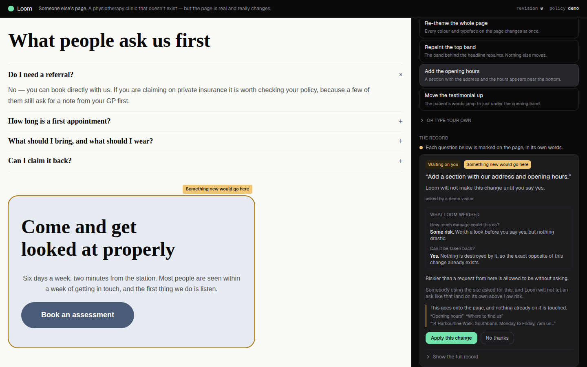
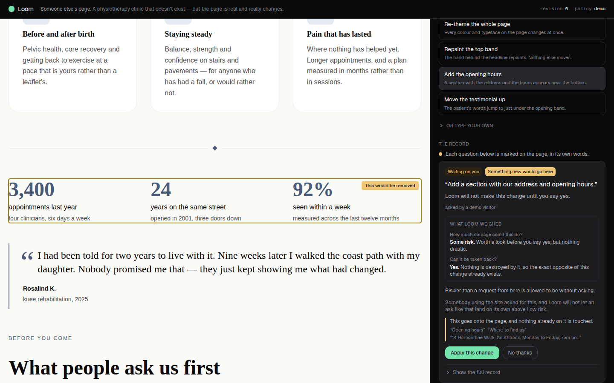
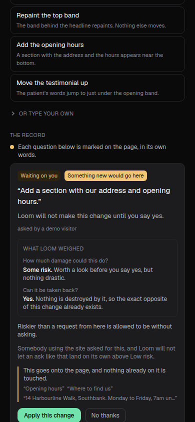

# Demo — two questions, two marks

**Date:** 7 September 2026 · **Routine:** `Loom demo` · **Branch:**
`demo-12-what-allowing-it-would-do` (unit 7) · **Pull request:** #220

---

## What a stranger could not work out before this run, and can now

**Which of two questions the page was asking them.**

Press *Take the numbers off*, then *Add the opening hours*, without answering the
first. This is not an obscure path: the panel offers five buttons and nothing
tells a stranger to answer one at a time, so pressing twice is what pressing once
teaches you to do. Both asks are held. The rail then showed:

- two cards, both badged **Waiting on you**, each with its own **Apply this
  change** and **No thanks**;
- **one** amber ring on the page;
- and one line above the cards reading *“The page is marked where **this** would
  happen, if you say yes.”*

*This* had two referents and the sentence chose neither. The mark went to the
newest ask, by a rule the screen states nowhere. A visitor comparing the ring
against two identical-looking cards had a matching problem with no key.

Nothing was false, which is why it survived six runs of this lane and was left as
a note by the run that found it. It was still the demo's own argument — *Loom
tells you what it is about to do, and shows you where* — quietly failing on the
second press.

Now: **every question waiting on an answer is marked**, in its own words; the
rail's line stops pointing at *this* the moment there is more than one thing it
could mean; and **each card wears its own mark**, as the chip off the band — same
words, same fill, same ink. The pairing is a thing to look at rather than a
sentence to reason about.

| before — one ring, two identical questions | after — a ring each, and each card wearing its own |
| --- | --- |
|  |  |

The other question's ring, which did not exist on this page before this unit —
and the pill on the card in view reading *different* words, which is the signal
*this ring is not this card's*:

At 390×844 the pill sits beside the badge and the rail's line takes two:

---

## What shipped

### 1. Every open question is marked

`spotlitChange` returned one change, ever. It is now `spotlitChanges`, and it
returns **every** hold the page has not moved past — or, when none is asking, the
single applied change that produced the revision on the stage.

The rule it replaces gave a reason, and the reason survives intact:

> Two marks in two colours on one page is a quiz rather than an explanation.

That is about two **colours**. A green *this landed* beside an amber *this is
waiting* asks a stranger to hold two ideas at once. Two amber marks ask them to
hold one idea twice, which is what the rail says there are: two questions. So the
tones still never mix — either the page is asking and every open question is
amber, or it is not and one change is green.

### 2. The budget is the page's, not each change's

`MAX_SPOTS = 3` is the point past which a marked page stops saying *this changed*
and starts saying *everything changed*. Two changes each obeying that cap
separately draw six marks and break it together, both of them faultless — so
marking two changes could not be a loop over the one-change function.

`spotlightsAcross` spends one budget of three **in rounds**: every change gets its
first mark before any change gets a second. A change with nine configures in it
can no longer take the whole budget and leave the question beside it invisible —
which is this unit's own defect, reached by a different road. `spotlightsFor` is
now that function called with one request, so there is one implementation.

### 3. The rail stops saying *this*

`_lib/marked.ts` owns the sentence. One mark keeps the two sentences the surface
already had. More than one gets:

> Each question below is marked on the page, in its own words.

It names no ask, however many are open. The words are already on the page and on
the cards; a third copy in the rail is a third place for one string to drift from
itself, and a line that grows a clause every time a visitor presses a button.

The count is of marks **drawn**, not of changes asking to be marked. Those are
different numbers and the difference is where a sentence goes wrong: the re-theme
configures the page root, and a ring around the whole stage points at nothing, so
a change can be worth marking and draw none. A rail promising two marks over a
page carrying one is this unit's defect pointed the other way.

### 4. Each card wears its own mark

A small amber pill beside the state badge, carrying the chip's exact words in the
chip's exact colours — read from `SPOT_COLOURS`, the same table `spotlightCss`
draws the ring from, so the two cannot drift.

**Only when the page carries marks for more than one change.** It answers *which
of these is mine?*, a question a visitor only has when there are two, and a second
badge beside the state on the first card a stranger ever sees would cost that card
the one-glance reading six runs have tuned it for.

---

## The defect the screenshot found, which nothing else could have

The first build of this unit **broke the demo's one-viewport layout**, and no
test, type or diff could have said so.

At two open questions the whole page began scrolling: the top bar went off
screen and 340 pixels of empty ground appeared under both panes. The cause is two
words nobody can see.

The pill carries `marked on the page: ` so a
screen reader hears what the words are for. Tailwind's `sr-only` is
`position: absolute` — and **an absolutely positioned element is not clipped by an
`overflow: hidden` ancestor that is not itself positioned**, which the demo's
`lg:h-screen lg:overflow-hidden` frame is not. With no positioned parent the
span's containing block is the page itself, so it was laid out at its static
position deep inside the rail's own scroll, escaped the frame, and stretched the
document by the height of the rail's overflow.

One word fixes it — `relative` on the pill — and the fix is asserted rather than
left to the eye, because nothing renders differently and the next run to tidy a
class name would put it straight back.

Measured, not inferred. `document.scrollingElement.scrollHeight`, driven in
Chromium at 1440×900, on both builds:

| | arrival | one hold | two holds |
| --- | --- | --- | --- |
| before this unit | 900 | 900 | 900 |
| first build of this unit | 900 | 900 | **1240** |
| shipped | 900 | 900 | 900 |

---

## Tests

`pnpm install && pnpm verify` — **green, exit 0**, first attempt.
`@loom/runtime` 119 files / 1860 tests; `@loom/app` **165 files / 2626 tests**
(164 / 2607 before this unit).

**19 new tests**, across three files:

- `_lib/spotlight.test.ts` — the plural rule, the shared budget, the rounds, two
  changes wanting the same band, and the two-hold path driven through the real
  write path (`commitIntent` → assess → Gate → hold) rather than through fixtures,
  so a policy retune that stopped holding either preset fails here.
- `_lib/marked.test.ts` — new. The sentence, the count that is of marks drawn
  rather than changes wanting them, and the rule that a card never wears words the
  page is not wearing.
- `demo/_components/record-card.test.tsx` — the pill's words, its colours read
  from `SPOT_COLOURS` rather than restated, its screen-reader preposition, its
  absence when there is one mark, and the `relative` that keeps it from moving the
  whole demo.

Nothing skipped, no test weakened.

**Measured rather than asserted.** Reverting the three behavioural changes —
`spotlitChanges` back to one hold, `spotlightsAcross` back to a per-change cap,
and `markedPage` back to one sentence and no pill — with the tests left in place
turns **10 of the 19** red, across both `_lib` files.

Of the nine that do not, two are worth naming. *“is absent when there is nothing
to be told apart from”* is the test that catches this unit going **too far**, by
putting a second badge on the first card a stranger ever sees. And *“keeps the
words a screen reader hears inside the pill that carries them”* is the one
guarding the layout defect below, which nothing else in the suite can see.

The five card tests survive the revert by design: they hand `RecordCard` a mark
directly, because what the card owes is to render one correctly — *whether* it is
given one is the page's decision, and `marked.test.ts` is where that is held.

---

## Decisions taken that were not specified

- **Mark both, rather than name the marked one in the rail.** The finding of
  6 September offered three shapes and recommended this one. Driving it confirmed
  the recommendation: shape 2 (one mark, named in the rail) leaves a visitor
  comparing text, and shape 3 (only ever hold one at a time) removes the state and
  the true thing with it — the Gate holds each ask independently and does not
  queue them.
- **The pill rather than a sentence.** Every other way of answering *which ring is
  mine* asks the visitor to read something. This asks them to see that two things
  are the same thing, which is the mechanism the whole colour scheme already uses.
- **The pill only when there is more than one mark.** Argued above; it is the
  decision here most worth a second opinion.
- **Rounds rather than a slice.** A page-wide cap could have been a `slice` of the
  concatenated list. Rounds are what keep a broad change from starving a narrow
  one.

## Records

None added, none superseded. Nothing here touches the tree schema, the delta
model, or an `Accepted` record — the marks are a reading of `touched` against the
tree on the stage, which is what they were before.

## Findings

**Closed:** the 6 September entry, *two live holds draw one mark, and nothing says
which card it belongs to* — by this unit, on #220.

**Filed:** three, all in `FINDINGS.md`.

## Open questions

- The 1 September question is unchanged and did not arise here: **should a
  primitive type ever get a friendly name on this surface?** Recommendation
  unchanged — keep the refusal.
- **Seven units are on #220 now.** The offer stands from five runs ago: say if you
  would rather this lane go back to one pull request per run now that the redo
  queue is empty, and it will take the collision risk instead.
