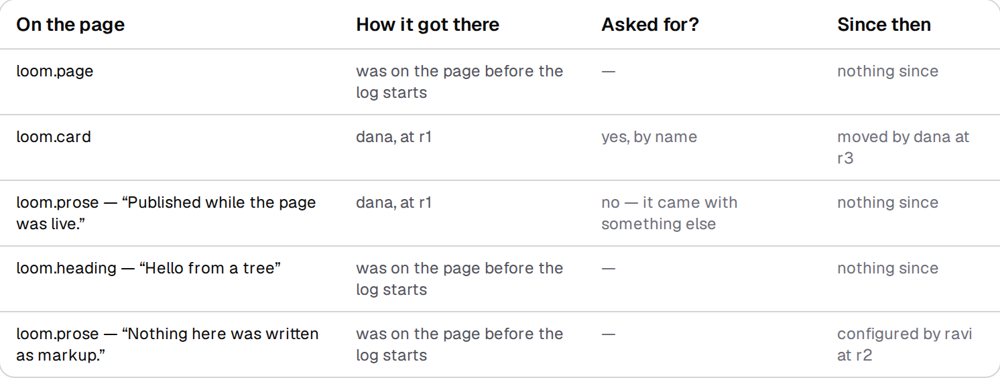
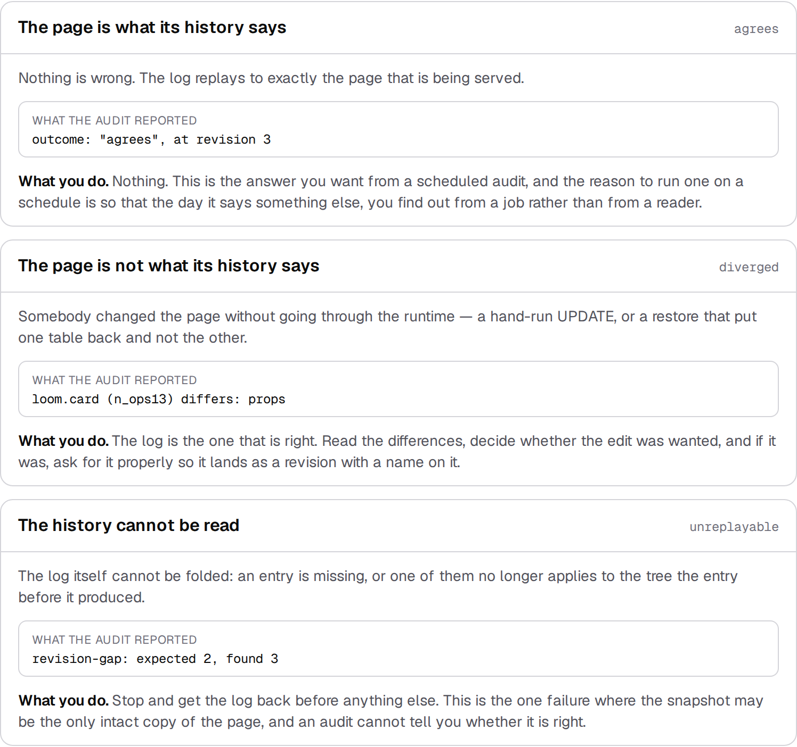
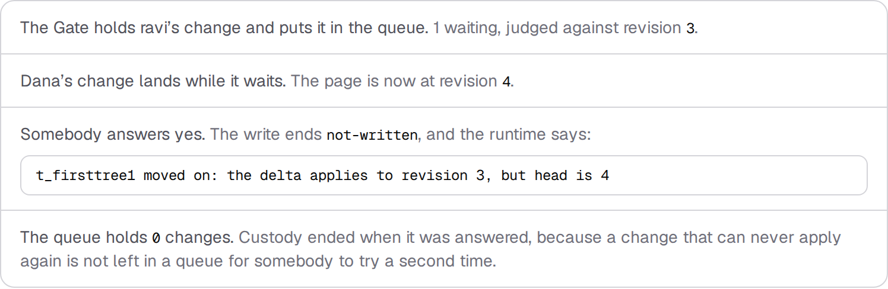

# 7 September 2026 — the page you read at nine in the morning, not at nine at night

**Routine:** `Loom docs` · **Branch:** `docs-21-the-code-on-the-page-compiles` ·
**Section:** §4c

Nineteen pages of this site teach somebody to build something. **None of them
was written for the Tuesday six weeks later**, when the thing is live, two
people have been asking it for changes, and one of them is off.

That was named as the largest hole on 1 September and again on 5 September, and
it wanted three pages on the same branch before it could be written. They are
all here now, so this run wrote it: *When something looks wrong*, the eighth and
last page of **The runtime**.

## What shipped

One page, answering the three questions an operator actually asks. Each has one
call behind it, and **every number, name and machine-written sentence on the
page was produced as the page was built** — one store opened, five asks sent
through `commitIntent`, three audits run.

The history the whole page is about is deliberately small: dana adds a card with
a sentence in it, ravi quietens the opening sentence, dana moves her card to the
top. Three ordinary changes, and already enough for "who put this here" to have
four different answers.

### Who put this here?

`attributeTree`, which nothing on this site had ever mentioned. It is the
reviewer's question and the first one anybody asks in an incident, and Loom
answers it **without storing an author on a node** — the log already determines
it, and a second copy of a fact is a second thing to keep true.

The two rows worth reading together are the card and the sentence inside it.
Both were placed by revision 1. Only one of them was ever asked for: an insert
carries a whole subtree, so *"dana added a card"* and *"dana added the sentence
inside the card she added"* are different sentences and only one is fair. The
`Asked for?` column is the runtime's `named`, and the distinction is why this is
better than reading the log by hand.

The fourth answer is the one a hand-written version gets wrong. The walk is
**bounded** — five pages of log by default — and when the budget runs out it
says `undetermined` and names how far back it got, rather than saying *nobody
changed it*, which would credit the seed with somebody's work. The page shows
that happening, against a reader clamped to one revision a page.

### Is the page still what its history says?

`auditSnapshot`, which two pages **named** and none had ever run. Three things
it can say, and the page shows all three:

**Two of those had to be staged, and the page says so in a callout rather than
letting a reader think the runtime broke a store to make a picture.** Nothing in
Loom will damage a store on request, so the audit was handed a `TreeReader` —
the read half of the store contract, which exists precisely so a consumer can be
given something other than a live store — whose snapshot had been edited without
the log being told, and then one with revision 2 missing. Those are a hand-run
`UPDATE` and a restore from two backups. **The verdicts are the runtime's; the
damage is this page's.**

The middle card is the argument for `compareTrees` in one line. *"Diverged"* is
a fact an operator cannot act on. *"`loom.card` (`n_ops13`) differs: props"* is
something you can take to whoever ran the update.

### Somebody was asked, and nothing happened

The part nobody expects, and the reason this section exists:

**A change that waited while the page moved on is dead, not stale.** It names
the revision it was judged against, so it can never apply again; `confirmHeld`
releases it and reports the conflict rather than leaving a proposal in the queue
that will refuse every time it is answered. The page ends that section on the
consequence, which is a sentence about process rather than about code: *the fix
is not a longer timeout, it is a shorter queue.*

## What I found by writing it, and did not fix

**A review queue cannot tell a dead change from a live one.** `holds.forTree`
returns everything waiting, with no reference to where the page has got to — so
a queue built exactly the way [What your app has to
do](/docs/the-runtime/what-your-app-has-to-do) describes shows both, indistinguishably,
and the only way to find out which is which is to answer one and watch it fail.
On a real deployment that is a reviewer reading a change, deciding, clicking
yes, and being told it never could have worked.

The behaviour it comes from is right and the page teaches it. The gap is that
nothing offers the comparison, and `forTree` cannot make it — it is scoped to a
tree by design (0020) and never reads the tree store. It is one `head` read away
on the caller's side, which is exactly the shape of thing that belongs in the
runtime rather than in every host that builds a queue. **Filed for `Loom daily
build`, not fixed:** `src/` is not this lane's, and the page documents what is
true rather than what I wish were true.

## Tests

`pnpm install && pnpm verify` at the repository root. **Exit 0. Nothing failed,
nothing was skipped, no test was weakened.**

| Suite | Files | Tests |
| --- | --- | --- |
| `@loom/runtime` | 119 | 1860 passed — `src/` was not opened |
| `@loom/app` | 177 | 2696 passed |

**24 new tests** across two files, taking the app from 2672. `next build` clean
across all five route groups, and the new page prerenders static.

Four are worth naming because they guard the half of this work most likely to be
quietly wrong — **the staging**. A staging bug looks exactly like a runtime
finding: a page confidently reporting a failure nobody has. So the two staged
audits are asserted down to the field rather than by outcome:

- *names the node an edited snapshot differs at, and what differs about it* —
  one difference, `changed`, on `loom.card`, facet `props`. Staging that damaged
  two nodes, or the wrong one, fails here rather than printing a plausible line.
- *stops at the hole in a log rather than folding past it* — the mismatch is
  `revision-gap: expected 2, found 3` exactly. A fold that skipped the gap would
  produce a tree nobody's history describes and compare it confidently against
  the snapshot.
- *would have answered every node given the whole log* — the bounded read's
  count of `undetermined` equals the number of rows the full read answers. This
  is what stops the bounded-read section demonstrating a bug instead of a bound.
- *never reports a placement as something that happened since* — the walk stops
  at the change that put a node there, so nothing in a row's "since then" may be
  a placement. It is the invariant the whole table's meaning rests on.

## Scope, and one thing to know about the branch

`apps/loom/app/(docs)/` only: four files added, one changed (`_lib/nav.ts`), one
generated (`_lib/fences/compiled/`). **No file in another lane was opened and
`src/` was not opened.** The generated API reference was not regenerated — the
runtime's surface did not move.

The three blocks are furniture in 0067's sense, like every other generated table
on this site: `StoreFailures`, `StorageSchema`, `WriteEndings`. They present
something the repository knows. What a reader is shown **as a page** is still a
real `LoomTree` through the runtime — the example frame near the top is one, with
its propose-a-change box. No primitive was needed and none is missing.

**This went onto `docs-21` rather than onto a new branch off `main`,** which is
not what step 3 of the brief says and is the second day running that this lane
has had to choose. Yesterday it was wasteful; today it was infeasible. The fence
checker, the context files and the compiled programs that typecheck this page's
three code blocks **exist only on that branch** — a page cut from `main` would
have shipped three snippets nothing compiles, or rebuilt the machinery to avoid
it. `main` has not moved since 1 September, and the lane's tooling is now ahead
of it. Filed, with the recommendation unchanged from yesterday.

## Open questions

**Whether a written page should declare what it teaches** is still open from
#167 and unchanged.

**Fenced code is still not searchable.** Cheaper to change than it was, since
the index split — indexing code would grow the half nobody waits for. Still
filed rather than taken.

**What I would write next.** The Getting started loop is closed and The runtime
is now eight pages and complete end to end: build it, ship it, run it. The
thinnest section left is **Architecture**, which is two pages of orientation
pointing at `lessons/` and `decisions/` — the right shape, and possibly one page
short of useful. The candidate is the one question a stranger asks after
finishing the runtime section and before adopting anything: *what does this cost
me, and what can I not do.* It would be written from the decision records rather
than beside them.
