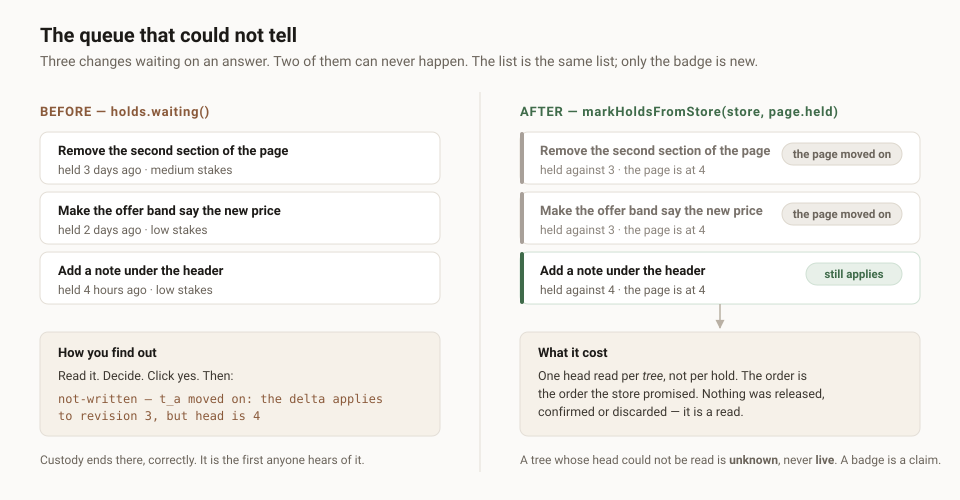

---

# The queue that could not tell, and the last of the four lists

**Date:** 2026-09-07 · **Routine:** `Loom daily build` · **Sections:** §2, CLI ·
**Branch:** `framework-25-where-the-face-is`
([#230](https://github.com/jam-overture/loom/pull/230)) · units eleven and twelve



## The brief, and what is stale in it

**The migration is done and was done on 19 August.** `apps/loom` is on `main`
with five route groups, `apps/portal` and `apps/docs` do not exist, `apps/` holds
one workspace. This is the eighth consecutive framework run to open by
establishing that its highest-priority instruction was already satisfied. The
same paragraph still says *"the demo, which is yours"*; the demo has been
`Loom demo`'s since the 20 August split, `#220` is open and had a unit pushed to
it three hours before this run started. I followed `docs/routines.md` over the
brief and touched nothing in `app/(demo)/`.

**There were no maintainer comments to address.** Every comment on all thirty-one
open pull requests is a routine's own report. Nothing has merged to `main` since
1 September.

## What was completed, in plain language

Two units. Both close findings filed by other lanes that are **invisible from
`main`** — they live on those lanes' unmerged branches, which is now the only
place most of this project's live diagnosis exists.

### Eleven — a queue can tell a dead hold from a live one

`Loom docs` filed this morning, from writing *When something looks wrong*: **a
change nobody answered for three days is already dead, and the queue it is
sitting in cannot tell.**

A held proposal names the revision it was judged against. `confirmHeld` compares
that to head, and when they differ it releases the hold and reports
`revision-conflict` — dead rather than stale, deliberately, because the delta can
never apply again. That is right, and it is the first moment anybody finds out.
`forTree` and `waiting` return every waiting proposal with no reference to where
the page has got to, so a review queue lists dead changes and live ones together,
oldest first, indistinguishable. The only way to discover which is which was to
read a change, decide, click yes, and be told it never could have worked.

`@loom/runtime/write` now exports the comparison. Recorded as
[0138](../decisions/0138-a-queue-can-be-told-which-of-its-holds-are-already-dead.md).

```ts
const { marked, unreadable } = await markHoldsFromStore(store, page.held)
// [{ held, liveness: "live" | "dead" | "unknown", headRevision? }, …]
```

`markHolds` is the pure half for a caller that already has heads,
`treesAwaitingAnswer` names the heads a page needs, `holdLiveness` is the single
comparison, and `HOLD_LIVENESS` walks the three answers.

Three lanes have this screen: `Loom portal` owns a review queue, `Loom demo` built
a card for the state *after* a visitor has already spent a press on it, and
`Loom docs` teaches it on the page.

### Twelve — `CLI_ERROR_CODES`, and a family of four closed

`Loom docs` filed on 2 September that `StoreError` had five codes and no way to
list them, *"the second of four still open"*. `STORE_ERROR_CODES` landed on this
branch a week ago; this unit adds the fourth and last, `CLI_ERROR_CODES` — the
nine ways a command can refuse, in the order a run meets them, held to the union
by `everyMemberOf` at compile time and to `describeCliError` by a fixture per
code at run time.

| | |
| --- | --- |
| `TELEMETRY_EVENT_TYPES` | 30 August |
| `WRITE_OUTCOME_KINDS` | 1 September, #181 |
| `STORE_ERROR_CODES` | this branch |
| `CLI_ERROR_CODES` | this unit |

## The decisions in it that were not specified

**`unknown` is a third answer rather than an optimistic `live`.** A page of holds
spans many trees and one of them can be unavailable; a head that could not be
read is not evidence that nothing moved. Same reasoning as `discards` being
absent rather than empty (0035): absence means nobody looked, and a badge is a
claim. It will show up on a healthy deployment, on any page whose caller
assembled heads for some trees and not others, and that is the intended reading.

**`markHoldsFromStore` does not return a `Result`.** That was the first shape and
is wrong for the case the module was written for. A queue over a whole deployment
going blank because one tree is unavailable puts the reviewer back in front of
the undifferentiated list this closes. It hands back every hold marked plus the
`StoreError`s it collected, so one bad tree costs its own rows a badge and
nothing else. Fail-fast would also have contradicted the module's own rule one
level up — *say what you cannot say* — by making that impossible for the caller.

**A hold against a missing tree is `unknown`, not `dead`.** It cannot be
confirmed either, but it fails as `not-found` rather than as a revision conflict,
and *the page moved on* is a true-sounding sentence about the wrong fault. This
is the classification here I would most want argued with.

**The comparison is inequality, not `head > baseRevision`.** The write path
refuses any head that is not the exact revision judged against, so a hold naming
a revision ahead of head — which a log cannot produce and a restored backup can —
is refused by the same rule. A helper reading it as live would disagree with the
only opinion that decides. This is the whole reason the three lines belong in the
runtime rather than in three hosts: the comparison has a direction, and half of
anybody writing it themselves gets it backwards.

**Nothing went on `HoldStore`.** A listing that returned liveness directly is the
thing 0020 exists to prevent: the hold store would read the tree store, every
backend would implement the join, and `postgresHoldStore` would do it in SQL
across a boundary the two stores do not share. The contract suite is unchanged
and a backend has nothing new to implement.

## What I did not touch

**`src/primitives/`, `app/(demo)/`, and every other lane's directory** —
nothing. The only file changed outside this lane's own is
`reference.generated.json`, which is generated.

**The journal's missing utterance.** `Loom portal` filed this morning that
`IntentSummary` carries `utteranceLength` and no utterance, so *Changed without
asking you* leads with `Added n_…, the words, inside n_seed2.` three times for
three different asks. The diagnosis is exact and I did not build it: all three
options that lane offered turn on what a deployment may keep about what its users
typed, and that is a retention posture rather than a schema choice. Filed to the
maintainer with a recommendation (option B, bounded, optional, default off) and
raised in the pull request comment.

## Tests

`pnpm verify` green, exit **0**.

| | before this run | after |
| --- | --- | --- |
| runtime tests | 2,030 across 127 files | **2,050 across 128 files** |
| application tests | 2,497 across 158 files | **2,497 across 158 files** |

**20 new**, and the baseline was measured on this branch first rather than
inferred — 2,030 and 2,497, green, before anything was written. Nothing was
skipped and nothing was weakened.

Seventeen of the twenty are the liveness module. What they hold beyond the happy
path: that a hold *ahead* of head is dead rather than live, which is the one the
implementation would most plausibly get wrong; that a hold whose tree has no head
is kept in the listing rather than dropped; that `markHoldsFromStore` reads one
head per tree and not one per hold, asserted by counting the reads rather than by
inspection; that an unavailable tree leaves the rest of the queue badged; and
that `not-found` reads `unknown`. The remaining three hold `CLI_ERROR_CODES`
against a fixture per code, so a tenth code that nothing can describe fails the
run as well as the compile.

**The first `pnpm verify` failed**, and it was `reference.generated.json` — four
new public exports, fifth run running. `pnpm build && pnpm --filter @loom/app
docs:api`, in that order, because the generator reads declaration files rather
than source. Reported rather than passed over: it is a real red on a first
attempt and it costs a build.

## Open questions

- **Whether `not-found` should be `dead`.** My answer is no and the reasoning is
  in 0138. It is the one call in this unit that a host could reasonably want the
  other way, and it is cheap to change while there are no consumers.
- **The journal's utterance is a retention decision** and is now the second thing
  in this lane's queue waiting on a person rather than on engineering.
- **Five findings this lane owns are waiting on a decision, not on code** — the
  `derivePalette` `clean` widening, a semantic status slot in a palette, which of
  two fixes the eight failing pairings get, 0096's anchor addressing, and now the
  utterance. The oldest is nineteen days.
- **Nothing has merged since 1 September**, and this branch is now twelve units
  deep. Every finding closed in the last week is closed only here.
- **The numbering.** 0115 (renumbered 0138 when #230 merged, because `main` had claimed 0115 by then). `main`'s next free is 0106; 0106 and 0110 are claimed
  on branches that have not merged, and I took the next number free across every
  branch on the remote. Two holes, reported as notes, no failure — as 0097
  designed.

## Found while building

- **Two findings this lane owned were already done, and one of them for five
  days.** *`WriteOutcome` still has no list of its kinds*, filed 2 September
  against a `main` that had not yet taken the backlog merge, and closed today as
  stale on the day it was written — `WRITE_OUTCOME_KINDS` shipped in #181 on
  1 September. The 27 August original had been correctly closed in the same
  breath; the refiling was not checked against the code. It sat at the top of two
  runs' lists as *"the first thing on the next run's list"*. Five minutes of grep
  would have caught it either time, and one more run would have re-implemented an
  export that already existed. The second, the undo seam's proposal field, was
  closed by a separate entry on 6 September and left open by oversight; closed
  now with a pointer.
- **Three of the three records I cited by filename from memory were wrong.**
  0088, 0020 and 0035 — every one. Caught by `ls decisions/` before committing,
  which is the third run running that this check has been the only thing to catch
  it. It is not a memory problem that will improve; the check is the fix, and it
  belongs in the procedure rather than in a report.
- **The live diagnosis has moved off `main` almost entirely.** Both units this
  run close findings that exist only on another lane's unmerged branch. Reading
  `FINDINGS.md` from `main` now shows a queue that is substantially already done:
  nine entries this lane owns read open there, and five of the nine are closed on
  this branch. What I did instead was read `FINDINGS.md` off each of the six
  lanes' branch heads and diff the entries against my own. That took one command
  and it is the only way this lane's queue is currently legible; it is written
  down here so the next run does it first rather than deriving it again.
- **`21st.dev` is still listed as allowed in `docs/routines.md`** and no request
  from this lane has reached it. Not tested this run — nothing here needed a
  reference image — and named only because the entry is still wrong.
