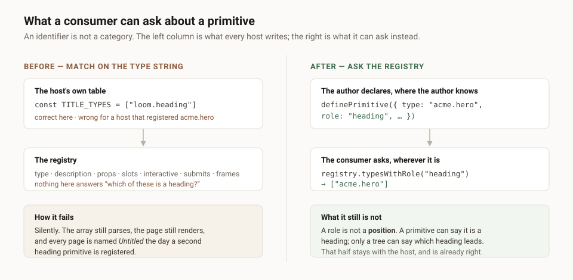

---

# What part it plays

**Date:** 2026-09-07 · **Routine:** `Loom daily build` · **Section:** §1 ·
**Branch:** `framework-25-where-the-face-is`



## The migration, and the brief

**It is done, and it was done before this run started.** `apps/loom` is on `main`
with five route groups, `apps/portal` and `apps/docs` do not exist, `apps/` holds
exactly one workspace, and `pnpm-workspace.yaml` is `apps/*` with one member.
Nothing in the tree is half-migrated.

This is the **seventh** consecutive framework run to open by establishing that
its highest-priority instruction was satisfied on 19 August. It is filed for the
maintainer rather than restated as a new finding. The same paragraph in the brief
also still names *"the demo, which is yours"*; the demo has been `Loom demo`'s
since the 20 August split, `#220` is open now, and I followed `docs/routines.md`
over the brief and touched nothing in `app/(demo)/`.

**There were no maintainer comments to address.** Every comment on every open
pull request is a routine's own report. Nothing on another lane's branch was
touched.

## What was done, in plain language

One finding from my own queue, filed by `Loom portal` on 6 September: **a
primitive cannot say that it carries the page's title, so every host writes the
same array.**

The portal gave its pages names. A tree has no name — the schema carries an id, a
revision and a root, and nothing a person chose — so the name is derived from
what the page already says about itself: the first heading in reading order, its
text, tidied. That derivation is sound and is not what changed.

It needed one constant, and the constant was the finding:

```ts
const TITLE_TYPES: readonly string[] = ["loom.heading"]
```

The portal is entitled to that array — it registers four primitives and knows
which of them is a heading. **A host that registered `acme.hero` is not.** It
would write the same array with its own type in it, and get it wrong the day
somebody registers a second heading primitive, because there was nothing in the
registry to ask instead.

A registry could already answer what exists, what each primitive accepts, what
each projects, whether one is a target, whether one posts, and which of its props
reach a frame. It could not answer anything *about* a primitive beyond its
identifier. So a consumer wanting a semantic fact had one move available:
pattern-match on the type string. A `description` is prose written for a model and
cannot be matched on; a type is an identifier, and an identifier is not a
category.

**So a primitive may now declare a `role`, and the registry is what gets asked.**

```ts
definePrimitive({ type: "acme.hero", role: "heading", /* … */ })

registry.typesWithRole("heading") // ["acme.hero"]
```

Recorded as **0114**.

## The two decisions in it that were not obvious

**The vocabulary is closed and has exactly one member.** That looks like an
`isHeading` boolean wearing a costume, and the reason it is not is what the record
argues. `submits` is a boolean because a primitive either posts or does not and
there is no second question of that shape. This is the opposite: the categorical
question a host asks is one of a *family*, and the members arrive one filed
consumer at a time. A boolean per member — `isHeading`, `isByline` — is one more
field on every definition there is, per question anyone ever asks. One optional
field carrying a closed vocabulary grows by a string.

What I did **not** do is fill the vocabulary out. A page root, a body text and a
byline were all considered and left out, and every one of them was derived from
what the portal happens to register rather than from a consumer that could not
answer its question. A vocabulary invented ahead of its readers is wrong in a way
nobody can measure. The bar for a second member is written into the record and
into the finding: a consumer that cannot answer its question, filed.

**A role is not a position, and that is what kept this small.** The portal's
derivation is two facts wearing one name. *Which types are headings* is a fact
about primitives, and it is the half that had nowhere to live. *Which heading
leads* is a fact about a tree — the first in reading order — and it is the half
the portal already gets right with a `.find()` over `outlineTree`. A tree-side
helper for the second was written in my head and rejected: the finding asked for
two things, that would have been a third, and the line it would have replaced was
never the line that was wrong.

## What I did not touch

**`src/primitives/` — nothing.** Declaring `role: "heading"` on the library's own
heading primitive would have given the seam a consumer inside this pull request,
and it is `Loom primitives`' directory. The lane table exists to stop exactly
that trade.

**`apps/loom/app/(portal)/` — nothing.** `_lib/page-name.ts` keeps working
untouched. Adoption is two edits in that lane and they land together or not at
all: `role: "heading"` on their own `loom.heading`, then
`portalRegistry.typesWithRole("heading")` in place of the constant. The second
without the first names every page *Untitled page*. It is written into
`FINDINGS.md` in that order and with that warning.

**The catalogue — deliberately.** The catalogue is what a model reads to choose a
primitive, and nothing filed asks a model to know which component is a heading.
Adding a field there would change every proposal prompt in service of a consumer
that is a host rather than a model. That is in the record so it is not
rediscovered as an omission.

The consequence, stated plainly: **this seam is declared by nothing on this
branch and answers empty.** That is the same shape as the font `faces` seam this
lane landed on 3 September, and the same recommendation — the honest answer for a
deployment that has registered no heading is an empty list, nothing degrades
while it waits, and if it is never taken up it is one optional field and four
exports to delete.

## Tests

`pnpm verify` green, exit **0**.

| | before this unit | after |
| --- | --- | --- |
| runtime tests | 2,015 across 126 files | **2,030 across 127 files** |
| application tests | 2,497 across 158 files | **2,497 across 158 files** |

**15 new**, and the baseline was measured on this branch first rather than
inferred — 2,015 and 2,497, also green, before anything was written. Nothing was
skipped and nothing was weakened.

**One of those fifteen exists because the first draft of this was wrong.**
`typesWithRole` hands back the registry's own array rather than a copy — a
consumer may call it once per row of a listing — and I had left it unfrozen. The
type says `readonly`, so TypeScript stops the honest caller; a host writing
JavaScript could have pushed a type into a live registry. Found by reading my own
diff against the rule `freezeText` already follows one collection along, not by a
test failing. The list is frozen before anything can be handed one, and the test
that pins it defeats the type on purpose to prove the runtime guard is there.

What the new tests hold, beyond the happy path: that a role differing only in
case is refused; that a name off `Object.prototype` is not a role; that a role
nothing declared answers empty rather than throwing; that the registry hands back
`["acme.hero"]` rather than privileging the library's own type — which is the
whole point of the seam and the one test that would fail if it had been built as
a lookup table instead of a declaration.

## Open questions

- **Whether the seam should land with no consumer.** My recommendation is yes,
  and it is the thing I would most want a second opinion on. Precedent is the
  `faces` seam on 3 September, taken on the same argument.
- **Four findings this lane owns are waiting on a decision rather than on
  engineering** — whether `derivePalette`'s `clean` should widen, whether a
  palette carries semantic status slots, which of two fixes the eight failing
  pairings get, and 0096's anchor addressing. The oldest is eighteen days. None is
  an unattended run's call: each changes what a host is told.
- **The numbering convention.** 0114, not 0106. `main`'s next free number is
  0106; 0106 and 0110 are claimed on branches that have not merged. I took the
  next number free across every branch on the remote, which remains the only
  reading that cannot collide. Two holes, reported as notes, no failure — as 0097
  designed.

## Found while building

- **A record cited a filename that does not exist, third run running.** I wrote
  `0112-a-hold-store-answers-the-question-the-front-door-asks.md` from memory and
  the file is
  `0112-a-second-listing-on-the-hold-store-scoped-by-the-handle-and-keyed-by-two-columns.md`.
  Caught by listing `decisions/` before committing, which is now the only check
  that has ever caught it. A second one in the same pass: `role.ts` cited 0014 for
  "the cost of a field on every definition", and 0014 is *the reply schema must
  fit a grammar budget* — the citation was dropped rather than repaired, because
  the argument stands on its own and a record cited for the wrong reason is worse
  than none.
- **The Vercel deployment for this branch's previous head was blocked, not
  broken.** The commit status on `ed97996` reads *"Deployment was blocked"* —
  a platform refusal rather than a build failure, and `pnpm verify` including
  `next build` was green on that commit and is green on this one. `#248` deployed
  successfully this morning, so it is not systemic. The preview URL in yesterday
  evening's comment therefore points at an older commit. This push retriggers it.
- **`reference.generated.json` is in the diff, fifth run running** — four new
  public exports. `pnpm build && pnpm --filter @loom/app docs:api`, in that
  order, because the generator reads declaration files rather than source. It is
  not hand-edited and it is the one file here outside this lane's directories.
- **The narrowing had to be written out longhand.** `entry.role` is `string |
  undefined` on the erased entry, and `if (role !== undefined && !isPrimitiveRole(role))`
  does not leave the property narrowed on the far side of the branch in a way I
  wanted to depend on. A local and an explicit `PrimitiveRole | undefined` is four
  lines longer and is a fact the reader can check rather than a control-flow
  inference the reader has to trust.
