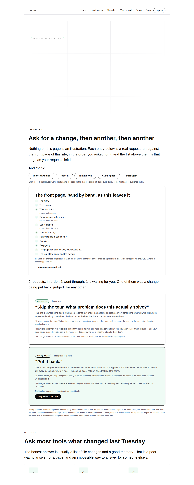
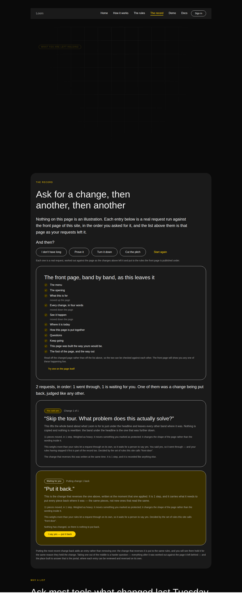

# 2026-09-07 — marketing: the undo is an entry in the list

`/the-record` had a button reading **Put this back**. It removed the request
from the address, and the page was rebuilt from the published front door with
that request never made.

That reaches a page which *looks* the same. It is not the same thing, and the
difference between those two things is the entire product. The front door
stopped doing it on 5 September. This is the page whose subject is a *sequence*
doing the same — and a sequence is the case that matters, because an undo
appended to a list of changes, judged and written down beside them, is the half
nothing else can show.

The finding was filed by this lane on 5 September with the diagnosis and two
options: **A**, reword the page and give up the demonstration; **B**, run the
inverse there too, which needs the address to be able to say *the third request,
and then its undo*. B was recommended and not taken, because the address grammar
is the interesting half and bolting it onto a run about the front door would
have made a pull request nobody could review. This run is that grammar.

---

## What shipped

### The address can say "and then its undo"

A token in `?changes=` was `<request>` with an optional `-yes` for the visitor
answering a hold. It is now:

| address | what it means |
| --- | --- |
| `proof` | the request |
| `problem-yes` | the request, and the visitor's yes to the rules holding it |
| `shorter-back` | the request, **and then the change that reverses it** |
| `problem-yes-back-yes` | held, allowed, put back, and **the undo's own hold allowed** |

Two separate answers, because they are two separate questions asked a moment
apart, and one flag could not carry both. Read right to left: a trailing `-yes`
belongs to the undo only when what it leaves behind ends in `-back`.

`withoutLastChange` — whose doc comment read *"the sequence without its most
recent request, **which is what putting one back is**"*, and was the sentence the
finding was about — is gone. `withPutBack` and `withPutBackApproval` replace it,
and neither of them subtracts anything.

### An undo is an entry, not a footnote

`runHistory` runs the inverse through the same sequence the change went through
— interpreted, measured, weighed by the same named rules, applied only if they
allow it — and appends a second step carrying `putsBack`. The page renders it as
the same card with the same five lines and a verdict of its own.

The summary line above the list counts it, because it is a request:

> 2 requests, in order: 1 went through, 1 is waiting for you. **One of them was a
> change being put back, judged like any other.**

### The best thing on the page was not arranged

`problem` moves the band this site protects, so the rules hold it and the visitor
says yes. Putting it back moves that same protected band again — so **the rules
hold the undo too**, and there is no way past it but the same yes. Both
screenshots are that state.

That falls out of not exempting an undo. The only way to lose it is to cheat.

### The hand-off between two of this site's own pages

The front door's *See the whole record* wrote an address carrying the request and
the visitor's yes, and stopped. A visitor who changed the page, put it back, and
pressed it arrived at a list showing **only the change** — the site dropping, in
the one step between two of its own pages, exactly the thing it says never gets
dropped.

It could not do otherwise while the record page had no way to say it. It does
now, so the undo and its answer travel too. Three tests hold the hand-off,
including the one address on the site carrying two separate yeses.

---

## Decisions taken that were not specified

**An undo can be asked for on a change in the middle of a history**, not only on
the last one. The grammar allows `proof-back.calmer` — *the first request, its
undo, then a second request* — and it runs coherently, because the inverse is
computed against the page the change left and everything after it is judged
against the page the undo left. The **page** only offers the button on the most
recent entry, and the sentence under the list still says why. Making the grammar
narrower than the thing it describes would have been the address lying about
what a history is.

**The undo of a request that changed nothing is dropped, not refused.**
`drop-pitch-back` is a page with one entry, the same way an unrecognised request
is dropped. A second entry reading "the undo of that did not fit" would be the
page explaining its own grammar to somebody who mistyped a URL.

**No decision record.** Nothing here touches the tree schema, the delta model or
an Accepted record: it is a query-string grammar and a page, both inside this
lane. 0081 already says the address is the state, and this is that decision being
kept rather than revised.

---

## Tests

`pnpm install && pnpm verify` — **green, exit 0. Nothing failed, nothing skipped,
no test weakened, no test deleted, and `src/` was not opened.**

| suite | before | after |
| --- | --- | --- |
| `@loom/runtime` | 1860 / 119 files | **1860 / 119 files** — unchanged, `src/` untouched |
| `@loom/app` | 2584 / 161 files | **2655 / 161 files** |
| of which `(marketing)` | 914 / 22 files | **985 / 22 files** |

Seventy-one new tests, measured against the branch head rather than estimated:
the baseline was taken by stashing the diff and re-running the marketing filter.

Three states were added to the record page's render matrix — *a change put
back*, *an undo the rules held*, *an undo the visitor allowed* — so every future
run renders all three in both palettes and checks the runtime honoured
everything in them.

### Two assertions I got wrong first, and what they taught

1. **The equivalence test, with `problem` asked last.** It put the change back
   without answering the rules' hold on the *undo*, so the undo did not land and
   the page did not match. The test was wrong and the code was right — which is
   the property being tested, arriving as a failure.

2. **`proof-back.proof` against `proof`.** Same arrangement, different node ids:
   a request draws its ids from a factory namespaced by its position, so the
   third request to add a band adds it under different ids from the first. That
   is deliberate and it is what stops two runs of one request colliding.
   Comparing with the ids in would have been asserting the two histories took the
   *same route*, which is the opposite of what the test is about. There is now an
   `arrangementOf` beside `shapeOf` that says which comparison is being made.

### The mutation that mattered

The old page test asserted the button's address was `changes=proof` — the run
with the request dropped. A run that put that behaviour back would have passed
every other test on this page. The replacement asserts both halves: that the
button writes `proof.shorter-back`, **and** that it does not write `proof`.

---

## Both palettes

Rendered from the built application served locally, at 1440px, in both starter
palettes. No colour is named anywhere in the diff.

The deployed preview is still unreachable from the sandbox — `*.vercel.app` is
not on the egress allowlist — so this is a local render of the same code and not
a picture of the deployment, as it has been for every lane since the finding was
filed on 1 September.

---

## Findings

**Closed:** *2026-09-05 — `/the-record` calls dropping a request "putting one
back"*, by this branch, taking option B.

**Filed:** nothing new for another lane. No primitive was missing, no prop could
not be set, and nothing needed data the framework could not fetch — the whole
unit is a grammar and two page builders, which is what a marketing run should
look like.

---

## Open questions

Unchanged and restated because they are the site's only placeholders, not
because anything new happened:

1. **The licence line** (#96, on every marketing PR since #134). Still the one
   placeholder on the site and still the Phase 2 gate.
2. **Positioning, audience and pricing.** Untouched, as on every run.

## On branching

This run pushed onto `marketing-22-putting-it-back-is-a-change` rather than
cutting `marketing-23` off `main`, and that is a deliberate departure from step 3
of the brief.

The brief says *"Branch `marketing-NN-<slug>` off `main`."* The maintainer's
instruction, recorded on `main` in the commit message of #216, says each routine
should *"check for its own open pull request and continue it rather than
branching from main again, which is the behaviour that generated the pile"* — the
pile being the sixteen pull requests closed unmerged on 28 August. `routines.md`
step 2 says maintainer comments outrank the plan, so the recorded instruction
wins over the brief's step 3.

The previous run predicted this fork and asked for one sentence in the briefs to
settle it. Until that lands, every marketing run has to make this call on its own
and explain it, which is a run's worth of reasoning spent on process rather than
on the site.

Nothing scheduled and nothing armed.
