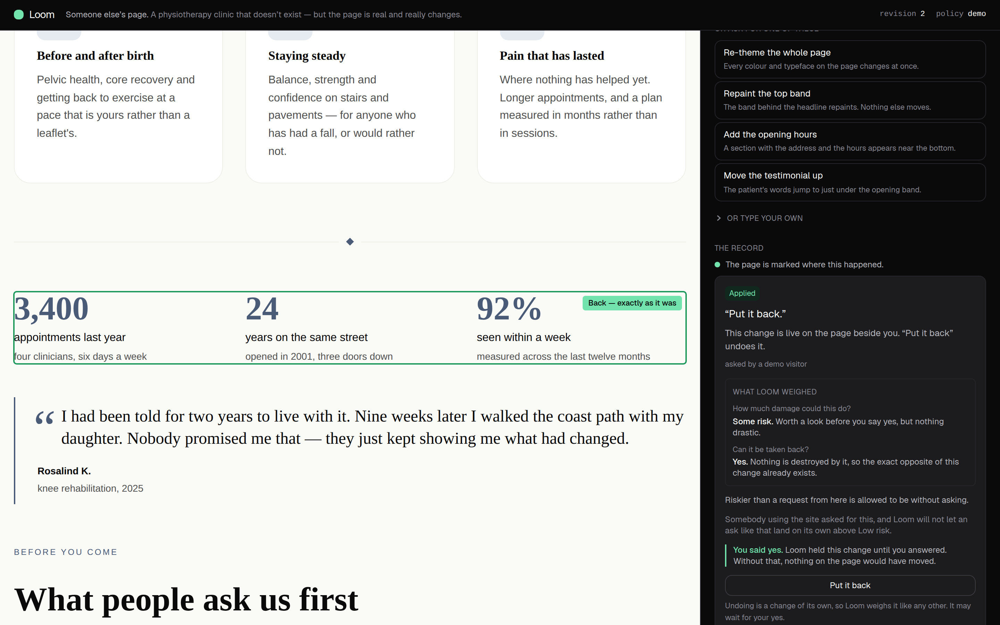
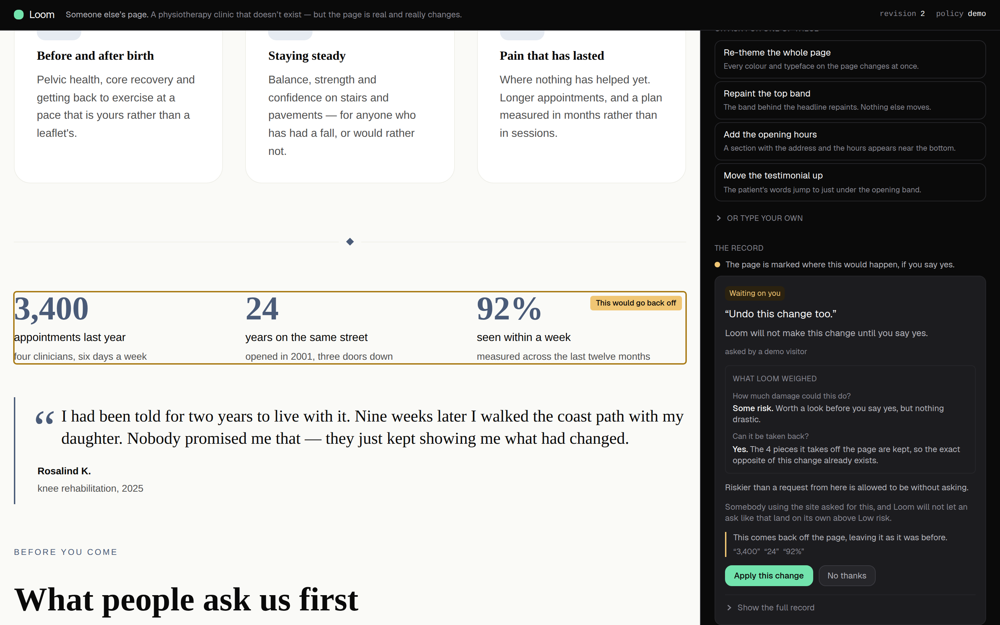
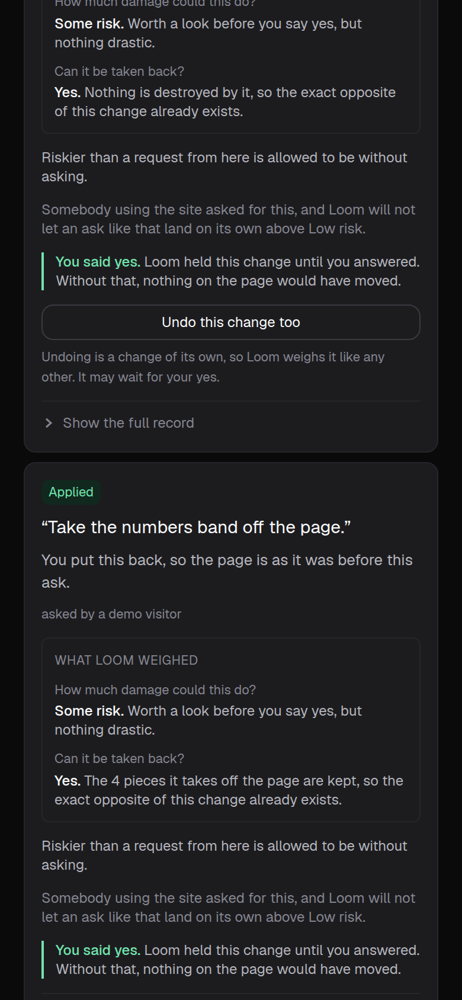

# Demo — one phrase, one meaning

**Date:** 8 September 2026 · **Routine:** `Loom demo` · **Branch:**
`demo-12-what-allowing-it-would-do` (unit 8) · **Pull request:** #220

---

## What a stranger could not work out before this run, and can now

**Which way the last button on the demo points.**

I built the page and drove it in Chromium at 1440×900 and 390×844, pressing what
the rail puts first and then following the sequence this surface is designed
around: **ask · allow · put it back · allow.** The first three frames hold up.
The fourth — the one a visitor is looking at when the sixty seconds are up — read
like this:

| | |
| --- | --- |
| badge | **Applied** |
| what was asked | *“Put it back.”* |
| what became of it | *“This change is live on the page beside you. **“Put it back”** undoes it.”* |
| the control | **[ Put it back ]** |

Three uses of one phrase, and **the button is the odd one out: pressing it takes
the numbers off again.** The card's own title is what that button would reverse,
and the sentence between them is circular — *“Put it back” undoes it*, on a card
whose subject is putting it back.

So the demo's last frame was a loop with no exit sign. A stranger who has just
watched the interesting thing happen — a change, gated, recorded, and really put
back — is handed a control whose words say the thing they have already done, and
which does the opposite.

Now the same frame says *the page is back as it was, and this record is how it
got there*, and the control under it says **Undo this change too**. *“Put it
back”* appears once on that card: as the quotation of what the visitor pressed.

| before — three uses, two meanings | after — one use, and it is the quotation |
| --- | --- |
|  |  |

**The button stays, and that is the point.** Removing it would be the tidy fix
and it would deny the interesting claim: an undo is a change of its own rather
than a rewind ([0032](../decisions/0032-an-undo-is-a-change.md)), weighed and
recorded like any other, and therefore reversible in its turn. Only the words
change.

---

## The half worth your attention: fixing a control moved the defect one press deeper

The quotation at the top of an undo's card is *of the control the visitor
pressed* — that is what the 26 August run established and it is right. Which
means renaming the control silently falsifies it.

The first build of this unit did exactly that. Press **Undo this change too**,
and the card that appeared was headed *“Put it back.”* — quoting a button that
was no longer anywhere on the screen. The defect had not been fixed; it had
moved one press further down and got quieter.

`askedLine` could not see it, because the words to quote are on a *different*
card: an ordinary change offers **Put it back**, an undo offers **Undo this
change too**, so which control raised this undo is a fact about the ask above it.
It now reads that from the records, the same way `undoOffer` does and for the
same stated reason — *the card cannot see the ask above its own* — and the page
hands it down beside `offer`.

The card quotes *“Undo this change too.”*, the mark on the page says **This would
go back off**, and the plain reading — computed against the tree, in the
restoring direction, by machinery that already existed — says *“This comes back
off the page, leaving it as it was before.”* over the three figures. Nothing in
that frame disagrees with anything else in it.

---

## What shipped

### `_lib/undo.ts` — an undo's card gets its own four strings, and one selector owns them

`appliedWords(record)` returns the sentence under the badge, the words on the
control, and the two sentences that replace the control while an undo of this
card is waiting or has landed. For every card that is not itself an undo it
returns exactly what was there before; for one that is, it returns the versions
that are about this card rather than about the one below it.

One selector rather than four `isUndo` branches in the markup, **because the
failure was four strings drifting apart while each stayed true on its own.**
Splitting them across the component is how they drifted in the first place.

`meaning` is optional and absent for an ordinary change: that sentence belongs to
`report.ts`, which already overrides the shared table's once for this surface, and
a second copy here would be the drift this file exists to stop.

### Why none of the four names a direction

*“Take it off again”* is the label this reads as wanting, and it is correct only
because this demo's leading preset happens to be a removal. The undo of *“Add the
opening hours”* puts a section back, and **its** undo takes one away. A string in
a table cannot know which, and this surface will not name a change by what it does
to a type (`plain-change.ts`, and the standing question below). So the strings say
*this one too*, and the plain reading on the held card — which is computed against
the tree and already writes in the restoring direction — says what actually moves.

There is a test that holds this: none of the four may contain *off*, *added*,
*removed* or *back on*.

### `record-card.tsx` — one more prop, of the same shape as `offer`

`asked?: AskedLine`, defaulted to the reading the card can reach on its own, which
is right for every card but an undo of an undo. `page.tsx` passes
`askedLine(record, records)` beside `offer={undoOffer(record, records)}` — the two
things about a card that only the whole record list can settle, computed in one
place.

### `report.ts` — a comment that was one card out of date

The doc comment on `DEMO_MEANINGS.applied` already explained that this sentence
names a control and that the control can be withdrawn. It now also says that on
one card the sentence has to be replaced outright rather than adjusted, and which
file owns the replacement.

---

## On a phone

Both directions in one frame at 390×844 — the undo's card with its new control,
and the ask it undid directly below, still carrying the ordinary
*“You put this back, so the page is as it was before this ask.”*

---

## Decisions taken that were not specified

- **Shape 1 and shape 2 of the 5 September finding, together rather than in
  sequence.** That entry recommended *2 now, 1 when the applied card next earns a
  rewrite* — fix the circular sentence, leave the button. Driving it says the
  button is the half that actually misleads: a sentence is read once and a
  control is pressed. Taking only the sentence would have left a visitor able to
  read the card correctly and still press the wrong thing.
- **Shape 1 by naming the card, not by naming the change.** The finding assumed
  shape 1 meant *“the control says what reversing this change comes to, in the
  words on the page”*, which needs the inverse delta resolved against the tree —
  and an applied record carries `inverseOperations` as strings, not a delta. The
  words on the page are not available on that card without new plumbing. Naming
  the card instead (*Undo this change too*) needs nothing new, generalises to
  every undo, and is the reading the caution under it already gives.
- **The two no-button states came along.** `UNDO_WAITING` and `UNDO_SPENT` are the
  same claim in the same direction, and fixing the sentence and the button while
  leaving those would have put the next press back where this one started.
- **No decision record.** Nothing here touches the tree schema, the delta model or
  an `Accepted` record. It is four strings and a selector over a predicate the
  runtime stamps (`REVERT_INTERPRETER`). Nothing escalated, nothing left out.
- **Continued on #220 rather than cutting `demo-13`.** Your 28 August entry says
  to push onto an open pull request rather than branch again from `main`, and this
  unit edits `record-card.tsx` — one of the two files that entry names as having
  made sixteen pull requests unmergeable.

---

## Real test numbers

`pnpm install && pnpm verify` — **green, exit 0**, first attempt.

| suite | files | tests |
| --- | --- | --- |
| `@loom/runtime` | 119 | 1860 |
| `@loom/app` | 165 | **2642** (2626 before this unit) |

Nothing failed, nothing was skipped, no test was weakened. **16 tests are new** —
8 in `_lib/undo.test.ts`, 8 in `demo/_components/record-card.test.tsx`.

**Measured rather than asserted.** With `appliedWords` collapsed back to the
ordinary strings and the tests left in place: **9 of the 16 fail.** The seven that
survive are the ones guarding this unit against going *too far* — that an ordinary
change keeps every string it had, that a held card keeps the shared table's
sentence, that a card rendered with no record list keeps the reading it can reach
alone, that the badge still says *Applied*, and that the caution making the 0032
claim is still under the button.

The two that matter most are the ones nothing in the diff could have shown:

- *“says ‘Put it back’ once, as the words the visitor pressed”* — counts the
  occurrences in the rendered card rather than asserting any one of them. It is
  the property the whole unit is for, and it is the one a future edit to any of
  the four strings would break silently.
- *“quotes an undo of an undo by the control that actually raised it”* — the trap
  this unit opened and closed. It fails against the first build of this unit,
  which is the point of it.

`src/` was not opened. No framework gap was found and no primitive was wanted.

---

## Findings

**Closed:** the 5 September entry — *the undo's own card says “Put it back” three
times and means two different things by it_ — by this unit, on #220.

**Filed:** three.

- `Loom demo` → itself and worth every lane's attention: **a string that quotes a
  control is coupled to that control, and renaming the control falsifies the
  quotation without touching it.** Found by driving the built page one press past
  where the fix was.
- `@jonathanbravecredit`: **`21st.dev` still `EGRESS_BLOCKED`**, thirteenth from
  this lane. The cost this run was nil and it is worth saying so: what decided
  four strings was building both trees and photographing the same six presses
  against each.
- `@jonathanbravecredit`: **`docs/rollout.md:19` still says the demo lives at
  `apps/loom/app/(portal)/portal/demo`**, eighteen days on. Re-verified on this
  branch rather than re-dated.

---

## The one thing I did not take, said plainly

**The 7 September finding — the rail and the stage are scrolled by two components
that do not consult each other — is still open**, and it was the standing
candidate for this run. I took this instead because the two are not comparable on
this lane's own standard: the scroll disagreement needs two open questions *and*
a visitor scrolling one pane by hand, while the phrase collision is the last frame
of the primary path and every visitor who finishes the sequence reads it. Its
recommendation (shape 2 — the chip becomes a link to its card) is unchanged and
still small.

## Open questions

- The 1 September question is unchanged and this unit is the clearest case for
  it yet: **should a primitive type ever get a friendly name on this surface?**
  Recommendation unchanged — keep the refusal. It is why the control says *Undo
  this change too* rather than naming what would move.
- **Eight units are on #220 now.** The offer stands from six runs ago: say if you
  would rather this lane go back to one pull request per run now that the redo
  queue is empty, and it will take the collision risk instead.
