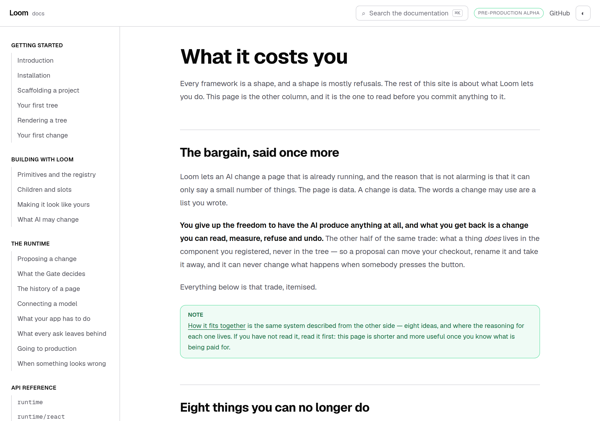
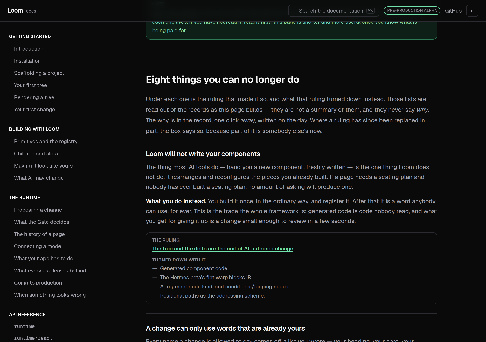
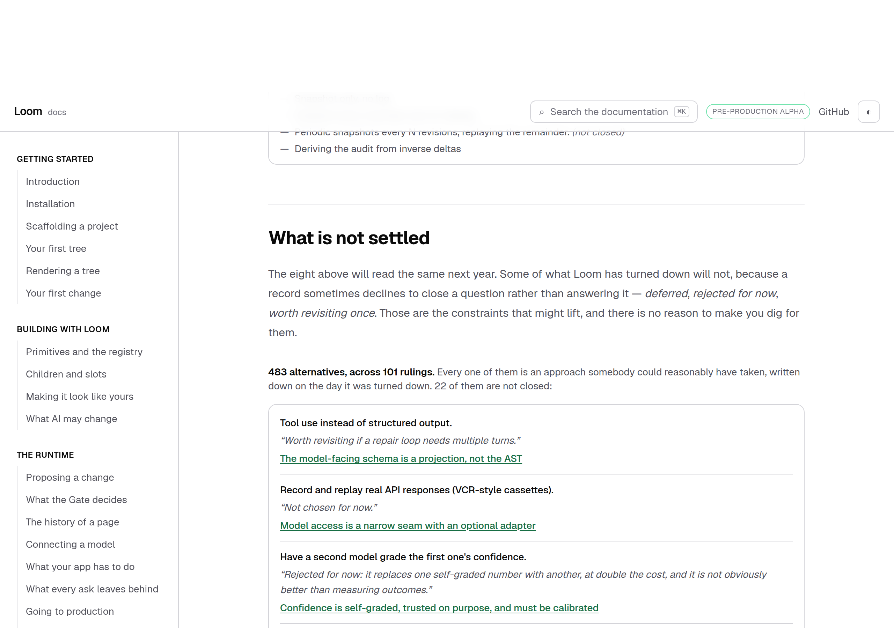
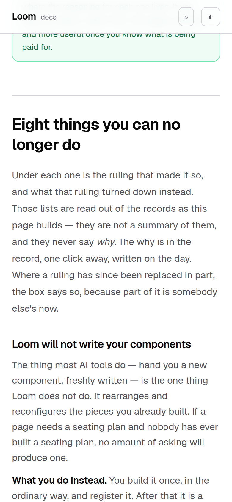

# 8 September 2026 — what it costs you

**Routine:** `Loom docs` · **Branch:** `docs-21-the-code-on-the-page-compiles` ·
**Section:** §4c

Twenty written pages, and almost all of them answer the same question: what can
you do with this. None was written for the person who has read enough and is
now deciding whether to adopt it, whose question is the other one — **what does
this take away from me, and what can I not do.**

## What shipped

**One page — *What it costs you*** — the third in Architecture, between the
eight ideas and the index of records.

Eight things you can no longer do, each in a sentence a person could repeat,
each answered by what you do instead. Under every one is the ruling that imposed
it and **what that ruling turned down** — and that second list is read out of
the record as the page builds, never typed.

That split is the whole design of the page, and it is the section's own rule
applied to a new shape. The plain sentence is written here because no record is
obliged to phrase its consequence in a way a stranger can hold. The alternatives
are the record's, named and never explained, so **the argument still has exactly
one home** and a reader who wants it is one click from the day it was decided.

## The part that is worth the build

Every decision record ends in *Alternatives considered*, and that section is the
part a future reader cannot reconstruct. Nothing had ever read it.

Reading all of them turns out to be the most useful number this site can put in
front of somebody deciding: **483 alternatives, across 101 rulings** — and
**22 of them are ones a record declines to close.**

Those 22 are the honest answer to *is this the shape it will keep*: Neon for
per-preview database isolation, container queries instead of a width query,
compacting the journal instead of deleting from it, requiring an append to carry
proof of a Gate disposition. Each row carries **the record's own sentence**, so
the classification shows its evidence rather than asking to be trusted.

## Three decisions I took that were not specified

**The Architecture section grew a third page, and the limit that keeps it small
is not a page count.** The nav comment said *"two pages is the whole of it"*. The
rule underneath that sentence is the one worth keeping and it is now written
down: **no page in this section may explain a ruling.** It may name one, count
them, say what a stranger needs in order to decide whether to open one. Three
pages that all obey that are cheaper to keep true than two that do not.

**A conditional is not a verdict.** The mark on those 22 rows comes from
matching words — *deferred*, *for now*, *worth revisiting* — with one exclusion.
0038 argues an alternative *"the last run recommended if the fix were deferred
again"* and closes it in the very next sentence; reading the word alone would
present a closed ruling as open, on the one page a reader uses to decide. So a
marker sitting after an `if` describes a hypothetical rather than saying where
the ruling stands. Every real one reads the other way round — *"worth revisiting
**if** a repair loop needs multiple turns"* — marker first, condition second.

**A cost cites its ruling, and says when that ruling has been replaced in
part.** Undo is *An undo is a proposal, not a rewind*, which is
`Accepted — partially superseded by 0035`. Citing it silently would let a reader
think the whole of it stands. The box shows the standing as a word rather than
the record's status line, because that line names its replacement by number and
a number is the thing this section withholds everywhere else.

## The bug the parser found, which is the reason to write parsers

The first version read alternatives as paragraphs, which is how 92 records write
them. **Nine write them as a bullet list** — same sentences, same bold lead, a
dash in front — and those nine came back having considered nothing at all.

It was silent, which is the worst way for this to be wrong: the page would have
shown a shorter list of roads not taken and looked complete. It cost **48
alternatives** — 435 against the 483 that are really there — and none of the
eight costs cites one of those nine records, so every test I had written passed
except the one that counts how many rulings were read at all. That test is the
only reason this was caught, and it was in the suite by accident: I wrote it to
pin a floor, not to find a bug.

Two things now stop it recurring. A unit is a bullet **or** a paragraph, and the
two are the same thing to the parser. And a cost whose record yields no
alternatives **throws when the module loads** rather than rendering a heading
with nothing under it — the derived half is what makes this page worth more than
an essay, and a silently empty list would leave the essay looking like evidence.

## Tests

`pnpm install && pnpm verify` at the repository root. **Green, exit 0.** Nothing
failed, nothing was skipped, no test was weakened and no cap was raised.

| Suite | Files | Tests |
| --- | --- | --- |
| `@loom/runtime` | 119 | 1860 passed — `src/` was not opened |
| `@loom/app` | 177 | 2719 passed |

**+23 tests** over the 2696 this branch carried yesterday: 16 in
`_lib/architecture/architecture.test.ts`, 7 in `_components/architecture.test.tsx`.
`next build` clean across all five route groups; the new page prerenders static.

Three claims were verified by mutation, because a test that has never failed is
a claim rather than a check:

- reading only paragraphs, not bullets, fails *reads an alternative out of every
  ruling that has any* — and nothing else
- dropping the `if` exclusion fails *does not read a hypothetical as a verdict* —
  and nothing else
- searching the whole paragraph for the note rather than the part after the lead
  fails three: *marks what a record declines to close*, *still reads a condition
  that says what would reopen it*, and *never repeats the alternative's own name
  back as its note*

The check I would defend hardest is the one that cannot be satisfied by writing
prose: **every cost must resolve a ruling that exists and yield at least one
alternative from it**, every alternative must name a record the index knows, and
every row marked unsettled must carry the sentence that earned the mark. A
record renumbered, withdrawn or rewritten fails the suite rather than shipping a
page that looks complete and points nowhere.

## Dark and 390px, before the pull request

`document.documentElement.scrollWidth` is exactly 390 at a 390px viewport and
1280 at 1280, in both themes.

## Scope

`apps/loom/app/(docs)/` only: four files added, one changed (`_lib/nav.ts`), two
test files extended. **No file in another lane was opened and `src/` was not
opened.** The generated API reference was not regenerated — the runtime's surface
did not move — and no fence context file was needed, because the page has no code
blocks: it is orientation, and a code block on it would be teaching.

Both components are furniture in 0067's sense, like every other generated table
on this site. No primitive was needed and none is missing.

**This went onto `docs-21` rather than onto a new branch off `main`**, which is
not what step 3 of the brief says and is the third day running that this lane has
had to choose. The reasoning has not changed and has got stronger: `main` has not
moved since 1 September, four of this lane's branches are already merged into
this one, and a fifth branch cut from `main` would be a fifth open pull request
in a lane the maintainer has already had to close sixteen unmerged pull requests
in. The recommendation, unchanged for three days: one sentence in the seven
briefs and in `docs/routines.md` — *"if this lane already has an open pull
request, push onto its branch instead."*

## Findings

**Two filed, both for `Loom daily build`:**

- **0081 has no *Alternatives considered* section**, and nothing in the
  repository would ever say so. `decisions/README.md` names five headings as the
  format; the index tool reads front matter and `record-claims.test.ts` reads
  numbers, and neither looks at the body's shape. The check belongs beside the
  index tool, which already fails a build on a numbering clash.
- **A record says whether an alternative is still live in prose, and only
  prose.** A record's *status* is machine-readable; an individual alternative's
  is not. The page finds the 22 by matching English, which works, is tested, and
  is a heuristic. The durable version is a convention in `decisions/README.md`,
  and a convention for `decisions/` is governance rather than this lane's.

**None closed.** Nothing open and owned by `Loom docs` was answered by this
work.

## Open questions

**Whether a written page should declare what it teaches** is still open from
#167 and unchanged.

**Fenced code is still not searchable**, unchanged. This page adds no code, so it
does not move the argument either way.

**What I would write next.** Architecture is now the shape it should be — the
ideas, the costs, the index — and the section a stranger meets first is the one
I would look at next. *Introduction* was written when the site had five pages
and there was nothing to send anybody to; there are twenty-one now, and the
first page still does most of its work in prose rather than by pointing. The
question worth answering on it is the one this page answers for adoption and
nobody answers for arrival: **what does the next hour look like.**

`*.vercel.app` is still off the sandbox egress allowlist, eighth documentation
run running, so the screenshots above are this commit served by `next start`, at
a true 390 and 1280 CSS pixels, in both themes.
