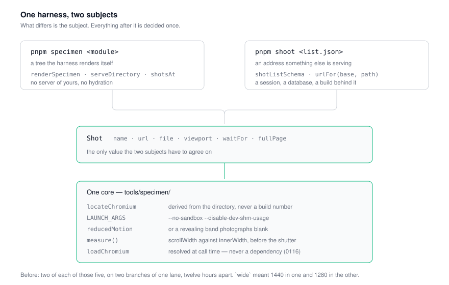
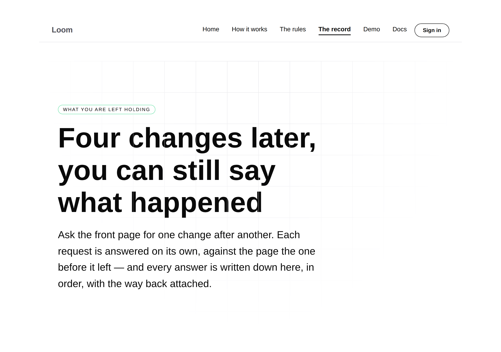
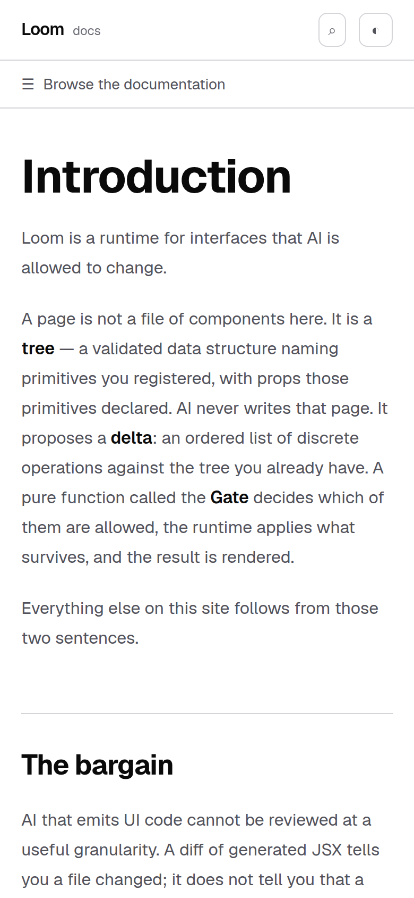

# One harness, two subjects — and the dependency the other branch had already refused

**Routine:** `Loom daily build` (framework core) · **Date:** 2026-09-08 (evening run)
**Section:** §1 (process) · **Branch:** `framework-25-where-the-face-is` · **Pull request:** #230



## What happened

This lane built the screenshot harness twice, twelve hours apart, and neither
run could see the other.

`tools/screenshot/` — `pnpm shoot`, photographing **addresses** — landed on
6 September as the ninth unit of #230. `tools/specimen/` — `pnpm specimen`,
rendering and photographing **trees** — landed this morning as #250, branched
from `main`, with [0116](../decisions/0116-a-screenshot-is-taken-by-the-repository-and-playwright-is-never-a-dependency.md)
recording it. `main` has not moved since 1 September, so the morning run read a
`main` that had never heard of the tool this lane shipped two days earlier.

Both subjects are wanted and they are genuinely different: a signed-in portal
screen cannot be built from a tree in a scratch process, and a composition of
primitives should not need a Next.js server to be looked at. What was not
wanted is what the two copies had done to each other in three days.

**The one that would have reached `main`.** 0116 rejects adding `playwright-core`
to `devDependencies`, by name, with reasons. #230 adds it. Merged in either
order, `main` carries an Accepted record and the dependency it refuses.

That is not a stylistic clash — it is measured. Run the two branches' merge and
one test fails:

```
× the browser adapter > says how to install playwright-core rather than
  throwing, when it is not there
```

`loadChromium` resolved the package it exists to report as missing, because the
other branch had installed it. The harness's own test caught the contradiction
between the harness and the record about it.

**The three quieter ones.** `wide` meant 1440×900 in one file and 1280×900 in
the other, so two lanes' "wide" screenshots of the same page were different
pictures and neither file name said so — 0116 states 1280×900 as the convention
six lanes share, on the evidence of what the reports already quote. There were
two Chromium locators, and two sets of launch flags, each missing one of the two
arguments Chromium needs here. And the address half — the entry point aimed at
real application pages — measured no overflow at all, so the one that could be
pointed at a live page was the one that could not tell you the page was wider
than the phone.

## What was built

**One harness. A subject is either a tree it renders or an address you serve,
and everything after the subject is shared.** The seam is `Shot`: a name, a URL,
a file, a viewport, an optional selector to wait for, and whether to photograph
the whole page. `pnpm specimen` produces those by rendering and serving a
specimen; `pnpm shoot` produces them by resolving a shot list against its base.

From there one code path finds Chromium, launches it with both flags this
container needs, opens a context at a true viewport with motion reduced, waits,
measures `scrollWidth` against `innerWidth`, writes the file and prints the line.

- `tools/screenshot/browser.ts` is **deleted** — 86 lines that did what
  `tools/specimen/browser.ts` does, with a weaker test for the headless-shell
  ordering.
- `playwright-core` is **out of `package.json`**. Both entry points resolve it
  at call time through `loadChromium`, per 0116, and print the install recipe
  when it is absent.
- `pnpm shoot` **gains the overflow measurement and the non-zero exit**.
- The shot list's `VIEWPORTS` is now `PHONE` and `WIDE` from the harness. An
  explicit size is still allowed and now carries a label, because every viewport
  reaching a file name is named.
- `settleMs` is **gone**: a fixed sleep after the wait condition, unused by any
  list in the repository, whose own comment called it the thing a selector wait
  exists to replace. Keeping it meant putting a sleep into the shared page seam.

Recorded as **0117**. 0116 **stands and is not superseded** — everything it
decided is still true, it was written without sight of a file on another branch
of the same lane, and this is the reconciliation rather than a change of
direction. Its sentence about the portal's harness is untouched: `pnpm shoot`
does not start your server, it photographs one you are already running.

## Evidence

Both entry points were run end to end against a real browser, not reasoned
about.

**The tree subject**, `pnpm specimen tools/specimen/example.specimen.ts`:

```
example-editorial-phone  390x844@2x  scrollWidth 390 / innerWidth 390
example-editorial-wide   1280x900@2x  scrollWidth 1280 / innerWidth 1280
example-bold-phone       390x844@2x  scrollWidth 390 / innerWidth 390
…                                                                  exit 0
```

**The address subject**, `pnpm shoot` against a `next start` of this branch at
`127.0.0.1:3111` — three shots, two viewports, one selector wait, `fullPage`
per shot:

```
front-door-phone  390x844@2x  scrollWidth 390 / innerWidth 390
the-record-wide   1280x900@2x  scrollWidth 1280 / innerWidth 1280
docs-phone        390x844@2x  scrollWidth 390 / innerWidth 390   exit 0
```

The overflow line under each is the thing this entry point could not print
before. The pictures came out at 780×20188, 2560×1800 and 780×1688 — every one
at 2×, the full-page shot full-page and the viewport shot exactly 900 tall,
which is `fullPage` being honoured per shot through the shared seam.





## Test numbers

`pnpm verify` green, exit **0**.

- **2,085 runtime tests across 129 files**
- **2,497 application tests across 158 files**

The baseline is the awkward part and is worth stating exactly rather than
rounding. At the merge commit — #230 and #250 in one tree, before this unit —
the runtime suite **fails**, on the `playwright-core` test quoted above. That
failure is the finding, so there is no green baseline on the merged tree to
compare against; the last green numbers either branch reported were 2,050
(#230, 7 September) and 1,899 (#250, this morning, off `main`).

The count moved by **−4** against what the merge would have collected: nine
tests went with the deleted `tools/screenshot/browser.ts`, whose subject is now
covered by the specimen harness's own browser block, and five were added — three
for the shot list's naming and its shared viewports, two for the selector wait
and the viewport-sized shot the widened seam now takes.

A measurement I attempted and could not use: a second worktree at the merge
commit reported 2,083, but `dist/` was not built there, so five smoke tests and
two whole files failed for that reason and two files never collected. It
established the clash and nothing about the count. Saying so rather than
quoting the number.

## Decisions taken that nobody specified

- **Two commands, not one.** Folding `pnpm shoot` into `pnpm specimen --shots`
  is the natural end of this argument and I did not take it on an unattended
  run: it is a rename that costs every lane document an edit for no capability.
  Recorded in 0117's alternatives so the next run knows it was considered.
- **`settleMs` removed rather than plumbed.** Unused, and keeping it meant a
  sleep on the shared page seam.
- **Directory creation moved into the adapter**, not the capture loop, so the
  loop stays exercisable against a double that touches no disk.
- **0116 not superseded.** It is right about everything it saw. The rule against
  editing a record to change direction cuts both ways: a record that needs a
  companion is not a record that needs replacing.

## Open questions

- Whether the two commands should become one. Recorded, not decided.
- The harness's own `playwright-core` test asserts the **absence** of an
  installed package, which makes it sensitive to what happens to be in
  `node_modules`. That sensitivity is exactly what caught this clash, so it is
  a feature today; it is also the kind of test that fails confusingly for a
  contributor who installed the package by hand.
- Nothing in CI photographs anything, still by design (0116).
