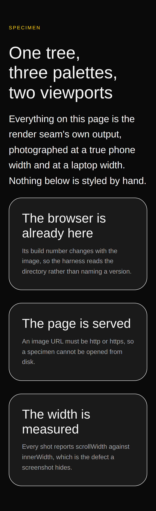

---

# The picture every lane was taking, taken once

**Date:** 2026-09-08 · **Routine:** `Loom daily build` · **Section:** §1 (process) ·
**Branch:** `framework-27-the-picture-every-lane-takes`

*The specimen this branch ships, photographed by the harness this branch ships.
Six shots — three palettes at a true 390px and at 1280px — produced by one
command. Above is `bold` at phone width; `2026-09-08-framework-specimen-editorial-wide.png`
is the same tree in the editorial palette at laptop width, and the other four are
beside them in `reports/`.*

## The migration, and the brief

**It is done, and it was done before this run started** — the fifth consecutive
framework report to open by saying so. `apps/loom` is on `main` with five route
groups, `apps/portal` and `apps/docs` do not exist, `apps/` holds one workspace,
and `pnpm-workspace.yaml` names `apps/*` with one member. Nothing is
half-migrated across this run boundary.

The brief still opens with that section marked **⚠**, still says it outranks
everything, and still says three routines are blocked on the shape it produces.
That is already an open finding for the maintainer, filed on 4 September; it is
not re-filed here.

**There were no maintainer comments to address.** Every comment on all
twenty-eight open pull requests is a routine's own report.

## What was done, in plain language

**`tools/specimen/` — a lane declares what it wants photographed, and the
repository takes the picture.**

This is not a unit I chose by looking for something to improve. It is the
finding this lane owned that had been filed **eleven times by three lanes in
five days**, most recently as *"the screenshot harness, written privately for the
ninth time"*. Four routine briefs and `docs/routines.md` ask a run for a
screenshot; nothing in the repository took one; so every run that needed a
picture wrote about forty lines, used them, and deleted them before opening its
pull request — because a scratch script is not a deliverable and `tools/` was
not that lane's to add to. The next run then wrote them again.

The forty lines are not what made it worth doing. What made it worth doing is
that each of those runs rediscovered the same four obstacles, and two of them
cost a lane most of a run:

| the wall | what the harness does instead |
| --- | --- |
| `playwright install` cannot reach its CDN here, and the browsers are already on disk | derives the Chromium path from what `PLAYWRIGHT_BROWSERS_PATH` **actually holds** — the unversioned symlink first, then the highest build — and **writes no build number down anywhere** |
| `playwright`'s postinstall re-fetches ~200MB through a proxy that blocks it | `playwright-core` only, resolved at call time, never a dependency; its absence prints the install recipe instead of a stack trace |
| an image URL may not be `file:` or `data:` (0053), so a specimen with an avatar will not render at all | serves the pages over `http://127.0.0.1` on an ephemeral port |
| a band that reveals on scroll photographs blank | every context opens with `reducedMotion: "reduce"` — which is what the library's own stylesheet keys its "already arrived" rules on |

A specimen is **data, not a script**: a name, a function from a theme selection
to a tree, the themes to wear, the viewports to stand at. `pnpm specimen
<module>` renders it through the render seam, serves it, photographs it, and
prints `scrollWidth` against `innerWidth` beside each shot. What to look at is
committed beside the lane that cares; how to look at it is here, once.

**Three lanes had hard-coded `chromium-1194`.** The finding that recorded it said
the quiet part — *"the number in it will go stale"* — and it is a Playwright
build number that changes with the image. Nothing in this directory names one.

**The overflow measurement is taken before the picture and never suppresses
it.** The temptation is to fail on overflow and skip the shot; that gets it
backwards. The photograph of the broken page is the artefact worth having, and
a report saying "1420 > 390" without one is the report nobody can act on.

**The seam between planning and driving is four methods.** `SpecimenBrowser` and
`SpecimenPage` are structural interfaces satisfied by Playwright and by a
double, so the naming, the plan, the launch flags, the context options, the
measurement and the reporting are all asserted against a fake. That is how a
harness whose entire job is driving a browser ships with a test suite that needs
no browser — and it is what let the mutations below run at all.

## Decisions I made that nothing specified

**`tools/specimen/`, not `apps/loom/scripts/`.** `Loom portal` proposed the
second, and for *its* need it is right — photographing a signed-in portal screen
needs `next build`, `next start` and three environment variables, none of which
belongs at the repository root. But a specimen is a **tree**, rendered by the
render seam with no Next.js anywhere, and putting the harness inside the
application would make the primitives lane import an application in order to
photograph a library. They are two harnesses. This is the tree one. The portal's
finding stays open with that reasoning attached rather than being quietly
marked closed by something that does not do its job.

**`playwright-core` is not added to `devDependencies`.** One line, and it would
remove the `LOOM_PLAYWRIGHT` step from the recipe. Rejected: it puts a browser
driver in the dependency graph of a package whose product is a runtime, for a
tool no consumer runs, and it makes `pnpm install` here depend on a download the
proxy has blocked fifteen times by the primitives lane's count.

**Phone is 390×844 and wide is 1280×900, both at 2×, and they are the default.**
Every report in this repository has been quoting those numbers and nothing
stated them. A specimen may declare its own; most should not, because a shared
convention is the only thing that makes two lanes' reports comparable.

**The document the markup is photographed inside sets `margin: 0` and nothing
else.** No font stack, no background, no container width — a specimen page that
added any of those would be photographing this file's opinions rather than the
library's. A test asserts the document contains no `font-family` and no
`background`.

**`pnpm specimen` exits non-zero on an overflow, and runs in no CI job.** It is a
tool a run drives when it has something to look at, not a `verify` step. Nothing
in this repository photographs anything on a schedule, and this branch does not
change that.

## A correction to the recipe three findings carried

`NODE_PATH=/tmp/shot/node_modules` **does not work on its own**, and it is what
three entries recommended in good faith. Node's ESM resolver ignores the
variable entirely; the failure is `Cannot find package 'playwright-core'` raised
from a directory where it is plainly installed, with a "did you mean
`playwright-core/index.js`?" hint that leads nowhere. This run hit it too and it
cost about twenty minutes.

The harness honours the variable anyway, through `createRequire`, so it now
means what four lanes thought it meant — and `LOOM_PLAYWRIGHT` is the name to
prefer. This is in the finding as a correction rather than left for a fifth lane
to find.

## Records

**0116 added** — *A screenshot is taken by the repository, and Playwright is
never a dependency*, Accepted, §1 (process). Five alternatives recorded with the
reason each was rejected: `apps/loom/scripts/` (the two harnesses are different
things), `playwright-core` as a devDependency (a browser driver in a runtime's
dependency graph, behind a blocked download), a `verify` step that diffs against
committed baselines (visual regression is a different project and needs a
tolerance and a baseline story), continuing to let each run write its own
(defensible for two runs; it has been eleven, and the recipe *was* written down
as prose twice — prose cannot be executed and cannot be kept true by a test),
and inlining images as `data:` URLs to avoid the server (refused by
`mediaUrlSchema` on purpose, and working around a security decision to save nine
lines is the wrong trade).

**Nothing superseded.**

**0116, not 0103, and this time the numbering cost nothing.** `main`'s next free
number is 0103 and **0103–0115 are claimed on unmerged branches** — I measured
that across every remote head rather than guessing. Taking the next free number
as the brief says would have guaranteed a clash, which
[0097](../decisions/0097-a-hole-in-the-numbering-is-reported-and-a-clash-is-fatal.md)
makes fatal. 0097 is now on `main`, and it makes a hole *reported and passing*:
`pnpm decisions:index` printed thirteen `note:` lines for 0103–0115 and exited 0.
**That is 0097 working exactly as designed, and it is the first run in seven
where the numbering did not cost something.** A per-lane range would still be
better and is still one unwritten paragraph in `docs/routines.md`.

## Findings

**Five closed, in one entry.** The 2 and 3 September entries from `Loom portal`,
and the 4, 5 and 6 September entries from `Loom primitives`. All five ask for
the same file. They live on six unmerged branches, so this is a closure entry
that names them rather than six edits to other lanes' text.

**Two filed.**

- **For every lane that drives its own browser** — the reveal-on-scroll blank
  shot is fixed for anything photographed through `pnpm specimen` and cannot be
  fixed by the harness for anything else. If your lane opens its own context,
  add `reducedMotion: "reduce"`. One line.
- **For `Loom portal`** — the served-application harness is still yours, with
  the reasoning above and an offer: `chromiumBrowser` and `captureShots` do not
  care who is serving. The obstacle is stated rather than hidden — `tools/` is
  not in `@loom/runtime`'s `exports`, so a script under `apps/loom/scripts/`
  would reach it by relative path across the package boundary, and **this run
  neither wrote nor typechecked that import.** Offered, not proven.

**`main` being green, the merge queue, and the brief's ⚠ were not filed again.**
All three are on the record from six lanes across twenty runs and another entry
is noise. They are in *Open questions* below.

## Tests

`pnpm install && pnpm verify`, and a baseline measured on `main` at `d7375ef`
before any of this was written.

| suite | baseline on `main` | after |
| --- | --- | --- |
| `@loom/runtime` | 119 files, 1860 passed | **120 files, 1899 passed** — green, nothing skipped |
| `@loom/app` | 158 files, 2497 passed | **158 files, 2497 passed** — untouched |

**Both suites green, exit 0 on build, typecheck, test and `next build`.**
`main` was measured green first: this branch inherits no red and adds none.

**Thirty-nine new tests**, all in `tools/specimen/specimen.test.ts`, and they
run in `pnpm test` because the root Vitest config already includes
`tools/**/*.test.ts`. No browser is required for any of them.

Seven mutations, each reverted before the next, each caught:

| mutation | result |
| --- | --- |
| the unversioned Chromium symlink no longer preferred over a pinned build | **1 failed** |
| overflow compared with `>=` instead of `>` | **2 failed** |
| shots taken at `deviceScaleFactor: 1` | **1 failed** |
| the served-path containment check removed | **1 failed** |
| the page left open when `goto` throws | **1 failed** |
| the viewport `<meta>` dropped, so a phone shot is a scaled desktop | **1 failed** |
| two viewports write to one file name | **2 failed** |

**One of those mutations found a real defect in this branch, and it is worth
saying out loud.** `resolveServedPath` originally stripped a leading `../` with
a regex *and* checked containment. Removing the regex changed no test — because
`normalize` already collapses `..` on an absolute request path, so the regex was
dead code the test appeared to cover. The regex is gone, the containment check
is now `resolved === root || startsWith(root + sep)` (the old `startsWith(root)`
would have accepted a sibling directory whose name merely began with the root's),
and the test exercises the branch that actually enforces it. That is the argument
for running the mutations rather than counting the tests.

**A second defect came out of re-reading the diff adversarially rather than out
of a mutation, and it would have been ugly.** `decodeURIComponent` throws on a
malformed escape — `/%zz.html` — and it was being called inside the request
handler, so one bad request would have taken the whole command down partway
through a set of shots, with some pictures written and some not. It is guarded
and tested. Two more of the same kind, both fixed before the pull request: the
static server was not closed if the browser failed to launch, which would have
left `pnpm specimen` hanging on an open socket rather than reporting the launch
error; and `startsWith(root)` accepted a sibling directory whose name merely
began with the root's.

**The harness was run end to end against a real browser**, not only against the
double: the six pictures in `reports/` are its output, all six reporting
`scrollWidth === innerWidth`, and the example specimen renders clean under all
three starter palettes with zero render diagnostics (asserted).

**No file outside `tools/`, `decisions/`, `reports/`, `FINDINGS.md` and one line
of `package.json` was touched.** `decisions/README.md` is generated. No lane's
hand-written file was opened.

## Open questions

1. **Nothing has merged since 1 September, and twenty-eight pull requests are
   open.** `main` is green — I measured it on a clean checkout before writing
   anything, exit 0 on both suites. Whatever was blocking the queue is gone.
   Not a new argument and not a new finding; the count is the whole content.
   **Recommendation: merge something.**

2. **This branch is independent and branches off `main`,** as the brief's step 3
   requires. It does not stack on #230, which now carries fourteen units of this
   lane in one tree. That tree remains the cheap way to take those fourteen; this
   is a sixth open pull request for this lane and I would rather it were not, but
   the alternative was to add a fifteenth unit to a branch nobody can review.
   **Recommendation: take #230 as one, then this.**

3. **A per-lane decision-number range** is still unwritten. It cost nothing this
   run only because 0097 landed and a hole is now survivable; it is still a
   paragraph in `docs/routines.md`, and a routine may not write the governance it
   is bound by.

4. **The framework brief's ⚠ section is satisfied and its *After the migration*
   list should be promoted to be the queue.** Filed on 4 September, restated here
   only because this is the fifth run to open by proving its highest-priority
   instruction was finished on 19 August. The same brief also names *"the demo,
   which is yours"*, and the demo has been `Loom demo`'s since the 20 August
   split.

5. **A specimen shorter than its viewport shows the body's own white below it**,
   because a full-page shot is at least the viewport's height and `loom.page`
   paints only its own. Visible in the `-wide` shots here. The fix is either an
   opinion in the specimen document (which this branch refuses on purpose) or a
   taller specimen. Recorded, not fixed.

Nothing scheduled, no self-check-in armed, and this pull request is not
subscribed.
