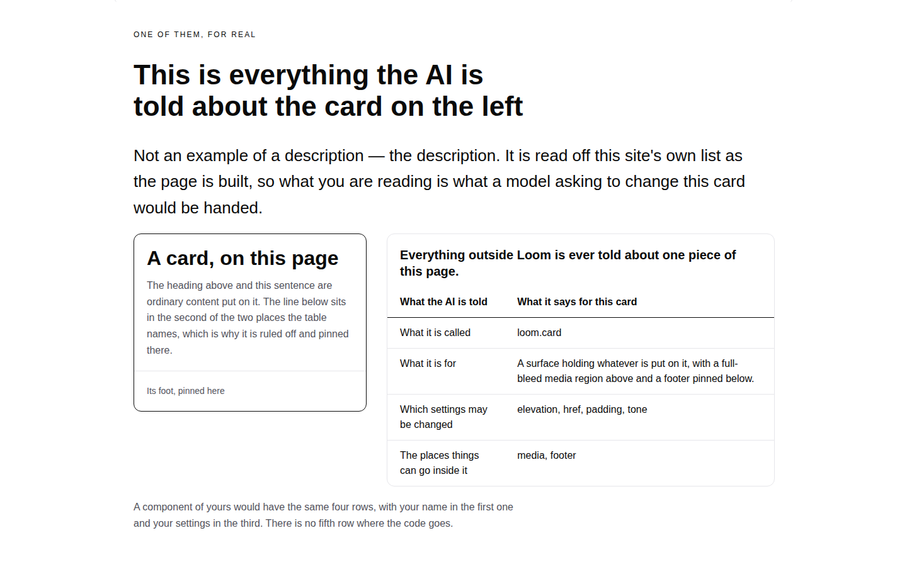
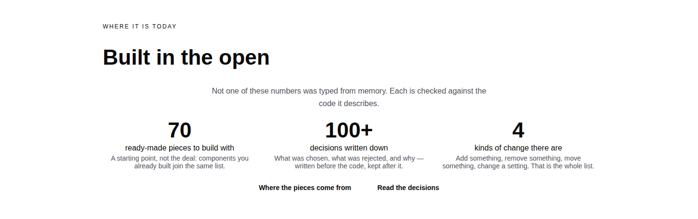
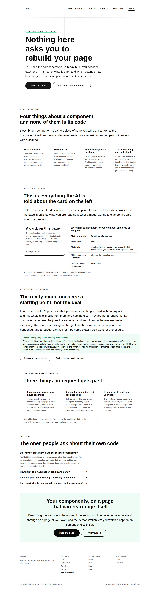
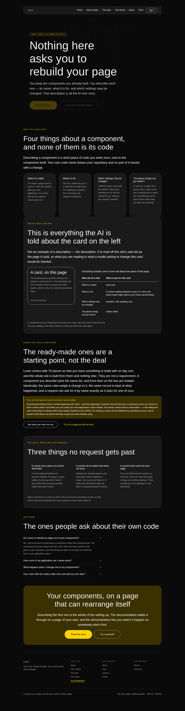


# 2026-09-08 — marketing: the pieces are yours, and the site never said so

The front door's numbers band offers **“70 ready-made pieces to build with.”**
Two bands below it the questions band answers *“can the AI write code into my
page?”* with **“it can only use the pieces you handed it.”** Two bands above it
a card says Loom **“only rearranges pieces you built and already trust.”**

All three are true. Nowhere on this site were any two of them said in the same
breath — so the one question that decides whether a developer can use Loom at
all was left for the reader to guess at: **do I have to rebuild my page in
somebody else's components?**

The answer is no, it has always been no, and four pages did not say it. This run
is the fifth page: `/your-components`.

---

## What shipped

### A page that says the whole thing once

`/your-components`, in six bands: what you hand over and why none of it is your
code; **one real description, printed**; where the pieces come from; the three
things no request gets past; the questions people ask about their own code; and
the way into the documentation.

Every claim on it is a description of code in this repository. Nothing on it
waited on positioning, audience or price — which is why it could be built this
run rather than added to the list of things blocked on the licence line.

### The specimen band is the reason it is worth reading

The band does not describe what a description looks like. It prints **the one
this site handed over for the card standing beside it**, read off `catalogueOf`
as the page is built:

| What the AI is told | What it says for this card |
| --- | --- |
| What it is called | `loom.card` |
| What it is for | *A surface holding whatever is put on it, with a full-bleed media region above and a footer pinned below.* |
| Which settings may be changed | `elevation, href, padding, tone` |
| The places things can go inside it | `media, footer` |

Not one of those four cells is typed on this page. A page arguing *the AI only
ever sees these four things* while typing out an example of them would be making
its argument in exactly the form it tells the reader not to trust.

**The heading is narrower than the one I wrote first, and the narrowing is the
interesting part.** It read *“everything Loom knows about the card on the left”*,
which is not true: what a piece hands over includes the values each setting will
accept, and that is how a wrong one is refused. What *leaves the process* — to a
model, to telemetry, to a portal's insert menu — is the shallower projection
`catalogueOf` makes, by a decision recorded on that function. So the heading is
**“everything the AI is told”**, which is exactly true and is also the better
claim.

### The front door stopped leaving the reader to reconcile it

The smallest available repair. Both sentences stay — they were never wrong. The
stat's caption changed from *“Each one takes its colours and type from whatever
theme the page is wearing”* (true, and demonstrated by the switcher in the footer
rather than needing to be claimed) to **“A starting point, not the deal:
components you already built join the same list”**, and the band gained a second
quiet action to the page that says the rest.

### A page of this site can now be kept off the top bar

The one judgement call in the run, and it needs saying plainly.

`Surface` has carried `inMenu` since 28 August, when the maintainer asked on #166
whether eight items in the bar was too many. It was; the course moved out; and
**the count was back to eight** by the time this route group had a fourth page,
because the flag governed only half of what the bar carries. A fifth page would
have made it nine.

So `SiteRoute` carries the same flag on the same terms, and the guarantee the
surfaces already had is now held for pages too, in `chrome.test.ts`: whatever the
bar leaves out, **the footer's map carries — and marks as the page the reader is
on**, so a page off the bar still says where you are. Two assertions changed
shape and both got stronger: *offers every route* became *offers exactly what
`inMenu` says*, in both directions, and *the bar marks the current page* became
*the bar marks what it carries and the map marks everything*.

`/your-components` is the only page that is off it. If you would rather it were
in the bar, one word in `site.ts` does it — see **Needs your input**.

---

## Decisions taken that were not specified

**The specimen is named, not chosen by a rule.** `loom.card`, because the reader
is looking at cards and because its four settings and two regions read in a
glance. “The first one alphabetically” would be a band whose subject moves every
time the library grows, and nobody can write copy for that.

**The library's own sentence is exempt from this page's register test.** The
strict rule — no reserved word at all, the front door's rule rather than the
mechanism page's — is held over the page's own copy, with the quoted description
removed first. It is `src/primitives/`'s text, and holding another lane's file to
this lane's register through a shared test is precisely the coupling that had
five lanes editing one marketing file to get green in August. The choice of
specimen is this file's; the wording of it is not. What *is* asserted is that the
page prints whatever the library says now, so it cannot go stale.

**`cell`, `row` and `columns` moved to `nodes.ts`.** The rules page wrote them
locally on 28 August and this page needed exactly them. A second private copy is
how two tables on one site start disagreeing about what a heading cell is.

**No decision record.** Nothing here touches the tree schema, the delta model or
an Accepted record. It is a page, a flag on a type this lane owns, and three node
constructors — all inside `apps/loom/app/(marketing)/`.

---

## Tests

`pnpm install && pnpm verify` — **green, exit 0. Nothing failed, nothing skipped,
no test weakened, no test deleted, and `src/` was not opened.**

| suite | before | after |
| --- | --- | --- |
| `@loom/runtime` | 1860 / 119 files | **1860 / 119 files** — unchanged, `src/` untouched |
| `@loom/app` | 2655 / 161 files | **2717 / 162 files** |
| of which `(marketing)` | 985 / 22 files | **1047 / 23 files** |

Sixty-two new tests, measured against the branch head rather than estimated.

**Two were caught by the suite that already existed, and both are worth naming.**

1. `share.test.ts` refused the page's first title. *“Your components — Loom
   rearranges the ones you already built”* puts the wordmark inside a clause, and
   the share card splits a title on its separator and drops the part that is
   exactly *Loom* — so the card would have printed the name twice to the one
   reader who sees the card and never opens the page. The title is now
   *“Your components — the ones you already built, rearranged and never
   rewritten”*.
2. `tsc` refused `CataloguedPrimitive` from `@loom/runtime/sdk`. It is not
   exported there; the SDK entry point carries `catalogueOf` and not the type of
   what it hands back. Filed for `Loom daily build`; the page imports the
   function from the SDK and the type from the root, both published entry points.

### Four mutations, each caught by exactly one assertion

| mutation | result |
| --- | --- |
| `YOUR_COMPONENTS.inMenu` → `true` | **1 failed**, 1046 passed — *is kept off the bar deliberately*, alone |
| the front door's old caption restored | **1 failed** — *no longer leaves the number to be read as the whole offer* |
| the front door's link to this page removed | **1 failed** — *offers the way to the answer from the band that raises the question* |
| the specimen's description frozen to a stale string | **1 failed** — *prints the sentence the library holds, not one written beside it* |

The first is the one worth reading twice. Every chrome assertion is derived from
`inMenu`, so putting the page in the bar breaks none of them — correctly, because
they assert the decision is honoured rather than a fixed shape. The explicit test
is what makes the decision a decision. If you want the page in the bar, that test
is the one line to change, and it should be changed rather than deleted.

---

## Measured, not assumed

Rendered from the built application served locally, at 1440px and 390px, in the
house palette and the bold one.

- `scrollWidth` is **exactly 1440 at 1440** and **exactly 390 at 390**. Nothing
  scrolls sideways, the table included.
- The four tiles in *What you hand over* are **343px each, all bottom-aligned at
  1685**; the three in *Three things no request gets past* are **317px each,
  aligned at 3890**. Measured because the screenshot made them look ragged at
  thumbnail scale; the text ends at four different points inside four equal
  boxes, which is correct.
- The hero's primary action under the bold palette is `rgb(10,10,10)` on
  `rgb(255,212,0)`. It reads as low contrast in a scaled-down screenshot and is
  not.

No colour is named anywhere in the diff. No primitive was added and no local
component exists.

The deployed preview is still unreachable from the sandbox — `*.vercel.app` is
not on the egress allowlist — so these are local renders of the same code rather
than pictures of the deployment, as they have been for every lane since the
finding was filed on 1 September. Geist is still unreachable too, so this is the
fallback face again.

---

## Findings

**Closed:** the two answers to *where do the pieces come from*, filed and closed
by this branch.

**Filed:** `@loom/runtime/sdk` exports `catalogueOf` and not the type of what it
returns, for `Loom daily build`. A paper cut, and the kind a host meets in the
first hour. One line fixes it: `export type * from "../catalogue.js"`.

**The shape, sixth run running.** Two individually defensible sentences nobody
had read next to each other. Five of the six were fixed with a word; this one
needed a page, which is the first time the tell has been worth more than the
repair. The tell has not changed and is still cheap: **read the site across a
link, in the order a visitor reads it.**

---

## Open questions

1. **The licence line** (#96, on every marketing PR since #134). Still the one
   placeholder on the site and still the Phase 2 gate.
2. **Positioning, audience and pricing.** Untouched, as on every run.
3. **The top bar**, newly answerable in one word — see the PR comment.

## On branching

This run pushed onto `marketing-22-putting-it-back-is-a-change` rather than
cutting `marketing-23` off `main`, for the third run running and for the reason
the last two gave: the maintainer's instruction recorded on `main` in #216's
commit message says each routine should *“check for its own open pull request and
continue it rather than branching from main again, which is the behaviour that
generated the pile”*, and `routines.md` step 2 says his instruction outranks the
brief's step 3.

Nothing scheduled and nothing armed.
