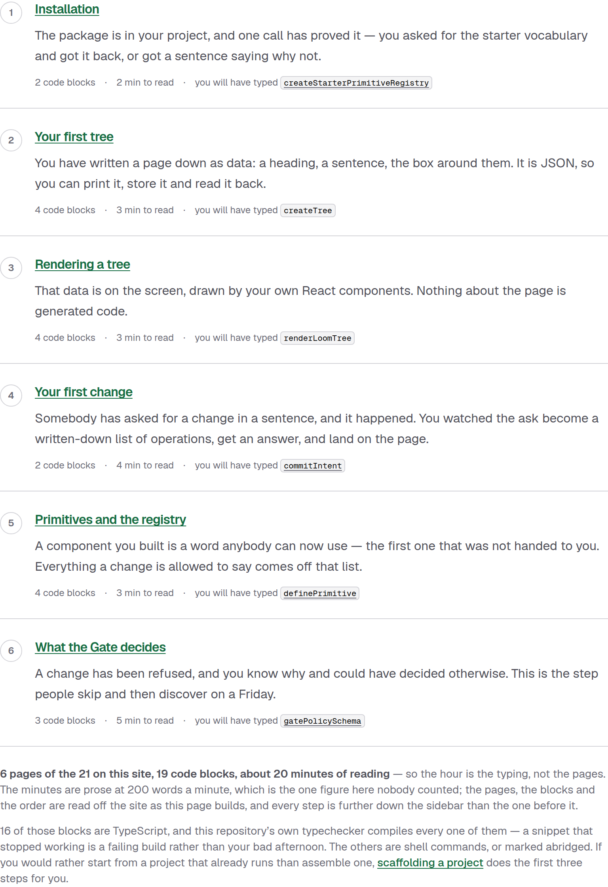
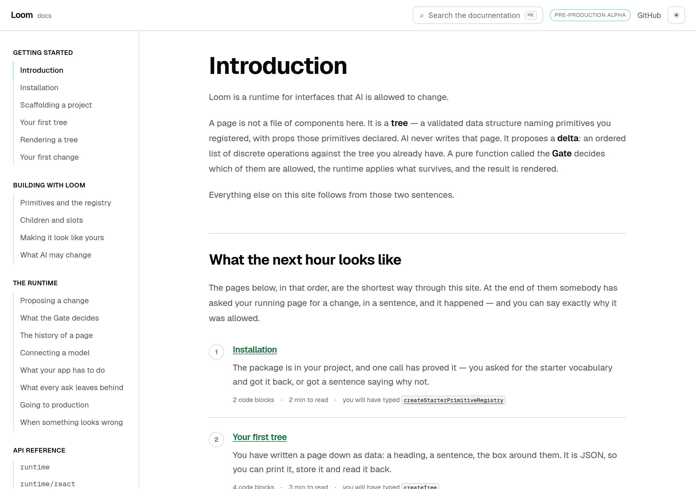
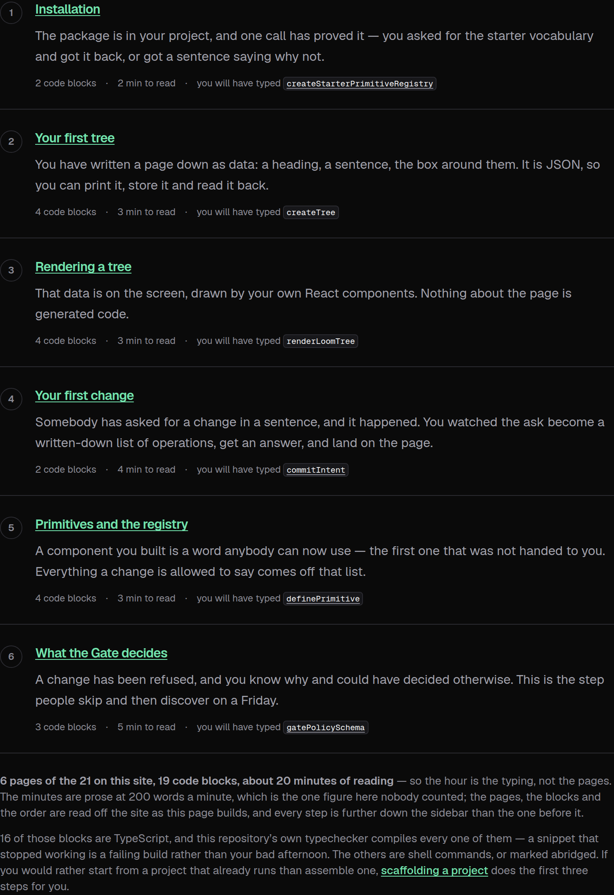
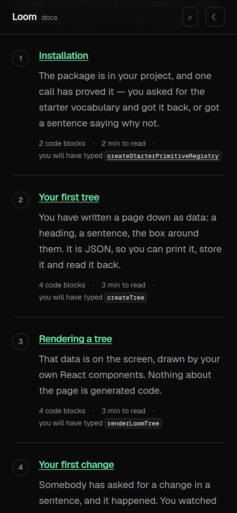

# 9 September 2026 — what the next hour looks like

**Routine:** `Loom docs` · **Branch:** `docs-21-the-code-on-the-page-compiles` ·
**Section:** §4c

Twenty-one pages, and a stranger arriving at the first of them could not find
out what any of it was going to cost them. *Introduction* said what Loom is,
beautifully, and then offered two links chosen by hand — the shape of the thing
in front of a reader was left to the sidebar, which lists everything there is in
the order it should be read *once you are already reading*.

The question somebody actually has on arrival is the other one: **what am I
about to spend, and what do I have at the end of it.**



## What shipped

**A route through the site, on the page a stranger lands on.** Six pages in the
site's own order, each with a sentence saying what you will *have* when that
step is done — not what the page is about — and, beside it, how much of the page
is code, how long its prose takes to read, and the one name you will have typed
by the end of it.

At the end of the six, somebody has asked your running page for a change in a
sentence, it happened, and you can say why it was allowed. That is the brief's
exit condition, and this is the first page on the site that states it as a
route rather than leaving it to be assembled from the rail.



## The split, and which half can lie

The written half is six sentences — *"A component you built is a word anybody
can now use"* — and they are allowed to be lossy, because no page is obliged to
describe its own point in a sentence a stranger can hold.

**Everything else is read off the site as the page builds:** the titles and
addresses from `nav.ts`, the code-block counts from the fence extractor, the
reading time from the prose indexer, and the anchor from the heading where each
step's name is really used. So the itinerary cannot drift from the pages it is
about — it fails the build instead.

The load-bearing part is the **checkpoint**: the one published name a reader will
have typed by the end of a step. It is checked twice — against the runtime's
generated reference, and against the page's own code. A step claiming to teach
you `definePrimitive` on a page that has stopped printing it is a build failure,
not a confident sentence pointing at prose that no longer keeps it.

Five ways the route refuses to render rather than mislead:

| The mistake | What happens |
| --- | --- |
| a step pointing at a page that does not exist | throws, naming the address |
| a step that comes *earlier* in the rail than the one before it | throws |
| a checkpoint the runtime does not publish | throws, naming it |
| a page that has stopped printing its checkpoint | throws, naming both |
| a "you will type this" step on a page with no code on it | throws |

The second is the one I would defend hardest. The route is a shortcut through
the site, not a second opinion about what order the site is in — so it is
checked as a **subsequence of the sidebar**, by position. Moving a page in
`nav.ts` is felt here immediately, and the front page and the rail cannot end up
telling a reader two different things about what comes first.

## The numbers on it, and the one nobody counted

**Six pages of the twenty-one, 19 code blocks, about 20 minutes of reading.**
The first three are counted; the last is a rate — 200 words a minute — and the
page says so out loud rather than implying a stopwatch.

Which makes the heading a claim: *the next hour.* Twenty minutes of that is
reading, so the page says the rest is the typing, and the module carries a
**budget** — a route that grew past sixty minutes of prose under that heading
throws at module load. It is the kind of falsehood nothing else would catch:
every link still resolves, every number is still true, and the promise at the
top has quietly stopped being one.

16 of the 19 blocks are TypeScript, and every one is compiled by `pnpm verify`
already — that is the fence checker from 5 September doing work it was not
built for, and the reason the route can say it without hedging.



## The bug the screenshot found, and the tests could not

The footer's second paragraph opens with a counted number:

```tsx
<p className="mt-3">
  {ARRIVAL_TOTALS.compiled} of those blocks are TypeScript, …
```

Under `vitest` that renders `16 of those blocks are TypeScript`. A test asserted
exactly that string and passed. The **built** page says:

> 16of those blocks are TypeScript

I found it in the screenshot, fixed it with an explicit `{" "}`, and then — an
accident being no kind of evidence — put the defect back, rebuilt, and checked
both ends: the prerendered HTML carries `16<!-- -->of`, its RSC payload carries
the text child as `16,"of those blocks` with no leading space, and **all eight
component tests still passed.** Then I restored the fix.

Two other interpolations in the same block kept their spaces, so this is not a
rule anybody applies by eye. It is filed for `Loom daily build` with the
observation rather than a mechanism, and with the thing that would close it for
all four surfaces: `next build` already runs inside `pnpm verify`, so a test
that reads a handful of sentences out of the **prerendered** HTML would have
failed here and costs one file.

Worth saying plainly, because this lane has filed the egress restriction eight
times as a nuisance: **the screenshot is the only renderer any test in this
repository looks at.** Today it was the check that worked.

## Tests

`pnpm install && pnpm verify` at the repository root. **Green, exit 0.** No test
weakened, none skipped, no cap raised.

| Suite | Files | Tests |
| --- | --- | --- |
| `@loom/runtime` | 119 | 1860 passed — `src/` was not opened |
| `@loom/app` | 179 | 2752 passed |

**33 new tests** in two files — 25 on the route's data, 8 on what a reader can
see. `next build` clean across all five route groups.

Four were verified by mutation, because a test that has never failed is a claim
rather than a check:

- deleting the *may not send a reader backwards* check fails **refuses a step
  that comes before the one in front of it**, and only that one
- deleting the *page must have code on it* check fails **refuses a step that
  sends a reader to type on a page with no code**, and only that one
- putting `LoomTree` into one step's written sentence fails **is written without
  a single runtime name in it**, and only that one
- linking every checkpoint, including the two with no heading to land on, fails
  **links a checkpoint into the page only where the page has a heading to land
  on** — this one *did not* fail at first, because the test only inspected
  anchored links; it now counts the links inside each step, and it bites

The plain-language rule is the one I care most about keeping. A reader on this
page has none of the vocabulary yet, so no runtime name may appear in the
sentence promising them something — and the test enforces it against the
runtime's own published surface rather than against a word list I wrote.



`document.documentElement.scrollWidth` is exactly 390 at a 390px viewport and
1280 at 1280, in both themes.

## Scope

`apps/loom/app/(docs)/` only: three files added, one page changed. **No file in
another lane was opened and `src/` was not opened.** The generated API reference
was not regenerated — the runtime's surface did not move — and no fence context
file was needed, because the page gained no code blocks.

The component is docs-site furniture in 0067's sense, like every other generated
table on this site: it renders a list the repository already knows. No primitive
was needed and none is missing.

**This went onto `docs-21` rather than a new branch off `main`**, the fourth day
running. `main` has not moved since 1 September, four of this lane's branches
are already merged into this one, and today it was again infeasible rather than
merely wasteful: the route counts code blocks through the fence extractor, which
exists only on this branch. Filed, with the same one-sentence recommendation.

## Findings

**Filed:**

- **A space the test suite could see and the built page could not** — for
  `Loom daily build`, with the reproduction above. Any test written on
  `textContent`, on any surface, shares the blind spot.
- **The plain-language rule is enforced by a spelling heuristic** — for this
  lane. `ok` and `value` are published names and ordinary English, so the check
  matches only camel-cased and capitalised names. A future export called `hold`
  or `gate` would sail through the sentence it is meant to keep out of.
- **`*.vercel.app` is still off the egress allowlist**, ninth consecutive run.
- **This lane pushed onto its open pull request**, fourth data point.

**None closed.** Nothing open and owned by `Loom docs` was answered by this
work.

## Open questions

**Whether the route should be shown anywhere but the first page.** A reader who
arrives on *Your first change* from a search engine gets no sense of where they
are in it. The pager knows the next page; nothing knows the next *step*. It is
one component away and I have not built it, because a route that appears on
every page is a navigation element and this site already has two.

**Fenced code is still not searchable**, unchanged from 1 September.

**Whether a written page should declare what it teaches** is still open from
#167. The checkpoint is a partial answer arrived at sideways: six pages now have
one name each that they are *held* to printing.

**What I would write next.** The route ends at *What the Gate decides* because
that is where a stranger's first refusal happens. The step after it — what you
do when the answer is *held* and a person has to look at it — is a queue, and
the finding filed on 7 September says the runtime cannot yet tell a dead held
change from a live one. That page wants `holds.forTree` fixed first, and it is
the largest hole in the site's story about the day after you ship.
