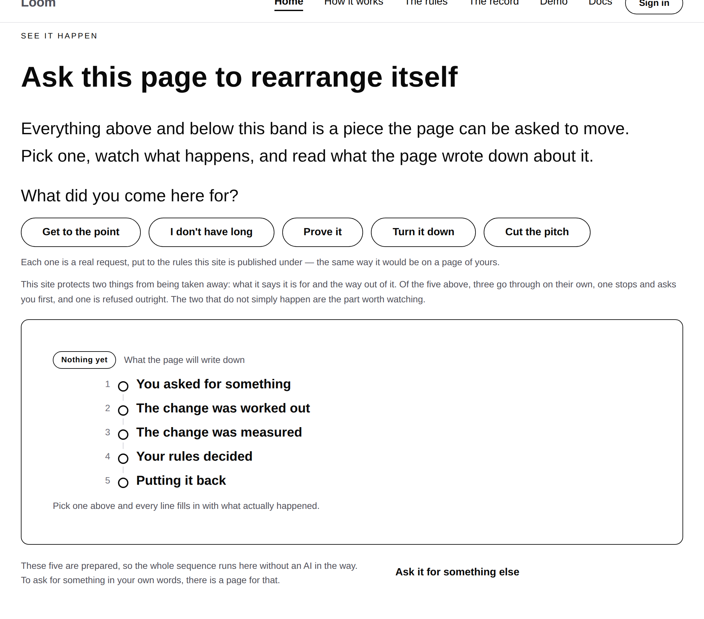
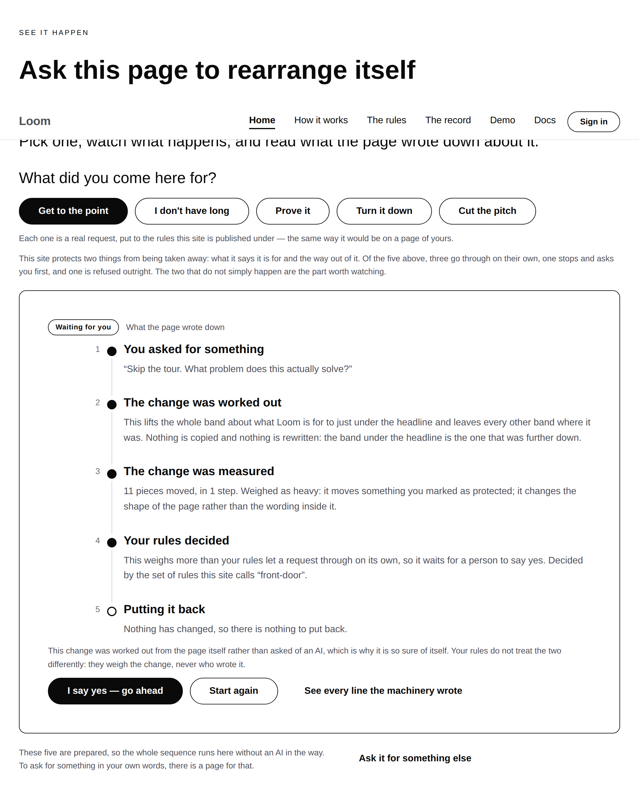
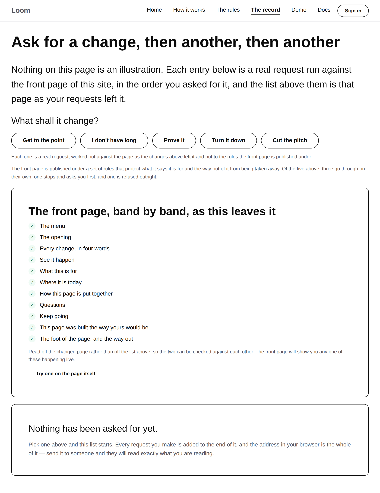
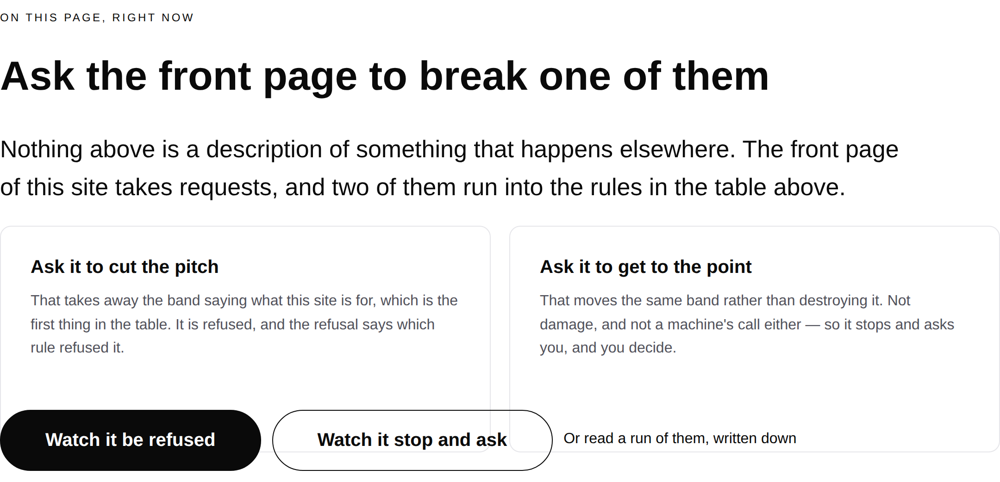
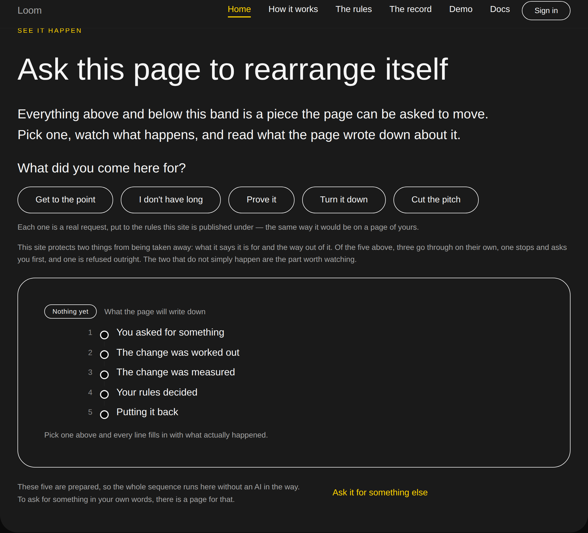
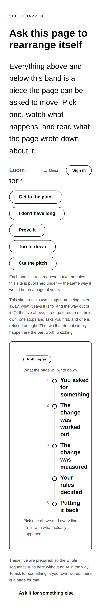

# 2026-09-09 — marketing: the answer the front door did not have

The band where a stranger first meets the mechanism introduced its five buttons
like this:

> This site protects two things from being taken away: what it says it is for
> and the way out of it. **Everything else a request may rearrange on its own —
> and one of the five above will be refused**, which is the part worth watching.

Two answers: it happens, or it is refused. That is the product everybody else
has.



Run against this site's own rules, the five answer **three landed, one refused,
and one held** — *Get to the point* moves a band the rules protect rather than
destroying it, which is not damage and is not a machine's call either, so it
stops and asks. A visitor told the page would rearrange on its own pressed the
first button on the band and got this:



*Waiting for you.* **I say yes — go ahead.**

---

## Why this is not a wrong number

The step count on 1 September was a wrong number. This is not.

`/the-rules` writes the three answers out as *"There are three answers, and there
is no fourth"* — it happens, it waits for you, it does not happen. The middle one
is the whole argument. Plenty of things change a page with AI and plenty refuse;
what nothing else can show is a machine stopping, in front of you, because a line
you drew says a person decides this one. The site says so on page three, in the
journey's fourth step, and in the panel's own badge — and the band where a
stranger meets the mechanism first offered no room for it at all.

So the sentence was not merely miscounting its exceptions. It was describing a
simpler product than the one underneath it.

## What shipped

**One declaration, one module, three sentences.**

`Ask.answer` carries what this site's rules do with each request — `"landed"`,
`"held"` or `"refused"`, the runtime's own three rather than a second vocabulary.
`_lib/adapt/answers.ts` counts them and spells the sentence. Three call sites
stopped typing a number:

| where | said | now |
| --- | --- | --- |
| `/` — under the five buttons | "Everything else a request may rearrange on its own — and **one** of the five above will be refused, which is the part worth watching" | "Of the five above, **three go through on their own, one stops and asks you first, and one is refused outright.** The two that do not simply happen are the part worth watching." |
| `/the-record` — the same five, before any are pressed | "Everything else a request may rearrange on its own, and you will see **one of these refused**" | the same sentence, from the same function |
| `/the-rules` — the live band | "**two** of them run into the rules in the table above" | `${EXCEPTIONS_SPELLED}`, off the same list |

`/the-rules` had it right and had it right by having typed the correct word. It
is the same number as the front door's, so it now comes off the same list.

### The declaration was already in the repository, in the one place the page could not read it

`adapt.test.ts` held a literal table — five ids to five verdicts, `problem:
"held"` among them — and put every one of them through the real sequence. **The
suite knew.** The page could not reach what the suite knew, so the two were free
to disagree, and 1,047 passing tests were consistent with a band contradicting
its own panel eighty pixels below it.

So the table did not get another entry; it moved onto the asks, where a page
builder can read it, and the test that held it against reality came with it.

**The guarantee its docblock claimed is kept and is now stronger.** It said it
was written out rather than derived so that "a change that quietly collapsed all
five into allowed" could not pass. A literal table does not actually catch that —
a run that changed a plan and its row together satisfies it. What the band is
*for* is showing all three answers, so that is what is asserted now:

```ts
it("demonstrates all three answers, which is why there are five of them", () => {
  const tally = answerTallyOf()

  for (const answer of ANSWER_ORDER) expect(tally[answer]).toBeGreaterThan(0)
})
```

### Declared rather than derived, and why

A page builder is synchronous and running the sequence is not. The alternative
was running all five requests on every visit to compose one sentence — which
would make the published front door depend on performing every demonstration on
it, on top of the two passes it already runs for the ask in the address.

So `answer` is a claim, and `answers.test.ts` puts each one through `runAsk` and
holds the claim to what came back. That is a stronger check than a derivation
would have been anyway: a derivation says the sentence matches the code, and this
says the sentence matches what the rules actually answered.

## Tests

`pnpm install && pnpm verify` — **green, exit 0. Nothing failed, nothing skipped,
no test weakened, no test deleted.**

| suite | before | after |
| --- | --- | --- |
| `@loom/runtime` | 1860 / 119 files | **1860 / 119 files** — `src/` was not opened |
| `@loom/app` | 2717 / 162 files | **2734 / 163 files** |
| marketing, within it | 1047 | **1064** |

Twenty-two new assertions in one new file; five removed from `adapt.test.ts`
along with the table they iterated.

Everything about the pages is asserted against the **rendered trees**, never
against `answers.ts`. An assertion that compared the module with itself would
pass however the page was built, and passing however the page was built is
exactly what the old sentence did for sixteen runs.

**Three mutations, each caught by exactly the assertions it should be:**

| mutation | result |
| --- | --- |
| the old front-door sentence put back verbatim | **4 failed** — the two page assertions, the negative one, and *says on the front door that one of them stops and asks*. Nothing else. |
| `problem.answer` declared `"landed"` | **5 failed** — starting with *'problem' is declared 'landed' and the sequence agrees*, so a lie in the declaration cannot reach a page |
| a sixth choice added to `ASKS` | the two assertions that pin *today's* five fail and nothing else about the wording does — the sentences moved with the list |

The negative assertion is deliberately wider than the answer, for the reason the
1 September run gave: checking that the right words are present would pass a page
that said both. It searches for the old claim verbatim, for its second half, and
for every count from *one* to *six* in the sentence frame that carried it.

The clause builder is tested at two, three and four choices and in the singular
and the plural of all three answers — none of which is on the site today. A run
that adds or drops a choice gets prose rather than *"1 requests stops"*, and a
run that would have to remember to check that is a run that will not check it.

## Decisions and findings

**No record written.** The change is compositional, adds nothing to the library,
constrains nothing outside this lane, and touches no Accepted record. `src/` was
not opened; no other route group was touched; no primitive was added and no
colour is named in the diff.

**One filed, and closed by this branch** — this run's own defect, recorded for
how it survived rather than because it is still open. It is the seventh
consecutive run to find the same shape: two individually defensible things nobody
had read next to each other. The new half is worth keeping: this one was a fact
the test suite already held and the page had no way to read.

**None closed for another lane.** Nothing was missing this run — no primitive,
no prop that could not be set, no data the framework could not fetch. The whole
unit is a declaration, a tally and three sentences, which is what a marketing run
should look like.

## Open questions

- **The licence line** (#96, on every marketing PR since #134). Still the site's
  one placeholder and still the Phase 2 gate. Untouched.
- **Positioning, audience and pricing.** Untouched, as on every run.
- **`fonts.googleapis.com` is still not on the egress allowlist** — restated, not
  re-filed. Six connections failed while these screenshots were taken, so the
  images below are in the fallback face rather than Geist, as every set this lane
  has published has been. It changes no assertion; you judge this surface by eye.
- **#224, #231 and #237 are still contained in this branch and can be closed.**
  Restated, unchanged.









`scrollWidth` is exactly 1440 at 1440 and exactly 390 at 390, on every page shot.

Nothing scheduled and nothing armed.
