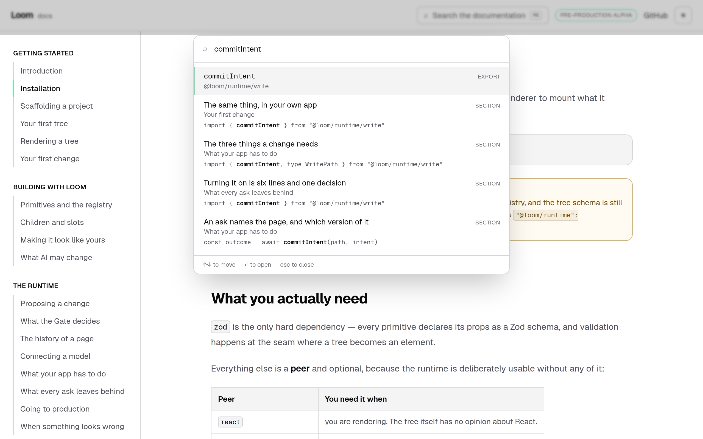
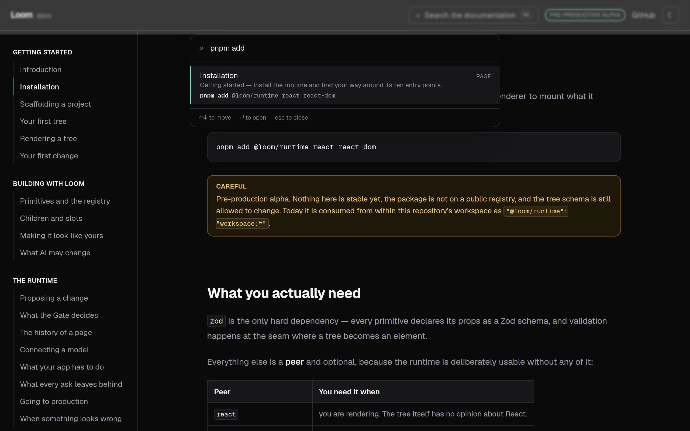
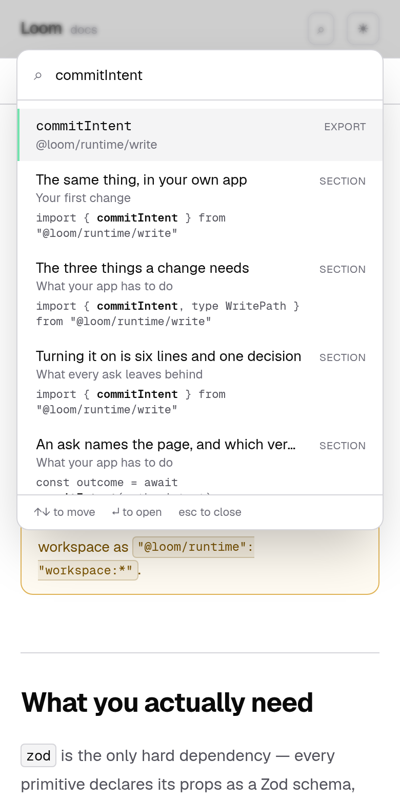

# The name you saw in a snippet

**Routine:** `Loom docs` · **Section:** §4c · **Date:** 10 September 2026
**Branch:** `docs-21-the-code-on-the-page-compiles` (#243) · **Unit 8 on this branch**



## What shipped

Two things, and the second is why the first was worth doing today rather than a
week ago.

**The search box now reads the code.** Twenty-two pages carry about forty fenced
blocks with a copy button on each, and none of it was findable. A reader who had
seen `commitIntent` in a snippet, or who typed the install command off
*Installation*, was told *nothing on the site says that* — by a site whose blocks
say it plainly. That was the reverse of what anybody assumes: prose is the vaguer
half and was searchable; code is the exact half and was not.

**And the four fence scanners became one.** Four separate things needed to know
whether a line is inside a fenced block — two search readers skipping them, the
reference reader wanting what is inside them, the fence checker reading them
properly — and all four decided it for themselves with the same six characters
and a flipping boolean. Three of the four had the same latent bug.

## The bug three of the four shared

A boolean that flips on any run of three backticks cannot read a block that
*contains* a fence. That is how a page shows what markdown looks like:

````
```` md
```ts
const page = buildElement({ type: "stack" })
```
````
````

The inner fence reads as the outer one's closing tick. Everything after it reads
as code. **Nothing goes red**: the page simply stops being searchable half way
down and stops offering its headings, and the only way to find out is to search
for a word you can see on the screen.

No `page.mdx` has such a block today, so this was latent. It is not
hypothetical — `_lib/fences/model.ts` documents the whole fence vocabulary with
exactly that shape, in a doc comment, and the day somebody moves that
explanation onto a page is the day the index quietly loses half of it.

`spans.ts` now answers one question by markdown's own rule: a fence opens on
**three or more** backticks or tildes, and closes on the same character, **at
least as long**, with nothing after it but whitespace.

## The seam is not the one I would have guessed

The 5 September entry filed this as *"they want to be one reader that both halves
consume"* and declined to build it, on the grounds that building a shared thing
while adding its first consumer produces an abstraction with one real user. That
was right, and waiting is what made the seam visible — because it is not *read a
fence*. It is two questions:

- **Where is a fence?** One rule, four consumers, no opinions. Deliberately
  lenient: it does not care what the fence claims to be, so the search readers
  can be tested against markdown written to exercise *their* rules rather than
  against whichever page happens to exercise them this week.
- **What does a fence claim to be?** Stays in `extract.ts` and stays strict — an
  unknown language or a misspelled declaring word stops the build. That is the
  half that must be loud, and folding it into the shared reader would have made
  the lenient half impossible.

`fenceSpansIn` hands over the blocks, for the extractor and the new code index.
`outsideFences` blanks the fenced lines and **keeps the line count**, for the two
search readers and the mention reader — blanked rather than removed, because two
of the three work out a heading's position by walking the file and a shorter file
would name the wrong line.

## The ranking hazard, which was real

The 1 September finding that filed *code is not searchable* predicted the hazard
correctly, and it bit on the first run of the tests.

This site ranks its own pages above the runtime's names deliberately: somebody
typing `gate` does not yet know what a Gate is, so no field score may lift an
export above a page. Indexing the **prose** could take that band for free,
because prose has no names in it — `prose.ts` elides every span between
backticks for exactly this reason. **Code is nothing but names**, so the band it
inherited was wrong immediately:

```
definePrimitive  →  1. Defining one          (heading, in the band, +3 for code)
                    2. definePrimitive       (the export, spelled the same)
```

That is the failure the band exists to prevent, upside down. The rule that fixes
it, and the one thing here that could regress with nothing else noticing:

> **A page that says it in words comes before the name. A page that only shows
> it in a block comes after.**

Mechanically: an entry whose *whole* claim is a snippet drops out of the prose
band and ranks below the names, keeping the same order among themselves. An
entry that matched on anything else is in the band as it always was, and a second
word found in its code costs it nothing.

The screenshot at the top is that rule working. `commitIntent` returns the export
first, then the four sections that show it, each with the actual line it was
found on.

## What counts as code, and what still does not

**What a reader can see in a block**, and nothing finer. Every fence, whatever
its language and whatever it claims to be — a `bash` block is how somebody finds
the install command, and a `sketch` is still on the screen even though nothing
compiles it. That rule means this half of the index cannot drift out of step with
the vocabulary in `fences/model.ts`: a sixth kind of fence is searchable the day
it is written, with nobody told to come back.

**Inline code is still not indexed**, unchanged and deliberate. The reference's
own *named on* band already answers *which pages print this name* from exactly
those spans, and letting names into the prose would re-open the band problem in
the half that is safe from it. What a fence adds that neither holds is the
**shape of the call** — the argument you pass, the field you read off the result.

## The empty state was making a claim that stopped being true

It read:

> Every page, every section, the words in them and every published name are
> searched. **Code blocks are not.**

That last clause was written on 1 September precisely so a reader looking at a
word they could see on the page would not be misled, and it is the sentence this
unit had to stop being able to say. It now lists what is missing rather than
what is excluded, so it narrows itself while the second and third files are in
flight and never overclaims:

- all three landed → *"…the words in them, the code in them and every published
  name are searched."*
- code still loading → *"…the code in them is still loading."*
- both still loading → *"…the words in them are and the code in them is still
  loading."*

## The third file, and what it costs

| File | Raw | gzip | Grows when |
| --- | --- | --- | --- |
| Entries — pages, headings, 800-odd names | 167.0 KB | **14.8 KB** | a page is added or an export published |
| The words under them | 112.2 KB | **36.8 KB** | anybody writes a paragraph |
| **The code beside them** | 13.4 KB | **3.9 KB** | somebody adds a block |

The code is the cheap one — **a ninth of what the words cost**, over 39 entries —
and the reason is the opposite of what a glance at the site suggests. The blocks
are the same handful of imports and calls written out again and again, and
repetition is what compresses. The expensive half of a search index is prose,
which is why the prose is the half that had to be split off on 6 September and
why the code could simply be added.

A reader still waits for one file. The other two are asked for at the same
moment and each turns on a band when it lands; if either never arrives the box
carries on exactly as it did before that half was indexed.

The new cap is set an order of magnitude below the prose cap rather than beside
it. A code file that ever approached the prose file would mean something changed
about how this site is written — a page pasting a generated file in, most likely
— and that is worth a red test rather than a quiet doubling of what a reader
downloads.

## Tests

`pnpm install && pnpm verify` **green, exit 0.**

| | Before | After |
| --- | --- | --- |
| Runtime (`src/`) | 1860 | **1860** — `src/` was not opened |
| Application | 2752 | **2786** |

**+34 tests.** No cap raised except the new one, no test weakened, and the one I
would have had to weaken — *sends an export name to that export* — is the one
named above that caught the band problem instead.

New test files: `_lib/fences/spans.test.ts` (13, the fence rules with a wrong
answer, nested and unclosed and tilde-versus-backtick among them) and
`_lib/search/code.test.ts` (9, what code belongs under which heading). The rest
are additions to `match.test.ts`, `build.test.ts` and `search.test.tsx`,
including the two that hold the ranking rule, the five that hold the code
excerpt, and the three-way round trip in either arrival order.

## What was not done

- **No page was written.** This is site chrome in the sense 0067 gives the word
  — furniture rather than content — which is the one part of this surface
  allowed not to be a Loom tree.
- **`src/` untouched.** One file outside `(docs)/` was not needed either; the
  whole diff is inside the route group.
- **A `mention` entry kind**, which is what the 1 September finding proposed.
  What shipped is a fourth *field* rather than a fourth kind, so the results list
  still holds three kinds of thing and a reader sees no new sort of row. Closing
  that finding says where the two differ.

## Findings

**Closed**

- *a code block is not searchable* (1 September) — fenced code is indexed. The
  half about inline code stands, unchanged and for the stated reason.
- *a fence's declaring word is invisible to MDX* (5 September) — the *three
  scanners* half. There were four, and there is now one. The meta constraint
  itself is not a defect and stays as written.

**Filed**

- *four scanners disagreed about where a fence is, and three of them were wrong
  the same way* — closed by this run, recorded for the latent bug and for what
  the seam turned out to be.
- *a search box that ranks prose above names cannot rank code the same way* —
  open, as a stated rule. Any future band must ask this question before adding
  itself to `KIND_BONUS`, and the only thing that catches getting it wrong is one
  assertion.
- *`*.vercel.app` still off the egress allowlist* — tenth consecutive run. Newly
  concrete about what it costs: not a photograph, but any check that the three
  JSON files the deployed site serves are the three the tests built.
- *pushed onto the open pull request for the fifth day running* — fifth data
  point on the 6 September entry.

## Visuals

The search dialog is the one thing on this site that cannot be photographed from
a static render: it needs a real browser, three `fetch` calls and a keystroke.
These are this commit served by `next start` and driven with `playwright-core`
against `/opt/pw-browsers/chromium-1194`.



The dark shot is the whole point of the unit in one frame: the query is
`pnpm add`, the result is *Installation* with the exact command as its excerpt,
and the block on the page behind the dialog is the same line. Before today that
query returned nothing.



`document.documentElement.scrollWidth` is exactly 390 at a 390px viewport and
1280 at 1280.
