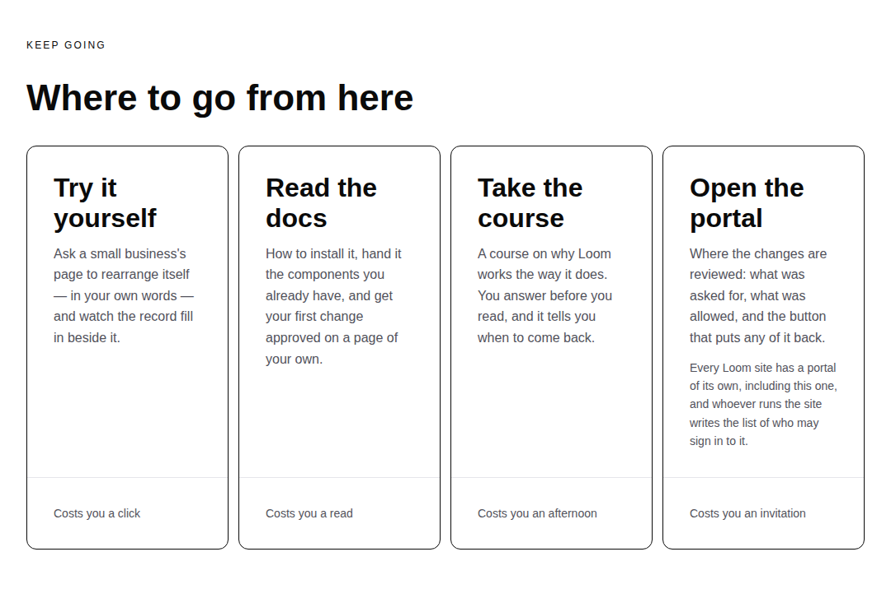
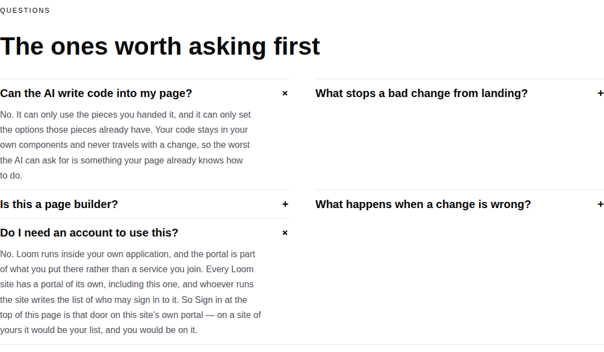
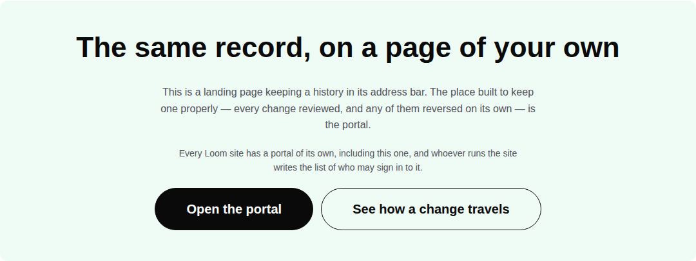
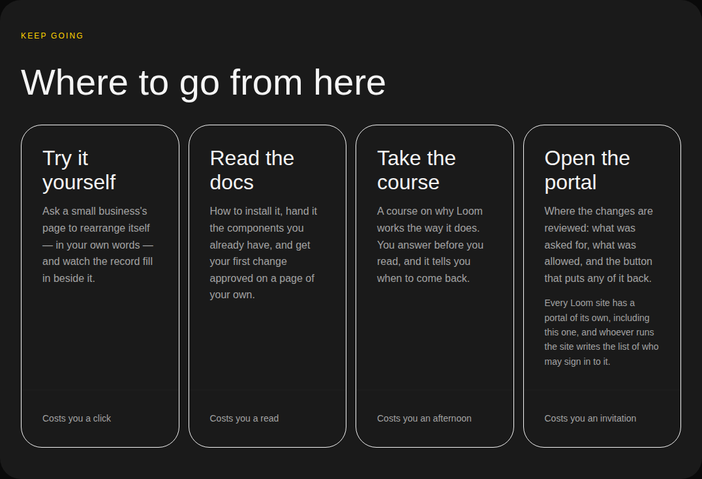
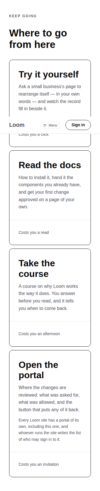

# 2026-09-10 — marketing: whose portal is it?

The maintainer's decision of 18 August is that **access to the portal is through
the marketing site**. This surface offers it four ways — the bar's *Sign in*, the
front door's band of cards, the footer's map, and the last band of
`/the-record` — and until this run **not one of them said whose portal it is.**

A portal belongs to the Loom site it is part of. Who may sign in to one is a
roster whoever runs that site writes. Nobody reading this site can obtain an
account here by deciding to — and on this deployment the door behind *Sign in*
answers, correctly and in the portal lane's own words, **"This portal isn't set
up yet."**



---

## The sentence was on the site, and an ordinary edit took it

The portal's blurb read *"who may sign in is set by whoever runs the
deployment"* until **25 August (#158)**, when the run that gave every surface a
`cost` moved it out to keep four blurbs one length and wrote **"Costs you an
account"** in its place.

That was a fair edit. Four blurbs of one length is a real thing to want, and the
costs are the most useful line on those cards — a reader comparing four
destinations is deciding how much of their afternoon to spend, and the band
answers that before they click.

The fact went with it, and what replaced it is **worse than silence**. Three of
the four costs name something the reader can spend: a click, a read, an
afternoon. An account on the same line reads as the fourth. It is the one cost
in the row that is somebody else's decision, wearing the shape of the three that
are the reader's.

## Two tests and a docblock covered the gap while it was open

This is the eighth consecutive run to find two individually defensible things
nobody had read next to each other. It is the first where **a test was one of the
two.**

`pages.test.ts`'s note on the band still promised:

> each card is honest about what is behind it, which is why the portal's says
> that signing in is required rather than pretending the whole product is one
> click away

— of a card that had stopped saying so sixteen days earlier.

And `site.test.ts` held it, or looked as though it did:

```ts
const read = `${surface.blurb} ${surface.cost}`.toLowerCase()

expect(/\bsign|\baccount\b/.test(read)).toBe(surface.guarded)
```

**"Costs you an account" contains the word `account`.** The assertion passed, for
sixteen days, on a sentence that told a reader something false.

That is the half worth keeping from this run:

> An assertion that checks a page for a **word**, rather than for what the word
> is standing in for, will outlive the fact and go on passing.

The keyword was never the fact. The fact is **who decides**, and no arrangement of
`/\bsign|\baccount\b/` can ask for it.

## Why this lane cannot check the door instead of describing it

`site.ts` records the contract, and it settles what the copy is allowed to claim:

> a surface is a destination this lane **may only point at**. Pointing at one is
> the whole contract — the path is the other lane's front door, so it stays
> correct across anything that lane does behind it.

So `(marketing)` does not import `(portal)`'s auth config, and has no way to know
whether sign-in is configured on the deployment it is served from. Which means
the copy may not say that the door opens — only what kind of door it is. That is
a constraint and it produced the better sentence anyway: what a reader needs is
not *this one is shut*, which would leave them thinking the product has a door
they failed to get through. It is *this is what a portal is, so it is also what
yours would be.*

## What shipped

**One required field, four places it is said, and one word.**

`Surface` is now `SurfaceFacts` plus one of two halves, and the guarded half
**requires `door`**:

```ts
type GuardedSurface = SurfaceFacts & {
  readonly guarded: true
  readonly door: string
}

export type Surface = OpenSurface | GuardedSurface
```

A guarded surface added a year from now is a **compile error** until somebody
writes down what a visitor without a way in actually finds. That is deliberately
the compiler's job rather than a test's, because the failure this run fixed is
exactly the one a test written today would not have caught: the test would have
been written against the field, and the field did not exist.

| where | said | now |
| --- | --- | --- |
| the portal's cost line | "Costs you an **account**" | "Costs you an **invitation**" |
| the front door's band of cards | blurb only | blurb, then `PORTAL.door` in the card body |
| the front door's questions band | four questions | a fifth: *"Do I need an account to use this?"* |
| `/the-record`'s last band | "…is the portal." | the same, then `PORTAL.door` |



### The record page's band is the sharper of the two placements

*The same record, on a page of your own* is the heading, and the button under it
opened a portal that is not the reader's. It was the one place on the site where
*yours* and *this deployment's* stood a sentence apart and read as the same
thing. `door` is what makes the heading true: a portal comes with the site, so
the one on a page of your own would be yours.



### Both halves of the new question are composed, not typed

The answer names a button by the button's own word (`SIGN_IN_LABEL`, exported
from `chrome.ts`) and a door by the door's own sentence (`PORTAL.door`). Re-word
either and the answer follows. A question that named the button by typing
*"Sign in"* out again would go stale the day the button changed, and it would go
stale **silently** — the wrong half of the answer still reads like an answer.

### The door is in the card body, never the footer

The costs are pinned to the cards' footers precisely so unequal bodies do not
disturb the line a reader compares along. A sentence dropped into that line would
be read as a fourth cost and would break the line for the other three. There is
an assertion for it.

## What was not changed, and it is the open question

**The bar still says *Sign in*.** Ten seconds is the whole span that bar is for
and none of the above fits in it — and re-wording the front door's principal
action is a positioning call, not this routine's. Raised on the pull request with
a recommendation.

## Tests

`pnpm install && pnpm verify` — **green, exit 0. Nothing failed, nothing skipped,
no test weakened, no test deleted.**

| suite | before | after |
| --- | --- | --- |
| `@loom/runtime` | 1860 / 119 files | **1860 / 119 files** — `src/` was not opened |
| `@loom/app` | 2734 / 163 files | **2749 / 164 files** |
| marketing, within it | 1064 | **1079** |

Fifteen new assertions: thirteen in one new file, `_lib/pages/the-way-in.test.ts`,
and two in `site.test.ts`, where a third was strengthened rather than added.

**`site.test.ts`'s existing assertion was strengthened rather than relaxed.** It
now reads `door` as well, so it keeps doing the job it is good at — that no
*unguarded* surface warns about a door it does not have — and the fact it was
standing in for gets an assertion of its own beside it:

```ts
expect(door.toLowerCase()).toContain("whoever runs the site")
```

**Every assertion in the new file is scoped to the band that does the offering**,
not to the page it is on. A page-wide `toContain` would go on passing for every
arrangement of the page that keeps the words anywhere on it, which is the same
latitude that let the band's own note promise a property the band had lost.

### Seven mutations, each caught by exactly what should catch it

| mutation | result |
| --- | --- |
| `cost: "Costs you an account"` put back | **2 failed** — *does not offer an account as a thing the reader can spend*, and *does not price a surface in something only somebody else can grant*. Nothing else. |
| the door dropped from the front door's card | **1 failed** — *Portal says whose it is on its own card, not merely on the page* |
| the door dropped from `/the-record`'s last band | **1 failed** — *says whose portal it is offering, in the band that offers it* |
| the fifth question removed | **3 failed** — all three assertions on the questions band |
| the bar re-worded to *Log in*, answer left composed | **1 failed** — only the pre-existing `chrome.test.ts` assertion about the bar's word. **The new file stays green, which is the point of composing it.** |
| the bar re-worded **and** the answer typing *Sign in* by hand | **2 failed** — the bar's assertion, and *names the button by the word the bar actually carries* |
| `door` deleted from `PORTAL` | **does not compile** — `Property 'door' is missing … but required in type '{ readonly guarded: true; readonly door: string }'` |

### Rendered

Both palettes and the third, at 1440 and at 390. `scrollWidth` exactly 1440 at
1440 and exactly 390 at 390 on every shot.





No colour is named in the diff. No primitive was added and none was missing: the
whole unit is a card body, a question, a sentence and a type.

## Findings

**Filed and closed the same run:** *the front door's one action offers an
account, and no page of this site says whose* — closed by this branch.

**Filed open, and proposed as this lane's next unit:** *the site can now say a
portal belongs to whoever runs the site, and never says what running one is.* The
door sentence answers the question a stranger arrives with and hands them the
next one immediately — **so what do I run?** Five pages and none of them says what
a Loom site *is*: your own application, your components described to it, your
rules beside them, and a portal that comes with it. A reader who has understood
every page still cannot tell whether this is a library, a service or a thing they
host. It is a description of code, so it does not wait on the licence line; the
boundary to agree first is with `Loom docs`, who own *how to install it*.

**Nothing for another lane.** No primitive was missing, no prop could not be set,
nothing needed data the framework could not fetch. The portal lane's sign-in page
is doing exactly the right thing — this was our copy pointing at it, not their
page.

**Restated, not re-filed:** `fonts.googleapis.com` is still not on the egress
allowlist, so this screenshot set is in the fallback face rather than Geist, as
every set this lane has published has been.

## On the branch

Pushed onto `marketing-22-putting-it-back-is-a-change` (#242) rather than cutting
`marketing-23` off `main`, **fourth run running**, for the reason recorded on the
last three: #216's commit message on `main` says each routine should *"check for
its own open pull request and continue it rather than branching from main
again"*, and `routines.md` step 2 says a maintainer instruction outranks the
brief. The brief's step 3 still says to branch. One sentence in the briefs and in
`docs/routines.md` settles it for all seven lanes.

Nothing scheduled and nothing armed.
