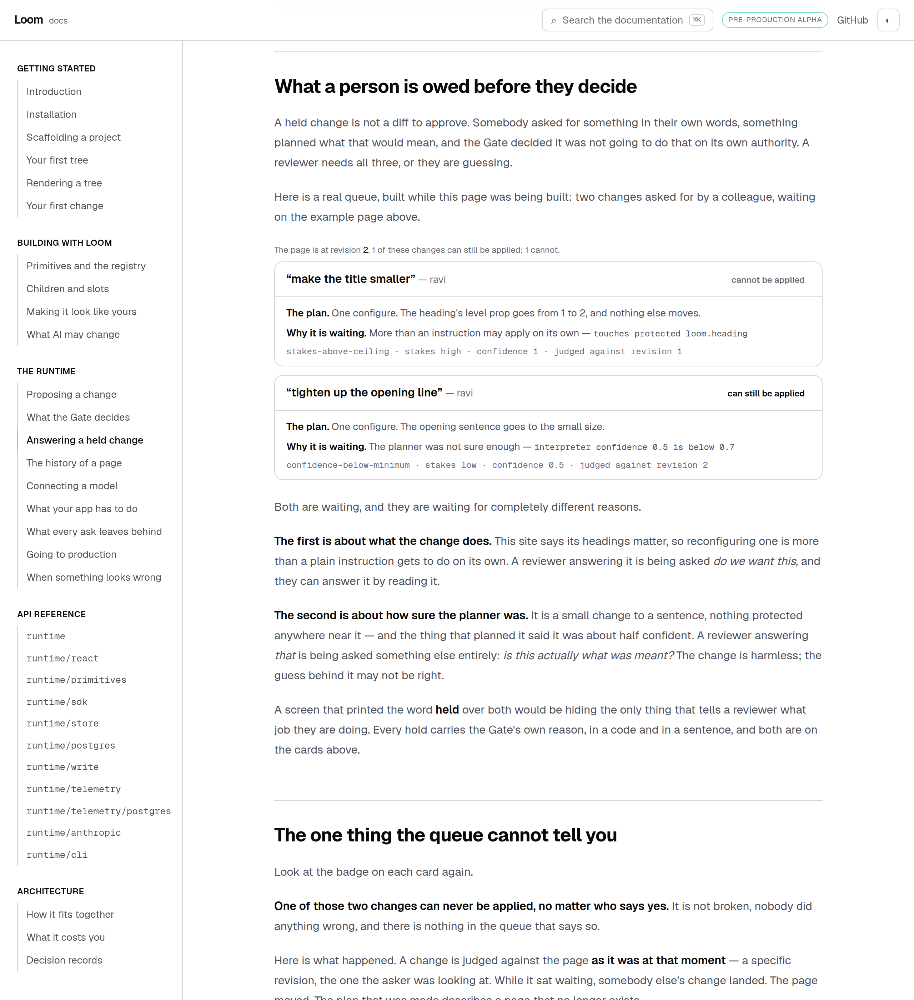
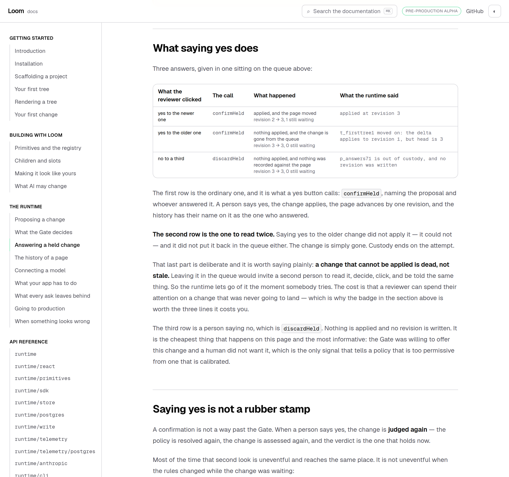
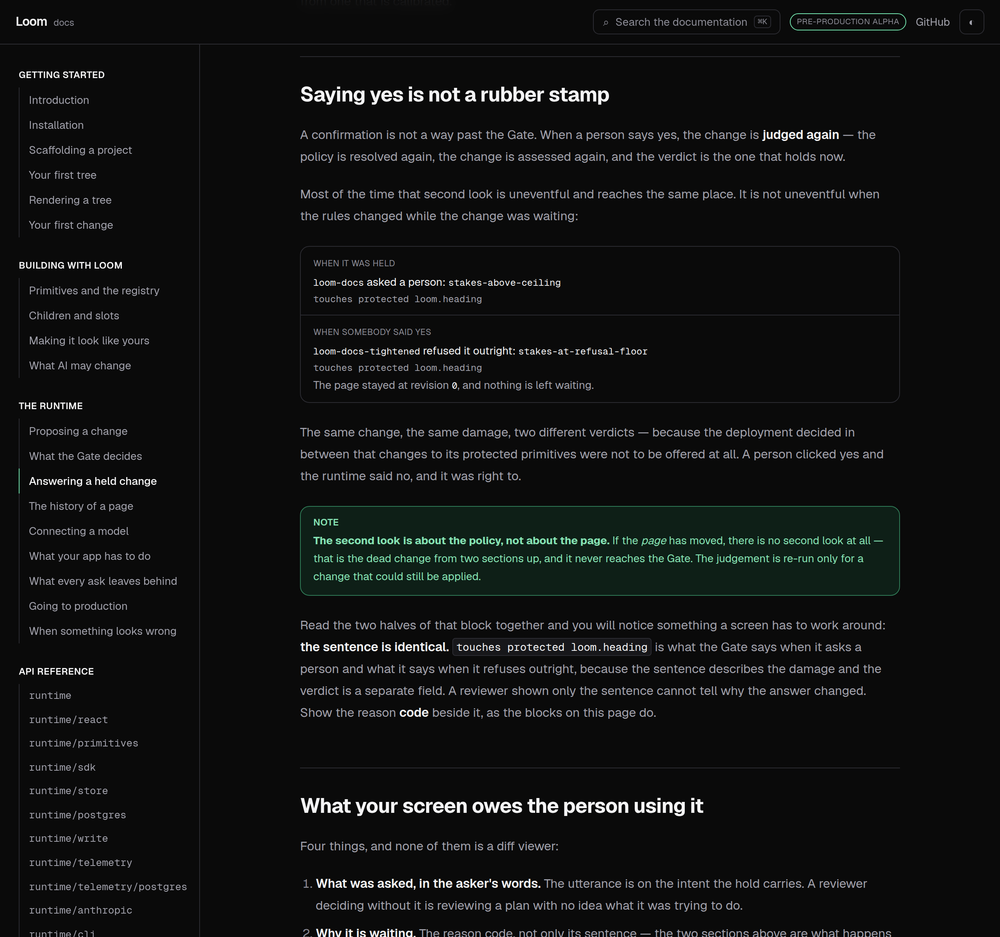
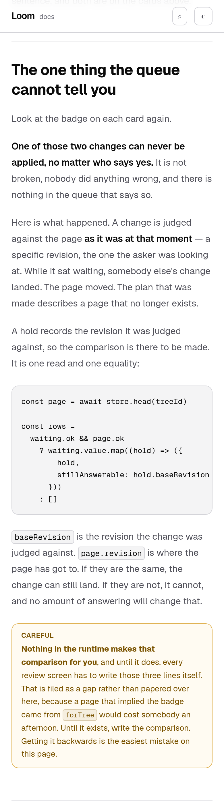

# 11 September 2026 — the change that can never land

**Routine:** `Loom docs` · **Branch:** `docs-21-the-code-on-the-page-compiles` ·
**Section:** §4c

The Gate has three answers and only two of them are answers. Twenty-two pages
taught a reader to build something, ship it, and read its history afterwards.
None of them was written for the third answer — **ask a person** — from the point
of view of the person being asked.



## What shipped

**One page — *Answering a held change*** — under *The runtime*, between *What the
Gate decides* and *The history of a page*. It is the screen a deployment has to
build and nothing on this site had described: where a held change waits, what a
reviewer is owed before they click, what each of the two answers does, and the
one thing a queue cannot tell you.

Every card, row and number on it is a real hold. One store is opened as the page
builds, four ordinary asks go through `commitIntent`, two of them are held — for
the **two different reasons** a hold happens — and the three answers in the table
are `confirmHeld` and `discardHeld` being called on them.

## The finding the page is built around

`holds.forTree(treeId)` gives you everything waiting on a page, oldest first, and
**nothing in what it gives you says whether a change can still be applied.** A
held change names the revision it was judged against; the page moves on without
it; and a change judged against a revision head has passed can never be applied
again, whoever says yes.

There is no flag for that. The comparison is one read and one equality, and every
host that builds a review screen writes it:

```ts
const page = await store.head(treeId)

const rows =
  waiting.ok && page.ok
    ? waiting.value.map((hold) => ({
        hold,
        stillAnswerable: hold.baseRevision === page.value.revision,
      }))
    : []
```

The queue on the page has one of each kind in it, and the badge on each card is
that expression rather than a sentence I wrote. `Loom docs` filed the missing
helper on 7 September and it is filed again today with a new argument: **a
documented workaround is harder to withdraw than an undocumented one.** From
today, `staleHolds` landing means this page is rewritten rather than merely
extended.



The second row of the answering table is why it matters. Saying yes to the older
change does not apply it, does not put it back in the queue, and does not ask
again — custody ends on the attempt. A reviewer can read a change, decide, click
and be told it was never going to work. That behaviour is right (*dead rather
than stale*, as `confirmHeld`'s own comment puts it) and it is exactly why the
badge is worth three lines.

## A sentence the site has been wrong about since at least 24 August

*What the Gate decides* said this, and it is false:

> If the page moved in between, the second look is a look at things as they are
> now, and a change that would now be refused stays refused.

If the page moved, **there is no second look.** `confirmHeld` compares
`baseRevision` against head before anything is judged, releases the hold and
returns `not-written`. The sentence described the one case where the
re-judgement does not happen.

What is true is that the second look is about the **policy**, and the page now
says so — and shows it. `produceSecondLook` holds a change under this site's
policy, then answers it under a policy whose `refusalFloor` has been lowered, and
prints both verdicts:

| | Policy | Verdict | Reason |
| --- | --- | --- | --- |
| When it was held | `loom-docs` | asks a person | `stakes-above-ceiling` |
| When somebody said yes | `loom-docs-tightened` | refused | `stakes-at-refusal-floor` |



**Both details are the same string** — `touches protected loom.heading` — because
the detail describes the damage and the verdict is a separate field. A review
screen that renders `reason.detail`, which is the field that reads like a
sentence and is therefore the one a host will render, shows a reviewer identical
words for *this needs you* and *this will never be offered*. Filed for
`Loom daily build`; worked around on the page by printing the code beside the
sentence, and said out loud rather than quietly designed around.

The part of the wrong sentence worth keeping is **why nothing caught it**. Every
check this site has runs in one of two directions: a claim about a *number* is
held against a producer, a claim about a *name* against the published surface. A
claim about *behaviour*, written in English, has neither. It compiles, it
renders, it reads well, and it is wrong. That is filed too, with no mechanism
proposed, because the honest one is expensive.

## The bench, extracted rather than copied

*When something looks wrong* already opened a store, sent asks and answered a
hold. This page needed the same deployment and different questions. So the store,
the planning interpreter, the two ways of answering and the four ordinary changes
moved to `_lib/bench/` and both pages read them — 295 lines out of
`operations/checks.ts`, and its seventeen tests still pass untouched.

This is the lesson #243 wrote down on 5 September and then got to apply: an
abstraction built while its first consumer is being written is a guess about what
the second one will want. The second consumer arrived today, and the seam it
wanted was visible rather than predicted. One thing deliberately did **not**
move: the change a single page makes its point with. The card that carries a
sentence nobody asked for belongs to the attribution table; the plan a planner
says it was half sure of belongs to the queue.

## The second hold is the one I would defend

A queue with two changes in it, both held for being consequential, would have
taught a reviewer half of their job. The Gate holds things for two different
kinds of reason and a reviewer answers them differently:

- **What the change does.** This site protects its headings, so reconfiguring one
  is above the ceiling an instruction may apply on its own. *Do we want this?* —
  answerable by reading it.
- **How sure the planner was.** A small change to a sentence, nothing protected
  anywhere near it, planned by something that said it was about half confident.
  *Is this actually what was meant?* — a different question entirely, about a
  harmless change.

The second is staged and the page does not pretend otherwise: a documentation
build does not call a model ([0057](../decisions/0057-a-preset-is-a-deterministic-interpreter.md)),
so the confidence is written rather than earned. It is honest rather than
invented — `confidence` is the field a model interpreter fills in, 0.5 is under
the 0.7 this policy inherits, and the events go to a sink that drops them, so no
ungraded number walks into calibration as a model's record
([0031](../decisions/0031-calibration-is-a-reader-not-a-controller.md)).
It is one parameter on `plans`, with the reason attached, rather than a second
way of planning a change.

## Tests

`pnpm install && pnpm verify` at the repository root, **green, exit 0**.

| Suite | Files | Tests |
| --- | --- | --- |
| `@loom/runtime` | 119 | 1860 passed — `src/` was not opened |
| `@loom/app` | 184 | 2817 passed |

**+31 tests** over the 2786 on this branch this morning: fourteen on the
producers, six on what the page's own prose claims about them, eleven on the
three blocks.

Nothing was skipped, no cap was raised, and no test was weakened. One test did go
red on the first full run and it was right to: `compiled.test.ts` caught that
editing the page shifted the line numbers in its generated program and did not
regenerate it. That is the check working, not a flake.

Three claims were verified by mutation, because a test that has never failed is a
claim rather than a check:

- replacing the staleness comparison with `true` fails *claims exactly as many
  changes can never be applied as the badges say*, *has one change that can still
  be applied and one that cannot*, and *calls a change answerable exactly when it
  was judged against head* — and nothing else
- inverting the badge on the card fails *badges each card with what the producer
  said about that change*, and only that one
- changing the page's own sentence from *one of those two* to *two of those two*
  fails the claims test that reads it, and only that one

The test I would defend hardest is derived rather than written: *calls a change
answerable exactly when it was judged against head* walks whatever ends up in the
queue and asserts the badge against `heldAgainst === head` for every row. Whatever
that story becomes next month, the comparison the page teaches is the comparison
the page shows.

## Dark and 390px, before the pull request

`document.documentElement.scrollWidth` is exactly 390 at a 390px viewport and
1280 at 1280. The one block that could overflow is the code fence, and it scrolls
inside its own box, which is what `overflow-x: auto` on a code block is there
for.



## Scope

`apps/loom/app/(docs)/` only. Seven files added, four changed. **No file in
another lane was opened**, `src/` was not opened, and the generated API reference
was not regenerated because the runtime's surface did not move.

The three blocks are docs-site furniture in 0067's sense, like every other
generated table here — they present something the repository knows. What a reader
is shown *as a page* is still a `LoomTree` through the runtime, and the example
at the top of this one is the same first tree the rest of the site uses, with its
propose box. No primitive was needed and none is missing.

## Open questions

**The stale-hold helper is now load-bearing on a published page.** Recommendation
unchanged from 7 September: a `staleHolds`-shaped helper in `@loom/runtime/write`.
`Loom portal` owns a review queue screen and is the other lane this reaches.

**`reason.detail` cannot tell a hold from a refusal.** The fix is one string per
rule in `src/runtime/gate.ts` — a detail that names what the policy did as well
as what the change does. Until then every host has to know that the field which
reads like a sentence is not sufficient on its own.

**Nothing on this site checks a sentence about behaviour.** Today's correction
was found by writing a page that produces the behaviour beside it, which is not a
mechanism — it is a lane that happens to work that way. Filed, unresolved.

**What I would write next.** The queue page assumes somebody is looking at the
queue. Nothing tells a host how anybody finds out there is something in it, and a
review screen nobody opens is the same as no review screen. That is a page about
notification, and it wants a runtime answer first — there is no event a host can
subscribe to that says *a change is waiting*, only a telemetry record after the
fact.
