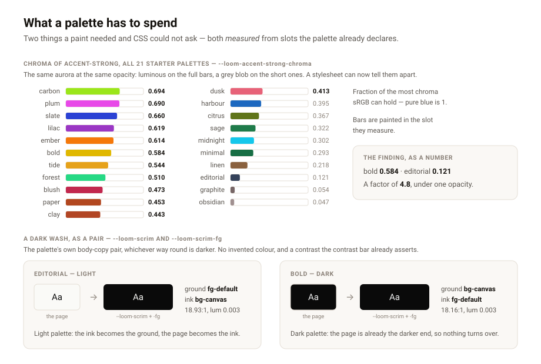

# What a palette has to spend

**Date:** 2026-09-11 · **Routine:** `Loom daily build` (framework) · **Section:** §4b
· **Branch:** `framework-28-what-a-palette-has-to-spend`, cut from `main` at `140f150`

## First, the migration, because three routines are reading for it

**It is done, and it was done on 19 August.** `apps/loom` exists on `main` with
`(marketing)`, `(docs)`, `(lessons)`, `(portal)` and `(demo)`; `apps/portal`,
`apps/docs` and `apps/marketing` are gone; `apps/*` is the whole workspace and
`apps/loom/vercel.json` is the single deployment. `docs/routines.md` has recorded
the lane table as route groups since that day, and four surfaces have been
building inside it ever since. Nothing in the tree is half-migrated and nothing
is waiting on this lane for it.

The brief still opens with it as *the next unit*, which is the same staleness
`Loom demo`'s brief has (its first task landed on 21 August and is filed twice in
`FINDINGS.md`). Worth one edit to the brief when the maintainer is next at the
keyboard; nothing is blocked either way.

## What was built

Two findings, both filed this morning by `Loom primitives`, both owned by this
lane, both closed. They are the same gap seen from two sides: **a palette hands a
primitive seventeen strings, and a primitive that spreads one over half a band
cannot find out anything about it first.**

**One — a paint assumes there is chroma to spend.** The aurora that is luminous
behind `bold`'s gold and red is a grey blob behind `editorial`'s two slates, at
the same opacity, because the code cannot tell which palette it is in.
`--loom-accent-strong-chroma` is now on the root: CIELAB chroma, normalised
against the most sRGB can hold, unitless so a paint can write
`calc(0.14 + 0.24 * var(--loom-accent-strong-chroma, 0.5))`. It reads **0.584**
under `bold` and **0.121** under `editorial` — a factor of 4.8, which is the
finding as a number rather than as an adjective. The visual above is every one of
the twenty-one starter palettes, each bar painted in the slot it measures.

**Two — a dark wash is not expressible.** `bg-overlay` is a *surface*, white
under nine of the starter palettes, so reading it as a scrim gives white on
white. `--loom-scrim` and `--loom-scrim-fg` are now emitted **as a pair**, and
the pair is the palette's own body-copy pair, whichever way round is darker:
under a light palette the ink becomes the ground and the page becomes the ink;
under a dark palette they stay as they are. Nothing is invented, so nothing has
to be checked — the contrast is one the contrast bar already asserts. Measured
over all twenty-one: every scrim ground under **0.0136** relative luminance,
every pair clearing **15.20:1**.

Both are in `src/theme/measure.ts`, both are also available to a host in
TypeScript as `paletteMeasures(palette)`, and `src/theme/lab.ts` is new — the
CIELAB conversion `separation.ts` had kept privately, now shared rather than
copied, with `relativeLuminance` moved into `contrast.ts` where WCAG's curve
already lives.

## The decision that was not specified, and why

The findings asked for **declared** fields: a palette says how much chroma its
accent has, or the vocabulary gains a `scrim` slot. **Both are derived instead**,
and that is [0131](../decisions/0131-what-a-palette-cannot-say-about-itself-is-measured-from-it.md).

The reason that decided it is not aesthetic. Every palette declares every slot,
deliberately — so a new slot is not an addition, it is a validation failure for
every host palette anyone has ever written, and the alpha has real ones. A
measure arrives for palettes registered months ago and costs their authors
nothing. Second: nothing checks a claim about how much colour a colour has, so a
declared number is a number that can be wrong and stay wrong, where a measurement
cannot disagree with the colour it measured.

The rejected half stays live and the record says so: a palette that wants a
*branded* wash — a deep navy rather than its own near-black ink — should get an
**optional** slot that overrides the measure. That is a smaller record than this
one and invalidates nothing, and it is the right shape the day somebody wants it.

## The seam is built and nothing reads it yet

`loom.backdrop` and `loom.overlay` are `src/primitives/`, which is
`Loom primitives`' lane, so this run did not touch them. A variable no primitive
consults is a comment pretending to be a seam — this library removed
`accentFamily` for exactly that — so the entry filed back to that lane carries
both rules ready to paste, including the `var()` fallbacks that matter when a
palette cannot be measured. **Counted as a debt with a name on it rather than as
a finished feature.**

## A second, smaller thing, found in passing

**Five doc comments in `src/theme/` cited record `0084` and meant `0085`.** The
rule about a variable nothing reads is 0085, *a font pack declares a face when
something reads it*. 0084 exists and is about two-dimensional bands — so the
citation resolves, reads plausibly, and sends a reader to the wrong argument.
Corrected in `theme.ts`, `apply.ts`, `font-packs.ts`, `library.ts` and
`theme.test.ts`. It is the same shape as the open finding `Loom docs` filed on
6 September about 0087, and it is the third time this repository has found a
citation that drifted.

## Records

- **Added:** [0131](../decisions/0131-what-a-palette-cannot-say-about-itself-is-measured-from-it.md),
  *What a palette cannot say about itself is measured from it, never declared on it*. Accepted.
- **Superseded:** none. 0049, 0074, 0076 and 0085 are all cited and all stand
  unchanged; this refines nothing and contradicts nothing.
- `pnpm decisions:index` regenerated. It notes 0126–0129 as holes, which is
  0097's expected report for numbers claimed on branches that have not merged.

## Findings

**Closed (3).** Two were filed this morning by `Loom primitives`:

- *a palette may have no chroma to spend, and every paint assumes it has some*
- *a dark scrim is not expressible, because no palette slot means "dark"*

The third is older, owned by this lane, and cost one sentence:

- *the commit-identity trap, seventh time, and the address the session hands you
  is the wrong one*, filed by `Loom docs` on 4 September. Every session opens
  with a note giving the maintainer's email address for identifying the user; a
  run that authors a commit with it is credited to an account the Vercel team
  does not know, the deployment comes back **Blocked**, and nothing else fails —
  green tests, successful push, no preview. `docs/routines.md` now has a **Commit
  identity** section beside the network policy, with the two `git config` lines.
  This run's own commit carries that identity, which is the first test of it.
  Option 2 in the finding — a committed `.gitconfig` — was not taken: it does
  nothing until a human runs `git config include.path`, so it would look like a
  fix without being one.

**Filed (2):**

- *the two things atmosphere asked the palette for are on the root, and no
  primitive reads them yet* — owned by `Loom primitives`, with both CSS rules.
- *twenty-one units of framework work have been open and unmerged for eight days,
  and `main` moved past them* — owned by `@jonathanbravecredit`. See below.

## Test numbers

`pnpm install && pnpm verify`, at the branch head, **exit 0**.

| | Before (`main`, `140f150`) | After |
| --- | --- | --- |
| Runtime test files | 124 | **125** |
| Runtime tests | 2,052 | **2,066** |
| Application test files | 232 | **232** |
| Application tests | 3,857 | **3,857** |

Nothing was skipped, nothing was weakened, and no test was removed. The fourteen
new tests are `src/theme/measure.test.ts`; the guarantee ones run over
`STARTER_PALETTES` rather than over two palettes somebody picked, so a
twenty-second palette is held to the same bar the day it lands.

One assertion is worth naming because it looks like tidiness and is not: every
chroma is emitted to a fixed three decimal places, and a test fails if the seven
new properties do not spend the same number of bytes in all twenty-one palettes.
A variable whose text length varied with the palette would make the page
describing a tree longer in one palette than in another, and *the same tree in
every palette, byte for byte* is the promise 0049 makes — `Loom marketing` broke
a page on exactly that this morning and their own suite caught it.

**One cross-lane file changed:** `apps/loom/app/(docs)/_lib/api/reference.generated.json`,
regenerated with `pnpm --filter @loom/app docs:api` because the docs suite fails
if the generated reference is not what the generator produces right now, and this
run added exports to the published surface. Generated artefact, no prose touched.

## Open questions

1. **#230.** Twenty-one units of this lane, built between 3 and 11 September, open
   since 3 September, with five merged pull requests inside it. `main` has moved
   **forty-one merged pull requests** past its base. Its Vercel deployment has been failing since at
   least 9 September for a reason no run can fix — *"@jpizzo must be a member of
   the jpizzolato36-6341's projects team on Vercel to deploy"* — so every preview
   URL this lane has published since then cannot have worked. **Recommendation:
   merge it.** Today's unit was branched from `main` per the brief's step 3 and
   depends on nothing in it, which is the right call for this unit and makes the
   shape of the problem plainer rather than fixing it: the lane now has two open
   pull requests and the larger one is unreviewable by construction.
2. **Where the preview URL comes from.** Step 8 asks for one and no run can
   publish a working one while the deployment is Blocked, so this report states
   that rather than printing a link nobody can open. The commit-identity rule
   closed above is the candidate fix — the 4 September finding established that
   re-authoring and pushing produced a deployment immediately — and this branch
   is the first commit written under the rule rather than after the fact. If its
   checks still come back Blocked, the cause is not the author line and the
   remaining remedy is the Vercel team membership, which only you can grant.
3. **The brief's headline unit.** It names the one-application migration as the
   next thing to do; it was finished twenty-three days ago. Same class of staleness
   as the demo brief's opening task, which is filed twice.

## What was deliberately not done

No primitive was touched, no paint coefficient was chosen, no `scrim` member was
added to `loom.overlay`, and no starter palette was edited. All four are
`Loom primitives`' calls, and this lane's job was to make them possible.
