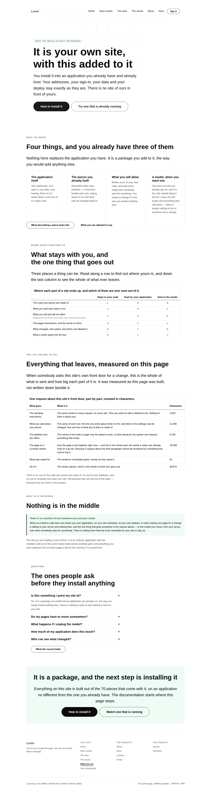
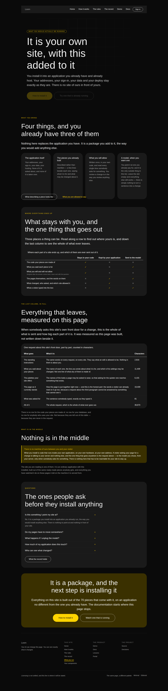
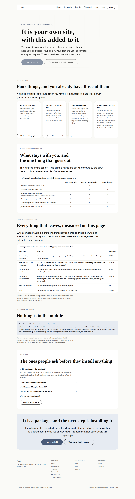


# 2026-09-11 — marketing: what you would actually be running

Yesterday's run put a true sentence on the front door — *whoever runs the site
writes the list of who may sign in* — and handed the reader the next question in
the same breath: **so what do I run?**

Five pages, and none of them answered it. `/how-it-works` is the journey one
change takes. `/the-rules` is what you decide in advance. `/your-components` is
what you hand over. `/the-record` is what you are left holding. Every one of them
is about a *part* of the thing, and a reader who had understood all five still
could not say whether this is a library they add to something, a service they
point something at, or a site somebody else hosts for them.

---

## What shipped

`/what-you-run`, the sixth page, on this branch rather than a new one.

Two bands carry it and they are a pair: one says where each thing a reader owns
ends up, and the one below it **measures what actually leaves**, on this site's
own front door, as the page is built.

### The comparison

Six rows and three columns — *stays in your code*, *kept by your application*,
*sent to the model* — built from `loom.comparison-table`, which nobody in this
lane had used and which is a real `<table>` with real row and column headers, so
the answer in the third column of the fourth row can be found by somebody
arriving from either edge.

| | Stays in your code | Kept by your application | Sent to the model |
| --- | --- | --- | --- |
| The code your pieces are made of | ✓ | ✕ | ✕ |
| What you said each piece is for | ✓ | ✕ | ✓ |
| What you will and will not allow | ✓ | ✕ | ✕ |
| The pages themselves, and the words on them | ✕ | ✓ | ✓ |
| What changed, who asked, and which rule allowed it | ✕ | ✓ | ✕ |
| What a visitor typed into the box | ✕ | ✓ | ✓ |

**The fourth row is why the band can be believed at all.** The page goes, and the
words on the page are part of the page. A band claiming *nothing of yours leaves*
while quietly omitting that would be worth less than no band, because a reader
who found out later would be right to assume the rest was shaded too. There is a
test whose only job is that this row cannot be softened.

The third row is the one people do not expect: **your rules are never sent.**
They are weighed after the answer comes back, which is the difference between a
rule and an instruction and is the site's whole argument, said in a table cell.

### The measurement

`measurePrompt` is the function a host calls to find out what registering more of
something costs. It builds the request without sending it. So the band is not an
illustration of what would be sent — it **is** what would be sent, counted, taken
at build time against the page this site publishes at `/`, with the library and
the palettes it really renders with.

| What goes | Characters |
| --- | --- |
| The standing instructions | 2,816 |
| What you said about your pieces | 11,409 |
| The palettes your site offers | 6,155 |
| The page as it currently stands | 19,409 |
| What was asked for | 81 |
| **All of it** | **39,870** |

Measured on the deployment the screenshots were taken from. The numbers move a
little with the origin, because the page's own links are in the page — which is
the band being honest about itself rather than a flaw in it.

Under it, the only sentence on the page that needed no hedging: *there is no row
for the code your pieces are made of, no row for your database, and no row for
anybody who uses your site — not because they are left out of this table, but
because they are never in the request.*

**The band refuses to build if that stops being true.** `partsOf` holds the
page's five sentences against `PromptMeasurement`'s keys in both directions: a
part nobody has written a sentence for is something leaving a reader's server
that the page does not mention, and a sentence for a part no longer sent is the
page describing something that stopped happening. A sixth thing arriving in the
request is a page that does not build, rather than a page that goes on quietly
naming five.

That is the 9 September lesson applied a second time. A fact the code held and
the page could not reach was a fact the page eventually contradicted; this is the
same fact — *what leaves* — read off the one function that knows.

## The boundary with `Loom docs`, agreed rather than discovered

The finding that proposed this page asked for the split to be settled in writing
first, so it is, and it is filed for that lane.

`/docs` owns **how to install it**: the commands, the code, the API, and every
sentence that assumes the reader has decided to try. `/what-you-run` owns **what
the shape is**, which is what somebody asks before they are willing to read an
installation guide at all. Two assertions keep it from eroding a sentence at a
time: the page prints no code — a test fails on `npm`, `pnpm`, `yarn`, `npx` or
an `import` in its copy — and it uses none of the reserved vocabulary. The
overlap that remains is one sentence, and it is that installing is the next step.

## Two things this run got wrong before the code was right

Both are in `FINDINGS.md` with the reasoning. Both were caught by tests that
already existed, which is new for this lane and worth more than the fixes.

### The measurement leaked the palette

The obvious way to write the band is to measure the front door in the palette the
reader is wearing. That is wrong: a page's root carries what it is wearing, so
the request describing it is a few characters longer in one palette than in
another — and a number **below the root** that moves when the palette moves is
precisely what [0049](../decisions/0049-a-theme-is-three-ids-in-the-tree.md)
says cannot happen.

`pages.test.ts` failed on all three palette pairs before the page had been looked
at once. This lane's standing failure is two individually defensible things
nobody has read next to each other, and the defence found so far has been reading
the site across a link. **Nobody reads a page three times in three palettes
comparing digits.** A generic per-route assertion caught what no amount of
reading would have.

The fix is the honest reading anyway: `/` is published in the house palette and
that is the page a visitor arrives on.

### A navigation link changed what one of the site's five requests costs

The link to this page went into the front door's questions band first, under the
two answers that make its claim. **Ten existing tests went red** — in `answers`,
`history`, `undo`, `outline` and `the-record`, none of them about navigation.

*Take the questions off the page* is one of the five requests this site offers,
the rules weigh how much a request removes, and one more row in that band pushed
the verdict from **landed** to **held**. The front door's demonstration stopped
being *three land, one is refused, one stops and asks* — which is the sentence
the 9 September run shipped and the argument of the band above it.

This is the site's own rules working exactly as the site says they do, on the
site itself, and it is the most convincing thing that happened this run. It is
also a trap for every lane that builds a page a request can be run against:
**anything added to a removable band is a change to what removing it costs.** The
link now sits in the facts band, beside `/your-components`, where `home.ts` had
already written down why that is the right place.

### And one gap the register had

`loom.comparison-row` names itself in a `heading` prop, which was not on
`words.ts`'s allowlist of props that hold sentences. So the six criteria — the
most load-bearing copy on the band, since the marks mean nothing without them —
were invisible to every register check on this site. The page's own test for the
row that must never be softened failed for that reason rather than because the
row was missing, which is how it was found. `heading` is on the list now.

## Tests

`pnpm install && pnpm verify` — **green, exit 0. Nothing failed, nothing skipped,
no test weakened or deleted.**

| suite | before | after |
| --- | --- | --- |
| `@loom/runtime` | 1860 / 119 files | **1860 / 119 files** — `src/` was not opened |
| `@loom/app` | 2749 / 164 files | **2815 / 165 files** |
| marketing, within it | 1079 | **1145** |

Sixty-six new assertions, in one new file. One existing test was **widened, not
relaxed**: `is kept off the bar deliberately, and is the only page that is` is now
`…one of the two pages that are`, still an exact list, so a third page leaving the
bar fails there and has to be argued for.

Everything is asserted against the **rendered page**, never against the module
that builds it.

**Four mutations, each caught by exactly what should catch it:**

| mutation | result |
| --- | --- |
| the reader's palette passed into the measurement | **4 failed** — `pages.test.ts` on all three palette pairs, and *prints the same numbers in every palette* |
| the honest row softened to *"The pages themselves"* | **1 failed** — *admits that the page and the words on it are sent*, alone |
| a typed `1,234` in place of the measured number | **1 failed** — *prints the number the runtime reports for every part* |
| one part dropped from the page's list of what leaves | **27 failed** — the page refuses to build, which is the guarantee |

## Decisions and findings

**No record written.** The change is compositional, adds nothing to the library,
constrains nothing outside this lane and touches no Accepted record. `src/` was
not opened, no other route group was touched, no primitive was added, and no
colour is named in the diff.

**One closed:** the finding of 10 September that proposed this page.

**Five filed:** the `Loom docs` boundary, for agreement; the palette in the
measurement; the removable-band coupling; the register's blindness to a
comparison's criteria; and the font allowlist, restated rather than re-filed.

**Nothing for another lane except the boundary.** No primitive was missing, no
prop could not be set, nothing needed data the framework could not fetch. The
whole unit is a page builder, a measurement read off a public function, and a
link moved.

## Open questions

- **The licence line** (#96, on every marketing PR since #134). Still the site's
  one placeholder and still the Phase 2 gate. Untouched.
- **Positioning, audience and pricing.** Untouched, as on every run. One sentence
  on this page came close and stopped: the *nothing is in the middle* band says
  only what is true of the **software** — that what you install runs inside your
  own application — and makes no claim about whether there will ever be a hosted
  offering. That question was raised on 10 September and is still open; if the
  answer is yes, this band wants revisiting before launch rather than after.
- **The bar is at eight and two pages are now off it.** The second time this
  judgement has been made alone. See the PR comment.

## How it looks

Three palettes, and the phone.

`scrollWidth` is exactly 1440 at 1440 and exactly 390 at 390.

**The honest weak spot is the comparison on a phone.** `loom.comparison-table`
reserves 7rem per value column and overflows its own wrapper rather than crushing
itself — a deliberate decision recorded on the primitive, and the page does not
scroll sideways, only the table does, with its criterion column pinned. But three
value columns do not fit in 390px, so a phone reader meets the first column and
has to push the band sideways to reach *sent to the model*, which is the column
the band exists for. Not filed: it is the primitive doing what its own note says
it should. Named here because the mitigation is real and was not arranged — the
measured band below it is an ordinary table making the same claim, and it reads
fine at 390.

Every screenshot is in the fallback face rather than Geist, as every set this
lane has published has been. See the font finding.

Nothing scheduled and nothing armed.
