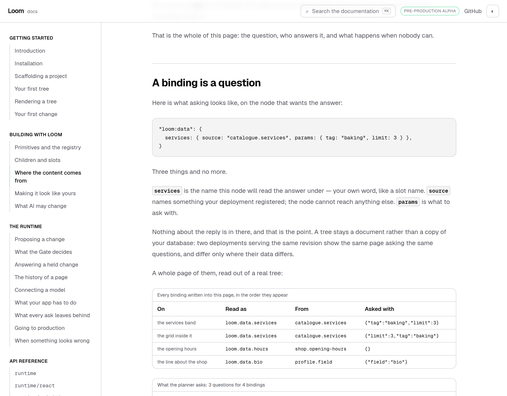
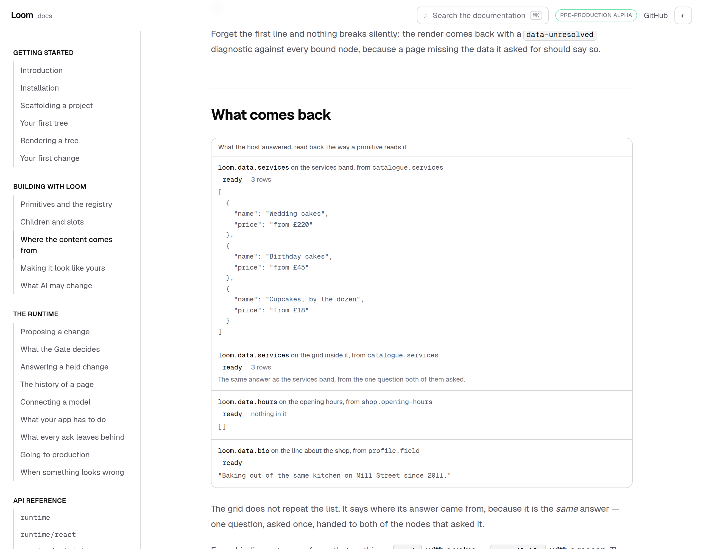
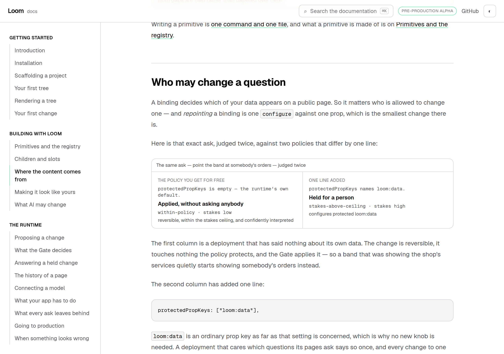
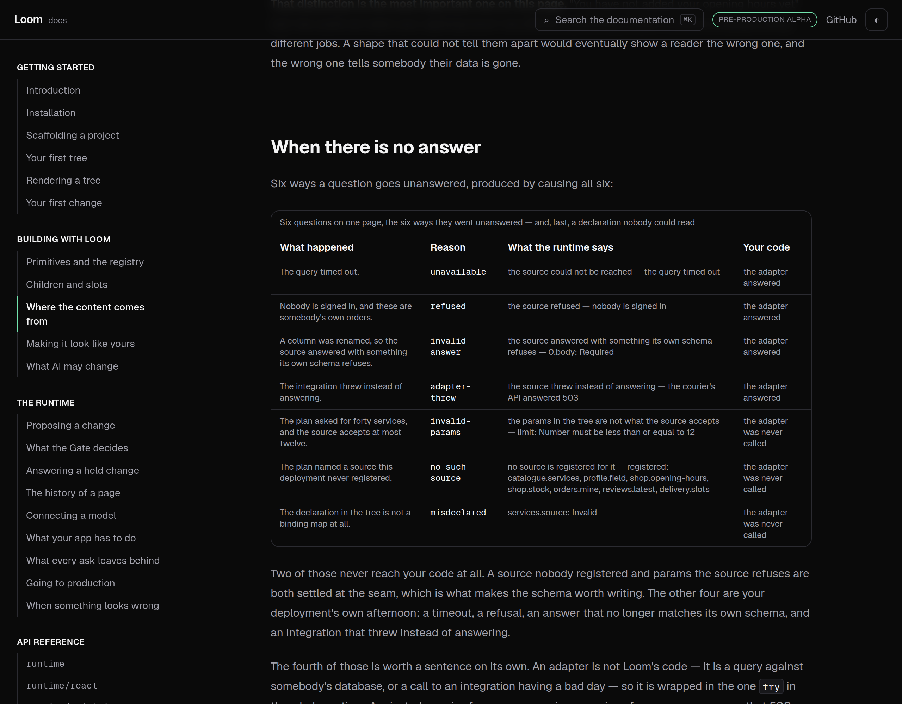
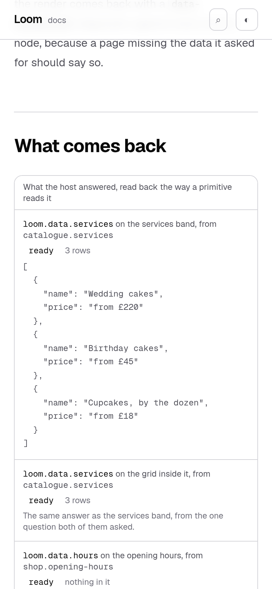

# 12 September 2026 — where the content comes from

**Routine:** `Loom docs` · **Branch:** `docs-22-where-the-content-comes-from` ·
**Section:** §4c

Twenty-three pages taught a reader to build a page, change it, review the
change and read its history. Every example on all of them had its words typed
into the tree. Nothing on this site said what happens when the page is supposed
to show **somebody's actual data** — a shop's services, a visitor's name, a
price that moved on Tuesday.

The seam for that has existed since 15 August and had never been written about.

## What shipped

**One page — *Where the content comes from*** — under *Building with Loom*,
between *Children and slots* and *Making it look like yours*. It is the fifth
page of that section and the first to say that a tree can ask a question it
cannot answer itself.

It covers, in this order: what a binding is, how to register a source, the two
lines that resolve one, what comes back, the six ways nothing comes back, how to
read an answer inside a primitive, and who is allowed to change which data a
page asks for.

Every table on it is a real seam being planned and resolved as the page builds.
One registry of three sources, one bound tree, one `planTreeData`, one
`resolveTreeData`, and a second page whose six questions all fail — for the six
different reasons they can.

## The number the page is built around

Four bindings on the page. **Three questions.**

The services band and the grid inside it both ask `catalogue.services` for the
same three rows, and they wrote the params in different orders, which is what
happens when two changes are planned months apart. `planTreeData` canonicalises
the key order, so that is one round trip rather than two — and the answers block
under it does not print the list twice either. It names the row it shares with.

That is the whole reason resolution happens before the walk instead of inside
it, and printing it beside the tree that produced it is the only way to show it
without asking a reader to take it on trust.

The other produced claim is the one a reader is most likely to disbelieve: the
shop has no opening hours, and the answer is **`ready` with an empty list**, not
`unavailable`. A seam that could not tell those apart would eventually tell
somebody their data is gone. The block prints `[]` and the words *nothing in
it*, and a test fails if that row ever stops being both ready and empty.

## Three findings, and the page is written around all three

**The seam has no consumer.** No primitive in the starter library reads
`loom.data` — four weeks after 0058 shipped the seam and named the missing
authoring half as *"the next unit"*. It was not the next unit and has not been
any unit since. So a reader who follows this page writes both halves themselves,
and the page says so in a warning callout rather than implying a `loom.services`
exists somewhere.

**A primitive cannot declare what it reads.** `PrimitiveDefinition` has `props`,
`slots` and `submits` and nothing about data, so the documented example carries a
second Zod schema and three exits to narrow `JsonValue` by hand. The seam
validated that answer against the *source's* schema; the primitive does not know
which source it was bound to.

**A model is never shown the sources.** `dataCatalogue` exists, is tested, and
**has no caller anywhere in the repository**. `InterpreterConfig` carries the
primitive catalogue and the theme catalogue; there is no third field. So a model
asked to put somebody's services on a page can only guess at a source id, and a
guess is refused at the seam. The page therefore teaches bindings as something
*you* write — which is what is true today — and says so in a callout, because
the day the catalogue reaches the prompt that section is rewritten rather than
extended.

All three are filed. None of them is a fix this lane may make.

## The section I would defend

*Who may change a question* was not in the plan for this page and is the part I
would keep if only one section survived.

A binding decides which of a deployment's data appears on a public page.
Repointing one is a single `configure` against a single prop. Here is what the
Gate makes of exactly that ask, produced twice as the page builds:

| Policy | Verdict | Stakes | Reason |
| --- | --- | --- | --- |
| `defaultGatePolicy` | **accepted** | low | `within-policy` |
| the same, plus `loom:data` in `protectedPropKeys` | requires confirmation | high | `stakes-above-ceiling` |

Out of the box, a band showing a shop's services can quietly start showing
somebody's orders and nobody is asked. The fix is one line and the page gives it.

The finding beside it is the asymmetry. A repointed **form** has its own stake
factor, host-independent, and `stakes.ts` gives the reason in its own words:
*"where a visitor's data goes should not depend on who asked for it to move"*.
Every clause of that is true of a binding with one word changed — the two keys
are the two ends of the same pipe, and only one of them is weighed. Filed for
`Loom daily build` with a proposed shape; it wants a record, which is not this
lane's to write.

## The shop, and why it is a shop

The producers open a small deployment rather than an abstraction: a bakery with
four services, a profile field, and opening hours nobody filled in. Sources
called `source-a` answering `value-1` would have made every sentence about *why
an answer might not arrive* unteachable, because the reasons are all about
somebody's database having a bad afternoon.

The failure table is six real failures: a timeout, a refusal, a renamed column,
an integration that threw, params over a declared cap, and a source nobody
registered. The last row is not one of the six — it is a `loom:data` that is not
a binding map at all, which is what a tree looks like coming back from storage
with something the seam cannot read.

## Tests

`pnpm install && pnpm verify` at the repository root, **green, exit 0**.

| Suite | Files | Tests |
| --- | --- | --- |
| `@loom/runtime` | 124 | 2052 passed — `src/` was not opened |
| `@loom/app` | 235 | 3890 passed |

**+33 tests** on this branch: sixteen on the seam's producers, seven holding the
page's own prose against them, and ten on the four blocks.

Nothing was skipped, no cap was raised, and no test was weakened. One test went
red on the first full run and was right to: `compiled.test.ts` caught that
editing the page shifted the line numbers in its generated program and did not
regenerate it — twice, in fact, both times after adding a paragraph above a code
fence. That is the check working.

Four claims were verified by mutation, because a test that has never failed is a
claim rather than a check:

- **giving the grid `limit: 4`** — so the two bindings stop being one question —
  fails *asks one question fewer than the tree has bindings*, *does not mind
  which order the keys were written in*, *hands the two bindings on one question
  the same answer*, both prose-count claims and the block's two-orders check.
  Six tests, and nothing else.
- **giving the shop some opening hours** fails exactly the three tests about the
  empty answer — the producer's, the block's and the page's.
- **changing the page's "Four bindings" to "Five bindings"** fails the claims
  test that reads it, and only that one.
- **dropping `loom:data` from the guarded policy** makes `produceRepointing`
  throw where it asserts the disposition it is illustrating, taking four tests
  with it rather than printing "held for a person" over an accepted change.

The test I would defend hardest is derived rather than written: *leaves no
binding waiting on a question the page does not show* walks whatever ends up in
the tree and asserts that every binding is accounted for in the questions the
page prints. Whatever that story becomes, the arithmetic the page teaches is the
arithmetic the page shows.

## Dark and 390px, before the pull request

`document.documentElement.scrollWidth` is exactly 390 at a 390px viewport and
1280 at 1280, in both themes. The blocks that could overflow are the answer
values and the code fences, and each scrolls inside its own box.

The one visual change made for the phone was to print the answers multi-line and
to stop repeating the shared one — which turned out to be the better block on a
wide screen too, and is the section's own point made visible rather than stated.

## Scope

`apps/loom/app/(docs)/` only. Ten files added — one of them generated — and one
changed, which is `_lib/nav.ts` gaining a page. **No file in
another lane was opened**, `src/` was not opened, and the generated API reference
was not regenerated because the runtime's surface did not move.

The four blocks are docs-site furniture in 0067's sense, like every other
generated table here: they present something the repository knows. What a reader
is shown *as a page* is still a `LoomTree` through the runtime, and the example
at the top of this one is the feature grid from *Children and slots*, with its
propose box — the page opens by pointing at three items written into a tree and
saying that a real shop's services are not like that.

**No primitive was needed and one is missing**, which is the first finding above.

## Open questions

**The authoring half of 0058 is four weeks overdue and now has a published page
resting on it.** Recommendation: a declared `data` field on `definePrimitive`
naming the bindings a primitive reads and the schema it expects. It deletes one
callout from this page and unblocks a starter primitive that reads one, which is
`Loom primitives`' half.

**A repointed binding is not weighed.** Recommendation: a `repointed-binding`
stake factor in the shape `redirectedSubmission` already has. Until then, every
deployment that cares needs the one line this page gives them, and most will not
know to look.

**`dataCatalogue` has no caller.** One field on `InterpreterConfig` and a block
in the prompt. Until then, a binding is host-authored in practice, whatever the
tree schema allows.

**What I would write next.** This page ends where a real page begins: a list of
services that is bound, rendered, and then *asked to change*. Nothing on the site
yet says what a proposal looks like against a node whose content is not in the
tree — what a reviewer sees in the diff when the words on screen were never in
the revision. That is a page about reviewing a bound page, and it wants the
authoring half first.
