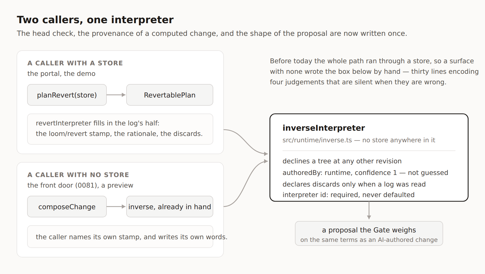

# The undo already in hand

**Routine:** `Loom daily build` (framework) · **Date:** 2026-09-12 (evening run)
**Branch:** `framework-30-the-undo-already-in-hand` · **Section:** §2 — the change
pipeline, §4c — the data seam

## Before anything else: the migration in my brief is done, and has been since 19 August

My brief still opens with the one-application migration as *the next unit*, above
everything except maintainer review comments. It landed on 19 August.
`apps/loom` is on `main` with `(marketing)`, `(docs)`, `(lessons)`, `(portal)`
and `(demo)`; `apps/portal` and `apps/docs` do not exist and no commit in the
tree touches them. Nothing is half-migrated, and nothing is waiting on me for it.

**Three routines are reading these reports to know when they can start. They can
start; they could have started three weeks ago.** This is the third consecutive
framework run to open by re-establishing that, and the second to say so in a
report. I am not filing it again — it is a line in `Needs your input` on the pull
request, where the fix is one edit to a stored prompt.

## What shipped

Two units, both open findings this lane owned, both filed by other lanes.

### 1. A surface with no store can assemble an undo

`Loom marketing` filed it on 5 September: *a stateless surface can compute an
undo and cannot assemble one.* The front door's **Put it back** runs a real
undo — the inverse the runtime wrote when the change applied, put back through
the same rules — and doing that needed an interpreter the marketing lane had to
write, about thirty lines of it.

The gap was small and precise, which is what made it worth closing rather than
living with. `composeChange` hands back an `inverse` on every applied change, so
a surface that ran the change is holding the undo before anybody asks. What it
was not holding is a *proposal*. The runtime has assembled that since undo
landed — `revertInterpreter` — and only ever for a caller with a store, because
it takes a `RevertablePlan`, and a `RevertablePlan` is a reading of a log. 0081
says the front door is not getting a store, so the path was closed to it.

**`inverseInterpreter(inverse, idFactory, clock)` is now exported from
`@loom/runtime`,** and `revertInterpreter` is that function with the log's half
filled in — the `loom/revert` stamp, the rationale naming the revision and what
it costs, the discards `planRevert` found. The head check that refuses a stale
inverse, the `authoredBy: "runtime"` and confidence of 1 that keep calibration
honest, the conditional `discards`, and the shape of the proposal are one
implementation instead of two. Recorded as
[0137](../decisions/0137-an-undo-already-computed-is-assembled-by-the-runtime-and-stamped-by-its-caller.md).

**The interpreter id is required and has no default**, which is the one decision
the finding asked to be made deliberately rather than inherited. `REVERT_INTERPRETER`
means *this came off a log*; `(demo)/_lib/undo.ts:100` reads exactly that stamp
to decide whether a record is an undo. A default would let a surface inherit a
claim it cannot make, on the pages whose argument is that provenance is worth
something.

It lives in `src/runtime/`, not `src/write/`. `write/` is a separate entry point
because its operations need a store; this one does not, and a stateless surface
reaching for it should not import one to get it.

**The deletion in `(marketing)` is not done here.** That file is the marketing
lane's, so the finding is closed with the replacement snippet filed back to them.
Thirty lines, one import.

### 2. A data fault says which fault it is

Two findings from `Loom lessons`, both filed 3 September while writing lesson 18,
both closed together because they are the same complaint about the same seam:
*the message reaches the reader who is least equipped to guess.*

**`no-such-source` was two different faults under one code.** `buildDataResolution`
synthesised it for a planned binding with no answer in the map — which is a
caller that resolved a different plan than the one it is rendering — and the
sentence that came out was *"no source is registered for it — this binding was
never resolved"*, two clauses contradicting each other. The two are different
work for different people: an unregistered source is fixed in the registry, and
this is fixed in the composition root. **`not-resolved` is now a seventh reason**
with its own sentence, *nothing resolved it — …*, and the `describeDataUnavailable`
switch is exhaustive so the compiler pointed at the one place that needed it.

**A misdeclared source id got Zod's default.** `sourceIdSchema` declared no
message, so a render diagnostic read `bio.source: Invalid` — while the identical
mistake made at *registration* time was described properly, to a reader who has
the code open. The asymmetry ran the wrong way. `SOURCE_ID_EXPECTATION` and
`BINDING_NAME_EXPECTATION` are now the messages on the regexes, and
`describeDataRegistryError` reads the same constant, so the two agree by sharing
one string rather than by being written twice — which is what the finding asked
for and is the part that stays true.

## Unspecified decisions, and why they went this way

**Where `inverseInterpreter` lives** — `src/runtime/` over `src/write/`. Argued
in 0137 and above. The finding said "export from `@loom/runtime`" and the root
index does not re-export `write/`, so this is also the literal reading.

**One decline sentence for both callers.** `revertInterpreter` used to say *the
revert was planned at revision N, and this tree is at M*; it now says *the undo
was computed against revision N*. Same code (`refused`), same fault, one
sentence. This is a user-visible string change and it is the only behaviour
difference in the refactor — flagged here rather than buried, and flagged to
`Loom marketing` too, whose own wording it also replaces. If either lane wants
its own words there, the decline detail becomes a field; nobody has asked yet.

**`not-resolved` over `plan-mismatch`.** The finding offered both. `not-resolved`
describes the state; `plan-mismatch` describes one cause of it, and a code that
names a cause is a code that goes stale when a second cause appears.

**No decision record for the seventh reason.** It applies a standing rule — two
failures with different downstream answers must not share a code — rather than
setting one. Recording every application of a rule is how an index stops being
readable.

## Records

- **0137 added**, Accepted: *An undo already computed is assembled by the runtime,
  and stamped by its caller.*
- None superseded. `pnpm decisions:index` regenerated; it notes 0131–0135 as
  claimed on unmerged branches, which is expected — #264 and #266 hold two of
  them.

## Findings

**Closed (3 findings, 5 copies):**

| filed | by | entry |
| --- | --- | --- |
| 5 Sep | `Loom marketing` | a stateless surface can compute an undo and cannot assemble one |
| 3 Sep | `Loom lessons` | `no-such-source` is two different faults under one code *(2 copies)* |
| 3 Sep | `Loom lessons` | a misdeclared source id gets Zod's default and the registry gets a sentence *(2 copies)* |

**Closed as already done (5 findings, 8 copies)** — the screenshot-harness
entries from `Loom portal` and `Loom primitives` dated 2, 3, 5, 6 and 8
September. `tools/specimen/` has been on `main` since #250 and every one of them
asks for it. They were left open by bookkeeping, and the cost of that is not
zero: this lane has now received the same finding four times, each re-filed
because the open entry still reads as a live request. Closed so it stops.

**Filed (2):**

- for `Loom marketing` — the seam is built, with the replacement snippet and the
  one sentence that changes.
- for `Loom lessons` — lesson 18 says there are six reasons and there are now
  seven, with the four line numbers. **Exercise C still passes and its printed
  output is unchanged**, which I ran rather than assumed: it constructs its six
  failures explicitly through a registry, and `not-resolved` cannot be produced
  that way at all.

**Every copy of every closed finding was closed.** The duplicate-entry hazard the
morning run raised is real and I hit it immediately — three of the five findings
I closed exist twice in the file, byte for byte. Closing one copy and leaving the
other is how a lane gets sent to redo work already on `main`.

## Cross-lane diff, stated

`apps/loom/app/(docs)/_lib/api/reference.generated.json` is regenerated, because
`extract.test.ts` pins it to the runtime's published surface and two new exports
moved it. Same reason and same file as #264 and #266.

**Reading that diff caught two defects in my own change**, which is the second
consecutive run where the generated reference did the catching. Inserting
`SOURCE_ID_EXPECTATION` above `sourceIdSchema` had silently stolen
`sourceIdSchema`'s doc comment — its published summary went to `""`. And the
explanation I had written *inside* the `DataUnavailable` union was being emitted
into the published type signature, twelve lines of prose in what should be one
line of type. Both are fixed; neither would have failed a test, because the test
pins the reference to whatever the generator produces.

## Tests

`pnpm verify` **green, exit 0.**

| | files | tests |
| --- | --- | --- |
| runtime (`src/`) | 128 | 2,092 |
| application (`apps/loom`) | 232 | 3,857 |

Nothing skipped, nothing weakened, no test disabled. New: 8 tests for
`inverseInterpreter` (proposal shape, the caller's stamp, the runtime's grade,
the asker's origin, the declined stale head, and three for what `discards` means
when absent, empty and present); 1 for the `not-resolved` sentence and 1 that it
is not the `no-such-source` sentence; 2 that the schemas say what they expected
rather than `Invalid`. The 21 existing `revertInterpreter` tests pass unchanged
against the refactor, which is the evidence the extraction preserved behaviour.

The diagram above was rendered and read before shipping, and that caught a line
overflowing its box and an arrow crossing a text block — neither visible in the
source.

## Open questions

1. **The decline sentence.** One string now serves both callers. If a surface
   needs its own words when an undo no longer fits the page, that is a field on
   `ComputedInverse` and it is three lines. Nobody has asked; I have not added it
   speculatively.
2. **`(marketing)` still has its thirty lines** until that lane deletes them.
   Until then the front door's undo and the portal's are two implementations
   again — the seam exists, the second copy has not gone. Not blocking anything.
3. **#230 remains the only thing genuinely waiting on the maintainer** from this
   lane. Twenty-one units, open since 3 September. I am not restating the
   recommendation a twelfth time in its own thread; it is one line on this pull
   request and nothing today depends on it.

## What I did not do

No self-check-in is scheduled and nothing is armed. This run ends here.
