
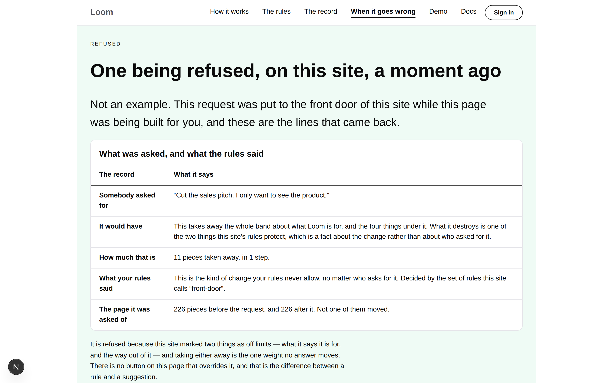





# 2026-09-12 — marketing: the four endings that leave your page alone

Six pages, and every one of them is about a change that **worked**. `/` shows one
happening. `/how-it-works` walks one from the request to the record.
`/the-rules` is what you decide in advance, `/the-record` what you are left
holding, `/what-you-run` the shape of the thing, `/your-components` what you hand
it.

The reader this project's recorded positioning names — somebody who cannot ship
un-reviewed AI output because they answer to a client, a regulator or a board —
reads all six and asks the only question they were ever going to ask: **and when
it doesn't?**

The answer is the best one this product has and the site was not making it.

---

## What shipped

`/when-it-goes-wrong`, the seventh page, on a branch of its own.

**A request to change a page can end five ways, and exactly one of them touches
the page.** That is not reassurance and it is not a claim about how careful
anybody was — it is the shape of `@loom/runtime`, and the page reads it off the
runtime rather than restating it.

### The endings are the runtime's list, not a copy of it

`COMPOSITION_OUTCOME_KINDS` publishes the five and their order. Its own note in
`pipeline.ts` names, in as many words, the reader this page turned out to be —
*"a surface explaining what a host must handle"* — and observes that such a
reader keeps its own copy, because a `switch` is exhaustive at compile time and
enumeration has no answer.

So the page keeps one, and `endingsOf` holds it to the original **in both
directions**:

| the machinery's name | what the page calls it | your page afterwards |
| --- | --- | --- |
| `applied` | It happened | **changed** |
| `awaiting-confirmation` | It waits for you | exactly as it was |
| `rejected` | It is refused | exactly as it was |
| `not-interpreted` | Nothing came back | exactly as it was |
| `not-applicable` | It no longer fits | exactly as it was |

An ending nobody has written a sentence for throws while the page is being
built. A sentence for an ending the runtime no longer has fails a test. A sixth
way to end is a page that does not publish, rather than a page that goes on
saying *five* — and the hero's *four of them* is counted off the fourth column,
not typed.

That is the 9 September lesson in a third place: a fact the code held and the
page could not reach was a fact the page eventually contradicted.

### All five are exercised, not four asserted and one taken on trust

Three come back through choices the front door already offers. The fourth comes
back from a choice with nothing to change. **The fifth is the interesting one**
— *it no longer fits* — and it is produced the way the page says it happens: a
change is worked out against the page as it stood, a different change lands on
that page, and the first is then confirmed against the page that has moved. The
runtime answers `not-applicable`. Nothing is stubbed and no revision number is
edited by hand.

That ending is the failure nobody expects and the one that quietly ruins things
elsewhere — a change worked out ten seconds ago, applied to a page that has
moved, produces a page nobody wrote and nobody asked for.

### The refusal, run on the page rather than described

Every sentence above that band is a sentence, and a sentence about refusing
things is the cheapest sentence in the industry. So the band spends the one asset
this surface has that a description of it does not: the request is put to **the
front door as this site publishes it**, while the page is being built, and the
lines that come back are printed.

The last row is the claim: **226 pieces before the request, and 226 after it.**
Both counted off the two trees — the page the request was handed, and the page
the sequence gave back — rather than asserted.

It is the front door's own fifth button, so a visitor arriving from `/` is
watching the same refusal opened up rather than a second one arranged to be more
convincing.

### And the fifth ending, which the page would be dishonest without

Four endings leaving a page alone says nothing about the fifth, and a page that
stopped at the four would be making its case by leaving out the only case that
costs anybody anything. The last band is a change that landed and was wrong: you
can tell it happened, you can tell who asked, and you can put it back — and
putting it back is a change like any other, weighed and recorded, so the record
has no gap where somebody undid something.

## The bar: Home came off so that this could go on

The last two reports flagged this and both said the judgement had been made
alone. The bar was at the eight items the maintainer asked about on **#166**, and
two pages were already off it. A seventh page was about to make that three.

**`HOME.inMenu` is now `false`, and the count is unchanged at eight.** The bar's
left-hand end is a `loom.logo` carrying `/`, on every page, in the place every
site a visitor has ever used puts the way home — so *Home* beside it was the same
destination offered twice, spending one of eight slots to do it. Supabase,
Vercel, Stripe and Linear all do exactly this.

The guarantee `inMenu: false` has carried since 8 September holds unchanged:
what the bar leaves out, the footer's map carries, marked as the page the reader
is on. The one thing genuinely lost is the underline on `/` — a menu item can say
*you are here* and a wordmark cannot.

**This is the third page off the bar and that is a bad answer to a real problem.**
The good answer is a bar that groups, and `loom.nav` cannot: it takes a flat run
of `loom.link` children and nothing in the library can open. Filed for
`Loom primitives` rather than worked around. See the PR comment.

## An hour spent fixing a defect that was not there

Worth the space, because the method is the thing this lane has been getting right
and it produced a confident false positive.

The hero offers *See one refused, here*, pointing 2,400px down the page. Clicked
in a browser, it appeared to do nothing. The diagnosis was plausible: this site
keeps the palette in the URL, a reader on the default palette is served the bare
path, so `…?theme=minimal#refused` is a *different address* and the browser
navigates instead of jumping. A `selfHref` was written to omit the palette when
it is the default.

**`pages.test.ts` failed it immediately, on both palette pairs, and was right
to.** On one palette the link had a query and on the other two it did not —
markup below the root differing under a re-theme, which is exactly what
[0049](../decisions/0049-a-theme-is-three-ids-in-the-tree.md) forbids, and the
one difference `withoutPaletteNames` cannot normalise, because it normalises the
palette's *name* rather than the parameter's absence.

**The measurement was the defect.** The scroll was read 900ms after a click that
triggers a full document load in a development build — before the load had
finished. Waited for properly, every combination of entry address and link form
lands the band at the top of the viewport, on every palette, with the ordinary
`internalHref` the rest of the site uses. The link had never been broken.

Both halves are in `FINDINGS.md`. The second is the one that generalises: **a
generic per-route assertion refused a real regression, for a defect that did not
exist, before a reviewer saw it.** That is twice this week — the palette inside a
measurement on 11 September, and this.

## Tests

`pnpm install && pnpm verify` — **green, exit 0. Nothing failed, nothing skipped,
no test weakened or deleted.**

| suite | before | after |
| --- | --- | --- |
| `@loom/runtime` | 2052 / 124 files | **2052 / 124 files** — `src/` was not opened |
| `@loom/app` | 3857 / 232 files | **3922 / 233 files** |
| marketing, within it | 1145 | **1210** |

Baselines measured on `main` at `140f150` rather than quoted from the last
report, whose numbers are four merges stale.

Sixty-five new assertions, in one new file. **Two existing tests were widened,
not relaxed:** the off-the-bar lists in `what-you-run.test.ts` and
`your-components.test.ts` now read `[HOME, WHAT_YOU_RUN, YOUR_COMPONENTS]`, still
exact, so a fourth page leaving the bar still fails there and still has to be
argued for.

Everything is asserted against the **rendered page**, never against the module
that builds it.

### Mutations

| mutation | result |
| --- | --- |
| an ending renamed so the runtime's list has one the page does not | **20 failed** — the page refuses to build, which is the guarantee |
| a refusal declared to change your page | **2 failed** — the sequence says otherwise |
| the endings table split into three columns | **1 failed** — the column pinned |
| the fifth-ending band softened to *"Everything else is handled for you"* | **1 failed** |
| the after-count replaced with a wrong literal | **1 failed** |
| both counts replaced with equal wrong literals | **1 failed** |
| the after-count replaced with a literal **equal to today's true count** | **survived** |

The last one is reported rather than papered over. A literal that happens to
equal the real number is indistinguishable from the computation at a single
point; what the suite does guarantee is that the number is held to the front door
as built, so the literal goes red the moment that page changes. An assertion
pinning `piecesAfter` to the tree `runAsk` returned — rather than only to the
count above it — was added after the mutation, and is what kills the
equal-but-wrong pair.

## Decisions and findings

**No record written.** The change is compositional, adds nothing to the library,
constrains nothing outside this lane and touches no Accepted record. `src/` was
not opened, no other route group was touched, no primitive was added, and no
colour is named in the diff.

**Three filed:** the bar that cannot group, for `Loom primitives`; the hour spent
on a defect that was not there, for the method; and the font allowlist, restated
rather than re-filed.

**None closed.** Nothing owned by this lane was open.

## Open questions

- **The licence line** (#96, on every marketing PR since #134). Still the site's
  one placeholder and still the Phase 2 gate. Untouched.
- **Positioning, audience and pricing.** Untouched, as on every run. This page
  came nearer than most — its whole argument is aimed at the audience the rollout
  names, people with something to lose — and it says nothing about who they are.
  Every claim on it is about what the code does.
- **Three of seven pages are now off the bar.** See the finding and the PR
  comment.

## How it looks

Three palettes, and the phone.

`scrollWidth` is exactly 1440 at 1440 and exactly 390 at 390.

**The endings table is two columns because three does not fit, and it was built
both ways to find out.** The obvious shape is a short bold handle, then what
happened, then the answer. At 390px that comes to 369px inside a 284px wrapper,
which puts *Your page afterwards* — the one column the band exists for — behind a
sideways push. Two columns come to 284 with nothing to scroll. The cost is a row
heading carrying a whole sentence, which on a phone is a column of solid bold:
a worse-looking band and a better-reading one. A test pins the width so the
improvement cannot be made back.

The front door, with `Home` off the bar:

Every screenshot is in the fallback face rather than Geist, as every set this
lane has published has been. See the font finding.

Nothing scheduled and nothing armed.
