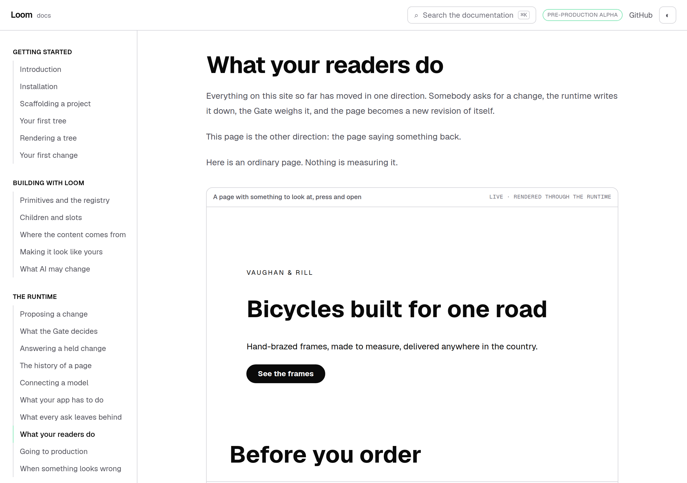
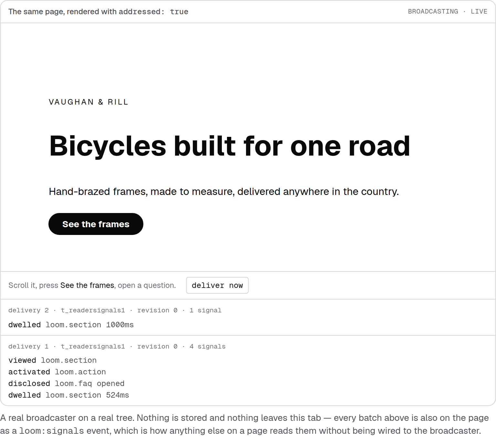
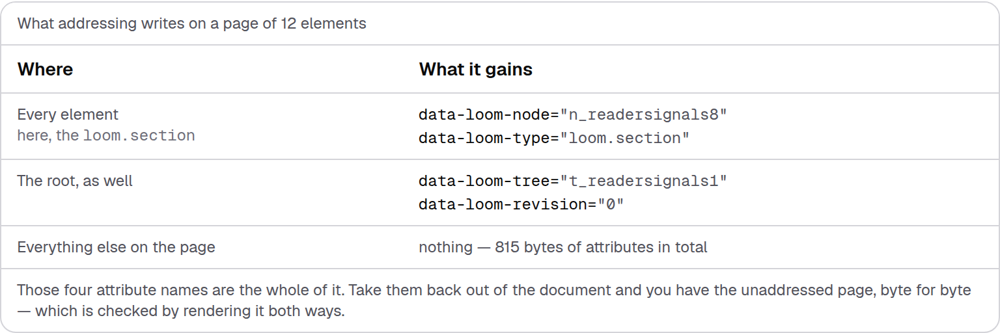
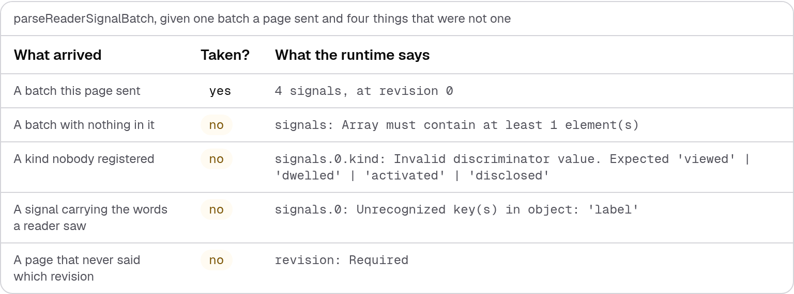
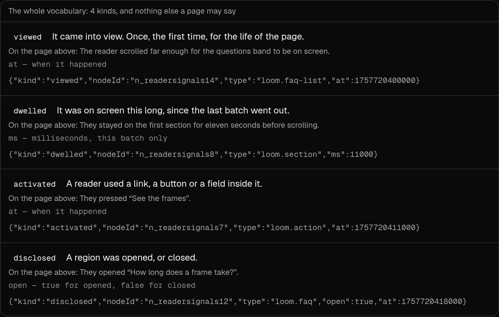
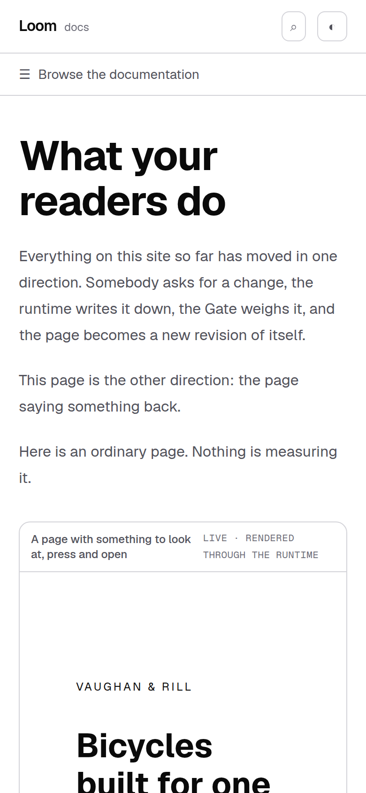

# 13 September 2026 — what your readers do

**Routine:** `Loom docs` · **Branch:** `docs-23-reader-signals` · **Section:** §4c

The maintainer filed a finding yesterday: reader signals shipped with 0136, they
appear in the generated API reference, and nothing anywhere tells a host how the
pieces fit. That outranks the plan, so that is the whole of this run.

Twenty-five pages taught a reader to build a page, change it, review the change,
read its history, ask somebody's database for its contents and take it to
production. Every one of them is about the page changing because **somebody
asked**. Nothing on the site said a published page can say anything back.

## What shipped

**One page — *What your readers do*** — under *The runtime*, between *What every
ask leaves behind* and *Going to production*. Both of its neighbours are about
what gets written down; this is the one where the writing starts on the page
rather than in a request.

It covers, in this order: what a signal is and what the four kinds are, what a
signal does **not** carry, the two steps that turn it on, which of the two entry
points to import from and why, a live broadcaster the reader can drive, choosing
kinds and types, parsing a batch back at your own endpoint, and the four things
this seam does not do yet.

## The block I would keep if only one survived

Everything else on this page is produced on a server. This one cannot be — a
broadcaster's entire subject is a browser with somebody in front of it — so the
page carries a **real broadcaster running on a real addressed tree**, imported
from `@loom/runtime/signals/broadcast` exactly as the callout above it tells the
reader to import it.

Driven the way the page tells a reader to drive it:

`dwelled loom.section 524ms` is 524 milliseconds somebody's tab was actually
open. Nothing on this site has previously been able to show a browser-side seam
working; the alternative was a code sample and a paragraph of description, which
is the unfalsifiable shape §4c's registry rule exists to prevent for trees and
had no equivalent for behaviour.

Six tests drive it in jsdom, including the one that matters most: pressing
something the configuration did **not** ask about, and asserting that no batch
mentions it. A broadcaster reporting everything would pass the other five.

## The claim a reader is most entitled to disbelieve

That addressing a page costs nothing but attributes.

**815 bytes across twelve elements**, and the four attribute names are the whole
of it. The pass/fail line under the table is not "did it write the four" but
"did it write **only** the four" — the same bag serves edit mode, which means a
great deal more than identity, so a fifth key appearing there is a change to what
a published page discloses and would otherwise arrive silently.

The other half of that claim — that stripping the attributes back out gives the
unaddressed document byte for byte — is held by `addressing.test.tsx`, which
renders both ways in jsdom. The two halves agree to the byte: the producer
computes 815 from the attribute strings, and the rendered diff is 815.

## The section the page is written around

*What a signal does not carry*, and it is written around a refusal rather than a
promise:

A signal with the **label of the button on it** is refused — the whole batch,
with the offending key named — not quietly trimmed. That is what makes "a signal
carries no content" a property of the runtime rather than an assurance on a
documentation page, and it is `parseReaderSignalBatch`'s real answer to a real
input rather than a table somebody typed.

The four kinds are likewise walked out of `READER_SIGNAL_KINDS`, so a fifth kind
added to the runtime fails the page — naming the kind — rather than quietly not
appearing on a page that says there are four.

## Decisions taken that were not specified

**The example tree is a bicycle workshop with two sections, a call to action, a
link and two questions.** Not arbitrary: the four kinds are two about a node
being on screen, one about a target a reader aims at, and one about a region that
opens. A tree of three paragraphs can demonstrate half of them. It is registered
in the examples catalogue like every other example, so it renders under the
catalogue's no-diagnostics test, and the same tree appears twice on the page —
once ordinarily with its propose box, once addressed and broadcasting.

**Every signal's node id is looked up from the tree rather than written down.**
The first draft had them typed, and the producer refused them, because the ids I
guessed were not the ids the factory makes. Filing a signal against a position
that no longer exists is the exact failure 0136 was written to prevent, and it
would have been an embarrassing one for its own guide to ship.

**The page states its own limits in a section.** Three of the four are open
findings owned by other lanes. A guide that implied the seam was finished would
cost a reader more than one that says a broadcaster only watches the nodes that
were there when it started — so four claims-tests hold those sentences, and the
page cannot drift towards optimism without going red.

## Two findings, and one of them changed the page

**The screenshot harness cannot photograph a block that only exists once you
press it.** `pnpm shoot` has no way to do anything before the shutter and no way
to photograph one element. The live block through the harness is a correct
picture of a component with nothing to say. This run wrote about forty lines of
Playwright in `/tmp` to press the button, open a question and photograph the
figure — so the best image in this report is the one the harness did not take.
Filed for `Loom daily build` with a proposed shape: a `do` list of steps and a
`clip` selector. Not urgent, and it is the private-harness drift 0117 was written
to stop, reappearing.

**Next refuses `react-dom/server` in a Server Component, and that improved the
page.** The first version rendered the tree twice and diffed the HTML. `pnpm
verify` was green through typecheck and 4,064 tests and failed at `next build`.
The fix split the claim in two — what addressing *writes* asked of the function
that writes it, on the server; what it *does not disturb* proved by a real render
in a `.test.tsx` — which is a better arrangement than the one it replaced. Filed
against this lane as the shape the next browser-seam page should start from.

## Tests

`pnpm install && pnpm verify` at the repository root, **green, exit 0**.

| Suite | Files | Tests |
| --- | --- | --- |
| `@loom/runtime` | 142 | 2,378 passed — `src/` was not opened |
| `@loom/app` | 243 | 4,064 passed |

Baseline on `main`, measured by stashing this branch and running the same suite:
**239 files, 4,021 tests, all passing**. So this branch is **+4 test files and
+43 tests**: 16 on the producers, 14 holding the page's prose against them, 5
rendering the tree both ways, 6 driving the live broadcaster, and 2 the existing
suites gained from the new example.

Nothing was skipped, no cap was raised, and no test was weakened. Two tests went
red on the first full run and both were right to:

- `compiled.test.ts` caught that I edited a paragraph after generating the fence
  programs, so the line numbers in the generated program named the old page.
- The claims test caught that the page never actually writes the word
  `disclosed` — it said "disclosures" — which a reader matching prose against
  the JSON below it would have had to bridge themselves. The page was fixed
  rather than the test.

Four claims were verified by mutation, because a test that has never failed is a
claim rather than a check:

- **Pointing the live block's `disclosed` at `loom.card`** fails the claims test
  that reads its configuration *and* the jsdom test that opens a question. Two
  tests, and nothing else.
- **Reordering the read-back table** so the content-carrying signal is no longer
  fourth fails *has the content-carrying signal fourth*, which is the test that
  holds the sentence "the fourth row is the interesting one".
- **Dropping `addressed: true` from the render** makes the producer throw where
  it asserts that addressing did something, taking the whole producer suite with
  it rather than printing a table of zeroes.
- **Inventing the node ids** — the first draft — fails at the producer, naming
  the field the schema rejected.

## Dark and 390px

`document.documentElement.scrollWidth` is exactly 390 at a 390px viewport and
1280 at 1280, in both themes. The blocks that could overflow are the JSON in the
kinds table, the batch, and the code fences; each scrolls inside its own box.

## Scope

`apps/loom/app/(docs)/` only. Eleven files added — one of them generated, four of
them tests — and two changed, which are `_lib/nav.ts` gaining a page and
`_lib/examples/catalogue.ts` gaining an example. **No file in another lane was opened**, `src/` was not
opened, and the generated API reference was not regenerated because the runtime's
surface did not move.

The four produced blocks are docs-site furniture in 0067's sense, like every
other generated table here. The live block is the one thing on this site that is
neither furniture nor an ordinary example: it is a `LoomTree` through the runtime
with a second piece of the runtime attached to it. **No primitive was needed and
none is missing.**

## Open questions

**Nothing stores these, and the page says so.** Where batches live, how they are
aggregated, how long they are kept and how a signal becomes a proposed change are
all explicitly undecided in 0136. Recommendation: none of it from this lane — but
the page that would follow this one is *reading a page's own signals back*, and
it wants a store first.

**The pipe has one end.** The runtime has been able to weigh a `system-signal`
intent since §2 and now has something that could produce one, and nothing joins
them. That is the sentence this page most wants to be able to delete from its
"does not do yet" section.

**What I would write next.** This page and *Where the content comes from* both
end at the same wall: a page whose content is not in the tree, and now a page
that reports on itself, with nothing on the site about what a **proposal** looks
like against either. A reviewer opening a diff for a node whose words were never
in the revision is a page nobody has written, and it is the last big gap in
*The runtime*.
