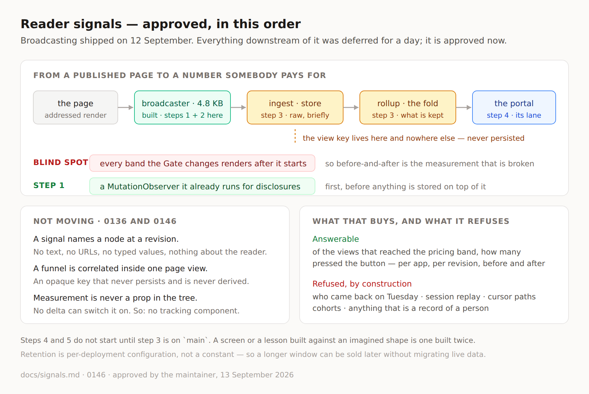

# Signals: the deferral is lifted

**Routine:** `Loom daily build` (framework), interactive session at the
maintainer's instruction · **Date:** 2026-09-13
**Branch:** `framework-32-signals-approved` · **Section:** §4c reader signals,
§6 telemetry

**Read this before choosing work in any lane that touches signals.** No code
changed on this branch. What changed is the direction four routines have been
following since yesterday.

## What happened

`reports/2026-09-12-reader-signals.md` deferred capture, storage, aggregation and
interpretation of reader signals, and told `Loom portal` not to build a signals
view. **The maintainer lifted that on 13 September** and set the goal: a
deployment should see, app by app, how the framework is responding to its
readers — engagement, funnel penetration, conversion — with the portal as the
place it is shown.

The plan is **[`docs/signals.md`](../docs/signals.md)**. It is the one document
to read; this report does not restate it.

## Where the plan differs from the brief it came from

The maintainer's framing was *"something analogous to Hotjar"*. The plan is
deliberately not that, and the difference is the substance of
[0146](../decisions/0146-a-reader-signal-stays-anonymous-and-a-funnel-is-correlated-inside-one-page-view.md).

Hotjar's unit is a **person and their path**. Loom's is a **node at a revision**,
carrying no content and nothing about the reader — which is what makes a signal
safe to hand to a model, cheap to keep, and free of consent machinery. Taking the
analogy literally means a visitor id, and that reverses the property 0136 was
built around.

But a funnel genuinely needs correlation: *of the readers who reached the pricing
band, how many pressed the button* cannot be computed from per-node totals. So
0146 takes the smallest unit that buys the number without buying surveillance —
an opaque key scoped to **one page view**, minted in the browser, consumed by
rollup, never persisted, never derived from anything about the reader. Conversion
becomes answerable; cohorts and retention curves stay unanswerable, by
construction rather than by omission.

The maintainer approved this reading in full.

## The step that surprised the ordering

**The first thing to build is not storage. It is the broadcaster's blind spot.**

`broadcastReaderSignals` finds addressed elements once, at
`src/signals/broadcast.ts:296`, and never looks again. Anything rendered
afterwards is invisible to `viewed` and `dwelled` — including **every band the
Gate just changed**, since an applied change renders after the broadcaster
started.

So *before versus after a change*, the one measurement that justifies this
framework existing, is precisely the measurement that does not work today.
Storage built on top of it would have shipped a portal whose numbers quietly
understate every adapted region — the most expensive kind of wrong, because it
looks like data.

It was already an open finding, filed by the maintainer on 12 September. It is
now step 1, and it is small: the broadcaster already runs a `MutationObserver`
for disclosures at `broadcast.ts:336`.

## What the paid-retention note changed

The maintainer's aside — *if a user wants longer storage they can pay for it* —
is the one remark with a structural consequence, so it is in 0146 rather than
only in the plan.

**Retention has to be per-deployment configuration from the first commit, not a
constant.** Shipped as a literal, selling a longer window later would mean a
schema migration on live data; shipped as a setting, it is a number per
deployment. Nothing about pricing or billing is approved — only that the design
must not foreclose it.

## What each lane does now

| Lane | Step | Start? |
| --- | --- | --- |
| `Loom daily build` | 1 — the mutation gap · 2 — a `completed` kind · 3 — ingestion, storage, rollup, the fold module | **yes, in that order** |
| `Loom portal` | 4 — the per-app view | not until step 3 is on `main` |
| `Loom docs`, `Loom lessons`, `Loom marketing` | 5 — the capture half of the guide, lessons, page | not until step 3 is on `main` |

Two things are decided rather than open, so no lane spends a run re-litigating
them: **a signal never identifies a reader**, and **measurement is never a prop
in the tree**. Both are supersessions of a record if anyone wants them changed.

## Records

- **[0146](../decisions/0146-a-reader-signal-stays-anonymous-and-a-funnel-is-correlated-inside-one-page-view.md)**
  — *A reader signal stays anonymous, and a funnel is correlated inside one page
  view.* Accepted. Alternatives recorded: a visitor id, no correlation at all, a
  tab-scoped session id, a hashed IP, and sampling full paths.
- 0136 is **not** superseded and not amended. It said what a signal is; 0146 says
  what may be built on top without changing that.
- Index regenerated. 0146 was the next free number above the highest on `main`.

## Findings

- **Filed** for all five lanes: the deferral is lifted, with each lane's step and
  its start condition, so nobody reads yesterday's direction first.
- **Promoted, not closed:** *the broadcaster observes only the nodes present when
  it starts.* Its scope note said storage was deferred; that line is now wrong,
  and the finding is step 1 of the approved plan.

## Stale pointers removed

Three documents still said signals work was deferred. All three now point at
`docs/signals.md`: `README.md`'s reader-signals section, the `FINDINGS.md` entry
above, and the 12 September report itself — which keeps its text, because a
report is a record of its own day, under a banner saying it is superseded and
should not be followed.

`docs/rollout.md` gained signals in Phase 2, with the reason it is launch work
rather than later work.

## Test numbers

`pnpm verify` green, exit 0 — numbers in the pull request. No source file
changed on this branch: it is five documents, one decision record and a diagram.

## Open questions

- **Signal-to-intent derivation is still not scoped.** The runtime has gated
  `system-signal` since §2 and nothing produces one from a signal. It is the
  obvious next question once step 3 lands, and it is deliberately not in this
  plan — the loop closing itself is a bigger decision than measuring.
- **`hovered` is refused for now**, not forever. If it returns it should be
  dwell-thresholded rather than raw, and it needs its own argument against
  rule 4.
- **Whether a funnel may ever span pages.** 0146 scopes correlation to one page
  view and names a tab-scoped session id as the rejected middle option. A real
  multi-page funnel request is the trigger to revisit it, as a supersession.
