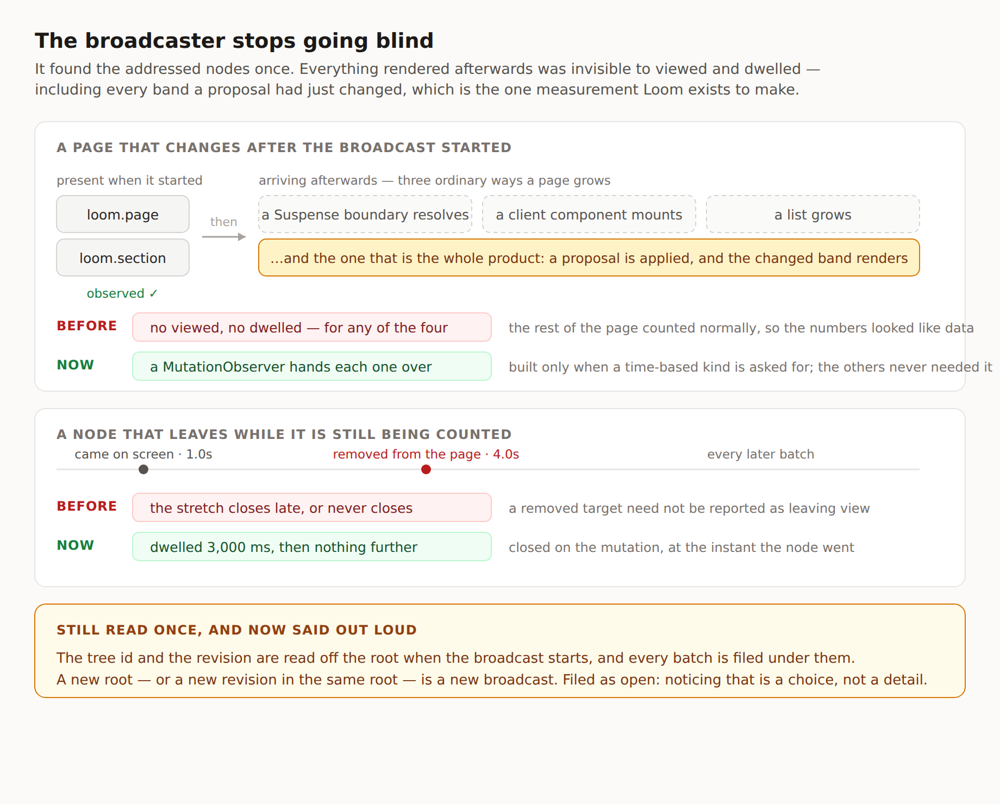

# The broadcaster stops going blind

**Routine:** `Loom daily build` · **Date:** 2026-09-13 (evening run) ·
**Section:** §4c, reader signals · **Branch:**
`framework-33-the-broadcaster-stops-going-blind`

## Before anything else: the migration in my brief was finished on 19 August

My standing brief still opens with the one-application migration as "your next
unit", above everything except maintainer comments. It is done and has been for
twenty-five days: `apps/loom` exists with `(marketing)`, `(docs)`, `(lessons)`,
`(portal)` and `(demo)`; `apps/portal` and `apps/docs` are gone; the report is
[`reports/2026-08-19-framework-one-application.md`](2026-08-19-framework-one-application.md).
Nothing is half-migrated and no routine is blocked on it. I mention it because a
fresh session reads that paragraph first every twelve hours and has to spend a
few minutes proving it stale; the brief is the maintainer's to edit, not mine.

## What shipped

Step 1 of [`docs/signals.md`](../docs/signals.md) — the plan approved this
afternoon and still open as [#288](https://github.com/jam-overture/loom/pull/288).

`broadcastReaderSignals` found the addressed elements under its root once, when
it was called, and never looked again. Anything rendered afterwards was invisible
to `viewed` and `dwelled`: a band behind a Suspense boundary, a region a client
component mounts after hydration, a list that grows — **and every band a proposal
had just changed**, because an applied change renders after the broadcaster
started.

That last one is why this was step 1 rather than a tidy-up. *Before versus after
a change* is the measurement the framework exists to make, and it was the single
measurement that did not work. Worse, it failed quietly and selectively: the
unchanged parts of the page counted normally, so what a portal would have shown
is not "no data" but a set of numbers that understate exactly the adapted
regions. Storage built on top of that would have shipped confident wrong answers.

### What it does now

A `MutationObserver` on the root, watching `childList` with `subtree: true`.

- **Arrivals.** Every added element, and every addressed element under it, is
  handed to the visibility observer — so a subtree that appears whole is
  registered whole, not just at its outermost node.
- **Departures.** A removed node's open dwell stretch is closed at the instant it
  left, by telling the ledger directly. This is not left to the visibility
  observer on purpose: a removed target is not guaranteed to be reported as
  having gone out of view, and where it is reported it is reported late. A
  stretch that is never closed is time a reader keeps being credited with in
  every later batch.
- **Nothing when nothing needs it.** The observer is built only when `viewed` or
  `dwelled` is among the host's kinds. `activated` and `disclosed` are delegated
  from the root and already reach a node that did not exist when the broadcast
  began; they never had this problem and do not pay for the fix.

Re-entry behaves: a node taken out and put back is `viewed` once, because the
ledger's `seen` set is per-node for the life of the page, not per-observation.

### The half that was documented rather than fixed

Closing the blind spot to *nodes* leaves the blind spot to *pages* open. The tree
id and revision are still read once, off the root, and stamped on every batch. A
host that re-renders a new revision into the same root, or navigates client-side
without unmounting, goes on filing signals under the revision it left.

The module doc and `broadcastReaderSignals`'s own doc now both say so in as many
words: **a new root, or a new revision in the same root, is a new broadcast.**
That is what step 1 scoped, and it is honest, but it is still a rule a host has
to have read rather than something the code notices. Filed as open — see below.

## Unspecified decisions, and how they went

**One observer or two.** `broadcast.ts` already runs a `MutationObserver` for the
disclosure attribute. Adding `childList` to its config would have been one
observer instead of two. I used a second, named for what it watches, because the
two have nothing to say to each other and a combined callback would branch on
`mutation.type` on its first line. The browser delivers filtered records either
way, so the cost is one object, and only for hosts asking for a time-based kind.

**Where a departure is recorded.** I considered trusting the visibility observer
to report a removed element as no longer intersecting, which browsers usually do.
"Usually" is the problem: it is not guaranteed, it is asynchronous where it
happens, and the failure mode is unbounded dwell rather than a missing signal. A
ledger call on the mutation is exact and idempotent — `left` on a node not on
screen is a no-op, so a later observer report costs nothing.

**Step 2 was not attempted.** See *Findings*.

## Records

**None added, and none superseded.** This implements a step of a plan that is
already recorded: 0136 defines reader signals, and `docs/signals.md` (approved by
the maintainer today, pending as #288) names this as step 1. Nothing here changes
a shape, a vocabulary or a contract, so there was nothing expensive to reverse.

The revision hazard above *will* want a record when it is fixed, because the
choice between re-stamping, stopping loudly, and refusing to care is a contract
change. That is named as an open question rather than decided here.

## Findings

**Closed:** *2026-09-12 — the reader-signal broadcaster observes only the nodes
present when it starts* (filed by `@jonathanbravecredit`). The status names this
branch and says what closed and what did not.

**Filed — `Loom docs`, and it blocks step 2.** `completed` is approved as the
fifth kind, and I could not land it. */docs/the-runtime/what-your-readers-do*
does not merely *count* four kinds, it **argues** four: `page.mdx` carries the
sentences *"Four things, and nothing else."* and *"There is no fifth kind"*, and
`claims.test.ts` asserts both verbatim alongside `READER_SIGNAL_KINDS.length === 4`.
`page.ts` throws by design when a kind has no sentence.

That is the docs lane's tripwire working exactly as built, on the first day
anything tripped it — and it is prose in their voice, not a constant I should
edit around. Adding the kind first would red `pnpm verify` for all four surfaces,
which is precisely the thing I am told not to do. So the order inverts: the page
changes, then the runtime. The finding gives them the three call sites and the
one sentence worth writing, which is what `completed` does *not* mean — the
broadcaster can see that a form was submitted with its constraints satisfied, and
cannot see that a server accepted it.

**Filed — mine, deferred deliberately.** *A broadcaster keeps filing under the
revision it started on.* The three options and why none is obviously right.

## What was touched outside this lane

Nothing. Two files in `src/signals/`, two findings, this report and its diagram.
No primitive, no surface, no app code.

## Test numbers, and what was checked by removing

`pnpm verify`, **exit 0**:

| | |
| --- | --- |
| Runtime | **143 files, 2,420 tests** passed (was 2,415 — five added here) |
| Application | **244 files, 4,139 tests** passed |
| Findings | 605 findings, 0 malformed |
| Prerender | 99 prerendered pages, 750 text junctions, 0 run together |

Nothing failed and nothing was skipped. One build error was hit and fixed on the
way: `for…of` over a `MutationRecord`'s `addedNodes` compiles under the test
environment and not under `tsconfig.build.json`, whose `lib` has no
`DOM.Iterable` — `NodeList` is iterable at runtime and not in those types. The
rest of the file already wrapped `querySelectorAll` in `Array.from`; now this
does too. Worth recording because `pnpm test` alone was green for it.

**The five new tests were checked by removing the fix.** With
`arrivals?.observe(root, …)` commented out, four of the five fail — the arriving
band, the arriving subtree, the departure, and the viewed-once-across-a-move.
The fifth asserts an absence (no visibility observation at all when only
`activated` is asked for) and correctly passes either way.

## Open questions

**1. `completed` is blocked on a docs page, and the order is now docs-first.**
Nothing else is blocked: step 3 does not need `completed`. But if the maintainer
would rather the runtime moved first, the alternative is for one lane to edit the
other's prose, which I did not think was mine to do.

**2. What should a broadcaster do when the revision under it changes?** Three
options, none free: re-stamp itself (silent, and wrong about accumulated dwell),
stop with an error (probably right, changes the contract of a returned
broadcast), or keep saying so only in documentation (today). Worth settling
before step 4, because a portal reading per-revision counters is exactly what a
mis-stamped batch misleads.

**3. My brief's opening paragraph.** As above: twenty-five days stale, and a
fresh session pays for it twice a day.
