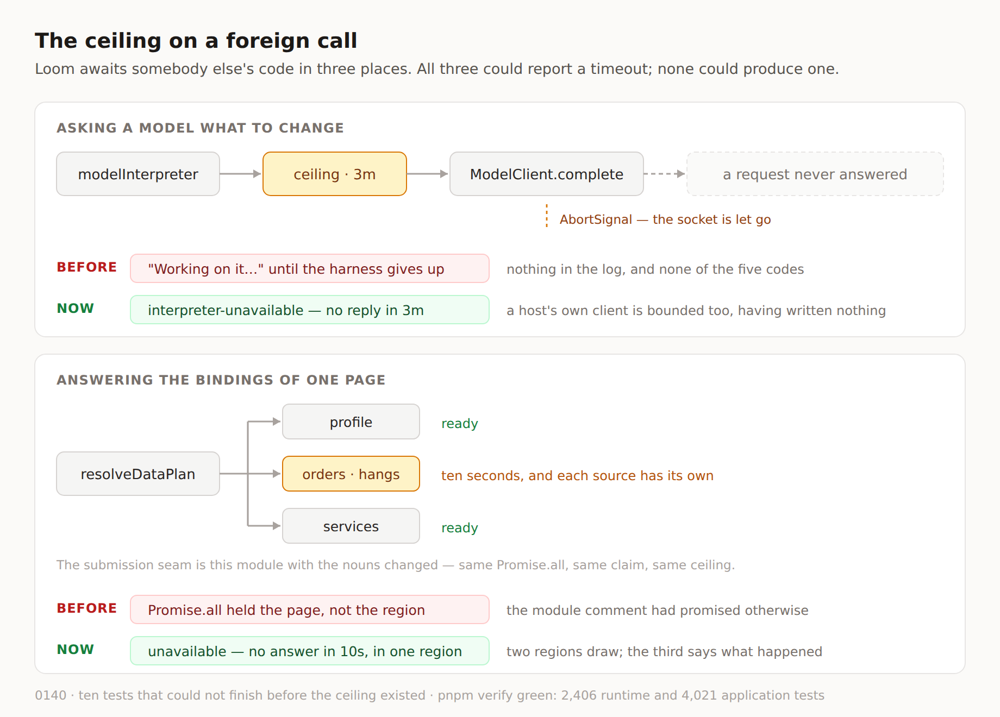

# The ceiling on a foreign call

**Routine:** `Loom daily build` (framework) · **Date:** 2026-09-13
**Branch:** `framework-31-the-ceiling-on-a-foreign-call` · **Section:** §2 — the
change pipeline, §4c — the data seam, §4d — the submission seam



## Before anything else: my brief's headline task has been done for twenty-five days

The brief still opens with the one-application migration as *the next unit*,
above everything except maintainer review comments, and says three routines are
blocked on the shape it produces. It landed on **19 August**. `apps/loom` is on
`main` with `(marketing)`, `(docs)`, `(lessons)`, `(portal)` and `(demo)`;
`apps/portal` and `apps/docs` do not exist anywhere in the tree. Nothing is
half-migrated and nothing is waiting on me for it. The brief also assigns me the
demo, which `docs/routines.md` records as split out to `Loom demo` on 20 August
and which has had its own lane ever since.

This is the fourth consecutive framework run to open by re-establishing that,
and the third to say so in writing. It is not filed as a finding again — the fix
is one edit to a stored prompt, so it is a line in *Needs your input* on the pull
request instead.

## What shipped

One unit: **every await into somebody else's code now has a ceiling.**

Loom awaits foreign code in exactly three places — it asks a `ModelClient` what
to change, it asks a `DataAdapter` to answer a binding, and it asks a
`SubmissionEndpoint` where a form posts. All three seams are careful about
failure. `ModelClientError` has five members, split apart on day 37 so a host is
told which actor has to act. `SourceFailure.unavailable` is documented, in as
many words, as *"a timeout, a dead connection"*, and
`SubmissionFailure.unavailable` as *"a token store that is down, a dependency
that timed out"*.

**None of the three could produce a timeout, because nothing in the runtime ever
stopped waiting.** A call that hangs was not one of the failure modes; it was the absence
of all of them — and it is the only one with no sentence anywhere, which is what
makes it the worst one to be missing. `Loom portal` filed it on 4 September after
losing most of a run to it: the button stuck on *"Working on it…"*, nothing in
the server log, until the harness gave up.

### Three seams, closed by the same twenty lines

**`src/deadline.ts`** is the whole mechanism. `withCeiling` races an attempt
against a timer and answers with the caller's own expiry value; `ceilingOf` takes
a caller's number or the default; `describeCeiling` says a duration the way a
person would. It is dependency-free, and it lives at the root of `src/` beside
`paging.ts`, whose `clampLimit` it borrows its fallback rule from for the same
reason — this number reaches a `setTimeout`, where a `NaN` and a negative both
fire immediately and turn a slow page into an instantly broken one.

**The interpreter bounds every call it makes.** `interpret` and `repair` share
one call path, so both are covered by one change. Three minutes by default,
`ceilingMs` to change it, and an expiry is `{ code: "unavailable", detail: "no
reply in 3m" }` — which `fromClientError` already maps to
`interpreter-unavailable`. No new code, no new mapping.

**The two render-time seams bound each question independently.** Ten seconds by
default, per source and per endpoint. These are the sharper case, because both
`resolveDataPlan` and `resolveSubmissionPlan` have claimed in their own module
comments since they shipped that

> one integration having a bad afternoon costs one region of the page rather
> than the page.

> a token store having a bad afternoon costs the forms on the page rather than
> the page.

`Promise.all` makes both false for a hang: one adapter or one endpoint that never
settles held the entire render. There is a test in this repository called *"costs one region
of the page when one source is down, not the page"* and it passes on `main` —
because *down* there means an adapter that **returns** a failure. Nothing had
ever asked what happens to a page when an adapter simply does not come back. The
answer was: the page does not come back either. The submission seam is the same
module written twice, and had the same hole.

### The half that is not the answer, and matters as much

`ModelCallOptions.signal`, `SourceRequest.signal` and `EndpointRequest.signal`
carry an `AbortSignal` into the implementation, and the Anthropic adapter
forwards it to the SDK. Walking
away from a promise does not stop the work behind it — without this, a deployment
leaks exactly the connections it has already given up on. An implementation may
ignore the signal and the answer still arrives on time; what it loses by ignoring
it is the socket.

### Where the ceiling sits, and why it is not in the adapter

The Anthropic SDK takes a `timeout` in its request options, so
`anthropicModelClient` could have honoured one in four characters. That was
rejected as the whole answer and taken as half of it. The ceiling is enforced in
`modelInterpreter`, above the vendor, because the promise is to a caller of the
interpreter rather than to a vendor: **a host that brings its own `ModelClient`
— which the seam exists to allow — gets the same bound without having written
one.** There is a test for exactly that, using a client that is four tokens long
and knows nothing about ceilings.

The same shape has a second payoff. `(portal)`, `(demo)` and a `(docs)` fence all
build `anthropicModelClient(new Anthropic(…).messages)` and hand it to
`modelInterpreter`. Because the bound is in the interpreter and defaulted rather
than required, **all three are bounded now and not one of their files changed** —
which matters when all three are other lanes'.

## Unspecified decisions, and how they went

**No new reason code, at any of the three.** `unavailable` already means "ask again
later, nobody has to act", which is exactly what an expiry is, and it is what
both seams' comments said a timeout would be. There was a real argument for a
`timed-out` member — a deployment counting *slow* apart from *down* is a genuine
operational distinction — and it lost on cost: two exhaustive
`Record<DataUnavailable["reason"], …>` maps in `app/(docs)/_lib/data/answers.ts`
would have gone red, in another lane's file, to split two states with the same
remedy and the same actor. The detail string carries the distinction meanwhile,
and 0140 names the condition for revisiting it.

**The submission seam was pulled into the unit rather than deferred.** It was
going to be an open question in this report — the sentence was written — and
checking it before writing it down showed `resolveSubmissionPlan` to be
`resolveDataPlan` with the nouns changed, including the module comment making the
promise `Promise.all` breaks. Leaving it out would have shipped a decision saying
*every* await is bounded beside a seam where one is not.

**There is no way to switch a ceiling off.** `ceilingOf` treats `undefined`,
`NaN`, `Infinity`, zero and negatives alike and substitutes the default. A caller
who wants twenty minutes writes twenty minutes, which is a number a reader of the
call site can see; `undefined` meaning *forever* is not.

**Three minutes and ten seconds.** Both are guesses with a reason rather than
measurements, and both are one config field away from being different. The one
datum: this branch's live smoke test against the real API, a full interpretation
at `effort: "high"` and 16,000 max tokens, takes **3.1 seconds**. The ceiling is
roughly sixty times that. A page's ten seconds is already several times longer
than a reader will wait.

**Real timers in the tests, not fake ones.** What is under test is a race, and
the cases are decided by orders of magnitude — a promise that never settles
against five milliseconds. Driving fake timers through a race makes the test
assert the harness's ordering rather than the module's.

## Records

- **[0140](../decisions/0140-a-call-into-foreign-code-has-a-ceiling-and-the-runtime-owns-it.md)
  — A call into foreign code has a ceiling, and the runtime owns it.** Accepted.
  Written with the alternatives that were rejected: the SDK timeout alone, a
  `timed-out` union member, a per-plan rather than per-source budget, leaving it
  to the host, and a `Clock`-driven ceiling.
- Index regenerated. 0140 was the next free number above the highest on `main`
  (0139); the one open pull request, #282, holds 0145.
- Nothing superseded, nothing amended.

## Findings

**Closed, three of them stale rather than done today.** Reading my own queue
found three findings owned by this lane marked `open` whose work is on `main`:

| Finding | Actually closed by |
| --- | --- |
| a preview of a tree loses its theme, and no seam for the words a node shows | #230, 10 Sep — 0121 and 0122 |
| the frame seam cites 0094 eight times and means 0095 | #230, 9 Sep — and 0118 is the check |
| 0095 says no primitive uses the framing seam | #230, 9 Sep — amended under 0099 |

All three landed on the long-running `framework-25-where-the-face-is` branch and
were merged into `main` on 12 September; the status lines were never edited. Each
is now marked with the pull request that closed it and the date it was verified
on `main`. **A finding left open after it is closed is the same cost as one
nobody filed** — the 30 August entry in this ledger is a framework run rebuilding
a unit that had been finished for four days.

**Closed in half.** *A Node server in this sandbox cannot reach the model unless
it is told to use the proxy, and the failure is a hang.* The hang was a framework
defect, not only a sandbox fact, and it is fixed rather than documented. The
entry stays open for its other half: the environment variables, the `pkill`
pattern that kills its own shell, and the two Playwright traps are still a recipe
nobody has written in code, belonging to a shared serve-and-shoot script that has
no owner.

**Filed, one, for `Loom docs`.** *The data seam can now say "the adapter never
came back", and `/docs` has no row for it.* `answers.ts` types `reached` as two
states — *the adapter was never called* and *the adapter answered* — and 0140
adds a third. Its neighbour is more interesting: `WHAT_HAPPENED["unavailable"]`
says *"The query timed out"*, which was aspirational when written, because the
only way to reach `unavailable` was for an adapter to report it and an adapter
that hangs reports nothing. **The page has been describing the timeout since
before the seam could produce one.** It can now.

## What was touched outside this lane, and why

One file: `apps/loom/app/(docs)/_lib/api/reference.generated.json`, regenerated
with `pnpm --filter @loom/app docs:api`. It is a generated file, `extract.test.ts`
fails on a stale one with the command in its own message, and 0139 says a
generated file is resolved by regeneration rather than by hand. The published
surface moved because `src/` gained `deadline.ts` and `hangingModelClient`.

## Test numbers, and what was checked by removing

`pnpm install && pnpm verify`, exit 0, nothing skipped and nothing weakened.

| | |
| --- | --- |
| runtime tests | **2,406 passed**, 143 files — 23 more than `main`'s 2,383 |
| application tests | **4,021 passed**, 239 files |
| findings ledger | 595 findings, **0 malformed** |
| prerender check | 96 pages, 705 text junctions, 0 run together |
| live API smoke test | 2 passed, 3.1s against the real model |

**Ten of the twenty-three do not merely fail without the change — they do not
finish.** Checked by taking the ceiling back out of each seam in turn and running
that seam's file under a hard cap:

```
× a source that does not answer > is reported as unavailable rather than waited out   4007ms
× a source that does not answer > is aborted, so the connection it holds is let go    4002ms
× a source that does not answer > costs its own region and not the page               4005ms
× a model that never answers > reports it as unavailable, naming the ceiling          4010ms
× a model that never answers > bounds a repair as well as an interpretation           4003ms
× a model that never answers > aborts the call it stopped waiting for                 4005ms
× a model that never answers > bounds a client the host wrote                         4005ms
× an endpoint that does not answer > is reported as unavailable rather than waited out 3006ms
× an endpoint that does not answer > costs its own form and not the page              3005ms
× an endpoint that does not answer > is aborted, so the token store is not left holding a connection  3002ms
```

Every one of those durations is the cap, not a measurement: the assertion never
arrives. That is the shape of the defect in one screen — before this branch none
of the ten could be written, because the thing they assert about had no end.

`hangingModelClient` is published from `@loom/runtime/testing` for the same
reason — every surface with a prompt box has an "it did not come back" state to
show, and until now there was no way to reach it except by waiting.

## Open questions

- **Are three minutes and ten seconds the right numbers?** They are defensible,
  not measured. The only real datum is one 3.1-second interpretation. If a
  deployment ever legitimately exceeds either, the ceiling has become a defect of
  its own, and the answer is a config field that already exists rather than a
  code change.
- **Does `unavailable` want splitting?** 0140 records the decision not to, and
  names what would change it: something wanting to count *slow* apart from
  *down*. The telemetry journal is where that question will arrive first.
- **Is there a fourth seam?** I went looking for every `await` into code Loom
  does not own and found three. The store and telemetry adapters are the ones I
  am least sure about: they are host implementations of a Loom interface, same as
  the other three, but they are not on a render path and their failures already
  surface as rejections a caller handles. Left alone rather than swept in, and
  named here so the next run does not have to re-derive the list.
- **`Loom primitives` filed a finding for this lane on #282**, unmerged as I
  write: two palette slots may hold the same colour and a primitive painting a
  gradient between them cannot tell. It is in `src/theme/`, which two findings in
  the ledger have now assigned to two different lanes. Not picked up this run
  because it is not on `main`; it is the first thing in my queue when it lands,
  if it is mine.
