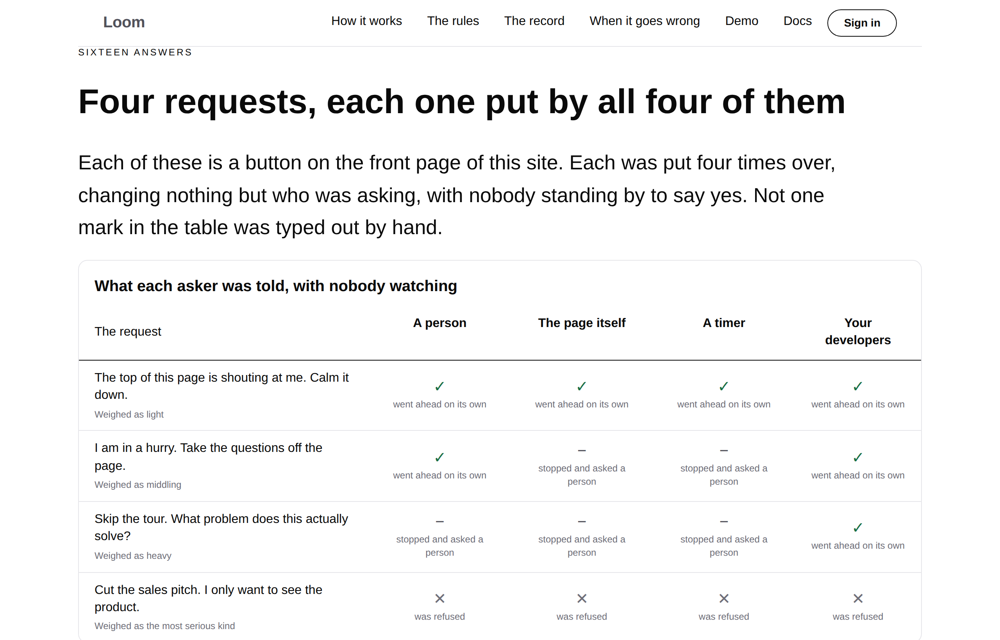
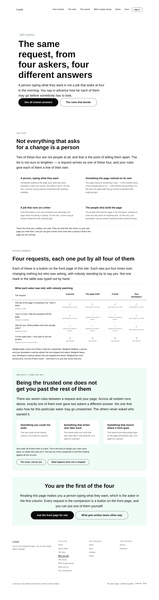
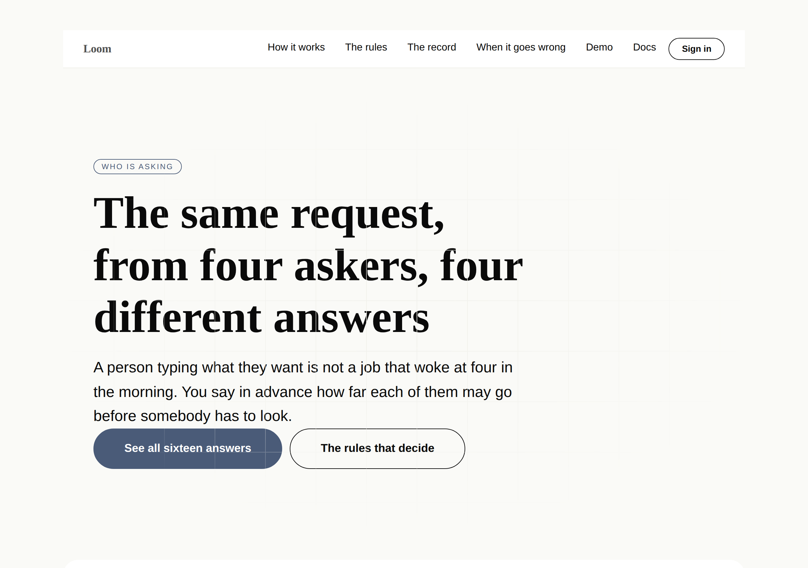
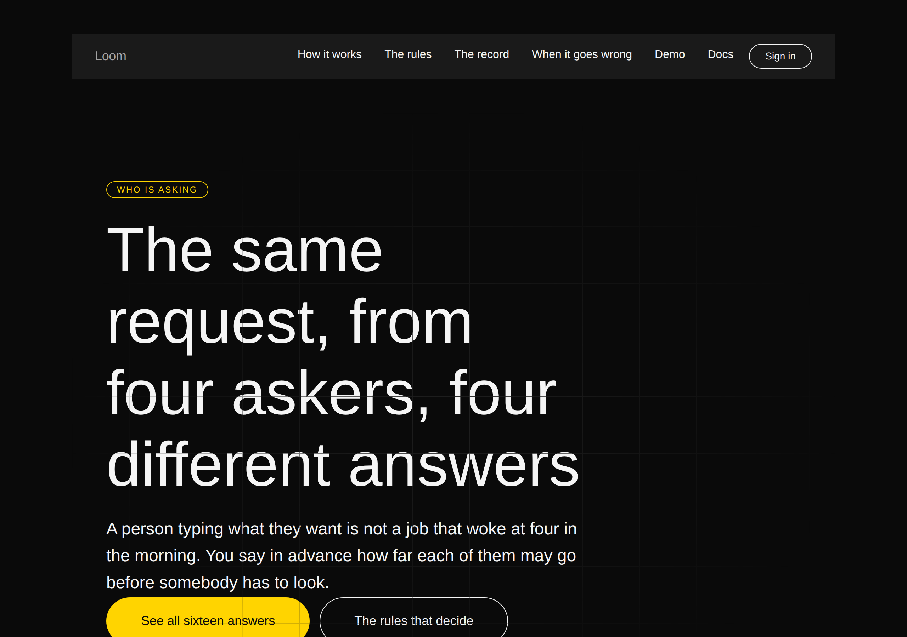



# 2026-09-13 — marketing: who asked, and the one rung of seven that reads it

Seven pages of this site argue about **what** a change is: how much it moves,
whether it can be taken back, whether a rule protects what it touches.

One line of the seventh says the other thing. `/the-rules` has carried a band
called *And who asked* since 28 August — four kinds of asker, and the weight each
may go ahead with unwatched — and it says it in a two-column table a reader has
to take on trust.

[0002](../decisions/0002-the-gate-is-a-pure-function-of-two-independent-axes.md)
calls that ceiling **"the one place origin is load-bearing rather than merely
recorded."** It is the most structurally interesting fact this product has, and
the site was *stating* it, on a site whose entire method is to show.

Sixteen marks. Not one of them typed.

---

## What shipped

`/who-can-ask`, the eighth page, and the change to `/the-rules` that it grew out
of. Both are one subject and they are in one branch for that reason.

### The band is four requests put four ways, run while the page is built

Four of the front door's own buttons — **one for each weight the rules can give a
change** — put by each of the four kinds of asker in turn, with nobody standing
by to answer a hold. That last part is the whole question a ceiling answers: *may
this one go ahead unwatched?*

| the request | weighed | who could, on their own |
| --- | --- | --- |
| *Calm it down* | light | **all four** |
| *Take the questions off the page* | middling | a person, and your developers |
| *Skip the tour — what problem does this solve?* | heavy | **only your developers** |
| *Cut the sales pitch* | the most serious kind | **nobody, and no yes moves it** |

Four rows, rising, and each one a different shape. That is not an arrangement —
it is what the front door's five buttons already do when you change who is
asking, and the site had never looked.

**The pairing is a claim and the page refuses to publish without it.** The four
weights that come back must be `STAKE_ORDER`, in order, or `weighEachAsker`
throws: two rows weighed the same are two rows saying one thing twice, and a
reader would have no way to tell the ladder in front of them has a rung missing.

**The weight is checked across all four askers rather than lifted from one.**
0002 keeps stakes and origin apart as independent axes, so a change cannot weigh
more because a different asker wanted it. If the four ever disagree the band is
meaningless, so that is checked where the band is built rather than assumed.

### And the half the reader this site is for actually needs

A compliance reader told that a trusted asker gets more latitude asks the next
question immediately: **so what stops something claiming to be the trusted one?**

The answer is unusually good, and it is a measurement rather than a promise:

> There are **seven** rules between a request and your page. Across all
> **sixteen** runs above, **exactly one of them** ever gave two askers a different
> answer.

Both numbers are derived — seven off `ESCALATION_LADDER`, sixteen off the runs —
and the *exactly one* is computed by `rulesThatReadWhoAsked`, which collects the
rules whose answer changed when nothing changed but who was asking. The three
under it are printed in the front door panel's own sentences, out of `BECAUSE`,
so the page that teaches this and the panel that reports it cannot drift.

Under all of them is the floor, which is the fourth row holding against all four
askers at once.

## `/the-rules` stopped writing the order by hand

This lane filed on 28 August that *the Gate asks its rules in an order nothing
outside the runtime can read*. #181 answered it — `ESCALATION_LADDER`, derived
from `ESCALATION_RULES` rather than declared beside them — and the closure on
2 September recorded that this file *"still writes the order by hand and can now
stop."*

It did not stop, for eleven days, and the reason is worth naming: **nothing was
red.** The hand-written order was correct. A correct copy of a list is wrong only
from the first time the list changes, which is exactly the failure that is
invisible until it is expensive.

`RULES` is now `ESCALATION_LADDER.map(...)` over an unordered `QUESTIONS` list. A
rung with no question here throws while the page is being built.

**Two assertions, and they are different ones.** One holds the list against the
ladder. The other holds the **rendered page** — each rung's sentence found in the
words a reader gets, positions required to increase — because a correctly ordered
list printed in some other order passes the first and fails the second, and the
band's whole claim is *the first no wins*.

## Things this run got wrong before the code was right

### The copy asserted three of four askers are not people. Two are.

The band opens *"N of these four are not people at all."* I wrote **three**. It
is two — a person is one, and your developers are the other.

I did not catch that by reading it. I caught it by deciding the count should be
derived rather than typed, adding `isPerson` to the asker so `peopleAmong` could
count it, and watching the page render **two**. The sentence had been wrong in
the draft for an hour and reads perfectly well wrong.

### A mutation found a sentence that would have lied under a different policy

`readingOf` composes the line under the table. Its *nobody went ahead* branch
read *"not one of them could — and there is no yes that moves that one."*

That is true today and true only by accident of this site's policy. Nobody going
ahead has two causes — every asker **refused** (a floor) and every asker **held**
(a ceiling nobody cleared) — and only the first has no yes that moves it. Today
the second is unreachable because the highest ceiling here is `high` and a `high`
request clears it; lower the developers' line and the page starts telling a
reader that a hold cannot be approved.

It surfaced because a mutation test fed the function four holds and the sentence
that came back was wrong. Both branches are now there and both are asserted.

## Tests

`pnpm install && pnpm verify` — **green, exit 0. Nothing failed, nothing skipped,
no test weakened or deleted.**

| suite | before | after |
| --- | --- | --- |
| `@loom/runtime` | 2378 / 142 files | **2378 / 142 files** — `src/` was not opened |
| `@loom/app` | 4021 / 239 files | **4094 / 240 files** |
| marketing, within it | 1210 / 27 files | **1283 / 28 files** |

Baselines measured on `main` at `2631a14` by stashing this branch and running the
suite, rather than quoted from a report.

Seventy-three new assertions, one new file. **Three existing tests were widened,
not relaxed** — the off-the-bar lists in `what-you-run.test.ts`,
`your-components.test.ts` and `when-it-goes-wrong.test.ts` now read
`[HOME, WHO_CAN_ASK, WHAT_YOU_RUN, YOUR_COMPONENTS]`, still exact, so a fifth
page leaving the bar still fails and still has to be argued for. **Two were
retightened**, not loosened: `spell`'s bound moved from ten to twenty for
*sixteen*, and `journey.test.ts` pins the new boundary at twenty-one rather than
dropping it.

Everything is asserted against the **rendered page**, never against the module
that builds it.

### Mutations

| mutation | result |
| --- | --- |
| two demonstrated requests that weigh the same | **1 file red** — the page refuses to build, which is the guarantee |
| the rules printed in a hand-written order instead of the ladder's | **23 files red** |
| a hold reported as having gone ahead | **1 file red** |
| every asker's line described as `critical` rather than read off the policy | **2 files red** |
| the absence of a rule counted as a rule that reads who asked | **1 file red** |
| the page claiming **no** rule ever read who was asking | **survived, then killed** |
| every cell drawn as a tick whatever happened | **survived, then killed** |
| the reading sentence replaced with a literal equal to today's true text | **survived** |

**Two survivors were real gaps and are reported because they were mine.** The
first left the measurement correct and had the band print the opposite claim; the
second left sixteen cells in place and drew them all as ticks. My tests counted
the cells and checked the computation, and neither looked at what the page said.
Both now assert against the rendered page and both mutations are red.

The third is the same survivor the 12 September report recorded, and it is
honest rather than fixed: a literal that happens to equal the computed sentence
is indistinguishable from the computation at a single point. What is guaranteed
is that the sentence moves when the answers move — asserted on data the site does
not have — and that the literal goes red the moment the runs change.

## Decisions and findings

**No record written.** The change is compositional, adds nothing to the library,
constrains nothing outside this lane and touches no Accepted record. `src/` was
not opened, no other route group was touched, no primitive was added, and no
colour is named in the diff.

**One closed:** `/the-rules` writing the ladder's order by hand — this lane's own
28 August entry, pending since 2 September.

**Two filed**, both for `Loom primitives`: four of eight pages now off a bar that
still cannot group, which is the number the 12 September finding asked to be told
about; and a comparison that is four subjects wide on a laptop and one subject
wide on a phone.

**One deliberately not done.** `Loom daily build` filed on 12 September that
`inverseInterpreter` is exported and about thirty lines of
`(marketing)/_lib/adapt/undo.ts` can go. It is correct, it is small, and it is
about undo rather than about who asked — and this repository's own rule is that a
pull request carrying two unrelated things is a pull request nobody reviews. It
is the first item for the next run. The share-card finding of 2 September is also
still open and untouched; it asks to be done *when this lane next opens that
file*, and this branch did not.

## Open questions

- **The licence line** (#96, on every marketing PR since #134). Still the site's
  one placeholder and still the Phase 2 gate. Untouched.
- **Positioning, audience and pricing.** Untouched, as on every run. This page is
  aimed squarely at the audience the rollout names — people who answer to a
  client, a regulator or a board — and says nothing about who they are. Every
  claim on it is about what the code does.
- **Four of eight pages are now off the bar.** See the finding and the PR comment.

## How it looks

Three palettes and the phone:

`scrollWidth` is exactly 1280 at 1280 and exactly 390 at 390.

**At 390px the comparison shows one of its four subjects** and scrolls sideways
inside its own edge, which is the primitive working as designed and is why the
page does not overflow. The sentence under the table carries the same argument in
words, composed from the same runs — a mitigation rather than a fix. Filed.

And `/the-rules`, with its questions now in the runtime's order and the hand-off
to the demonstration under its table:

Every screenshot is in the fallback face rather than Geist, as every set this
lane has published has been. See the font finding.

Nothing scheduled and nothing armed.
