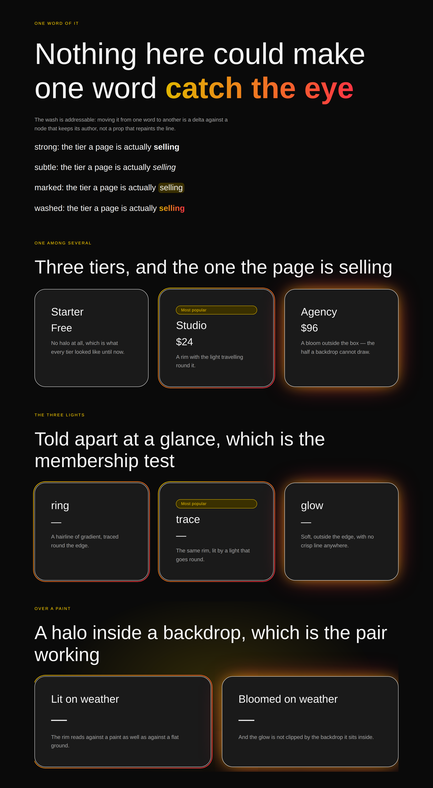

# What catches the eye

**Routine:** `Loom primitives` · **Date:** 2026-09-13 · **Branch:**
`primitives-28-what-catches-the-eye` · **Section:** §4b

## What this run built, and why this rather than anything else

**One new primitive and one new tone: `loom.halo`, and `washed` on
`loom.emphasis`.** The library is **92**.

The choice was made for this run by the run before it. The 12 September report
ends with a section called *"Where the range actually stops, for the run that
reads this next"*, and having read all 91 descriptions against what a marketing
page needs, it concluded the content bands are complete and named exactly two
things that are not:

> **Nothing in this library makes one thing on a page catch the eye.** […]
> There is no accent-washed display type anywhere — arguably the single most
> characteristic device of the tier the brief points at […] The interesting
> design question is whether it belongs on `loom.heading` (the whole headline) or
> on `loom.emphasis` (one word of it), and the second is both harder and much
> better, because a washed *word* is addressable.
>
> **Nothing draws attention to one card among several** — no glow, no lit
> border, no ring on the featured tier. By 0130 that is a wrapper and its
> argument would be the one 0130 already makes.

Both were left unstarted because four measured findings outranked them that day.
They are the whole of this run. Neither needed a framework change, both were
reachable in tokens, and together they are one coherent unit — *the library
could not make anything stand out* — at two scales: one word inside a sentence,
and one card inside a row.

The four open findings against `src/primitives/` were checked first and none was
taken. The oldest still open is `Loom demo`'s 7 September `sr-only` trap, which
is filed explicitly as *"a trap, not a bug in anything that exists"* with
*"nothing is blocked on this"*. Deferring a documented non-blocker for the thing
the maintainer's own sentence asks for is the same weighting the last run
applied in the other direction, and it is stated here so the next run can
disagree with it.

## `loom.halo` — the one among several

Three lights, a closed set, held to 0130's membership test — *a reader tells it
apart from the others at a glance*, not *it is a different number*.

| | what it draws | where |
| --- | --- | --- |
| `ring` | a gradient rim, `accent-strong` → `brand-secondary` | 4px outside the edge |
| `trace` | the same rim, lit by a light that travels round it | 4px outside the edge |
| `glow` | a soft bloom, no crisp line anywhere | from the edge outwards |

[0145](../decisions/0145-a-light-that-marks-one-of-several-is-a-wrapper-and-it-is-carried-by-distance.md)
is the record. The short form of why it is a wrapper is 0110's and 0130's
argument unchanged — the alternative is `featured: true` on `loom.tier`,
`loom.card`, `loom.feature`, `loom.offering`, `loom.product`, `loom.person` and
everything a host registers itself, which is the cost 0014 keeps naming.

**What is new in the argument is geometry, and it is the reason this could not
have been a sixth backdrop paint.** 0130 states that a backdrop cannot bleed
past its own box, because it clips. A halo's whole job is on the other side of
that edge, so `loom.halo` sets no `overflow: hidden` — the one line
`loom.backdrop` could never drop. It also inverts `backdrop.ts`'s second
documented trap: a paint *"hangs inside its band, not off the corner"* because
with a clip, negative insets render as a rectangle with two hard sides. With no
clip they are exactly right.

### The thing the screenshots caught, which no assertion did

The first pair of shots showed two defects, and the second is the more
interesting one.

**A wrapper that is not transparent to stretching changes the layout of what it
holds.** Three tiers in a `loom.grid` are stretched to the tallest of them; a
card is a grid item and fills its cell. Put a halo between them and the card is
a block in a taller box — so the rim hugged the *cell* and the card ended short
of it, photographing as a lit box with a strip of nothing along the bottom, on
two tiers of three. `height: 100%` takes the stretch and `display: grid` passes
it on. Both are inert against a parent with no definite height, which is every
halo that is not in a stretched row.

**A rim drawn flush at `inset: 0` is invisible on a palette with no chroma to
spare.** It sits exactly over the card's own 1px border. Under `bold` that is
yellow-to-red on black and it is the brightest thing on the page. Under
`editorial`, whose two accent slots are both a muted slate and whose cards
already carry a dark border, it is a slightly thicker dark line — present in the
markup, correct by every assertion, and **not distinguishable from the two unlit
tiers beside it**, which is the one thing the primitive exists to do.

Colour could not fix it, because the palette is the thing with no chroma and
0131's subject is exactly that a primitive cannot know. **Distance could.**
Pulled four pixels out, the rim is separated from the card's edge by a strip of
the page's ground, so a reader sees *two boundaries* rather than one heavier
one — and two boundaries read in greyscale, in print, and under the quietest
palette anybody registers. The radius grows with the offset, or a concentric rim
crosses the curve it is following and reads as a misprint.

So: **colour is what makes a halo beautiful; distance is what makes it work.**
Only `glow` is still carried by chroma alone, and it is the one of the three
allowed to be quiet, because a bloom has no job on a page where nothing else is
bright either.

`glow` also lost the crisp `0 0 0 1px` rim it was first written with. It made
the bloom read better on a light palette and it cost the claim the member is in
the set on: with a hard line at its own edge, `glow` was `ring` with a blur
behind it rather than a third thing, which is 0052's shades-of-one mistake.

### What the tree may say, and what it may not

Which light and how the lit area is cornered. Not a colour (0049), not a
duration or easing (0055), not an intensity — the "tune it a bit" number that
turns a reviewable choice into a value nobody reads in a proposal, and which
would have made the `editorial` problem look solved by letting a page turn the
rim up. **The rim was not too faint; it was in the wrong place.**

**No label prop.** "Most popular" is content, content is a node (0052), and
`loom.badge` draws it already. A halo draws the eye; a badge says why. Composed,
a page moves the words without touching the light and re-marks a different tier
with one `move`.

## `washed` — the accent display type, on the word rather than the headline

The fourth tone on `loom.emphasis`, and the last run's design question answered
as it recommended: **a washed word is addressable.** Moving the wash from
*faster* to *ship* is a `move` against a node that keeps its own author and
history. As a `display: "washed"` prop on `loom.heading` it would have been a
`configure` repainting the whole line, and *which word* would not have been
sayable at all.

It shares `<strong>`'s element deliberately. A wash and a bold face are the same
claim about the word — *this is the one you would not drop* — at two volumes, so
a screen reader hears the same thing from both. The file's existing rule is that
the element follows the **meaning**; two renderings of one meaning is what that
rule predicts rather than a case it fails to cover.

### The trap in it, which is one axis across from a trap this library already had

`tokens.ts` has carried this warning since 23 August: a token *"promises the
value comes from the theme. It promises nothing about that value being different
from the one beside it."* It was written after `weight("heading")` rendered a
stressed word identically to its sentence under a pack declaring
`headingWeight: 400`.

The obvious spelling of the wash is `accent` → `brand-secondary`. **Under
`editorial` those two slots hold the same hex** — `#4a5b78`, legitimately, because
a single-accent palette mirrors its accent into its secondary and `palettes.ts`
says so on purpose. That is a gradient between a colour and itself: a flat fill,
under one of the two starter palettes, the one every screenshot here is taken in
first. Nothing fails, no test sees it, and the effect is simply not there.

`accent-strong` and `brand-secondary` are used instead — the pair `loom.hero`'s
aurora already paints, which `palettes.ts` states every palette gives real chroma
*because* they are painted as areas. A wash across type is an area.
`library.test.ts` now asserts the two differ in **every** registered palette,
because that is the property this rendering silently stops working without. The
general shape is filed for `Loom daily build`.

A restrained palette still gets a restrained wash — `editorial` runs slate to
slate through two steps rather than hue to hue — and that is the palette being
honest rather than the primitive failing.

### Both fallbacks are rules, and that is not tidiness

`background-clip: text` with a transparent fill is one unsupported property away
from a word nobody can see, and forced-colours mode is a second way the same
word disappears. Both escapes are in the stylesheet inside `@supports` and
`@media (forced-colors: active)`, and **nothing visual is set inline** — because
an inline style beats a rule, so a `color` on the element would defeat both. The
declaration outside the `@supports` test is a solid `accent-strong`: unsupported,
the word is emphatic and legible rather than absent.

The same ordering protects the rim. Written the other way round, a browser
without mask compositing paints the whole gradient as a filled rectangle *over*
the content it is supposed to be ringing, because the rim layer sits above the
content on purpose. `@property` gets a `var(--loom-halo-angle, 135deg)` fallback
for the Firefox window that had mask compositing before registered properties;
without it the trace rim would have had no background at all in those versions.

## Which Hermes fields became nodes, and which stayed props

**None, and that is the honest answer.** Neither of these is a Hermes port.
There is no creator-toolkit block for *the tier you are selling* or for *one word
of a headline in accent*, which is the blind spot 0130 recorded about the port
ledger arriving for the second and third time. Everything here is a prop, and
every prop passes the granularity test the same way: `light`, `corners` and
`tone` change *how* their subject is drawn and change **no node**. The one field
that would have been a prop in a lesser version — the "Most popular" label — is a
`loom.badge` child, for 0052's reason.

## What the library still cannot express

Unchanged and still not this lane's: a dark scrim under a light palette; a paint
that bleeds wider than its own box; a backdrop that knows how much chroma its
palette has; a tab strip; a feed. `Loom demo`'s `sr-only` trap remains open
against this lane, deliberately, per the note at the top.

Two added by this run:

- **A halo cannot know it is one of several.** Nothing in a render reads a
  node's siblings (0008), so a page that lights all three tiers gets three lit
  tiers and no complaint. The relationship is the author's claim and this
  primitive is only the means to state it. This is a real limit on *every*
  "featured" treatment anyone builds here, not a gap to be closed — closing it
  would mean a render reading the tree around it.
- **A still photograph cannot show that `trace` moves.** It catches the conic
  rim at whatever angle the animation reached. The claim is asserted in
  `library.test.ts` — the rule exists, it carries an animation, and reduced
  motion removes the travel and not the rim — where it can be read rather than
  guessed at from an image. Worth knowing for any lane that photographs this.

## What was touched outside this lane, and why

`lessons/22-reach.md` and `lessons/23-anchors.md`: two saved transcript lines
from `primitives registered: 91` to `92`, and three prose "ninety-one"s to
"ninety-two". `app/(lessons)/_lib/transcripts.test.ts` checks those lines against
what the program prints, so adding a primitive turns it red — which is the test
working. `pnpm verify` green is every lane's merge gate, so it could not be
filed instead of done. Five one-word edits, no pedagogy touched, and none of the
counts the lessons turn on moved: targets is still 12, the anchor answer is still
zero, and `loom.halo` declares neither.

One sentence in `22-reach.md` was left alone on purpose — *"Seventy primitives
ship in the starter library"*, already stale before this run and sitting above a
prediction the reader is asked to make. Rewriting it is an editorial call about
the exercise. Filed for `Loom lessons`, with three ways to stop the number
drifting again.

## Findings filed

- **`Loom lessons`** — a lesson transcript pins the size of the library, so
  every primitive added falsifies another lane's prose. The mechanical half is
  done here; the editorial half and the choice of fix are theirs.
- **`Loom daily build`** — two palette slots may hold the same colour and the
  primitive painting a gradient between them cannot tell. Worked around for the
  two things built here and for nothing else; the general measure is 0131's
  shape and `src/theme/`'s file.

## Pictures

Four, two palettes by two widths, all in `reports/`. Each band is arranged so
the treatment and its absence are in the same photograph — an unlit tier beside
two lit ones, the same sentence in all four tones — because a shot of the fixed
state alone proves nothing.

| | |
| --- | --- |
| `-editorial-wide` | the offset rim carrying a palette with no chroma to spare |
| `-bold-wide` | the same markup reading as neon |
| `-editorial-phone` · `-bold-phone` | 390px, rims fully visible, nothing clipped |

`scrollWidth 390 / innerWidth 390` and `1280 / 1280` — no overflow at either
width under either palette.
