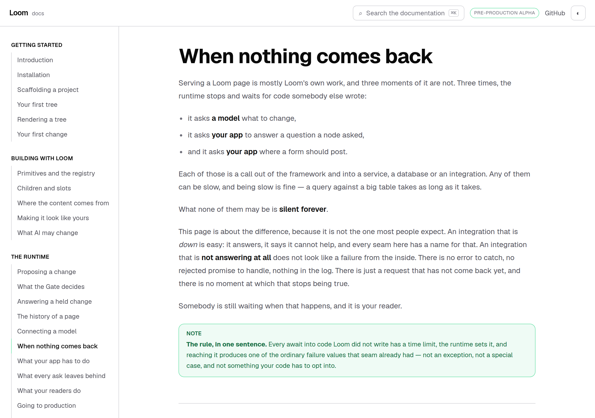
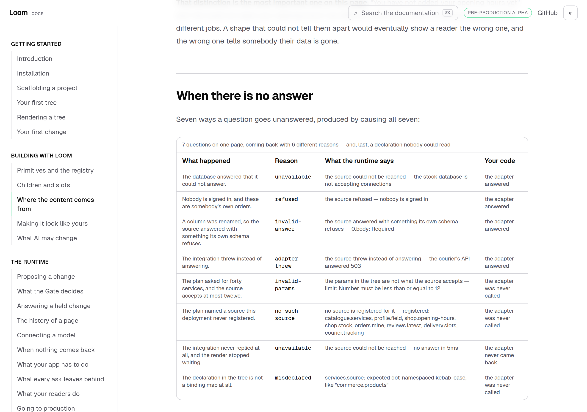
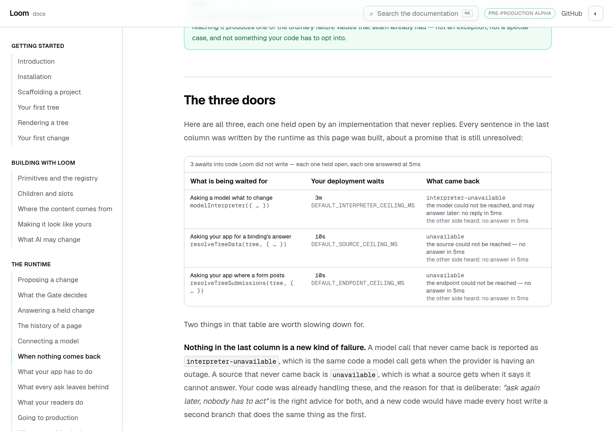
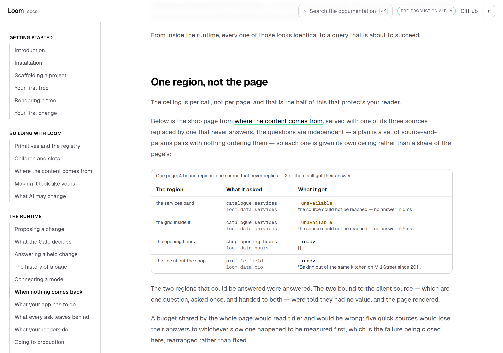
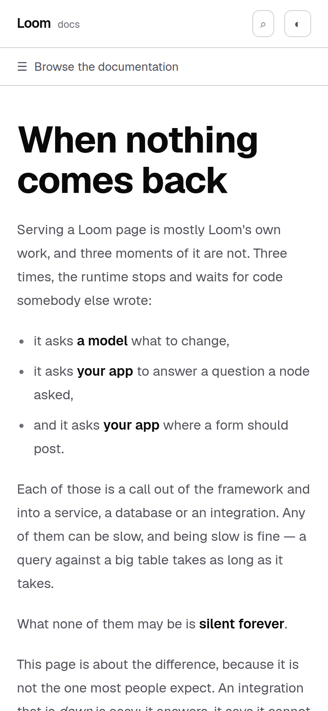

# 14 September 2026 — when nothing comes back

**Routine:** `Loom docs` · **Branch:** `docs-24-when-nothing-comes-back` · **Section:** §4c

The framework routine shipped [0140](../decisions/0140-a-call-into-foreign-code-has-a-ceiling-and-the-runtime-owns-it.md)
yesterday — every await into somebody else's code now has a ceiling — and filed
a finding against this lane with it: a table on *Where the content comes from*
had two cells that were no longer true. Reading that finding turned up something
larger. **The site said nothing at all about the ceiling**, on any of the three
seams it governs, and one of the two wrong cells was wrong in the most
uncomfortable way a documentation page can be: it had been *describing a timeout
since before the runtime could produce one*.

So this run is the ceiling, and the finding is closed as part of it.

## What shipped

**One new page — *When nothing comes back*** — under *The runtime*, between
*Connecting a model* and *What your app has to do*. It is the first page on this
site whose subject is something that does not happen.

It covers, in this order: the three places Loom waits for code it did not write,
what makes a silent call different from a failing one, the two ceilings a
deployment gets, why reaching one is an ordinary failure value rather than an
exception, what a silent source costs a page (one region, not the page), how to
change the number, the abort signal and why an adapter should pass it on, and
how to see the state your own interface shows when nothing comes back.

**The seventh row on the data seam's failure table**, which is the finding. The
trouble page now asks a seventh question, of a source that never answers, and
the row is produced by the runtime's ceiling reporting it.

The row above it changed too. `shop.stock` used to answer `unavailable` with the
detail *"the query timed out"* — a sentence typed by this lane, on a seam that
could not produce a timeout. It now says what it actually is: a database
reporting that it cannot answer. The timeout is the row underneath, and the
runtime wrote it.

**38 KB of nothing out of the search index**, which the new page forced and
which is the one thing here I did not plan to do.

## The block the page exists for

Everything else on the page is a sentence about a rule. This is the rule
happening, three times, to three real seams:

Every sentence in the last column was written by the runtime as the page was
built, about a promise that is **still unresolved**: a model client that never
replies, a data adapter that never answers, and a submission endpoint that never
says. Nothing is a fixture and nothing is a `setTimeout` standing in for an
integration, because a `setTimeout` is a call that comes back.

The last line of each cell is the half of the ceiling nothing else can show.
`no reply in 5ms` is what the **adapter on the other side heard** — the runtime
aborting what it walked away from — and it is what stops a deployment leaking
exactly the connections it has already given up on.

## The claim a reader is most entitled to disbelieve

That one silent integration costs its own region rather than the page.

That is the shop from *Where the content comes from*, served with one of its
three sources replaced by one that never answers. Two regions got their answers
while the third was still being waited for; the two bound to the silent source —
one question, asked once, handed to both — were told they had no value, and the
page rendered.

The test under it is the decision in one assertion. Before the ceiling this was
false for a hang and nothing said so: there is a test in this repository named
*"costs one region of the page when one source is down, not the page"* that
passed throughout, because *down* there meant an adapter that **returns** a
failure.

## The finding, and why it grew a row rather than a column

`answers.ts` typed two `Record<DataUnavailable["reason"], …>` maps, and 0140
made two of their cells wrong. The obvious fix is a third `reached` member, and
that is half of it. The other half is that **two different things now arrive at
`unavailable`** — a database that says it is down, and an integration that says
nothing — and a table keyed by reason cannot show both.

No new reason code was added, deliberately, and 0140 says why in as many words:
the remedy is the same and the actor is the same, so splitting the code would
make every host write a second branch that does what the first one does. The
distinction lives in the detail string instead.

So the page's rows are keyed by **which question was asked** rather than by the
reason that came back, and the exhaustiveness the `Record` used to give is kept
by a map that nothing renders: every reason names the question that causes it,
so a seventh reason added to the runtime fails to compile in this lane, naming
itself, exactly as before.

## 38 KB of nothing

Adding a twenty-first page took the search index's raw cap from 199 KB to
200,286 bytes against a limit of 200,000, and the cap's own comment says the run
that hits it should split the index rather than raise the number.

It did neither. **38,156 of those bytes were the fields `summary`, `body` and
`code` saying, 1,172 times, that they were empty** — 986 of the entries are
published export names, whose words live in their signature on the reference
page. They are left out of the file now and filled back in on arrival, which is
the tolerance `code` already had for a browser holding an older index. The file
is about 162 KB.

A field that carries nothing is not a payload anybody decided to send, so this
is not headroom bought by making the site worse. What it does not fix is the
**compressed** cap, which is the one a reader actually waits for: 18.1 KB against
20 KB, with 84% of the entries being published names. Recorded in the test's own
comment, because the lane that grows that number is not this one.

## Decisions taken that were not specified

**The page covers the submission seam, which this site has never documented.**
0140 is one rule across three doors, and a page that covered the two with guides
would have been teaching a rule with an exception in it. The cost is that a
reader now meets `resolveTreeSubmissions` on a site that has never said what a
form is. Filed as a finding against this lane, with the shape the missing page
wants.

**The produced blocks run at a five-millisecond ceiling, and the page says so.**
The defaults are ten seconds and three minutes; producing this page at those
numbers would cost half a minute a build, and a page whose evidence is expensive
is a page somebody eventually replaces with a fixture. Both numbers are on the
page — the default read from the runtime's published constant, the produced
sentence beside it — because showing only the produced one would be the page
quietly implying it had waited three minutes.

**No rendered example.** Every other page in this section opens with a
`LoomTree` a reader can change. The subject here is a promise that never
settles, and there is no tree that shows one; the two produced tables are the
evidence, and forcing an example on would have been decoration.

## Tests

`pnpm install && pnpm verify` at the repository root, **green, exit 0**.

| Suite | Files | Tests |
| --- | --- | --- |
| `@loom/runtime` | 143 | 2,415 passed — `src/` was not opened |
| `@loom/app` | 246 | 4,161 passed |

Baseline on `main`, measured by stashing this branch and running the same suite:
**244 files, 4,139 tests, all passing**. So this branch is **+2 test files and
+22 tests**: 17 on the three doors and the page's claims about them, 3 on the
seventh row of the data seam, and 2 on the search index having stopped carrying
empty fields.

Nothing was skipped, no cap was raised, and no test was weakened. Three tests
went red on the first full run and all three were right to:

- `compiled.test.ts` caught that a paragraph was edited after the fence programs
  were generated, so the generated program named the wrong line of the page.
- `build.test.ts` caught the search index's raw cap, at 286 bytes over.
- `seam.test.ts` caught that the reason list now has `unavailable` twice, which
  is the change the finding asked for and is worth being made to state.

Claims verified by mutation, because a test that has never failed is a claim
rather than a check:

- **Saying the silent adapter answered** — flipping one `reached` value — fails
  one test in the data suite and nothing else: the one that holds the two routes
  to `unavailable` apart.
- **Reordering the three doors** fails *in the order the page introduces them*,
  which is the test that stops the middle column of that table quietly describing
  the wrong seam.
- **Taking the abort listener out of the silent source** fails *aborts what it
  walked away from*, naming the door. Nothing else notices, because the page
  still gets its answer — which is exactly why the abort needed a test of its
  own.
- **Spreading the whole entry back into the search index** — the version this
  run replaced — fails three tests, one of which is the cap that started it.
- **Leaving the data page saying "six ways"** fails its claims test, which reads
  the produced rows and counts them.

## Dark and 390px

`document.documentElement.scrollWidth` is exactly 390 at a 390px viewport and
1280 at 1280. The two produced tables are the blocks that could overflow, and
each scrolls inside its own box.

The screenshots are all light, and that is a gap rather than a choice: `pnpm
shoot` photographs an address, the theme lives in `localStorage`, and the
harness has no way to set one before the shutter. The same family as the finding
this lane filed yesterday about photographing a block that only exists once you
press it. Not filed again — it is one missing capability, not two.

## Scope

`apps/loom/app/(docs)/` only. Twelve files changed and eight added — three of
them tests, one generated. **No file in another lane was opened**, `src/` was not
opened, and the generated API reference was not regenerated because the runtime's
surface did not move.

## Open questions

**Nothing blocking.** Three findings filed: two against this lane, one against
`Loom daily build`.

**What I would write next.** *What a form posts to* — the third door has a
ceiling documented and no page, which is the wrong order and is the clearest
hole left in the exit condition: a stranger working only from this site can
build a page, change it, review the change and deploy it, and cannot put a form
on it.
