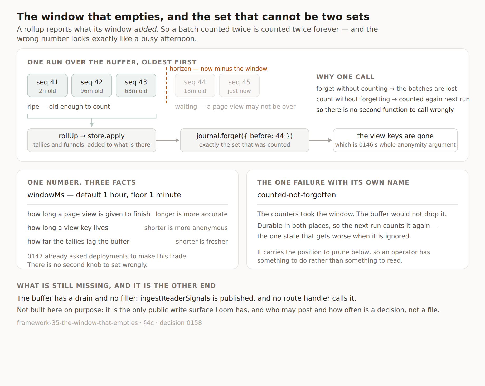

# The window that empties

**Routine:** `Loom daily build` (framework) · **Date:** 2026-09-14
**Branch:** `framework-35-the-window-that-empties` · **Section:** §4c — reader signals

## Two standing corrections to my brief, repeated because they are still true

**The one-application migration finished on 19 August.** My brief still opens
with it as the next unit, above everything, and says three routines are blocked
on it. `apps/loom` is on `main` with `(marketing)`, `(docs)`, `(lessons)`,
`(portal)` and `(demo)`; `apps/portal` and `apps/docs` do not exist in the tree.
Nothing is half-migrated and nothing waits on me for it. This is the sixth
consecutive framework run to establish that.

**The demo is not mine.** The brief assigns it to me; `docs/routines.md` records
it as split out to `Loom demo` on 20 August, and that lane has an open pull
request today (#303). Where a brief and that file disagree the brief wins and the
file is wrong — so I am saying it here rather than acting on it, which is what
the file itself asks for. I did not touch the demo.

Both are one edit to a stored prompt, and they are in *Needs your input* on the
pull request rather than filed again.

## What was waiting

No maintainer comments on anything. No open framework pull request — #295 landed
this morning. Three other lanes have pull requests open (#301, #302, #303) and
none of them needs anything from me.

So the queue was the open findings this lane owns, and the top of it was one I
filed myself eight hours ago and marked *a gap this lane left on purpose and must
close next*.

## What shipped

**The reader-signal buffer now empties, and counting is the thing that empties
it.**

`framework-34` built ingestion, the buffer, rollup and the counters and stopped
short of the thing that runs them: `ReaderSignalJournal.forget` existed and
nothing called it. Left out deliberately — forgetting raw batches before the
counters they feed are durable destroys data outright — and filed, with a
proposed shape.

### The shape in the finding was wrong, and finding out why is most of this unit

The finding asked for what `src/telemetry/retention.ts` is: a policy, a plan, and
a scheduled caller that runs rollup and then retention in that order. Two
functions, called in sequence, mirroring the sibling subsystem.

That does not work here, and the reason is one sentence: **a rollup reports what
its window added** (0147), so a batch counted twice is counted twice forever.
There is no idempotence to fall back on, no way to subtract it afterwards, and
nothing to notice — a doubled counter looks exactly like a busy afternoon.

Which means the set of batches a run counts and the set it forgets must be the
same set. Either one operation decides it once, or something durable remembers
how far counting got and retention reads it.

The two subsystems differ in exactly the place that matters. A telemetry journal
is read by folds that are pure over whatever they are handed, so forgetting is
independent of reading and a standalone retention function is safe. A signal
buffer is read **once**, by an operation that is not idempotent. A retention
function that can be called on its own is a loaded gun, and a host following
whichever example it found first is the one holding it.

So there is no `applyReaderSignalRetention`. There is one function.

### `collectReaderSignals(journal, store, request)`

Reads the oldest end of the buffer, takes the batches older than the horizon,
rolls them up, applies the rollup, and forgets exactly those.

- **The cut is the first batch young enough to keep**, not every old one. The
  buffer forgets a prefix or nothing, as both journals do; a hole would make
  `seq` — an opaque increasing position, never a count — start meaning something
  a reader could misread. `receivedAt` is what it measures, never `sentAt`, which
  is a number a page said.
- **Aggregates first, the buffer second.** The reverse order loses the window on
  any failure after the delete, with nothing left to notice it with.
- **The scan is incremental and bounded**, like telemetry's, so a first run
  against a buffer nothing has ever drained does a predictable amount of work.
  `more` on the outcome says another run has work now.

### `windowMs` is one number for three facts

A batch is counted once it has been held for a window. So the window is
simultaneously how long a page view is given to finish, how long a view key
lives, and how far the counters lag the buffer:

| The window is also… | longer | shorter |
| --- | --- | --- |
| how long a page view has to finish | fewer views straddle a boundary, so `views` over-counts less (0147) | more of them do |
| how long a view key lives | it lives longer | it expires sooner, which is 0146's whole argument |
| how far the counters lag the buffer | more lag | fresher numbers |

Default an hour, floor a minute. Under a minute every page view straddles a
boundary and `views` stops counting readers and starts counting network flushes;
it is also how a units mistake is written, and `windowMs: 60` reads as an hour
and means a minute.

**The lag is the real cost of this design and I am not going to bury it.** On a
deployment collecting hourly, a batch is counted between one and two hours after
it arrives. The alternative — a durable watermark, so counting is prompt and only
forgetting waits — is written up in 0158 as the door to open if the portal finds
that unacceptable. It costs a fourth table whose write has to be inside `apply`'s
transaction, and a re-read of the counted-but-not-yet-forgotten prefix on every
run, to make independent a number 0147 already asks deployments to tune.

### The one failure with a name

`counted-not-forgotten`: the counters took the window and the buffer would not
drop it. It is its own outcome rather than a general failure because it is the
only state that gets **worse** when it is ignored — the batches are durable in
both places, so the next run counts them again — and because collapsing it into
`unavailable` would hide the one case where an operator has something to do. It
carries the position to prune below.

### One run at a time, which I nearly shipped a lie about

The first draft of the script said *"safe to run repeatedly, safe to run twice at
once, and safe to interrupt"*, copied from the sentence that is true of telemetry
retention. Two of the three are true here. The middle one is not, and it is not
close: two collectors reading the same ripe prefix both roll it up and both
apply, applying is additive, so the counters double and the buffer empties once
— leaving nothing behind that could say what happened. A cron that overruns its
own interval is the ordinary way it would arise.

The runtime cannot fix it. A journal and a store are two handles with no shared
transaction between them, so serialising belongs to whatever schedules the call.
The script takes a **Postgres advisory lock** on the one connection it opens; a
second run says so and does nothing, and the lock is released when the process
dies, which a lock table of our own would not manage. `collect.ts` says in its
own documentation that the caller owns this, because a host writing its own cron
route will not read this report.

### And it is runnable

`pnpm --filter @loom/app signals:collect`, beside `telemetry:prune` and shaped
like it. `db-push.ts` also now creates the three reader-signal tables, which it
never did — `framework-34` added the schema and the migration and nothing called
`ensureReaderSignalsSchema`, so a deployment following `docs/deployment.md` had
the code and not the tables. `docs/deployment.md` gains section 8.

## What I deliberately did not build, and it is the other end

**Nothing fills the buffer.** `ingestReaderSignals` has been published since #295
and no route handler calls it, so on `main` today a collection run finds an empty
buffer and correctly says so.

Building the endpoint at the end of the run that built the drain would have been
the obvious thing and it is the wrong thing. Everything else in this subsystem is
written by a deployment's own server. This one is written by **any browser that
can reach the URL** — the only public write surface Loom has — and who may post,
how often, and what a deployment that never switched signals on should do with a
batch are four questions that deserve a decision rather than forty lines written
in a hurry at the end of a run. Filed, with the four questions and the nearest
existing shape (`(portal)/_lib/auth/attempts-postgres.ts`).

## Records

**Added [0158](../decisions/0158-counting-a-window-of-reader-signals-and-forgetting-it-are-one-operation.md)**
— *Counting a window of reader signals and forgetting it are one operation.*
Nothing superseded. `pnpm decisions:index` regenerated; 0148, 0149 and 0151–0154
remain claimed on unmerged branches, which the index says in its own words.

It records four rejected alternatives, and the one worth reading is the last:
*roll up everything scanned, regardless of age, and forget only the old part.*
That is the version that suggests itself first, it looks obviously right, and it
double-counts every young batch on the next run.

## Findings

**Closed:** *the raw signal buffer has no retention, so it grows until someone
notices* — mine, filed this morning, closed by this branch. The status line says
the shape it proposed was wrong and points at 0158, because a closed finding that
silently drops its own bad advice is worse than one that keeps it.

**Filed, owned by me:** *the buffer has a drain and no filler* — the ingestion
endpoint, with the four questions above.

**Filed, owned by `Loom portal`:** *the tallies lag the buffer by a window, and a
screen that does not say so will look broken.* Step 4's numbers do not appear
immediately, and the person most likely to look is the person who just made a
change — who will find the old revision counted and the new one empty, which
reads as a broken measurement rather than as one that has not happened yet.
`StoredTally.updatedAt` answers *"counted up to 14:05"* with no new plumbing, and
a revision with no row is a different fact from a revision with zeroes.

## Tests

`pnpm install && pnpm verify` — **exit 0**: **2,596** runtime (150 files),
**4,252** application (248 files), 626 findings 0 malformed, 101 prerendered
pages, 788 text junctions and 0 run together.

**Twenty-five added, none weakened, nothing removed.** The one existing file that
changed is `reference.generated.json`, which is generated: `pnpm --filter
@loom/app docs:api` after the new exports, exactly as `extract.test.ts` instructs
when the published surface moves. The docs search index took the growth with
room left — the ceiling raised on #295 is doing its job and the finding about it
stays open and stays `Loom docs`'.

**Every defect was put back one at a time. Seven of seven were caught**, which is
the number I wanted rather than the number I expected:

| defect restored | what fails |
| --- | --- |
| the horizon is `>` rather than `>=`, so a batch on the boundary goes early | 1 test |
| the ripe set is a `filter` rather than a prefix — a hole in the buffer | 1 test |
| `before` is the last ripe `seq` rather than one past it | 6 tests |
| forget runs before apply | 1 test |
| `more` is always false, so a backlog never announces itself | 1 test |
| `counted-not-forgotten` collapsed into `unavailable` | 1 test |
| the window floor removed, so `windowMs: 7` is obeyed | 1 test |

The third one failing six tests rather than one is the tell that it is the
load-bearing arithmetic: an off-by-one there leaves a batch behind that every
later run re-reads and never takes, because runs always read from the oldest end.

It also caught one of mine before the mutation round did. I had written
`more: scanned.full && plan.waiting === 0`, and the second clause cannot be false
when the first is true — the scan returns early the moment it sees a young batch.
**A condition nothing can make false is a claim no test can check**, so it came
out. That is the second run in a row this lane has found one of those in its own
diff, which is starting to look like a habit worth naming rather than a
coincidence.

**One thing is not covered and I would rather say so than let the count imply
otherwise.** The advisory lock is two statements in a script, and no script in
this repository has a test — `telemetry-prune.ts` and `db-push.ts` do not either.
The store itself is well covered: `postgres.test.ts` runs the whole contract
against PGlite, so this is a gap in the scripts rather than in the subsystem.
What is tested is everything the script delegates: the plan, the order, the five
outcomes and the line each one prints.

It is also why the lock stayed in the script rather than becoming a runtime
export, which was my first instinct. A session-level advisory lock has to be
taken and released on the *same* connection, and `signals-collect.ts` is safe
because it opens exactly one (`max: 1`). A helper published from
`@loom/runtime/signals/postgres` would be handed a pool by most callers, take the
lock on one connection and release it on another, and be a concurrency bug
wearing the costume of a concurrency fix.

## Open questions

- **Is an hour the right default window?** It is the number that makes the
  straddle over-count small and the lag noticeable. The portal is the lane that
  will feel the lag, and the answer may be that the watermark alternative in 0158
  is worth its fourth table. Nothing has to change to find out — one screen and
  one deployment's opinion decides it.
- **Who owns the ingestion endpoint?** I filed it against myself as application
  shell, because a public POST that a published page hits is not any one
  surface's. If that is wrong it is one line in `docs/routines.md`.
- **Nothing schedules any of this**, by the same rule 0037 states for telemetry:
  when a deployment forgets is its choice. A deployment that never runs
  `signals:collect` counts nothing and grows forever, and no code path complains.
  That is correct and it is also a foot-gun, and the honest place to answer it is
  the portal telling someone *"nothing has collected for 3 days"* — which it can
  do today from `updatedAt` alone.

## What this run did not do

It did not touch `docs/signals.md`. Step 3 is now genuinely finished rather than
half-finished, and step 4's input is real — but the plan document was written by
the maintainer's instruction and marking steps done in it is closer to editing
governance than to reporting, so the news is in `FINDINGS.md` where the portal
lane reads it and in section 8 of `docs/deployment.md` where a deployment does.

It did not touch `src/primitives/`, any route group, or the demo.
