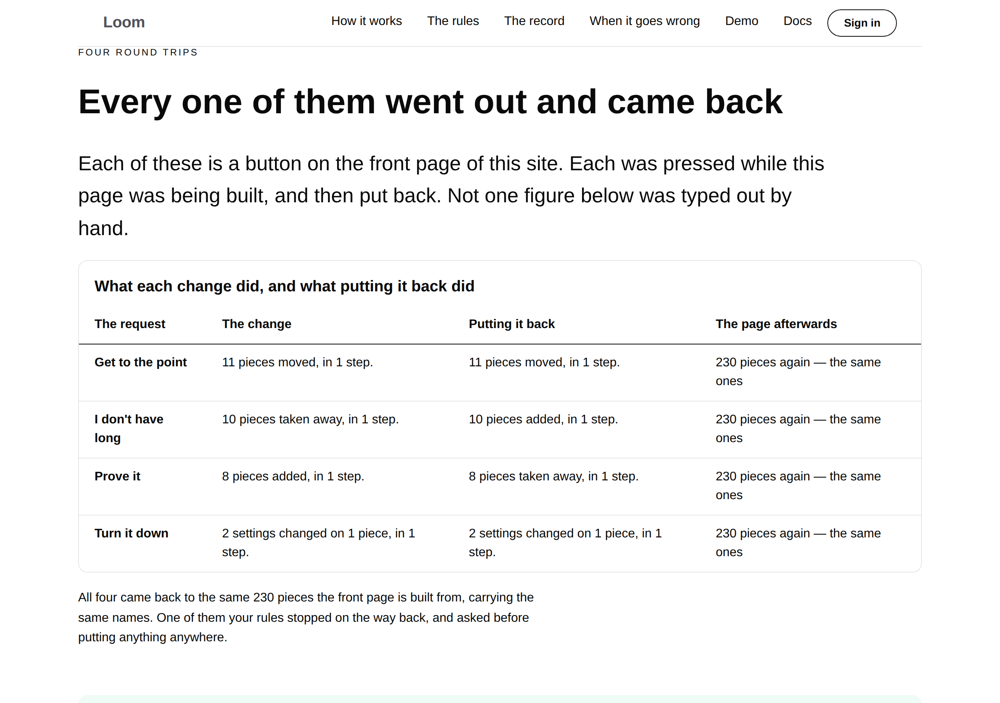





# 2026-09-14 — marketing: the fourth quarter of the difference

The one piece of positioning this project has recorded is four clauses long.
Loom can say **what changed, who asked, which rule allowed it, and how to put it
back.**

Three of those four have had a page of their own since August. The fourth had a
sentence inside a panel — *putting it back restores every word rather than
writing them out again* — and one assertion inside a test file, which is the one
audience a claim does nothing for.

Four changes, out and back. Not one figure typed.

---

## What shipped

`/putting-it-back`, the ninth page, and the deletion in `adapt/undo.ts` that has
been first on this lane's list since 12 September. They are one branch because
they are one subject: the run that opens the undo module is the run that should
delete the copy inside it.

### The band runs the round trip rather than describing it

Every request the front door offers that changes anything — four of the five —
is applied to the page this site publishes at `/`, and then put back, while
`/putting-it-back` is being built. What the table prints is what came back.

| the request | the change | putting it back | afterwards |
| --- | --- | --- | --- |
| *Get to the point* | 11 pieces moved | 11 pieces moved | 230 pieces again — the same ones |
| *I don't have long* | 10 pieces taken away | 10 pieces added | 230 pieces again — the same ones |
| *Prove it* | 8 pieces added | 8 pieces taken away | 230 pieces again — the same ones |
| *Turn it down* | 2 settings on 1 piece | 2 settings on 1 piece | 230 pieces again — the same ones |

**The comparison is the whole page written out, not a count.** Ten pieces coming
back in the wrong order, under a different heading, or with a setting changed on
the way is still ten pieces, and *the same ones* is the half that says it is the
page rather than a page.

**A round trip that did not come back throws and the page does not publish.**
This is the one claim on the site a reader is asked to trust rather than check,
so it is checked where a failure is a red build rather than a sentence nobody
re-reads.

### The two bands nobody would have thought to write

Neither was arranged. Both are what the sequence returned, and both are left out
of the page entirely when no run produces them.

**Putting back a change you approved asks you again.** *Get to the point* moves a
band this site's rules protect. The rules stop it and ask; you say yes; it goes
through. Then the change that reverses it moves the same protected band the
other way — which is exactly the thing the rules were told to ask about — so it
stops and asks as well, and the page prints the rules' own sentence for why.

That is the property that is easy to lose and worth having. A product that waved
undo through would be a product where the way past your rules is to do the thing,
say yes, and then undo something else.

**The way back is not handed the verdict of the change it reverses.** In two of
the four, putting it back was weighed differently from the change:

| | the change was weighed | putting it back was weighed |
| --- | --- | --- |
| *I don't have long* | takes a lot off at once; reaches across; changes the shape | reaches across; changes the shape |
| *Prove it* | reaches across; changes the shape | **takes a lot off at once**; reaches across; changes the shape |

Undoing an addition is a removal, so it picks up a weight the change never
carried. A reader who assumed *undo is always the safe direction* is reading the
counter-case off this site's own front door.

## The thirty lines in `adapt/undo.ts` are gone

This lane filed on 5 September that *a stateless surface can compute an undo and
cannot assemble one*. `Loom daily build` answered it with `inverseInterpreter`
(0137), and the deletion has been waiting for a run that opened the file for its
own reasons. This is that run.

What is left is a four-line function shaping a `ComputedInverse` and one call.
`FRONT_DOOR_UNDO_INTERPRETER` stays named here, which is the half the finding
said to keep: the runtime's own stamp means *this came off a log*, and claiming
it for a change planned on a page would be this site lying in the one field its
whole argument is about.

**The decline wording changed with it and reaches no reader.** The shared
function says *computed against revision N, and this tree is at M* where ours
said *written against … and this page is at*. `runUndo` turns a declined undo
into *"The page has moved since, so this undo no longer fits it"* before anything
is printed, so the detail was never on the page. No field needed; the finding
offered one.

## Things this run got wrong before the code was right

### A test claimed the comparison catches a rebuild. It does not, here.

I wrote an assertion that a page *rebuilt from the source* compares unequal to a
restored one, on the reasoning in `undo.ts`'s own header — the two-week bug where
*Put it back* was a link to `/`. It failed, and it was right to.

**This site's page builders are deterministic.** `pages.test.ts` holds every
route to building the same page twice byte for byte, deliberately, because that
is what a surface keeping nothing needs. So rebuilding the front door produces
the same names, and no comparison here can tell that apart from a restore.

The distinction is real on a host with a store and it is not observable on this
one. So the claim came down to what is measured — the pieces that came back are
the ones that were there — the test now asserts the limit rather than the
overreach, and the doc comments that said otherwise were wrong and are fixed.
None of it reached the page's copy, which never made the stronger claim.

### The last column was right-aligned prose

`loom.table-cell`'s `numeric` prop sets a column against the trailing edge, which
is right for figures and wrong for a sentence that happens to open with one: the
second line came back ragged on the left, where a reader's eye is not. Caught by
looking at the screenshot, not by a test. Dropped.

## Tests

`pnpm install && pnpm verify` — **green, exit 0. Nothing failed, nothing skipped,
no test weakened or deleted.**

| suite | before | after |
| --- | --- | --- |
| `@loom/runtime` | 2415 / 143 files | **2415 / 143 files** — `src/` was not opened |
| `@loom/app` | 4139 / 244 files | **4206 / 246 files** |
| marketing, within it | 1283 / 28 files | **1350 / 30 files** |

Baselines measured on `main` at `c222364` by stashing this branch and running the
suite, rather than quoted from a report. `findings:check` reads 606 entries, 0
malformed; `prerender:check` 99 pages, 0 run together.

Sixty-seven new assertions, two new files. **Three existing tests were widened,
not relaxed** — the off-the-bar lists in `what-you-run.test.ts`,
`your-components.test.ts` and `when-it-goes-wrong.test.ts` now carry
`PUTTING_IT_BACK`, still exact, so a sixth page leaving the bar still fails and
still has to be argued for. One was rewired, not dropped: `undo.test.ts` asserted
the head check through `undoInterpreter` and now asserts it through
`inverseInterpreter(frontDoorUndo(...))`, which is this site's wiring rather than
the runtime's own behaviour.

Everything is asserted against the **rendered page**, never against the module
that builds it.

### Mutations

| mutation | result |
| --- | --- |
| the undo column prints the change's own sentence | **1 file red** |
| a hold on the way back reported as a pass | **2 files red** |
| the two weighings compared as equal, so that band goes quiet | **2 files red** |
| the "came back" comparison always answers yes | **2 files red** |
| the cell always prints the reassuring half | **1 file red** |
| the round trip declared identical rather than measured | **survived** |
| the guard that refuses a trip that did not come back removed | **survived** |
| the reading under the table replaced with a literal equal to today's true text | **survived** |

**Three survivors, all reported because they are mine, and two of them are the
same fact.** On this site every round trip comes back, so a call site that
hard-codes `identical: true` agrees with every run the page prints, and a guard
that only fires when one does not is unreachable by construction. What is
asserted instead is the comparison itself — `cameBack` is exported and put
through pages that genuinely differ, and a version of it that always answers yes
takes two tests red — plus the other half of the guard, that a page nothing can
be asked of refuses to become a band rather than rendering an empty one.

The third is the survivor this lane reported on 13 September and it is honest
rather than fixed: a literal that happens to equal a computed sentence is
indistinguishable from the computation at a single point. What is guaranteed is
that the sentence moves when the runs move, asserted on data this site does not
have.

## Decisions and findings

**No record written.** The change is compositional, adds nothing to the library,
constrains nothing outside this lane and touches no Accepted record. `src/` was
not opened, no other route group was touched, no primitive was added, and no
colour is named in the diff.

**One file moved inside the lane and it is worth a line.** `piecesIn` was
exported from `pages/when-it-goes-wrong.ts`, and a page module importing another
page module is the wrong direction — pages read the layer below, not each other.
It is now `_lib/measure.ts`, which is the move `NOT_A_RULE` made on 13 September
for the same reason and on the second reader rather than the first. Three import
sites updated; the function is unchanged.

**One closed:** the 12 September entry asking for the thirty lines in
`adapt/undo.ts` to go.

**Three filed.** Two for `Loom primitives`: five of nine pages are now off a bar
that still cannot group, which is the number the 12 September finding asked to be
told about; and `loom.table` measured at 390px, where a three-column row of
sentences is 504 pixels tall — the same shape as the comparison-table entry of
13 September, with figures rather than an impression.

One against **my own lane**, and it is the more useful of the three: the marketing
layout's own note says every page replaces what a shared link unfurls as in its
own `generateMetadata`, and **five of the nine do not** — `/the-rules`,
`/who-can-ask`, `/when-it-goes-wrong`, `/what-you-run` and `/your-components`
export a static `metadata` and unfurl with no picture at all. The machinery is
already generic over a route; the newer pages copied the page beside them rather
than the comment. Nothing asserts that a route emits a card, which is why five
could stop. First item for the next run, not done here because it is about how a
page is announced rather than about putting a change back.

**One still open and untouched.** The share-card finding of 2 September asks for
the hand-drawn card to be retired *when this lane next opens that file*, and this
branch did not open it.

## Open questions

- **The licence line** (#96, on every marketing PR since #134). Still the site's
  one placeholder and still the Phase 2 gate. Untouched.
- **Positioning, audience and pricing.** Untouched, as on every run. Every claim
  on this page is a measurement taken on this site's own front door.
- **Five of nine pages are now off the bar.** See the finding and the PR comment.

## How it looks

The band the page is worth reading for is the accent one in the middle, and it
exists only because a run produced it:

`scrollWidth` is exactly 1280 at 1280 and exactly 390 at 390. At 390px both
tables scroll inside their own edge, which is the primitive working as designed
and is why the page does not overflow; the cost is measured in the finding.

Every screenshot is in the fallback face rather than Geist, as every set this
lane has published has been. See the font finding.

Nothing scheduled and nothing armed.
