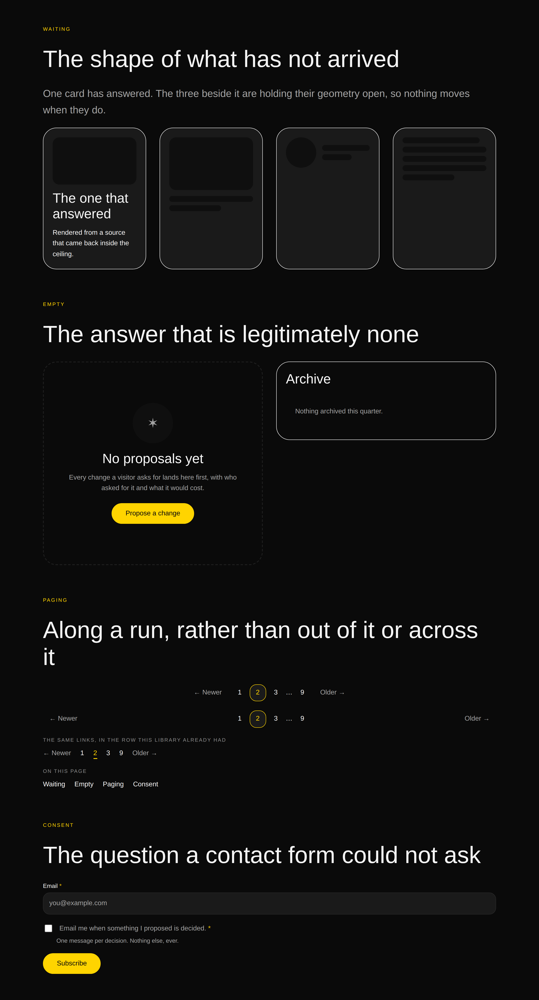

# Tier A finishes

**Routine:** `Loom primitives` · **Date:** 2026-09-14 · **Branch:**
`primitives-31-tier-a-finishes` · **Section:** §4b

## The maintainer's finding, first

`docs/routines.md` says maintainer comments outrank the plan, so this is where
the run started rather than where it ended up.

**12 September, `@jonathanbravecredit`, owned by this lane:** *a link cannot
point at a heading on the page it is already on.* Found building
`prototypes/ski-apparel` — a single long page with a nav bar across the top,
where `href: "#helmets"` was refused and the page had to write `/#helmets`
instead, **which is correct only because that page is the site root.** Anywhere
else it leaves the page the reader is on and lands them at the front door's
anchor, and nothing reports it.

Closed. `linkUrlSchema` now takes a bare fragment, and three details of how are
the whole of the change:

- **The grammar is `anchorSchema`'s**, read from `anchor.ts` rather than written
  again. What may be linked *at* is exactly what may be *marked*, in one regex,
  so the library cannot drift into accepting `#Helmets` at one end and writing
  `id="helmets"` at the other. `#Helmets`, `#my section`, `#-leading`, `#a--b`
  and a bare `#` are all still refused, and the test asserts each against
  `anchorSchema` as well as against the URL schema, so the two cannot separate.
- **`mediaUrlSchema` does not get it.** A `src` is fetched, and `#helmets`
  fetches the document already open. The one real use for a fragment in a `src`
  is an SVG sprite, which carries the file's path in front of it and is an
  ordinary URL here.
- **0053's argument genuinely does not reach it.** The allowlist exists to
  refuse what it cannot check the origin of; a bare fragment reaches no origin
  at all. `javascript:#x` and `javascript:void(0)#top` fail on their first
  character rather than on their scheme, and there is a test that says so.

The refusal message now names all three things a destination may be, which is
what a model reads when it gets one wrong.

The finding noted that `loom.section` already takes an `anchor` *to be linked
to*, so the library could mark a destination it had no way to link at. That
asymmetry had stood for seventeen days.

## What else this run built, and why this rather than anything else

**The choice was made by the run before it, and this run did not re-open it.**
`primitives-29` spent itself measuring what is actually missing — the count
nobody in the repository had — and came back with `docs/primitive-gap-inventory.md`:
**Tier A is five primitives and one enum widening**, Tier B is nine things
blocked together on the behaviour vocabulary, and Tier C is twenty-two things
that look missing and are not.

`primitives-29` shipped two of Tier A (the figure and the trend). **This run
shipped the other three and the enum widening**, which is the whole of it:

| | | |
| --- | --- | --- |
| `loom.link-pager` | paging through a run of things | *"`loom.link-trail` goes out of a page, `loom.nav` goes across; nothing goes along"* |
| `loom.empty-state` | what a region says when it holds nothing | *"every surface will otherwise invent its own 'no results yet'"* |
| `loom.waiting-state` | a placeholder with the shape of the thing | *"a bound region that has not answered has nowhere to say so"* |
| `checkbox` | a tenth `loom.field` type | *"a contact form that cannot ask for consent is a real gap"* |

The library is **95**. The three new primitives are one coherent unit and not
three errands: 0058 made a region's content something that might be empty or
might not have arrived, and a page that can say neither of those cannot page
along a list either. They are the four things a page needs once its content
stops being authored.

**The tenth field type — a radio group — is filed rather than built**, and the
reason is a real limit rather than a shortfall. It is below.

## `loom.link-pager` — along a run

Children are `loom.link` nodes, which is 0054 with nothing left to decide: a
page number is a link to a page and there is no sense in which it is anything
else. Two things fell out of that which were not obvious before building it.

**The current page was already expressible.** `loom.link`'s `current` prop
shipped on 27 August for the site header, and *the page you are on* turns out to
be the same fact at two scales. Nothing new was needed to mark tile 2 of 9.

**Previous and next are slots, and that is 0051 rather than convenience.** The
pager places them at its two ends *regardless of how many numbers there are* —
which is `loom.nav`'s argument for `brand` and `actions` verbatim, and is the
one arrangement fact a row of links cannot express. It is also the answer to
"why is this not `loom.link-list` with `direction: row`", which was a live
question until the ends were in it: that primitive runs everything left to
right, so the ends would be the first and last children, which is a rule no
schema states and every `move` breaks.

### The thing building it turned up, which is now a decision record

**A container in this library can only add to its children what they left
unspoken**, and nothing said so.

The tile a reader taps has to be drawn by the pager onto a child it did not
render. `stylesheet.ts` has warned since 22 August that an inline style beats a
rule, but it warned about a primitive varying *its own* value. Split the tile's
properties by that rule and the table is stark:

| reachable from `.loom-pager .loom-link` | set inline by `loom.link`, unreachable |
| --- | --- |
| `background`, `border`, `border-radius` | `color`, `font-size`, `font-weight` |
| `min-width`, `text-align`, `padding-inline` | `display`, `line-height`, `padding-block-end` |

The second column is not a missing feature. It is a decision another file made
for a different reason, with nothing anywhere recording that it was
load-bearing — and **the failure mode is silence**. A rule written against a
property a child sets inline does not error, does not warn and fails no test. It
renders a page that is *almost* right: here, a number with a box drawn tight
around it and a 24px hit area a thumb misses.

So `loom.link`'s two pixels of block padding moved into `.loom-link`, which is
[0155](../decisions/0155-a-container-may-only-add-to-its-children-what-they-left-unspoken.md).
Nothing about a link's rendering changed; what changed is that a container can
now reach it. The test asserts **both halves** — the rule is in the stylesheet
*and* the property is absent from the markup — because a link that took its
padding back inline would leave the pager's rule quietly doing nothing, and that
assertion is the only thing in the repository that would notice.

**The current page is marked by a lit border rather than a filled tile**, and
that is 0145's lesson taken second-hand rather than a preference. A fill would
have to win against a `color` the child sets inline, and under a palette with
little chroma to spare that is accent text on an accent ground. A border and a
ground that both differ from the page carry the mark in greyscale.

### What the screenshots changed

The first pair had `align: "start" | "center"`, and the numbers took all the
slack so the ends sat at the band's edges. At 1280px that is a very long way
between *Newer* and *Older* — defensible as an archive footer, wrong as a
default, and invisible in any description of the prop.

`align` is now `start | center | spread`, and `spread` is the member you ask for
rather than the one you get. All three draw the same nodes in the same order,
which is what keeps it a prop: the granularity doc's *how however-many children
are laid out*, not *how many there are*. Both arrangements are in the
photographs, one above the other, because the difference between them is the
only thing the prop does.

## `loom.empty-state` and `loom.waiting-state` — the two states of a bound region

[0156](../decisions/0156-the-two-states-a-bound-region-is-in-are-primitives-and-not-props-on-every-container.md)
is the record, and it rests entirely on a sentence of 0058's: *"there is
deliberately no way to express empty as a failure: a source with nothing to
report answers `ready` with an empty list."* The data seam protects that
distinction at the type level, and a library with one of these primitives and
not the other would have undone it at the last step — both states rendering as
a heading over a gap.

**Why they are not one primitive with a `kind` prop**, which is the tempting
version: they share no content model. One holds a title, a sentence and an
action; the other holds no content at all. A prop switching between them would
change the set of children the node may have, which is the one thing a prop may
never do.

**Why the empty state is not `loom.callout`.** A callout is an aside *within*
content and hugs its text. An empty state *is* the content — it takes the whole
region and offers the action that would fill it. A model choosing between them
gets two different answers, which is 0130's membership test.

**Why a skeleton rather than a spinner.** A spinner says the page is busy; a
skeleton says what is coming and how much of it, so the layout does not jump
when it lands. Reserving the geometry is the entire point, which is also why the
media shape holds an `aspect-ratio` rather than a height — a height in `rem` is
right at one column width and wrong at every other.

### The near-miss in it, stated because the next run will meet it

**`lines` counts bars and is a prop. `repeat` would count cards and is not.**

The granularity doc's question is *does changing this prop change the set of
nodes?* — and a bar is not a node. Nobody moves the second bar of a skeleton,
nobody re-words it, and no `move` could address one; it is `loom.rating` drawing
five stars from one score. But three waiting *cards* are three nodes in a
`loom.grid`, because there the repeated thing is the shape of a node — each one
is what a card will become — and `repeat: 3` would be `insert` in a prop bag by
the same test that lets `lines` through. The two look almost identical and one
of them is the mistake 0052 exists to stop.

### Accessibility, which is most of what a waiting state is

`role="status"` with `aria-busy`, one declared word (`Loading`), and **every bar
`aria-hidden`** — eleven rectangles read aloud is worse than silence. The
announcement is visually hidden by `clip-path` rather than by `display: none`,
which removes it from the accessibility tree, or by a 0×0 box, which some screen
readers skip. The word is declared rather than asked of the tree (0060): a model
has nothing to say here that the shape does not already say, and a deployment in
French has one string to replace.

Reduced motion takes the sweep and **leaves the bar**. That is the opposite of
what the library does for an entrance, deliberately: a `.loom-rise` element ends
at `opacity: 1` because an entrance switched off renders a blank page, whereas a
waiting state with no animation is still saying the whole of what it says — the
shape is the message. So this one is dropped outright rather than parked at its
end.

## `checkbox` — the enum widening that was not quite two strings

The gap inventory called this *"two enum members, not two files"*, and it was
right that it is not a primitive. It was optimistic that it is a string.

**A checkbox is the one field whose control comes before its label**, and a tick
box after the sentence it governs is a box a reader has to look back for. So the
field's arrangement forks: control then label in a row, with the hint indented
to the label's edge so the three parts read as one paragraph. The label is set
in the body weight and the reading size rather than the heading weight every
other field's label takes — a consent line is a sentence you agree to, not a
name for a box above it.

**It takes none of the shared `CONTROL` style**, which is `width: 100%` and would
have produced a rectangle with a tick lost at one end of it.

**`accent-color` is why this is an enum member and not a hand-drawn control.**
It themes the browser's own checkbox from the palette, so the tick keeps the
platform's focus ring, the platform's touch behaviour and the platform's idea of
what a checkbox looks like, and is still `accent` under every registered
palette. Drawing our own would have meant re-implementing all three to change
one colour.

**What it is not is a *group* of tick boxes.** One consent line is one field; a
set of them is a set of fields, each addressable — 0052 giving the right answer
without being asked.

## Which Hermes fields became nodes, and which stayed props

**None became nodes, because none of this is a Hermes port** — and that is the
second run in a row to answer this way, which is now worth saying plainly rather
than noting each time. Hermes has no block for *the state a region is in when
its content has not arrived*, because Hermes had no data seam; it has no paging
control, because a creator's page is one screen. These four came from 0058 and
from the gap inventory, not from the port ledger, and the ledger's tables have
been empty since August.

The one field this run touched that *is* Hermes' is `loom.field`'s `type`, and
it stayed a prop for the reason the file already gives: it selects among a
closed set of renderings of the same content — the label, the name and the
requirement are identical whichever it is — and no delta operation adds or
removes a node when it changes. `checkbox` is the ninth member and does not
disturb that; `radio` would have been the tenth and could not be one, for the
reason below.

Everything else here is a prop, and each passes the same test: `outline`,
`align`, `stature`, `shape` and `lines` change *how* their subject is drawn and
change **no node**.

## What the library still cannot express

Three carried forward unchanged: a dark scrim under a light palette, a paint
that bleeds wider than its own box, a tab strip, a feed. `Loom demo`'s
7 September `sr-only` trap remains open against this lane, deliberately, and is
still filed as *"a trap, not a bug in anything that exists"*.

Three added, all filed:

- **A container cannot tell its child which element to be**, so a radio group is
  not a field type. Its choices are `loom.option` by every test that matters,
  and a choice inside a `<select>` must be an `<option>` while a choice in a
  radio group must be an `<input>`. A render is a pure function of one node
  (0008); React context is unavailable because these are Server Components; and
  `cloneElement` over `children` reaches elements the render seam owns. Three
  shapes offered, smallest first, with a `loom.choice` primitive as the boring
  one. **Nothing is blocked** — a form that needs one of several uses a
  `select`.
- **The binding seam has no consumer, ninety-five primitives in.** `loom.data`
  appears in no file under `src/primitives/`. Both new states render whatever
  they were given, every time, so a page that places an empty state gets one
  whether or not the list beside it is empty. The interesting half is not *may a
  primitive read its binding* but **may a primitive render nothing** — deciding
  not to draw sits awkwardly beside rendering being total, and the seam does not
  currently draw that line. Not a request for conditionals in the tree.
- **The specimen harness cannot wire a submission**, so every form it
  photographs is a disabled fieldset at `opacity: 0.6`. Correct behaviour by
  `loom.form` and a useless photograph of a control inside one. This run lifted
  its fields into a `loom.stack` to get a picture of the checkbox, which is a
  specimen that does not show the markup a real page would have.

And one thing that is not new: **`WebFetch https://21st.dev` returned
`EGRESS_BLOCKED` again** — the fifteenth occurrence, the first on this date. It
is not filed a fifteenth time, because that entry says in as many words that
filing it again is not one of the two honest resolutions. It is tallied here so
the count stays true. No run of this routine has ever opened the page its brief
names as the visual standard.

## Pictures

Four, two palettes by two widths, all in `reports/`. Each band is arranged so
the new thing and its absence are in the same photograph, which is the debts
specimen's rule: a card that has arrived beside three that have not, the same
region empty two ways, and both pager arrangements above the row of plain links
that is what the library had yesterday.

| | |
| --- | --- |
| `-editorial-wide` | the quiet palette, where an empty state has to read without chroma |
| `-bold-wide` | the same markup, current tile ringed in yellow |
| `-editorial-phone` · `-bold-phone` | 390px, the pager wrapping rather than overflowing |

`scrollWidth 390 / innerWidth 390` and `1280 / 1280` — no overflow at either
width under either palette.

**One blemish the phone shots show and no assertion catches:** when the pager
wraps at 390px, `Older →` lands alone on a second row. It is legible and it does
not overflow, and the fix would need a media query that cannot reach the nav's
`justify-content` — which is set inline because it varies by prop, and is 0155's
own constraint pointing back at the primitive that produced it. Left, and
recorded so the next run does not think nobody looked.

## What was touched outside this lane, and why

`lessons/22-reach.md`, `23-anchors.md` and `24-silence.md`: three saved
transcript lines from `primitives registered: 92` to `95`, and five prose
"ninety-two"s to "ninety-five". `app/(lessons)/_lib/transcripts.test.ts` runs
each lesson's program and holds its printed output against the prose, so adding
a primitive turns it red — which is the test working. `pnpm verify` green is
every lane's merge gate, so it could not be filed instead of done.

This is the second consecutive run to make this edit, and the finding `Loom
lessons` already holds — *a lesson transcript pins the size of the library, so
every primitive added falsifies another lane's prose* — is unchanged and now has
a second data point. The sentence in `22-reach.md` reading *"Seventy primitives
ship in the starter library"* is still left alone, for the reason the last run
gave: it sits above a prediction the reader is asked to make, and rewriting it
is an editorial call.

## Findings filed

- **`Loom daily build`** — a container cannot tell its child which element to
  be; three shapes offered, smallest first.
- **`Loom daily build`** — the binding seam has no consumer, and the question
  under it is whether a primitive may render nothing.
- **`Loom daily build`** — the specimen harness cannot wire a submission.

## What is next

Compositions, which is what the gap inventory's arithmetic actually turns on:
**primitives 95 of ~110, compositions 13 of ~140.** `primitives-30` took the
catalogue from nine to thirteen and is open. Tier B stays blocked on the
behaviour vocabulary and is `Loom daily build`'s to open, not this lane's to
work around nine times.
