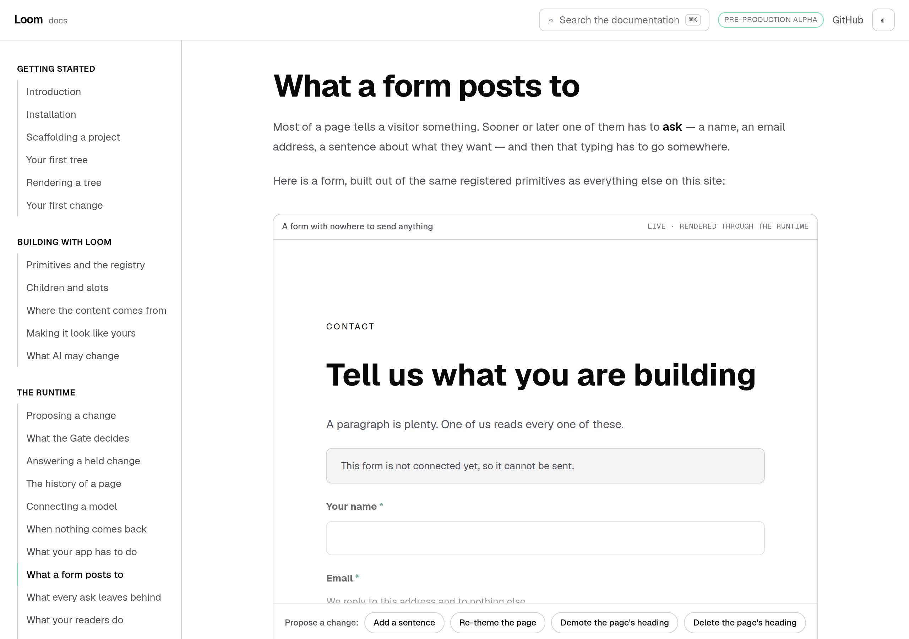
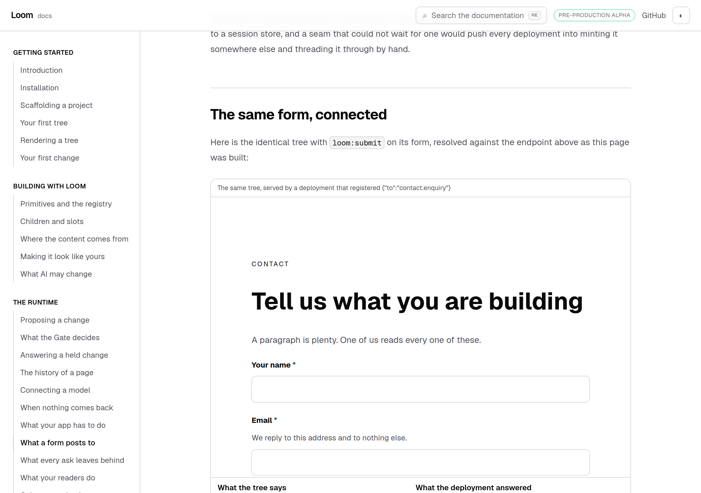
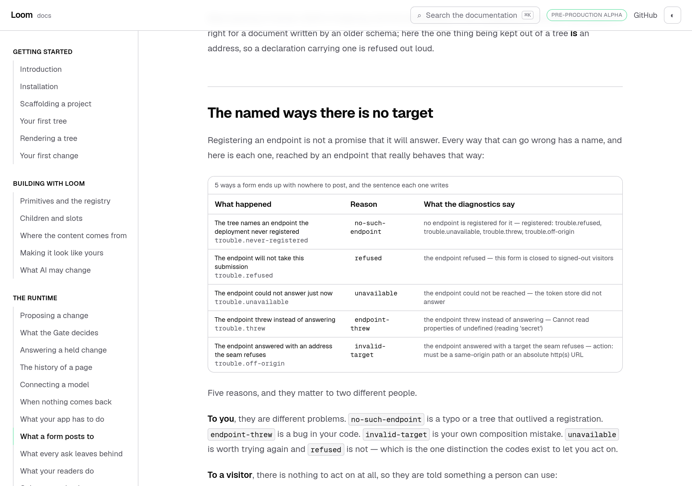
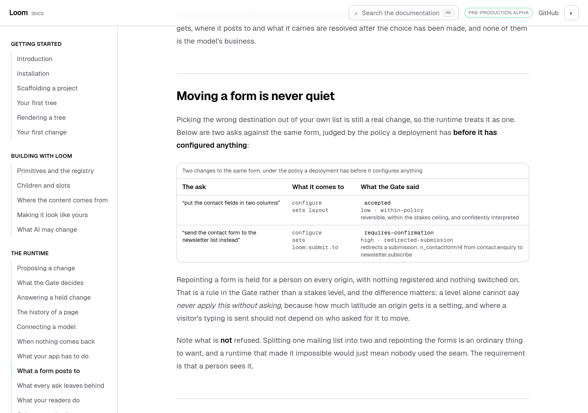
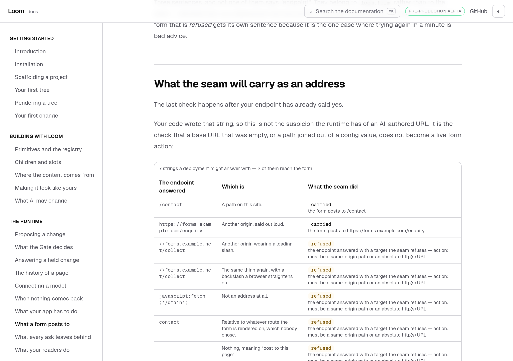
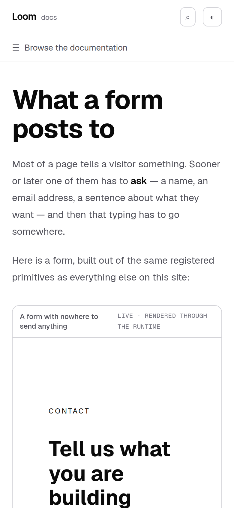

# 15 September 2026 — what a form posts to

**Routine:** `Loom docs` · **Branch:** `docs-25-what-a-form-posts-to` · **Section:** §4c

**Preview:**
<https://loom-git-docs-25-what-a-form-f81335-jpizzolato36-6341s-projects.vercel.app/docs/the-runtime/what-a-form-posts-to>
— Vercel reports Ready. Read off the deployment rather than opened: `vercel.app`
is still off this sandbox's egress allowlist, which is the standing 19 August
finding and is not re-filed. Every screenshot below is a production build of this
commit, served locally.

Yesterday's run built *When nothing comes back*, and finished by filing a
finding against itself: the ceiling page documents a **form's submission
endpoint** because the ceiling is one rule across three doors, and it had to do
that on a site that had never said what a form **is**. A reader who followed the
endpoint row had nowhere to go. That was the wrong order, and this run puts it
right.

## What shipped

**One new page — *What a form posts to*** — under *The runtime*, between *What
your app has to do* and *What every ask leaves behind*, which is the position the
finding asked for.

It covers, in this order: what a form is on a Loom page and what it does before
anybody has connected it, why the address is not in the tree, registering an
endpoint, the same form once somebody has, when resolution happens and why it
cannot happen during the walk, what a model is shown, what the Gate does when a
proposal moves a form, what happens when a declaration tries to carry an address
instead of a name, the five named ways there is no target, what a visitor is
told instead, and which strings the seam will carry as an action.

The finding is closed as part of it.

## The two frames the page is built around

Everything else here is a sentence about a rule. This is the rule happening, to
one tree, twice.

The page opens with a form that has **nowhere to send anything**: a real
`LoomTree` through the runtime, with a propose-a-change box, built out of
`loom.section`, `loom.heading`, `loom.prose`, `loom.form`, three `loom.field`s, a
`loom.button` and a `loom.perk`. Its fields are greyed out and there is a line
above them saying why, because nothing in that tree says where it posts.

Then the same tree with `loom:submit` on its form, resolved against a real
endpoint as the page was built:

Nothing about the form changed. The fields are the same nodes, the button is the
same node, the layout prop is the same. What changed is that somebody answered.
The `action`, the `method` and the hidden `csrf` input under the frame were
written by the endpoint — `/contact`, `post`, one hidden field — and none of the
three appears anywhere in the tree.

Both frames come from **one builder**, `contactExampleTree(to?)`, so "the same
tree with one prop added" is a fact about the code rather than a claim in a
paragraph.

## The five reasons, reached rather than described

Every row is a real endpoint that really behaves that way: one that says no, one
that cannot answer, one that throws, one that answers with an address the seam
refuses, and — for `no-such-endpoint` — no endpoint at all, which is the point of
it. The sentences in the last column are `describeSubmissionUnavailable`'s.

The page then says what a **visitor** gets, which is three sentences read off the
registry rather than retyped, because they are `loom.form`'s declared text and a
deployment serving another language would replace them.

## Two claims a reader is most entitled to disbelieve

**That a proposal cannot quietly move a form.** Two configures on one node,
judged by the policy a deployment has before it has configured anything:

Laying the fields out in two columns is accepted. Sending the form to the
newsletter list instead is `requires-confirmation`, `high`,
`redirected-submission` — with nothing registered and nothing switched on. That
is a rule in the Gate rather than a stakes level, and the page says why the
difference matters: a level alone cannot say *never apply this without asking*,
because how much latitude an origin gets is a setting.

**That writing an address into the tree does not get round it.** A declaration
with `action` beside `to` is refused where it is read — `loom:submit` is strict
and `{ to }` is its only key — so the form has no target at all rather than an
address nobody weighed. Produced by writing one and planning it.

## What the seam will carry as an address

The two middle rows are the reason this is a schema rather than a leading-slash
check. `//forms.example.net/collect` and `/\forms.example.net/collect` both begin
with a slash, both look like paths, and both reach a different origin — the
second because a browser normalises the backslash into the first.

This is the one check on the page that is **not** about AI-authored input. An
action never comes from a tree; what this catches is a host's own composition
mistake, at the last moment it can still be caught.

## Decisions taken that were not specified

**The connected form is a produced block rather than a second example, and it
has no propose-a-change box.** §4c says every rendered example has one. A
`SubmissionResolution` is two functions, so it cannot reach a client component as
a prop, and producing one is asynchronous while `Example` renders synchronously —
so a connected form cannot go through the catalogue as things stand. The page
shows the changeable frame first and the produced one second, framed in the
generated-table chrome rather than the example chrome so the difference is
visible. Filed as a finding against this lane with the shape of the fix and the
two shared checks it would have to move.

**The page covers the Gate, which is another page's subject.** *What the Gate
decides* explains the machinery; this page prints one verdict from it, because
"can something move my form?" is the question a reader has immediately after
learning that the destination is a name a proposal may write, and sending them
two pages away for the answer would leave the seam looking less safe than it is.

**The token in the produced block is a fixed string.** A real one is minted per
request, which is the whole reason the seam is asynchronous. Minting a different
one per build would serve HTML that disagreed with itself between the server and
the browser. Both facts are on the page, in the paragraph under the frame.

**No decision record.** Nothing here decides anything: 0065 settled the seam in
August and this run documents it. Nothing was superseded and nothing is
`Proposed`.

## Tests

`pnpm install && pnpm verify` at the repository root, **green, exit 0**.

| Suite | Files | Tests |
| --- | --- | --- |
| `@loom/runtime` | 149 | 2,571 passed — `src/` was not opened |
| `@loom/app` | 250 | 4,282 passed |

Baseline on `main`, measured by stashing this branch and running the same suite:
**248 files, 4,252 tests, all passing**. So this branch is **+2 test files and
+30 tests**: 18 in `submit/seam.test.tsx`, 10 in `submit/claims.test.ts`, and 2
that the shared example catalogue adds for itself when a new entry appears in it.

Nothing was skipped, no cap was raised, and no test was weakened. The whole suite
was green on the first full run, which is not evidence on its own — so four
claims were checked by breaking them:

- **Pointing the contact endpoint off the origin** — one string in
  `endpoints.ts` — fails four tests in the rendering suite and takes the build
  with it, because the producer behind the connected block throws rather than
  printing a form with no action.
- **Claiming the repointing is accepted** fails both Gate tests, one of them
  from inside the producer, which asserts the disposition it is about to print.
- **Moving one candidate action out of the middle of the table** fails the test
  that holds the page's sentence *"the two middle rows"* against the rows.
- **Editing "Five reasons" to "Six"** in the page source fails the count test.
  The exhaustiveness beside it is a `Record` over `SubmissionUnavailable["reason"]`,
  so a sixth reason added to the runtime fails to compile in this lane, naming
  itself.

Two properties are asserted against the DOM rather than against a returned
value, because that is where they actually land: that the hidden `csrf` input
sits **outside** the fieldset — a disabled control is not a successful one, so a
token inside a fieldset that can be disabled is a token that is never sent — and
that a visitor is never shown the words *endpoint*, an endpoint id, or a reason
code, under any of the five failures.

## Dark and 390px

`document.documentElement.scrollWidth` is exactly 390 at a 390px viewport and
1280 at 1280. The produced tables are the blocks that could overflow, and each
scrolls inside its own box.

The screenshots are all light, which is the same gap this lane recorded
yesterday rather than a new one: `pnpm shoot` photographs an address, the theme
lives in `localStorage`, and the harness has no way to set one before the
shutter. Not re-filed.

## Scope

`apps/loom/app/(docs)/` only. Two files changed and nine added, four of them
generated or tests. **No file in another lane was opened**, `src/` was not
opened, and the API reference was not regenerated because the runtime's surface
did not move.

## Findings

**Closed:** the third door has a page.

**Filed, two.**

*A form can ask for nine kinds of answer and not for a file* — `Loom daily
build`. `SubmissionTarget` has no `enctype`, so a form that grew a file field
before the target grew one would post successfully and deliver a filename where
the deployment expected a document. The enum member is the smaller half and has
to come second. Found by documenting every field a target has and looking for
the one this would need.

*The site cannot show a form that both posts somewhere and can be changed* — this
lane. The workaround above, written down with the two shared checks a real fix
would have to move.

## Open questions

**Nothing blocking.**

**What I would write next.** The exit condition is *a stranger can install Loom,
register a primitive and get a proposal accepted, working only from the site*,
and it is close. The hole I would look at next is not another seam: it is that
*Getting started* still hands a reader six pages before they have run anything,
and the one page that would make the difference — a single copy-paste file that
renders, proposes and applies, in one process, with no database — does not exist.
Every part of it is already documented; nothing puts it in one place.
