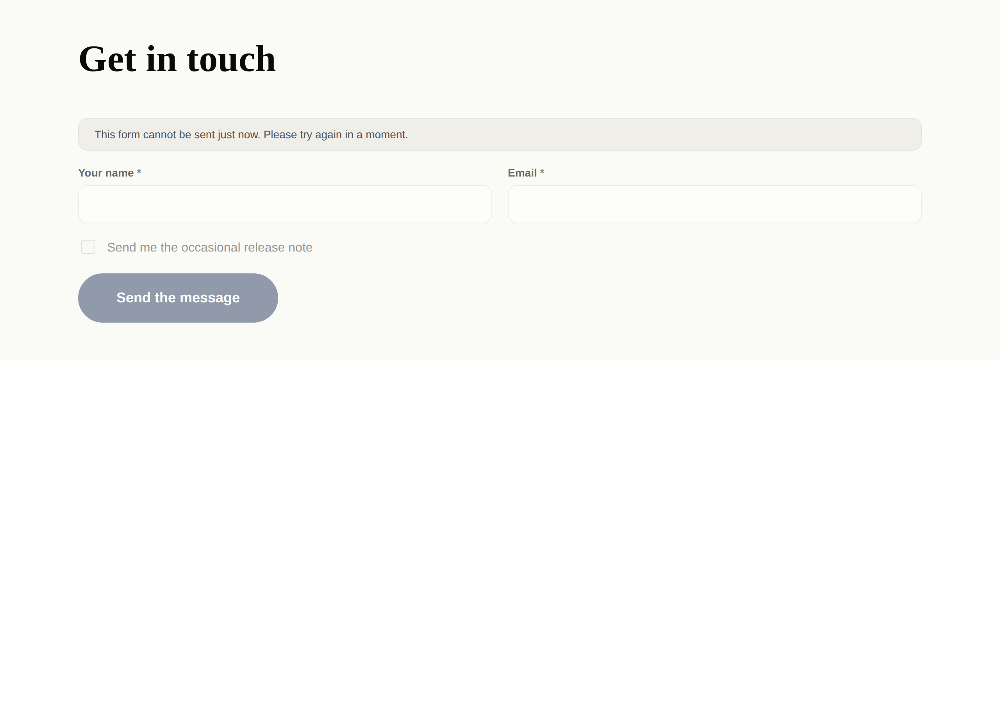
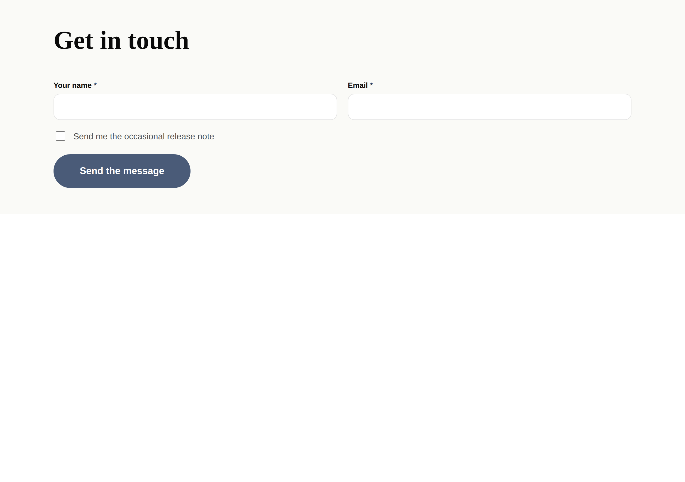
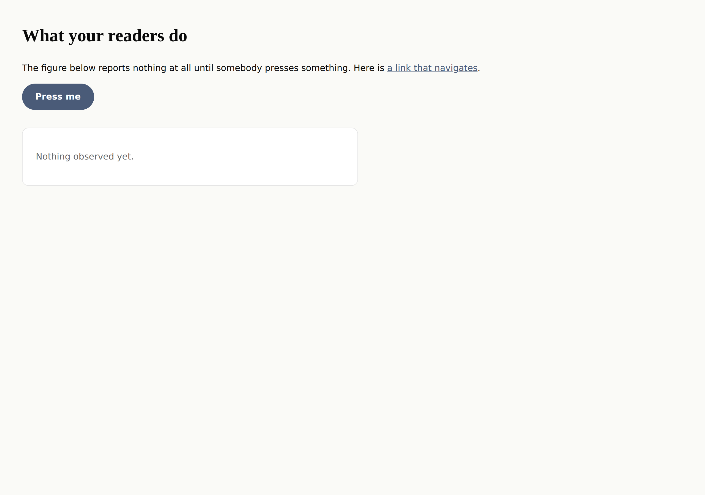
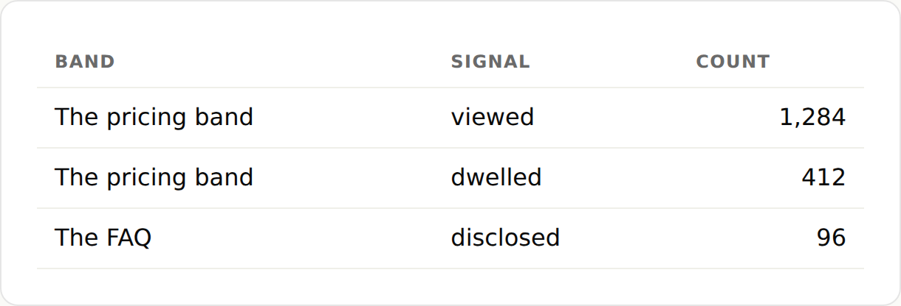
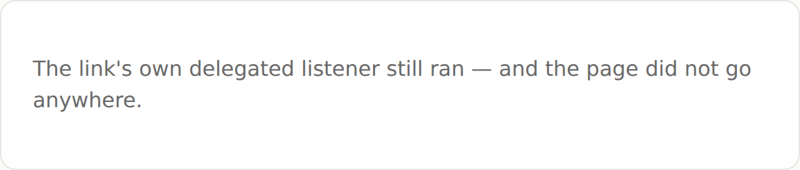

# The instruments — reaching the state worth photographing

**Routine:** `Loom daily build` (framework) · **Date:** 2026-09-15
**Branch:** `framework-36-the-instruments` · **Section:** §1 (process)

## What this run did

Two lanes filed the same complaint from opposite ends in the last three days,
and both worked around it by writing a private script — which is the exact drift
[0117](../decisions/0117-one-harness-two-subjects-a-tree-it-renders-and-an-address-you-serve.md)
consolidated two harnesses to stop. **The harness could photograph a page and
could not reach the state on that page worth photographing.** Both are closed.

`pnpm shoot` gains **`do`** — an ordered list of `{ click }` and `{ wait }` steps
run after `waitFor` and before the shutter — and **`clip`**, a selector to
photograph instead of the viewport. `defineSpecimen` gains **`endpoints`**, so a
form in a specimen can name a destination the render resolves.

[0159](../decisions/0159-an-instrument-may-reach-a-state-and-may-never-assert-one.md)
records the boundary all three sit inside, and it is the line worth having
written down: **an instrument may reach a state, and may never assert one.** A
shot may reach the third screen of a flow; it may not check what is on it.
Anything phrased as *did it…*, *is it…*, *wait until it says…* is a test and
belongs in Vitest. Without that line the next request is `expect` in a shot list
and the thing six lanes share quietly becomes a test runner nobody chose.

## The form half

`Loom primitives` filed it: *"the specimen harness cannot wire a submission, so
every form it photographs is grey."* `resolveTreeSubmissions` appeared nowhere
under `tools/specimen/`, so a `loom.form` could never name a destination and
correctly drew the state it draws when nobody said where to post. The lane that
shipped the `checkbox` field type had to lift the fields out into a `loom.stack`
to photograph it — a specimen of markup no real page has.

Left, the same specimen with no endpoints declared. Right, with them.





**One change from the shape the finding proposed, and it is the interesting
part.** It asked for endpoints; it gets **targets**. The seam takes a
`SubmissionEndpoint`, whose `target` is an async call free to mint a token
against a store — which is a photograph that depends on a network, free to be
slow, to fail on a bad afternoon, and to make two runs of one specimen produce
two different pictures. A specimen declares the answer instead:

```ts
endpoints: {
  "contact.enquiry": { action: "/contact", method: "post", fields: [] },
}
```

It is still validated. The declared targets go through `defineEndpoint`, so a
specimen naming `//evil.example` as an action is refused at the harness rather
than in review — asserted in a test, because that is the costliest composition
mistake in the seam and the one least likely to be caught by eye.

## The press half

`Loom docs` filed it: *"the screenshot harness cannot photograph a block that
only exists once you press it."* A reader-signal figure reports nothing until
somebody scrolls, presses or opens something, so photographed on load it is a
correct picture of a component with nothing to say — the one thing the page
exists to prove it does not do. That run wrote about forty lines of Playwright
in `/tmp`, and its best image was the one the harness did not take.

The page below, photographed on load and then with two steps and a clip:



```json
{
  "path": "/what-your-readers-do",
  "out": "signals-figure",
  "do": [{ "click": "[data-cta]" }, { "wait": 500 }],
  "clip": "#figure"
}
```



**Three things had to be decided rather than inherited**, and each is a way the
obvious implementation would have been quietly wrong:

**A `do` list pins the page.** The finding predicted this and it is now the
harness's behaviour rather than a lane's to remember: a click on a real
`a[href]` navigates, so step two would run on a different page and the picture
would silently be of somewhere else. Anchor clicks get `preventDefault` in the
capture phase for the duration of the steps — **never `stopPropagation`**,
because the page's own delegated listeners must still see the click. A
reader-signal broadcaster *is* a delegated listener on the root, so suppressing
the event would photograph the instrument instead of the page. Proven rather
than asserted: below is a shot whose only step clicks a link to `example.com`.



**Overflow is measured after the steps, not before.** Nobody asked for this. A
disclosure that opens or a list that grows is precisely what pushes a page past
the phone, so measuring the page the load produced would have reported the width
of something nobody is looking at — the phone-overflow check being wrong in
exactly the cases `do` exists to reach.

**`do` is `pnpm shoot`'s and not a specimen's.** A specimen page is
`renderToStaticMarkup` with no dev server and no hydration, so there is no
script in it to press. Offering steps there would offer a lane a list that
silently does nothing.

A wait is capped at 30 seconds with no way to ask for more —
[0140](../decisions/0140-a-call-into-foreign-code-has-a-ceiling-and-the-runtime-owns-it.md)'s
rule applied to an instrument, because a merge gate that hangs is
indistinguishable from one that is slow. Both step members are `.strict()`, so
`{ "clik": "..." }` is refused rather than parsed as an empty step that runs,
does nothing, and photographs the page the load produced. `clip` and `fullPage`
together are refused rather than resolved by precedence: they mean opposite
things, so picking a winner hands a lane the wrong picture without a word.

## A finding whose proposed fix I refused

*"A specimen cannot be put beside the code it photographs"* (`Loom primitives`,
12 September) asked, in its still-open general form, whether **a glob for
anything with a compound extension under `src/`** should replace the two exclude
patterns in `tsconfig.build.json` — one line instead of two.

**It must not, and it would have taken the whole starter library out of the
published build.** `src/**/*.*.ts` matches `src/primitives/loom.card.ts`.
Counted on `main` today: **97 files under `src/` carry a compound extension and
are runtime code** — every registered primitive, by the naming convention 0061
settled.

The real invariant is not about file names. It is *nothing the build includes
may import from outside `src/`* — which is the condition TS6059 was reporting,
and is checkable directly by walking the included files and refusing a relative
import that escapes `src/`. The failure would then name the file and the choice
instead of arriving as a red merge gate on a lane that was following a README,
which is how **both** halves of that finding were discovered.

**Left open with the shape named rather than built.** It is a third subsystem in
a run whose unit is the harness, and nobody is blocked. The judgement and the
evidence are in `FINDINGS.md` under the finding, which is what its general form
asked for.

Its second, smaller observation was correct and is now in `docs/routines.md`
beside the token discipline: **`pnpm verify 2>&1 | tail -35` reports exit 0 on a
failed verify**, because the exit code is the pipe's. This run redirected and
checked `$?`.

## Records

- **[0159](../decisions/0159-an-instrument-may-reach-a-state-and-may-never-assert-one.md)** —
  *An instrument may reach a state, and may never assert one.* Accepted. Five
  alternatives recorded, including the two that look more faithful to the
  runtime and make the instrument worse: a shot list that embeds a Playwright
  script, and `endpoints` taking a `SubmissionEndpoint`.
- Nothing superseded. `pnpm decisions:index` run; 0158 and 0160 are claimed on
  unmerged branches (#304 mine, #305 primitives'), so this took 0159.

## Findings

**Closed, both by this branch:**

- *the screenshot harness cannot photograph a block that only exists once you
  press it* (`Loom docs`, 13 September) — `do` and `clip` landed as proposed.
- *the specimen harness cannot wire a submission, so every form it photographs
  is grey* (`Loom primitives`, 14 September) — `endpoints` landed, as targets
  rather than endpoints.

**Answered, still open:** *a specimen cannot be put "beside the code it
photographs"* — general form. Proposed fix refused with the count; the right
shape named.

**Filed:** none. Nothing new was found outside this lane.

**Two greyed pictures in the repository are now retakeable and they are
`Loom primitives`', not this lane's:** the `checkbox` specimen that lifted its
fields out into a `loom.stack`, and the workaround noted in
`states-and-paging.specimen.ts`.

## Tests

`pnpm verify` **exit 0**, read from a redirect rather than a pipe.

| | |
| --- | --- |
| runtime tests | **2,591 passed** (149 files) |
| application tests | **4,252 passed** (248 files) |
| added this run | **20** (4 capture loop, 3 browser adapter, 6 specimen endpoints, 7 shot-list schema) |
| prerender check | 101 pages, 786 text junctions, 0 run together |

Nothing was skipped, weakened or quarantined. One test failed on the way and is
worth recording because the check earned its keep: the decision-citation check
caught a record filename I had written from memory
(`0140-a-foreign-call-has-a-ceiling-…` against the real
`0140-a-call-into-foreign-code-…`). That is the check doing precisely the job it
exists for, on its author's lane.

Beyond the unit tests, both seams were driven end to end against real Chromium:
the two form specimens and the four shots above are this run's output, not
mocks. The navigation pin is the only claim a unit test cannot fully make —
`preventDefault` without `stopPropagation` is a browser behaviour — so it is
photographed instead.

## Open questions

**1. Nothing here is blocking.** No maintainer comments were open when this run
started; #304 carries only the Vercel bot and my own comment.

**2. Four reaches are not offered and are findings rather than omissions if a
lane wants them**: typing into a field, hovering, scrolling to a position, and
waiting for a *condition*. The first three fit 0159 and are simply not yet
asked for. The fourth is the one to be careful with — *"wait until the selector
appears"* is `waitFor` and already exists, while *"wait until the count is 3"*
is an assertion wearing a wait's clothes.

**3. The build-boundary check** is named and unbuilt, above. One small unit of a
future run, this lane's, nobody blocked.
