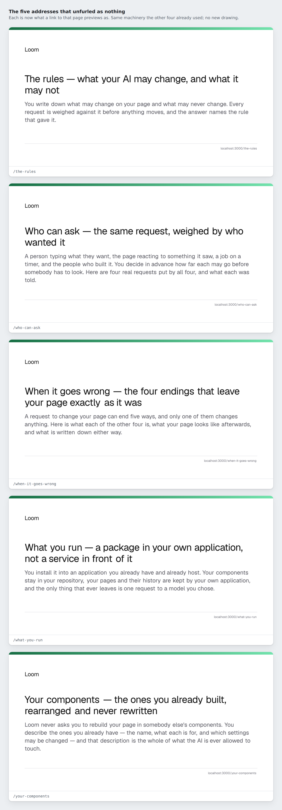
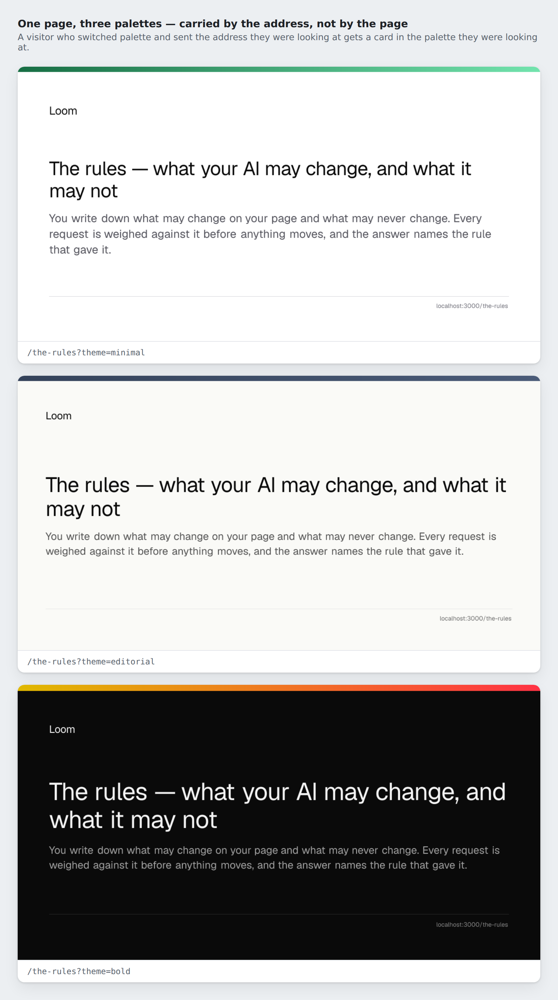

# 2026-09-15 — marketing: nine cards, and the twelve lines that were being copied

The layout has said since the machinery landed that *"every page replaces the
title, the description and everything a shared link unfurls as, in its own
`generateMetadata`."* On 14 September, **four of the nine did.** The other five
exported a static `metadata` with a title and a sentence, so a link to any of
them pasted into a channel previewed as a bare address with no picture at all.



Those five cards are what shipped. No new drawing, no new copy — the machinery
was already generic over a route and had been since 2 September. What was
missing was the five pages calling it, and anything that would have said so.

---

## What shipped

`/the-rules`, `/who-can-ask`, `/when-it-goes-wrong`, `/what-you-run` and
`/your-components` now announce themselves the way the other four already did.
This was the first item the 14 September run left for this one, filed against
this lane so the next run would not re-derive it.

Three things, and the first is the smallest of them.

### The five pages

Each one is a static `metadata` export removed and a `generateMetadata` put in
its place. Nothing else on any of the five changed; no page's tree, copy or
layout was opened.

### The twelve lines nobody should copy again

The interesting half is **why five pages could stop**, because it was not
carelessness and the same mechanism will produce the sixth.

`generateMetadata` was twelve lines of identical glue in every page that had it
— a `SearchParams` type, an async function, an await, and a call to
`pageMetadata` with the route and the palette. A page added after that landed
was written by copying the page beside it, and the pages beside the newer ones
were the ones that did not have it. The layout's comment said what to do; the
file next door said what to write; they disagreed, and the file next door won
five times running.

So the glue is now one exported factory, `routeMetadata`, and a page's whole
share of it is **one line naming its own route**:

```ts
export const generateMetadata = routeMetadata(THE_RULES)
```

Eight of the nine are exactly that, including the three that already had the
long form and did not need touching — they were converted precisely because a
tenth page will be written by copying one of them, and what it copies should be
the line that cannot be half-written. There is nothing left in it to leave out.

**The front door is the ninth and keeps its own**, and that is now asserted
rather than left as a comment. `/?ask=shorter` is the front door with a band
lifted under the headline; it has an address, and its card is the verdict the
rules reached on that request, run for real. A factory that reads only the route
and the palette cannot express that, and the day somebody tidies the front door
into the one-liner beside it, three tests go red and say what was lost.

### The test the finding asked for

The finding's own sentence was *"the fix is a test as much as an edit"*, and it
was right about why:

> `share.test.ts` holds what a card **says** and nothing holds that a route emits
> one, which is why five could stop.

Every existing assertion about cards is against `pageMetadata`, `publishedCard`,
`askedCard` and `shareImageHref` — **functions**. A page that never calls them
fails no test of them. Everything was green for three weeks with five pages
silently announcing nothing.

`app/(marketing)/announced.test.ts` is the other direction: it imports the nine
page modules and asks each what it actually exports.

| what it holds | why |
| --- | --- |
| this file has a module for every route in `SITE_ROUTES` | the import map is hand-written, so a tenth page cannot be added and left out of the test |
| each page exports a `generateMetadata` | the thing the five did not have |
| and does **not** also export a fixed `metadata` | the shape they did have — and the one Next refuses to build, so this fails first with a sentence rather than a build log |
| its result equals `pageMetadata(route, …)`, in all three palettes | the page announces what this site announces, not an approximation of it |
| the picture it points at is this route's, and absolute | a crawler is on somebody else's machine |
| the address it hands a crawler, fed to the route that answers it, draws **this page's** card | the whole way round, and the only assertion here that survives the two halves drifting together |

The last row is the one worth having. Everything above it compares one of this
lane's functions against another; that one takes the address out of the rendered
metadata, hands it to `shareImageFor` — the same call the image route makes —
and checks the headline and the address on the card that comes back.

## The palette travels, which is the part that is free

Not new, and worth a picture because it is the plainest demonstration on the
site that a re-theme is three registered ids and nothing else. The palette is in
the address, so the card is drawn in the palette the visitor was looking at when
they copied it.



Five pages gained that at the same time, for nothing, because it was already in
`shareImageHref`.

## Tests

`pnpm install && pnpm verify` — **green, exit 0. Nothing failed, nothing skipped,
no test weakened or deleted.**

| suite | before | after |
| --- | --- | --- |
| `@loom/runtime` | 2571 / 149 files | **2571 / 149 files** — `src/` was not opened |
| `@loom/app` | 4252 / 248 files | **4319 / 249 files** |
| marketing, within it | 1350 / 30 files | **1417 / 31 files** |

Baselines measured on `main` at `f62b9bc` by stashing this branch and running the
suite, not quoted from a report. `findings:check` reads 625 entries, 0 malformed;
`prerender:check` 101 pages, 786 text junctions, 0 run together.

Sixty-seven new assertions in one new file. **No existing test was changed**, in
either direction — the new file asserts a property no existing test had an
opinion about, and the eight pages converted to the factory produce metadata
byte-identical to what they produced before, which is what `share.test.ts`
was already holding.

### Mutations

| mutation | result |
| --- | --- |
| `/the-rules` put back as it was on `main` — static `metadata`, no `generateMetadata` | **7 tests red on that page alone** |
| a page announcing a different route (`routeMetadata(THE_RULES)` on `/who-can-ask`) | **5 red**, including the round trip |
| the front door converted to the shared factory | **3 red** — the ask leaves the title, the picture and the card |
| a route added to `SITE_ROUTES` with no entry in the import map | **8 red** — the named one first, then the seven that cannot find a module |
| `routeMetadata` dropping the palette and always drawing `minimal` | **16 red** — the eight pages that take the factory, in both palettes that are not the default |

The first of those is the check that mattered: the test is worth nothing unless
it fails on the exact state `main` was in this morning, so that state was
restored and measured rather than reasoned about.

## Checked by looking, as well

The document head, on the running build, for each of the five:

```
<meta property="og:image" content="…/share-image?page=%2Fthe-rules&theme=minimal"/>
<meta property="og:image" content="…/share-image?page=%2Fwho-can-ask&theme=minimal"/>
<meta property="og:image" content="…/share-image?page=%2Fwhen-it-goes-wrong&theme=minimal"/>
<meta property="og:image" content="…/share-image?page=%2Fwhat-you-run&theme=minimal"/>
<meta property="og:image" content="…/share-image?page=%2Fyour-components&theme=minimal"/>
```

The cards above are those five addresses fetched from that build, at the
1200×630 the tag declares. The origin reads `localhost:3000` because that is
where they were drawn.

**On the preview it should be the preview's own host, and I could not check
that.** `siteOrigin()` prefers `LOOM_SITE_ORIGIN`, then `VERCEL_URL`, and the
deployment for this branch went green while the run was still open — but
`*.vercel.app` is not in the sandbox's allowed domains, so fetching it returns
nothing at all. That is the policy working as intended rather than anything
broken, and it is filed. Every screenshot and every measurement above is from
the local build; the preview is unverified from here, as it is in every report
this project has published.

Every card is in the renderer's own face rather than Geist, as every card this
lane has published has been — `ImageResponse` draws without fetching a font,
deliberately, so the one asset other people's servers fetch cannot fail because
a CDN is down. Stated rather than papered over; it is the existing font finding
and nothing here changed it.

## Decisions and findings

**No record written.** The change is compositional, adds nothing to the library,
constrains nothing outside this lane and touches no Accepted record. `src/` was
not opened, no other route group was touched, no primitive was added, and no
colour is named in the diff.

**One closed:** the 14 September entry against my own lane, in full — the five
pages, and the test it asked for.

**One filed**, for `Loom docs`, `Loom demo` and `Loom lessons`: **nothing outside
this route group emits a card either.** `openGraph`, `twitter:` and
`opengraph-image` appear nowhere in the other three public surfaces, so every
docs page, the demo and every lesson previews as a bare address. It carries the
trap with it — `/share-image` answers for any path but resolves an unrecognised
one to the front door, so a docs page naively wired to it would unfurl
confidently as the marketing home page, which is worse than no card. Two ways
out are offered and neither is mine to pick.

**Two still open and untouched.** The share-card finding of 2 September asks for
the hand-drawn card to be retired *when this lane next opens that file*; this
branch did not open `share-card.tsx`. And the bar still cannot group, which is
why five of nine pages are off it.

## Open questions

- **The licence line** (#96, on every marketing PR since #134). Still the site's
  one placeholder and still the Phase 2 gate. Untouched.
- **Positioning, audience and pricing.** Untouched, as on every run. Nothing on
  the five new cards is a new sentence: each is the route's own title and
  description, already on the page and already held by `voice.test.ts`.

Nothing scheduled and nothing armed.
