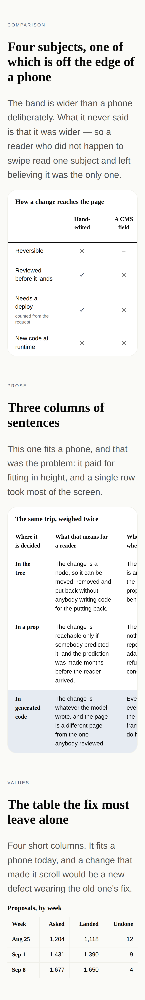

# A table a phone can read

**Routine:** `Loom primitives` · **Date:** 2026-09-15 · **Branch:**
`primitives-35-a-table-a-phone-can-read` · **Section:** §4b

## Why this and not more primitives

The brief is breadth, and this run added no primitives. That is the choice it
made rather than a shortfall, and the reasoning is short.

`docs/primitive-gap-inventory.md` — this lane's own measurement, taken on 13
September — says **Tier A is five primitives and one enum widening**, and
`primitives-29` and `primitives-31` shipped all six between them. Tier B is nine
things that arrive together or not at all, because they are one framework
decision (`select` in the behaviour vocabulary) rather than nine ports, and
`BEHAVIOUR_NAMES` is still `["copy", "disclose", "adjust"]` on `main` this
morning. Tier C is twenty-two things that look missing and are not, checked so
that runs stop re-proposing them.

So the honest list of primitives this library could add today is empty, and the
inventory's own arithmetic says the route to the demo target is the second row —
starting compositions, nineteen of them so far — not a ninety-eighth type.

What was **not** empty is `FINDINGS.md`. Two entries, filed nine days apart by a
lane that is not this one, measured rather than eyeballed, both owned here, both
open:

> **13 September, `Loom marketing`:** *a comparison is four subjects wide on a
> laptop and one subject wide on a phone.* `/who-can-ask` is the best band this
> lane has built and a phone reader gets a quarter of it.

> **14 September, `Loom marketing`:** *`loom.table` is the same shape of problem
> on a phone, measured.* Three prose columns at a hundred pixels each is one row
> 504 pixels tall.

Both say *nothing is blocked*. Both were worked around by writing the table's
argument out in prose underneath it — twice, on two pages. A band the marketing
site has to talk its way around is a band the demo will have to talk its way
around, and the demo is this month. **That is the work that was actually
waiting**, and the brief's quality mandate is not a lower priority than its
breadth mandate.

## What the run did

Four things, in one unit, because they are one sentence: *a table that does not
fit a phone should say so, be reachable, land cleanly, and not crush its prose
to fit.*

| | |
| --- | --- |
| **0155's second instance** | the two widths that decide what a 390px reader sees were inline styles, so no rule could reach either |
| **The peek** | the criterion column narrows to 9rem below 48rem, which is the 13 September finding closed |
| **The region** | both scrollers are focusable, named, snapped — `loom.carousel`'s answer, which these bands never picked up |
| **`prose`** | a table that says its cells are sentences gets a readable measure, which is the 14 September finding closed |

## Measured, before and after

Reproduced in Chromium at a true 390px viewport, on one page holding all three
shapes of table. `src/primitives/tables-on-a-phone.specimen.ts` is the
reproduction and it is committed, so the next run does not rebuild it.

| at 390px | before | after |
| --- | --- | --- |
| comparison, 4 subjects | 641px wide, criterion **192px**, 44 blank pixels of subject 2 | 593px wide, criterion **144px**, **92 pixels** of subject 2 — past its mark |
| table of sentences | 348px, fits, tallest row **360px** | 492px, scrolls, tallest row **193px** |
| table of values | 350px, fits, rows 41px | **350px, fits, rows 41px** |
| the page itself | `scrollWidth` 390 | `scrollWidth` 390 |

And at 1280px, every number in all three tables is **unchanged** — same widths,
same row heights, same cell widths. That is half of what this run claims and it
is in the wide photographs.

The third row is the one the design turns on. It is the control, it is in the
specimen on purpose, and a run that had fixed the first two by making it scroll
would have traded a measured defect for a new one.

## 0155's second instance, which is what made the rest possible

`loom.comparison` set `min-width: 7rem` on every answer. `loom.comparison-row`
set `min-width: 12rem` on every criterion. Both comments said the same thing
about the pair — *"the intrinsic answer to a narrow screen, with no width query
to declare"* — and half of that was right: the arithmetic does belong to the
content. The half that was wrong is that it never varies.

An inline style beats a rule, so **the two numbers that decide what a phone
reader sees were the only two in the band that no rule in the library could
reach.** Yesterday's record
([0155](../decisions/0155-a-container-may-only-add-to-its-children-what-they-left-unspoken.md))
named this constraint from the pager's side; this is the first place it was
costing a reader something rather than costing a container a treatment.

Both moved to `stylesheet.ts` at the same values, so nothing about the wide
rendering changed — and the test asserts **both halves**, the rule present and
the property absent from the markup, under both palettes. That second assertion
is the whole point: a width put back on either element would leave the media
query quietly doing nothing, with no error, no warning, and a phone rendering
that is merely wrong.

## The peek, and why not a fade

The 13 September finding suggested the band should **stack** on a narrow
viewport. It does not, and the reason is below under what the library still
cannot do.

What it does instead is the affordance `loom.carousel` already chose, and that
file had already argued the case against the alternative:

> A scroll-linked mask would say the true thing and it is not static CSS the way
> 0055 requires the rest of the library's motion to be, so the affordance is the
> honest one instead: **an item is never wider than 82% of the band**, so the
> next one is always visibly cut off.

The thing worth reporting is what the measurement showed about the comparison
band: **it already had a peek, and the peek was blank.** Criterion 192 plus one
subject 112 is 304 of 348, so 44 pixels of the second subject were on screen the
whole time — and an answer is centred in a 112-pixel cell, so 44 pixels of it is
padding. A reader could look straight at a four-subject comparison and come away
certain there was one, while the second subject was technically visible.

Nine rem puts 92 pixels on screen, which is past the centre of that cell and so
past its mark. In the phone photographs two subjects are readable where one was.

**It costs something and the cost is in the numbers above.** A narrower criterion
column wraps more, and the tallest row in the band goes from 80px to 107px. That
is the trade: about 60 pixels of band height, for three subjects a reader did not
know existed.

## The region, which had overflow and nothing else

Both bands rendered `
` and stopped there. Four
things were missing, all of them settled by `loom.carousel` on 28 August and
never carried across:

- **Focusable.** A scroll container is focusable by default in some browsers and
  not in others. A keyboard reader could not scroll either band in the ones where
  it is not.
- **Named.** An unnamed focus stop is worse than none, so the name is the
  caption where there is one — `aria-labelledby`, the same id the table already
  points at, rather than a second string to keep in step — and a declared word
  where there is not. `group` rather than `region`, because six tables in a
  document should not put six landmarks ahead of the page's own.
- **Snapped.** `proximity` rather than the carousel's `mandatory`, deliberately:
  a carousel is read one item at a time, and a comparison is read by holding two
  subjects side by side, which mandatory snap takes away the moment a reader lets
  go.
- **`scroll-padding-inline-start`.** The one line a carousel has no use for. The
  criterion column stays put while subjects travel under it, so a subject snapped
  to the start of the region arrives *underneath* the question it answers. The
  padding is the sticky column's width and moves with it in the media query.
  `loom.table` deliberately has none: a general table's heading column is as wide
  as whatever somebody typed, and padding a snap by an undeclared width is a
  guess that is wrong on every table but one. There is a test asserting its
  absence, so a later run copying the rule across has to decide to.

**One thing the screenshots could not have caught.** Both bands clip themselves —
a panel rounds its corners with `overflow: hidden`, and that wrapper is the
scroller's parent — so the carousel's `outline-offset: 2px` would have drawn the
new focus ring in the two pixels the parent cuts off. A focus stop that lands
somewhere and shows nothing is worse than the unreachable region it replaced.
The offset is `-2px` here and there is a test on it, because a photograph of an
unfocused band cannot show this and nothing else would have.

## Which Hermes fields became nodes, and which stayed props

Nothing was ported this run, so the honest answer is **none, and one prop was
added.** The granularity question it had to answer is still the one the brief
asks about, so here it is against the rule rather than asserted:

`loom.table` gains **`prose: boolean`** — *these cells hold sentences.*

- *Does changing it change the set of nodes?* No. Same rows, same cells, same
  children. It changes how however-many rows are painted, which is the doc's own
  test and the same answer `density`, `rules` and `tone` give in the schema
  beside it.
- *Is it a delta in disguise?* The only operation that could express it is
  `configure`, which is what a prop is.
- *Is it the near-miss?* The trap is a prop that decides *how many* children
  exist. This decides a measure applied to all of them.

What was not obvious is that **there are two ways to write this prop and only one
of them is right**, which is
[0160](../decisions/0160-a-prop-that-unblocks-a-rendering-names-the-content-and-never-the-layout.md).
`narrow: "stack" | "scroll"` reads better at the call site and pins every tree
that sets it to the rendering the library had in September. `prose: true` says
something about the content that is true now and stays true, and leaves what to
do about it to the library. The precedent was already in the file next door:
`loom.table-cell`'s `numeric` names what the cell holds, not the
`font-variant-numeric` it causes.

**It is a prop because both ways of avoiding one were measured and neither
works**, and that is in the record and the ledger rather than asserted:

| rule | prose table | the table that was already right |
| --- | --- | --- |
| `min-inline-size: fit-content(12rem)` | **no effect at all** | no effect |
| `min-inline-size: 12rem`, unconditional | 492px, row 193px | **744px, and it scrolls** |
| the same, behind `prose` | 492px, row 193px | untouched |

`fit-content(<length>)` is exactly this rule conditioned on the content —
`min(max-content, max(min-content, L))` — and Chromium ignores it for
`min-inline-size`. If that changes, the prop becomes a default and then a no-op,
and there is an entry in `FINDINGS.md` saying so.

## What the library still cannot express

**A cell cannot be labelled by its column heading, so no table here can stack.**
Filed for `Loom daily build`. Both marketing findings asked for a stacked
rendering and neither got one, and it is the same wall both times: a stacked row
is three sentences or four marks with nothing saying which column or subject each
came from, and the label is a node in a different row. Four routes were
considered and each fails on its own terms — a rule cannot copy text between
elements, a custom property inherits downwards and a heading is a cell's cousin,
a container that introspected its own rendered slot would be parsing its own
output, and a `label` prop is the heading said twice with nothing keeping the
copies in step.

This is the **second instance** of the shape this lane filed on 14 September —
*a container cannot tell its child which element to be, so a radio group is not a
field type.* Both are a container holding something its child must render with no
way to hand it over. Two instances is the bar 0114 sets for taking a seam
seriously, and it is the framework's to open: a per-primitive answer here is a
`label` prop on one cell type and a different dodge on the next.

Worth saying plainly, because it cuts against the findings that asked for it:
**stacking may still be the wrong rendering even once it is possible.**
`loom.table` exists because `Loom lessons` degraded thirteen lessons' tables into
one card per row and lost the column-wise scan that made the author write a table
at all. The door should exist. It is not a fix that is owed.

**`loom.code` is the third scroller and was left alone.** It has `overflow-x:
auto` on its own `<pre>` with the same missing region treatment, and it is a
different case — a copy behaviour sits on it and it already offers `wrap` as an
escape from scrolling entirely. Folding it into the shared class is a real
follow-up and not this branch's; a branch carrying both is a branch nobody
reviews.

## Outside the lane

One file: `apps/loom/app/(docs)/_lib/api/reference.generated.json`. It is
generated, `LIBRARY_CLASS`'s published signature moved when the two classes were
added, and `pnpm verify` fails until it is regenerated with the command its own
assertion names. Regenerated, not edited — which is 0139, and the reason the
assertion exists.

## Checks

- `pnpm install && pnpm verify` green, twice: once before the reference was
  regenerated (which is how the one cross-lane file was found) and once after.
- 2574 tests in the runtime suite and 4252 in the application's, all green.
  Three are new, and **each was verified to fail when the thing it asserts is
  broken** — the inline width put back, the phone criterion width
  changed, the prose rule widened past the body. A test that cannot fail is
  decoration.
- Four photographs, two palettes, two viewports, `scrollWidth` 390 at 390 and
  1280 at 1280 in all of them.
- No literal colour anywhere in the diff; every value is a token or a length.
