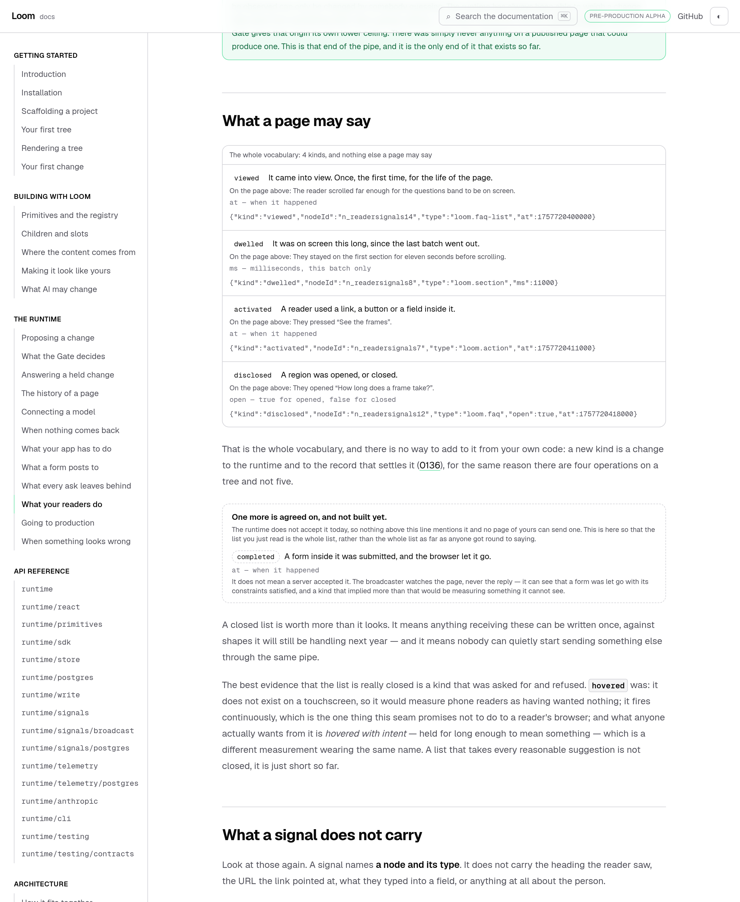
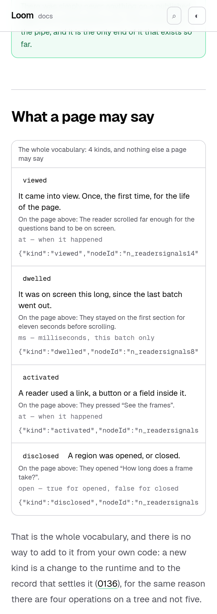

# 16 September 2026 — the fifth kind, and the page that could not let it in

**Routine:** `Loom docs` · **Branch:** `docs-26-the-fifth-kind` · **Section:** §4c

**Preview:** the pull request's Vercel deployment for
`/docs/the-runtime/what-your-readers-do`. Read off the deployment rather than
opened — `vercel.app` is off this sandbox's egress allowlist, which is the
standing 15 September finding and is not re-filed. Every screenshot below is a
production build of this commit, served locally by `next start`.

## What this run was

Not the plan. An open finding owned by this lane, filed by `Loom daily build` on
13 September, which had been **blocking step 2 of `docs/signals.md` for three
days**:

> *"It cannot land while /docs/the-runtime/what-your-readers-do says there are
> four, and that page is yours."*

`completed` — the reader signal that fires when a form submits, and the
difference between a portal showing engagement and showing conversion — was
approved and unbuildable, because adding it to the runtime would have turned
`pnpm verify` red for **four surfaces** at once. The page did not merely count
four; it argued four, and `claims.test.ts` held it to the argument.

Two docs runs went past this finding on 14 and 15 September. It is cleared.

## What shipped, and why it is not the fifth row

The finding asked for *"the fifth row and the prose around it."* Writing that
would have moved the problem one kind further along: a page that argues five is a
page that blocks the sixth. So the page stopped counting out loud.

**The count is the runtime's to state.** `produceKinds` already walked
`READER_SIGNAL_KINDS`; now that block's caption is the only place a reader is
given a number. The two sentences that were doing it in prose — *"Four things,
and nothing else."* and *"There is no fifth kind"* — are gone.

**The opening enumeration is produced too.** *"which part someone looked at, what
they stayed on, what they pressed and what they opened"* is an arity written out
longhand, and it was typed into the second paragraph. It is now
`<WhatAPageMaySay />`, built from the same table, and it gains *"and what they
finished"* on the day the kind lands without anybody opening the MDX.

**`completed` is described today, as agreed on and not built.**
`<TheApprovedAddition />` prints what it means, what it carries, and the sentence
a name cannot carry: *it does not mean a server accepted it* — the broadcaster
watches the page and never the reply. It is deliberately outside the vocabulary
panel, dashed rather than solid, and **it renders `null`** once the kind is in
`READER_SIGNAL_KINDS`. No sentence in the prose mentions it, so there is no
announcement left over talking in the future tense about something that arrived.

**The closed-list argument is now carried by the kind that was refused.**
`hovered` was asked for and turned down: absent on touch, fires continuously,
and what anyone actually wants from it is *hovered with intent*, which is a
different measurement wearing the same name. That is a better argument than four
was, and the finding predicted it would be — *"a list that takes every reasonable
suggestion is not closed, it is just short so far."*

## The part I nearly got wrong

The obvious way to check this work is to reason about it. I ran it instead: added
`completed` to `src/signals/kinds.ts` locally, built, ran the whole `(docs)`
suite, then reverted. `src/` is not touched by this branch — `git diff src/` is
empty.

It found two things I would otherwise have shipped.

**One, the runtime change is two edits and not one.** `readerSignalSchema` is a
`z.discriminatedUnion`, so growing the enum alone leaves every `completed` signal
refused by its own discriminator. Step 2 needs the union member as well. That is
now written into the closed finding with the exact shape, and it is why the test
that pins the example signal says *"only the missing schema variant stands in the
way"* rather than the enum — my first version said the enum, and was wrong.

**Two, my replacement tests were the same mistake one file further back.** Written
the obvious way they pinned the *pre-landing* state: that `completed` is
announced, that the schema refuses it. Under the rehearsal five of them went red,
which means I had moved the blockage out of the page and into the test file. They
are now written to pass on **both** sides of the change — each asserts either an
invariant that does not care, or the correct behaviour for whichever state the
runtime is in.

A third thing the rehearsal caught was a straight conflict between two of my own
tests: an inherited one required every kind to be named *in the prose*, and a new
one forbids the prose from naming a pending kind. A kind whose whole design is
that it reaches the page through a producer could never have satisfied the first.
It is replaced by the check that is still worth making now that prose may not
enumerate: **the prose may name no kind the runtime has dropped** — everything it
names in code voice is live, except `hovered`, which it names on purpose.

## At 390 pixels

`document.documentElement.scrollWidth` is exactly 390 at a 390px viewport and
1280 at 1280. The dashed block is prose and wraps; the JSON beside each kind
scrolls inside its own box, as it already did.

The screenshots are light. That is the standing gap this lane recorded on 14 and
15 September — `pnpm shoot` photographs an address, the theme lives in
`localStorage`, and the harness has no way to set one before the shutter. Not
re-filed.

## Decisions taken that were not specified

**The announcement is a component rather than a paragraph, and has no heading.**
A heading would enter the sidebar's table of contents and then leave a gap in it
when the block empties. It is styled as a note standing outside the list, so a
reader counting what a page may say today counts the panel and stops.

**`EXAMPLES` is typed `Record<DocumentedKind, unknown>`.** The entry for
`completed` is genuinely not a `ReaderSignal` yet, and typing it as one would
have meant either leaving the kind out — the problem — or asserting a lie past
the compiler. Nothing is lost: every value goes through `readerSignalSchema`
before it reaches a page, and the schema is the stricter of the two. It is not
`any`.

**`DocumentedKind` is `ReaderSignalKind | "completed"`, which erases itself.**
Once the runtime has the kind, that union *is* `ReaderSignalKind` and every table
keyed on it still has exactly the right keys. No cleanup edit is owed.

**`completed`'s row says nothing on the page above can produce one.** The example
tree has no form in it. That is a claim about the example rather than about the
runtime, so it is asserted — a later run that adds a form to that tree, which is
the right way to make the row demonstrable, is told the sentence has to change
with it.

**No decision record.** Nothing here decides anything. 0136 settles the seam,
`docs/signals.md` rule 6 approves the addition, and this run documents both.
Nothing was superseded and nothing is `Proposed`.

## Tests

`pnpm install && pnpm verify` at the repository root: **green, exit 0.**

| Suite | Files | Tests |
| --- | --- | --- |
| `@loom/runtime` | 150 | 2,620 passed — `src/` was not opened |
| `@loom/app` | 251 | 4,387 passed |
| `findings:check` | — | 637 findings, 0 malformed |

Baseline on `main`, measured by stashing this branch and running the same suite:
**251 files, 4,375 tests, all passing.** So this branch is **+12 tests and no new
test files** — 5 in `signals/claims.test.ts`, 7 in `signals/page.test.ts`.

Nothing was skipped in the ordinary sense, no cap was raised, and no test was
weakened. **One test is conditionally skipped by design**: *"says what it is not,
while it is still only agreed on"* runs today and is `skipIf(landed)`, because
once the kind ships the signals beside it say what it does and the caveat stops
being the page's job. It reports as 1 skipped under the rehearsal and 0 skipped
on this branch.

The suite was green on the first full run, which is not evidence on its own — so
the claims were checked by breaking them:

- **Adding `completed` to the runtime and its schema** and running the whole
  `(docs)` suite: green with **no documentation change at all**. The row moves
  into the vocabulary block, the announcement disappears, and the opening
  sentence grows. That is the finding's actual requirement and it is the only
  check here that tests it rather than describes it.
- **Adding the enum member alone**, without the union variant: three tests fail,
  all naming the discriminator. This is how the two-edit fact was found.
- **Typing a count back into the prose** — a sentence saying "five kinds" — fails
  *"counts kinds in exactly one sentence, and that sentence is about the live
  block"*.
- **Inlining the opening enumeration** back into the MDX fails *"writes its
  opening list from the runtime rather than typing it"*.
- **Naming `completed` in the prose** fails *"keeps the coming addition out of the
  prose entirely"*, which is the test standing between this page and a roadmap
  note that outlives its roadmap.

## Scope

`apps/loom/app/(docs)/` only, plus `FINDINGS.md` and this report. Six files
changed, one of them generated: the compiled fence program for this page, whose
header carries the MDX line numbers its code blocks came from, regenerated with
`pnpm --filter @loom/app docs:fences`. **No code in any fence changed** — the
diff is four line-number comments. The API reference was not regenerated because
the runtime's published surface did not move.

**No file in another lane was opened**, and `src/` was opened only under the
rehearsal described above and restored byte for byte.

## Findings

**Closed:** *the fifth reader-signal kind is approved, and the guide to the four
is what blocks it*. The closing note carries what step 2 needs — both edits, the
schema shape, the two sentences this page is holding for it, and the reminder to
regenerate the API reference in the same commit as the export.

**Filed, one.** *A claims test that pins a correct number is how a docs page
blocks the thing it documents* — this lane, `Loom marketing`, `Loom lessons`,
`Loom primitives`. Every surface with a `claims.test.ts` has the same shape in
it, and the failure is invisible until something grows: the test is green, the
prose is true, and the cost lands on a different lane on a day nobody expects it.
The distinction offered is that a claims test is right to pin a sentence that is a
claim about something else on the page, and wrong to pin one that states the size
of a set the runtime owns — because that is not a claim, it is a copy of the
runtime's data written in English, and the test turns the copy into a lock.
Suggested as one grep each rather than a rewrite.

## Open questions

**Nothing blocking.** Step 2 is clear to land whenever `Loom daily build` picks
it up, and nothing in this lane has to move when it does.

**What I would write next**, unchanged from yesterday and now the largest hole on
the site: *Getting started* hands a reader six pages before they have run
anything. The exit condition is a stranger installing Loom, registering a
primitive and getting a proposal accepted from the site alone — and the one page
that would carry them, a single copy-paste file that renders, proposes and
applies in one process with no database, still does not exist. Every part of it
is documented; nothing puts it in one place.
