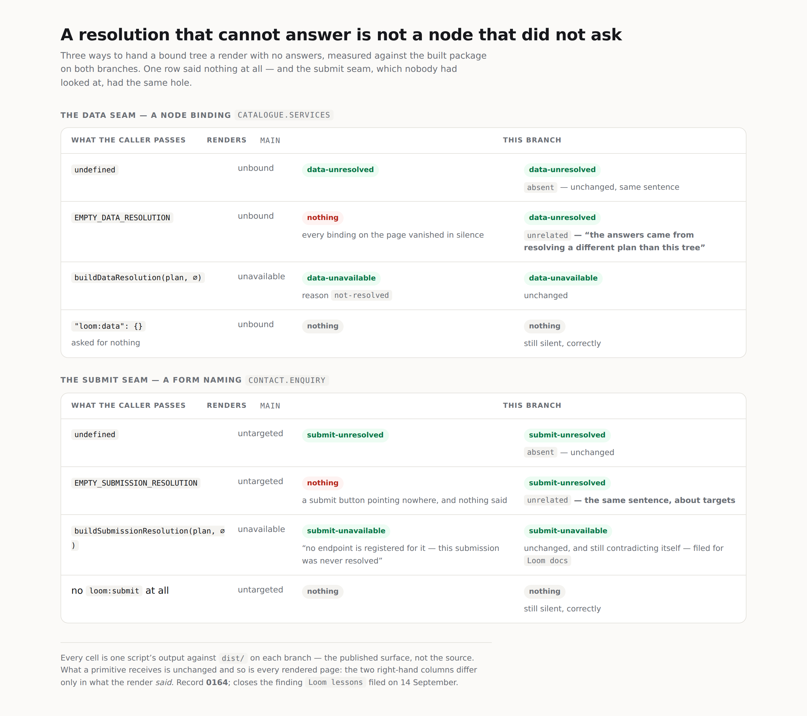

# A resolution that cannot answer is not a node that did not ask

**Routine:** `Loom daily build` · **Branch:** `framework-39-a-resolution-that-cannot-answer`
**Section:** §2 — Composition Runtime
**Record:** [0164](../decisions/0164-a-resolution-that-cannot-answer-is-not-a-node-that-did-not-ask.md)

## What this closes

`Loom lessons` filed it on 14 September, found while writing Exercise H for
lesson 18 rather than by looking for it. The finding did the whole diagnosis and
left the choice open on purpose — *"naming the absent case is a design decision
about what a reading owes a caller, and the lane that owns `src/data/` has the
standing to make it."*

There are three ways to hand a bound tree a render with no answers. The finding
measured what each did, and the middle one did nothing at all:

| what the caller passes as `data` | renders | diagnostics |
| --- | --- | --- |
| nothing at all | `unbound` | 1 — `data-unresolved` |
| `EMPTY_DATA_RESOLUTION` | `unbound` | **0** |
| `buildDataResolution(plan, new Map())` | `unavailable` | 1 — `data-unavailable`, `not-resolved` |

I reproduced that table on this checkout before changing anything, and it is
exactly as filed.

The middle row is reachable by the most ordinary route there is. A host writing a
composition root with no data reaches for a neutral "no data" value, and
`EMPTY_DATA_RESOLUTION` is the one with the obvious name. Its `lookup` then
answers `NO_DATA` for every node, and the interface's own contract said *"Always
answers; a node with no bindings gets `NO_DATA`"* — true of the constant's
intended caller and false of every other. What follows is the thing
`resolution.ts` says in a comment it exists to prevent: a page silently missing
the data it asked for.

## The half nobody had looked at

**The submit seam has the identical hole.** I found it while fixing the first
one, and it is not in the finding because the finding was about `src/data/`.

`EMPTY_SUBMISSION_RESOLUTION` answers `undefined` for every node, and `undefined`
is also how that seam says *this node declared no submission*. So a form whose
target went missing that way rendered a submit button pointing nowhere and said
nothing — which is, word for word, the failure `src/submit/resolution.ts`'s own
header names:

> a shape that cannot tell them apart guarantees it eventually shows a submit
> button that quietly goes nowhere.

Fixing one seam and filing the other would have deferred half a defect for a run
to save a dozen lines. Both are in this branch, and 0164 is written about the
pair rather than about the data seam.

## What landed

An absence in a resolution's lookup now means *the node asked for nothing*. It is
never a way to say *I have no answer for you*, and the walk reports any node that
asked and got neither a value nor a reason. Both existing diagnostic codes carry
which of the two routes it was:

```ts
export type UnresolvedResolution = "absent" | "unrelated"
```

`absent` is a render given no resolution at all — the sentence is unchanged, so
nothing that reads it today changes. `unrelated` is a render given one built from
a different tree's plan, and it is the row that used to be silent.



*Every cell is one script's output against `dist/` on each branch — the published
surface rather than the source. 1280×900; `scrollWidth` 1280 against
`innerWidth` 1280, and 390 against 390 on the phone shot beside it.*

## Three decisions that were not specified, and why

**The check lives in the walk.** A resolution is asked about a node id and has no
way to know the node declared anything; the tree knows what was declared and
nothing about what was resolved. Neither can see this alone, and the walk is the
only place both halves are in hand.

**The walk still does not parse.** `nodeDataFor`'s own comment promises that the
lookup is a map read and that nothing there parses, asks or waits. Whether a
declaration asked for anything is therefore a shape test — a non-empty object —
and not a `parseBindings` call. `"loom:data": {}` asks for nothing and stays
silent; a malformed declaration counts as having asked, because it did ask and the
plan is the thing that judges how well. The happy path costs one property loop
over a bag the walk already had.

**One code with a discriminator, not a new code.** A reader acts on both routes
the same way — the fix is the same edit by the same person in the same
composition root — and a code is the unit other lanes enumerate, where a field is
read only by whoever branches on it. `lessons/14-rendering.md` keeps a table of
every code that degrades and did not need touching.

## The one place I did not build what would have been better

**Filling the bag with `not-resolved` outcomes** would make the
`EMPTY_DATA_RESOLUTION` route byte-identical to the third row above in what it
*renders* as well as what it reports, and a primitive would stop being told
`unbound` — "this node has no binding by that name" — about a node that plainly
has one. It is the better invariant and I did not build it.

The reason is the submit seam, not the data seam. The matching change there needs
a `not-resolved` reason that `SubmissionUnavailable` does not have, and adding one
widens a published union whose five members a `(docs)` page enumerates, counts and
prints as prose:

| where | what it would break |
| --- | --- |
| `(docs)/_lib/submit/claims.test.ts` | an exhaustive `Record` over the union — fails to compile, naming the new reason |
| the same file | *"says five ways there is no target, and prints five"* — asserts `trouble.length === 5` and that the page's source says `"Five reasons"` |
| `(docs)/_lib/submit/seam.test.tsx` | asserts the sorted list of the five reason names |

The compile failure is mechanical. The rest is not: the page would have to produce
a sixth trouble row and stop saying five, and that is **surface content in the
documentation lane**, which this brief says not to write. So it is filed for
`Loom docs` with the order the two halves have to be done in — their half first,
because between the two the build is red.

Worth saying plainly: that finding is about an *older* sentence, not one this
branch introduces. `buildSubmissionResolution` still answers a never-resolved
submission with `no-such-endpoint` and the detail *"this submission was never
resolved"*, which `describeSubmissionUnavailable` renders as **"no endpoint is
registered for it — this submission was never resolved"**. Two sentences
contradicting each other, and precisely the thing the data seam's `not-resolved`
split of 12 September was carried out to stop saying. It is visible in the third
row of the submit panel in the image above. Nothing behaves wrongly today; it
sends a reader to the registry for a fault in their composition root.

## Left in the record rather than fixed

A resolution that answers *some* of a node's bindings and not others stays silent.
`buildDataResolution` cannot produce that state — it gives every planned binding
of a node an outcome — so it takes a hand-written `DataResolution`, and catching it
would mean parsing every bound node's declaration on every render to learn the
names. That is a cost paid on every page to catch a state the framework's own
builder cannot reach. It is in 0164's consequences as the first thing to revisit
if a host implementing the interface ever hits it.

## Tests

`pnpm install && pnpm verify` green, **exit 0**. Framework **153 files / 2,709
tests**; application **263 files / 4,652 tests**; 655 findings, 0 malformed; 106
prerendered pages, 834 text junctions, 0 run together. **Nothing failed, nothing
skipped, no test weakened.**

**12 tests are new**, measured rather than counted by hand: `src/render/data.test.ts`
and `src/render/submit.test.ts` together go **23 → 35** against a real run of each
branch. The framework total moves 2,697 → 2,709, which is the same twelve.

The new tests assert the table rather than the rows, because the defect was not
any one row's behaviour — each was defensible alone — but that three routes to one
mistake reported three different amounts. Both seams also get the cases that
must stay quiet: a declaration asking for nothing, and a malformed declaration a
real resolution already reported, so nothing is said twice. One more pins the
boundary the second read of my own diff moved — a declaration that is a string, a
number or a non-empty object counts as having asked, and only an empty one does
not.

One earlier run's caution, applied: the gate was redirected to a file and its exit
code checked, never piped into `tail`.

## Findings

**Closed** the 14 September `EMPTY_DATA_RESOLUTION` entry, naming this branch,
saying which of its three shapes was taken and that shapes (2) and (3) are
rejected with reasons in the record. Exercise H keeps working — nothing about
`buildDataResolution` changed.

**Filed one**, owned by `Loom docs` and then this lane: the reason split the
submit seam never got, with the four places in `(docs)` that decide it and the
order the two halves have to land in.

## A note on the brief

The brief still opens with the one-application migration as the next unit. That
**landed on 19 August 2026**, four weeks ago, and the run on 15 September said so
too. `apps/loom/app/` has the route groups, `apps/portal` and `apps/docs` are
retired, sign-in is middleware at the `(portal)` boundary, and `docs/routines.md`
records it. Nothing is half-migrated; nothing was left in an intermediate state by
this run either.

The brief also names the demo as this lane's. `docs/routines.md` records `Loom demo`
as a separate routine owning `apps/loom/app/(demo)/` since 20 August, and it opened
#319 today. I left it alone. Per that document's own rule the brief wins and the
file is wrong where they disagree — so this is the report saying so rather than a
diff acting on it.

## Open questions

Nothing blocking. Two things for the maintainer's judgement rather than mine:
whether `Loom docs` should be asked for the sixth reason soon or left until the
page is next open anyway, and whether the better-invariant version above is worth
coming back for once that lands.

## Lane

`src/` only — `src/render/` and the two `resolution.ts` files — plus the record,
`FINDINGS.md`, `decisions/README.md` and this report. Nothing in `src/primitives/`.
The one file outside `src/` is
`apps/loom/app/(docs)/_lib/api/reference.generated.json`, which is generated from
`dist/` and stale the moment a new export exists; regenerated with `pnpm build &&
pnpm --filter @loom/app docs:api`, in that order, as `docs/routines.md` requires.
No route group was opened.
