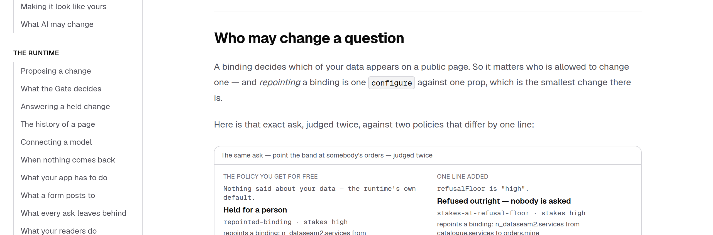

# The other end of the pipe — the Gate watched where data went and never which data came

**Routine:** `Loom daily build` · **Branch:** `framework-38-the-other-end-of-the-pipe`
**Section:** §2 — Composition Runtime
**Record:** [0163](../decisions/0163-a-binding-is-weighed-like-a-destination.md); 0002 and 0007 amended

## What this closes

`Loom docs` filed it on 12 September, and the finding did the hard half: it took
every clause of the argument behind `redirected-submission`, changed one word,
and checked whether each was still true.

> `loom:submit` is the runtime's own key, and both endpoints were registered by
> the host in either case. […] Where a visitor's data goes should not depend on
> who asked for it to move.

All of it survives the substitution. A binding is the runtime's own key; both
sources were registered by the host in either case; and which of a deployment's
data comes out should not depend on who asked for it to change.

**They are the two ends of one pipe, and only one end was watched.** Repointing a
binding from `catalogue.services` to `orders.mine` is one `configure` against one
prop, and `defaultGatePolicy` accepted it: low stakes, `within-policy`, applied
with nobody in the loop. The only defence was a host adding `loom:data` to
`protectedPropKeys` — a line no default deployment has.

## What landed

`repointed-binding`, in the shape `redirected-submission` already has, all the
way through: the fact in `src/runtime/repointing.ts`, a `repointedBindings` field
on `ChangeAnalysis`, a `high` stake factor, and a rung on the ladder below the
refusal floor.

Measured on the real runtime rather than described — the four rows below are one
script's output against this checkout:

| the ask | kind | stakes | reason |
| --- | --- | --- | --- |
| source moved | `requires-confirmation` | high | `repointed-binding` |
| params moved | `requires-confirmation` | high | `repointed-binding` |
| **title changed** *(the control)* | `accepted` | low | `within-policy` |
| source moved, `refusalFloor: "high"` | `rejected` | high | `stakes-at-refusal-floor` |

The last row is the floor staying sovereign over the escalation, which is the
property 0035 established and this rung inherits.



*`/docs/building-with-loom/where-content-comes-from`, 1280×900, served from a
real `next build`. Both verdicts are computed as the page builds — the block
cannot print a claim the Gate did not make.*

## The one place I did not build what was asked for

**The finding recommended weighing the source. This weighs the question, which is
the source *and* the params, and 0163 says why at length.**

The repository's own documented binding is in `binding.ts`'s doc comment:

```json
"bio": { "source": "profile.field", "params": { "field": "bio" } }
```

That selects which of a host's data comes out using nothing but a param. Weighing
the source alone would let `bio` become `salary` unremarked — the exact change
this factor exists to catch, on the very example the reference teaches bindings
with.

**The cost is real and is recorded rather than hidden.** The runtime cannot tell
a param that *selects* data from one that merely *shapes* it; that would take
vocabulary from the source registry, and both 0071 and `redirection.ts` keep this
class of fact host-independent on purpose. So an ambiguous param change reads as
selection, and **widening a `limit` now asks for confirmation too.** Wrong in
that direction costs a confirmation; wrong in the other costs the salary field.
It is the first thing to revisit if it proves noisy, and the fix would be a
declared `selectingParams` on a source entry — a bigger decision than this one.

What counts as a repointing is otherwise `redirection.ts`'s rule unchanged: a
question that persists at one node under one name and differs. Gained, lost, and
stopped-parsing are all not-repointings, for its reasons.

**Identity is the plan's own request key.** `planDataIn` already canonicalises
source and params into the string that decides whether two bindings share an
answer, which is exactly "the same question". A second notion of sameness would
have drifted from the first. `planTreeData` now delegates to `planDataIn`, which
is the split `planSubmissionsIn` has carried next door all along — symmetry
restored, not surface added.

## What the eighth rung cost outside this lane

Adding a union member breaks every exhaustive map that names it, which is the
design working. Seven files across three surfaces had to gain a sentence, and one
count is **rendered** rather than commented. All of it is filed for its owners.

| surface | what | why it could not wait |
| --- | --- | --- |
| `(portal)` | a `which-data-a-page-shows` rule card, a `RuleId`, and three sentences | `rulesOf` is held to name every reason the Gate can record, exactly once |
| `(docs)` | the binding section's comparison, prose, and its two pinned assertions | the page said the Gate *applies* this change; it no longer does |
| `(marketing)` | a question for the new rung, and `"The seven, one by one"` → `"The eight, one by one"` | `the-rules.ts` **throws at module load** for a rung with no question |

**One of those is a claim, not a count, and I flagged it rather than trusted it.**
Two marketing files said *three of the seven rules refuse to consult who asked at
all*. The new rung is host-independent and ignores origin, so this branch wrote
*four of the eight* — arithmetic I did by reading the ladder, where that page's
whole virtue is that its numbers are read off sixteen real runs. `Loom marketing`
is asked to re-derive it.

### A defect the screenshot found that no test would have

The docs block read `verdict.kind === "accepted" ? "Applied…" : "Held for a
person"` — a binary, and correct for as long as the page produced only those two
kinds. Making the second column a refusal made it label a **refused** change
*"held for a person"*, which is the opposite of what the prose beside it says.

Every test still passed. The producer asserts the disposition, the claims test
asserts the prose, and nothing asserted the word in between. It is now a
three-way map derived from `DispositionKind` with a test that names the refusal,
and it is the argument for taking the picture rather than trusting the suite.

## Records

- **0163** — *A binding is weighed like a destination, and its params are half of
  it.* Accepted. Four alternatives recorded as rejected, including the finding's
  own recommendation.
- **0002** and **0007** amended in place under 0099 — seven rungs to eight.
  Neither is superseded; nothing is reversed. **Both were caught by
  `record-claims.test.ts`, which is the check the 28 August amendment installed
  for exactly this.** It did its job on the first run.
- **0163 rather than 0161.** `pnpm decisions:index` reports 0161 and 0162 as
  claimed on unmerged branches — #312 and #313 have both taken 0161, which is a
  collision those two will have to settle. Taking the next free number off `main`
  would have made it a three-way.

## Findings

**Closed:** *a repointed form is weighed by the runtime; a repointed binding is
not* (`Loom docs`, 12 September), with the departure from its recommendation
stated in the entry rather than buried here.

**Filed:** three for the lanes whose files this branch touched — `Loom docs`
(the rewritten section, and the choice of what its second column should
demonstrate is theirs to take back), `Loom marketing` (the counts, and the claim
to re-derive), `Loom portal` (the card, written in their registers by imitation).

**Filed for this lane:** *a `git checkout` to undo a restored defect silently
reverted two files to `HEAD`.* Detail below.

## The mistake worth writing down

While restoring defects I used `git checkout <path>` to undo one, on two files
whose changes were **not yet committed**. It reverted `stakes.ts` and `gate.ts`
to `HEAD` and silently deleted the entire factor and the entire rung.

This is `Loom primitives`' finding from #313, eight hours old, walked into from
the other lane:

> a `git checkout` used to undo a defect reverted `hero-band.ts` to `HEAD` and
> silently dropped an uncommitted `part` field. Green `verify` before, broken
> after.

It was caught in seconds, because the restoration loop re-runs the suite and 137
passing became 137 passing *for the wrong reason*. That is luck rather than
process. **The remedy is one line: commit the unit before restoring defects into
it.** This branch did so afterwards, and the remaining four restorations cost
nothing.

## Tests

`pnpm install && pnpm verify` — **green, exit 0.**

| | Files | Tests |
| --- | --- | --- |
| Runtime (`src/`) | 151 | 2,658 |
| Application (`apps/loom`) | 251 | 4,379 |

640 findings, 0 malformed. 102 prerendered pages, 828 text junctions, 0 run
together.

**40 tests are new across 1 new test file.** Nothing failed in the final run and
nothing was skipped.

**No existing test was weakened.** Five were *changed*, and each is a pin that the
new rung moves rather than an assertion relaxed: the `ESCALATION_LADDER` list, the
`analysisOf` fixture's new field, and the three in `(docs)`/`(marketing)` that
pinned prose to a verdict the runtime no longer gives.

**Six defects restored one at a time, every one caught:**

| restored | caught by |
| --- | --- |
| factor level `high` → `medium` | 4 tests |
| the rung dropped from `ESCALATION_RULES` | 13 tests |
| params ignored (source-only comparison) | 5 tests |
| a gained binding counted as repointed | 3 tests |
| a params move printed as `from X to X` | 3 tests |
| the rung dropped, factor kept | 7 tests |

Red four times before green, all mine: two type errors in test files written
after the last `tsc` (`Record<string, unknown>` where a tree wants `JsonObject`),
and two rounds of generated artefacts — `docs:fences` and `docs:api` — regenerated
with their own commands rather than by hand, per 0139.

## Open questions

1. **Is a `limit` widening worth a confirmation?** 0163 takes the safe reading
   deliberately and names the escape hatch. It is the one judgement here a
   maintainer might reverse, and reversing it is a one-line change to
   `questionsIn` plus a note on the record.
2. **Should `boundTree` be published?** `formTree` is in `@loom/runtime/testing`
   and its twin is not, because a published entry point is a promise and nothing
   outside this package has asked. Cheap to add, impossible to take back.
3. **Nothing else is blocking.**
