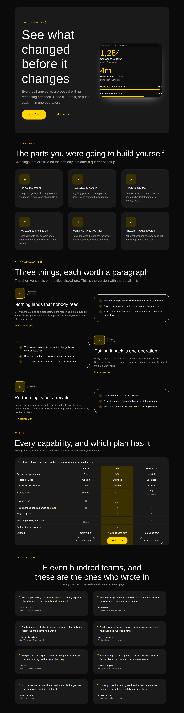

# The phrasebook and the page

**Routine:** `Loom primitives` · **Date:** 2026-09-16 · **Branch:**
`primitives-36-the-phrasebook-and-the-page` · **Section:** §4b

## What this run chose, and why that

Yesterday's run added no primitives and I asked the maintainer, on #305, whether
that was the right call — offering to spend the next run pushing compositions
from nineteen toward the inventory's target instead. No answer came, so this run
takes the route this lane's own measurement already recommends:

> **Recommendation: hold the vocabulary near 110 and spend the week on
> compositions.** — `docs/primitive-gap-inventory.md`, 13 September

The arithmetic behind that is unchanged and worth restating, because it is what
makes the target reachable at all. Distinct primitives have an honest ceiling
around 110–120; a padded 250 would cost every interpretation request about
42,600 characters and make the model choose from 250 near-identical
descriptions. **Compositions cost nothing per request**, because a composition
registers no type. And they are what 21st.dev's numbers actually count: its 1152
heroes are one block drawn 1152 ways.

So the work is compositions. The run hit a wall in the first ten minutes, and
the wall turned out to be the interesting part.

## The catalogue could not hold a second hero, and a test said so

There is only one page's worth of *distinct bands* — that is what a page is.
Growing the catalogue therefore means **more designs of the same band**, and
`STARTER_COMPOSITIONS` was doing two jobs that had been compatible only while it
held exactly one design of each:

1. the catalogue — everything a surface may offer;
2. the page — taken in order, one complete landing document.

The list's own doc comment, written on 13 September, named the day this would
stop working and asked the next run to watch for it:

> **This list stops being a page before it stops being useful** […] A second
> hero, a two-tier pricing band, a testimonial wall as a marquee — all
> legitimate, none of them insertable into a sequence that is meant to read as
> one document. […] It is not split here because thirteen still assembles one,
> and splitting it before it breaks would be inventing a structure ahead of its
> reader.

Every clause of that was right, including the last one. And the repository had
already written down *how* it would fail, in `compositions.test.ts`:

> Nine bands assembled in order are one document outline, and the hero is the
> only band that opens one.

Adding `hero-split` to a list that is also the page turns that test red. It is
measured rather than argued — restoring the old shape gives
`expected [ 1, 1 ] to have a length of 1 but got 2`, which is two `<h1>`s on one
document. The test was not in the way; it was the instrument saying the two jobs
had come apart.

[0162](../decisions/0162-the-catalogue-is-a-phrasebook-and-the-page-is-one-path-through-it.md)
splits them:

| | what it is |
| --- | --- |
| `STARTER_COMPOSITIONS` | the phrasebook — every design, growing without limit |
| `PAGE_SEQUENCE` | one design of each band, in page order, **derived** |
| `COMPOSITION_PARTS` | the nineteen parts, which is both the vocabulary and the order |
| `compositionsForPart` | every design of one band — *show me the heroes* |

A band now declares `part`, which is
[0114](../decisions/0114-a-primitive-declares-what-part-it-plays-and-the-registry-is-asked.md)'s
shape one level up. The page is derived from the convention that **a part's
canonical design has the part's own name as its id**, so there is no second list
to fall out of step with the first, and a part left with no canonical design is
a red test rather than a page quietly missing a band.

**Four published names, twenty-three bands behind them.** That is 0157's finding
paying off exactly as it predicted: the docs search index counts published
names, so the next fifty designs cost the published surface nothing.

## The rule that keeps this from becoming a dumping ground

This is the half of 0162 I most want looked at, because it is what stops a
phrasebook turning into shades of one.

> **A design earns a catalogue entry only by building a different set of nodes.**

That is 0052's own test lifted one level. A band that differs from another
design of its part only in its **props** is not a second design — it is a
`configure` of the first, and shipping it puts a catalogue entry where a
one-operation edit belongs. A centred hero and a left-aligned hero are one band.

It is asserted, not asked for: `compositions.test.ts` compares the node-type
shape of every design of a part. Adding a props-only clone of the hero fails
with *"two designs of the hero band build the same tree: expected 2 to be 3"*.

## The four designs, and which Hermes fields moved

Nothing was ported from Hermes this run — these are new designs over the content
models already ported — so the honest answer to the brief's standing question is
**no fields became nodes and none became props.** What each design *is*, against
0052, is below.

| design | part | why it is a design and not a `configure` |
| --- | --- | --- |
| **`hero-split`** | hero | fourteen nodes in the `media` region the centred hero does not have |
| **`features-alternating`** | features | `loom.split` per claim with a perk list; the grid has `loom.feature` tiles and no such child |
| **`pricing-matrix`** | pricing | `comparison-row`/`comparison`; the cards are `tier`/`perk-list`. No node in one corresponds to a node in the other |
| **`testimonials-wall`** | testimonials | two `loom.marquee` rows; the grid has neither |

Two of them are worth a paragraph.

**`hero-split` closes `hero-band`'s standing excuse, and not by finding a
picture.** That file has carried a section called *why there is no image* since
it shipped, and every word of it is still true — but all of it is about
`loom.media`. The slot is not typed to it. What goes in the region is
`loom.frame` over a small product surface **built out of the library**: two
`loom.stat` figures and two `loom.meter` bars. No asset, no third-party URL, no
file a host has to place, and it re-themes with the page. A host who wants their
real numbers edits nodes rather than opening an image editor.

**`pricing-matrix` is the case a future run will be tempted to collapse.** A
`layout: "cards" | "matrix"` prop on `loom.tier-table` would render both, and it
is wrong on the plainest reading of 0052: a prop that would have to delete forty
nodes and build thirty-eight others is `remove` and `insert` wearing a prop's
clothes.

## The eight pixels, which is the best thing in this run

The wall's first photograph was bad, and the reason took measuring rather than
looking. The specimen harness forces `prefers-reduced-motion: reduce` so shots
are deterministic — so what it photographs is the marquee's **static fallback**,
which is the rendering every reader who asked for calm actually gets.

It was one card per row with half the band empty. Measured in Chromium at
1280px:

| | run content box | item | gap | needs |
| --- | --- | --- | --- | --- |
| before | **1048px** | 512px | 32px | 1056px for two |

**Eight pixels**, and the band fell from two columns to one.

The cause: the run's trailing padding exists so the run and its echo **tile
seamlessly** while travelling. There are two renderings with nothing to tile
against — the still one, and the reduced-motion one, where the track becomes a
block and the run wraps — and the padding was set **inline**, so it beat both
rules that would have cancelled it.

That is
[0155](../decisions/0155-a-container-may-only-add-to-its-children-what-they-left-unspoken.md)
in the **third** place this lane has found it, one day after the second. The gap
is now declared by the primitive as a custom property and applied by the
stylesheet — a custom property rather than a class per density, because the
value is a prop and a rule cannot enumerate six of them without six rules.

| at 1280px, reduced motion | before | after |
| --- | --- | --- |
| rows × per row | 4 × 1 | **2 × 2** |
| band height | 789px | **378px** |
| with motion — *the control* | 1 row, 4 across, 173px | **1 row, 4 across, 173px** |

The third row is the one the fix turns on, and it is why the test asserts both
halves: a `padding-inline-end` put back inline leaves the two rules quietly
doing nothing, with no error and no other failing test. Restoring it fails the
new assertion, which was checked.

This also improves `loom.logo-cloud`, which uses the same marquee and has had
the same dead column in its reduced-motion rendering the whole time.

## What I looked at and decided was not a defect

The bold screenshots show what looks like a bar escaping the hero frame. It is
not: measured, **no content overflows the frame at either width** — the only
element outside its box is the empty `loom-frame-pins` layer, whose rect is
degenerate because nothing is in it. What the eye caught is the frame's own
shadow, and `loom.frame`'s doc comment predicted precisely this:

> this makes it a **shade under a light palette and a halo under a dark one**.
> That is the right answer for both and it is not the same effect, which only
> the two screenshots side by side will say.

Those two screenshots are in this report, and they say it.

## What the library still cannot express

**The catalogue cannot photograph a marquee doing what it does.** Every
screenshot this lane takes forces reduced motion, which is right for
determinism and means the wall's *travelling* rendering has never been in a
report and cannot be. The static fallback is now good, which is the half that
matters most since it is what a real audience sees — but a reviewer looking at
the picture is not reviewing the band. Filed.

**`COMPOSITION_PARTS` is closed, and a band that is not one of the nineteen
parts cannot be added.** A newsletter strip or a careers band needs the tuple
widened first. Deliberate, and the same bar 0114 sets one level down: widen it
when there is a design that needs it.

**The arithmetic to 250 does not work at this rate.** Nineteen to twenty-three
in one run, against a second row the inventory sizes at ~140 by 19 September.
The structure that makes 140 *possible* is what landed here; the designs
themselves are still one run at a time, and four excellent ones per run does not
reach 140 in three days. That is the maintainer's call to make and it is in the
PR comment rather than buried here.

## Checks

- `pnpm install && pnpm verify` green — twice, once before the generated API
  reference was regenerated and once after. 2,630 runtime tests, 4,375
  application tests, 636 findings 0 malformed, 102 prerendered pages.
- **Four defects restored, four caught**, each by the assertion that should:
  the canonical hero's id renamed (5 tests), a props-only second design added
  (the shape assertion, by name), the page claim pointed back at the phrasebook
  (`[1, 1]` where one was expected), the marquee padding put back inline.
- One of those restorations found a **real defect in my own tree**: a
  `git checkout` used to undo a defect reverted `hero-band.ts` to `HEAD`, which
  silently dropped the `part` field I had added and never committed. Green
  `verify` before, broken after, and nothing but the restoration exercise would
  have caught it before the PR.
- Four photographs, two palettes, two viewports. `scrollWidth 390 / innerWidth
  390` and `1280 / 1280` in all four.
- No literal colour anywhere in the diff; every value is a token or a length.

## Outside the lane

One file, and it is the same one as last run:
`apps/loom/app/(docs)/_lib/api/reference.generated.json`. Generated, not edited
(0139) — the published surface moved when the four names were added.

`decisions/README.md` regenerated with `pnpm decisions:index`.
