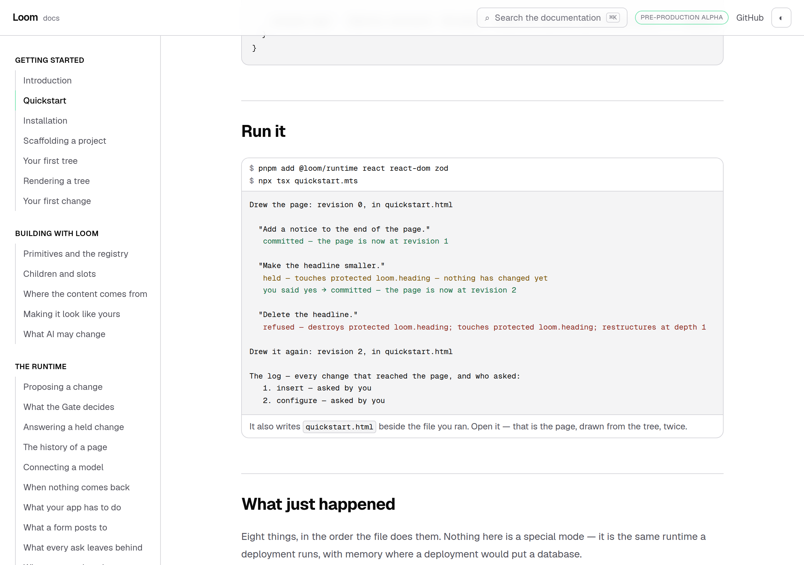
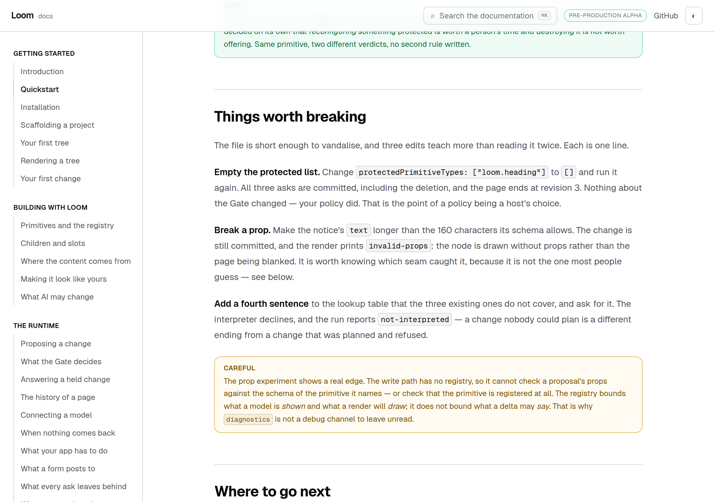
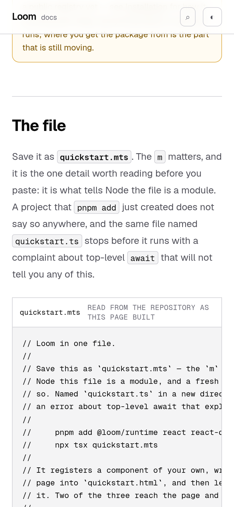

# 17 September 2026 — Loom in one file, and the page that is checked by running it

**Routine:** `Loom docs` · **Branch:** `docs-27-one-file` · **Section:** §4c

**Preview:** the pull request's Vercel deployment for
`/docs/getting-started/quickstart`. Read off the deployment rather than opened —
`vercel.app` is off this sandbox's egress allowlist, which is the standing
15 September finding and is not re-filed. Every screenshot below is a production
build of this commit, served locally by `next start`.



## What this run was

The hole this lane has named as the largest on the site for three consecutive
reports, and did not close on any of them:

> *Getting started* hands a reader six pages before they have run anything. The
> exit condition is a stranger installing Loom, registering a primitive and
> getting a proposal accepted from the site alone — and the one page that would
> carry them, a single copy-paste file that renders, proposes and applies in one
> process with no database, still does not exist. Every part of it is
> documented; nothing puts it in one place.

It is closed. **`/docs/getting-started/quickstart`** is the second page of the
section, before *Installation*, and it is one file and one command.

There were no open findings owned by this lane and no maintainer comments on any
open pull request, so this was the plan.

## What the file is

One file — 305 lines, of which 197 are code and the rest are the comments doing
the teaching — which a reader saves and runs. In
order it: defines a primitive of their own with `definePrimitive`, builds a
registry from the starter library plus that one, writes a three-node page down
as data, draws it to `quickstart.html`, opens a memory tree store and hold
store, fills the interpreter seam with a lookup table where a model would go,
declares a policy naming `loom.heading` protected, and then asks for three
changes through `commitIntent`.

The three asks get three different answers, which is the reason there are three:

| Ask | Answer | Why |
| --- | --- | --- |
| Add a notice to the end of the page | **committed** | a new node at the end threatens nothing — and the node is one of *theirs* |
| Make the headline smaller | **held**, then committed | reconfiguring a protected primitive is `high`; `confirmHeld` re-judges and applies |
| Delete the headline | **refused** | destroying a protected primitive is `critical` |

All three exit-condition beats — install, register a primitive, get a proposal
accepted — happen in one process with no database, no API key and no framework.

## The decision that shaped it: the file is not prose

*Quickstart* is the only page on this site whose subject is a file rather than an
idea, and it makes a claim every other page does not: **that if you run this,
this happens.** A transcript pasted into MDX is a screenshot of a program that
worked once. It keeps reading exactly as confidently on the day the runtime stops
printing it, and the reader is the one who finds out.

So neither half of the page is typed.

- **The file is a real module in the repository**, `_lib/quickstart/quickstart.ts`,
  read off disk by a server component as the page builds. The block a reader
  copies and the file the tests run are the same bytes, and there is no second
  copy to edit.
- **The transcript is its exact standard output**, written down once in
  `_lib/quickstart/program.ts`, and compared **in full** against a real run.

That second one is only worth anything because the run is real. `quickstart.test.ts`
spawns `tsx` on the file and diffs the whole of stdout. It is the slowest test in
the directory — three process starts and a runtime import each — and that is the
trade, taken deliberately.

## The part that would have burned every reader

The workspace the test runs in is built to be **a reader's directory and not this
repository's**, and that is what found it.

A project `pnpm add` just created has a `package.json` with dependencies and no
`"type": "module"`. This repository's has the field. Under ours, the file runs
fine whatever it is called. Under theirs, `quickstart.ts` **does not run at all**:
esbuild reads it as CommonJS, the top-level `await` is illegal there, and the
reader gets

```
ERROR: Top-level await is currently not supported with the "cjs" output format
```

before a line of Loom executes. First command, first ten seconds, an error that
names nothing they did.

The page now says **`quickstart.mts`** and spends a sentence on why. The test
asserts both directions: the `.mts` copy runs and prints the transcript, and a
`.ts` copy in the same directory rejects with *top-level await*. If that ever
stops being true, the page stops saying it.

I would not have found this by reasoning. I found it because the first thing I
tried after the file worked was to copy it somewhere else.

## Three edits, run rather than described

*Things worth breaking* invites a reader to make three one-line edits. Prose
describing an experiment nobody has run is the most rottable thing on a
documentation page, so each is performed by the test — the same substitution the
page describes in words, applied to a copy, run, and the promised ending
asserted:

- **Empty `protectedPrimitiveTypes`** → all three asks committed, page ends at
  revision 3. Three `committed —` lines, counted.
- **A `text` prop 200 characters long against a 160-character schema** → still
  committed, with `invalid-props` on stderr.
- **A fourth utterance the lookup table does not cover** → `not-interpreted`,
  which is a different ending from a refusal.

The second is the one that turned into a finding.



## Decisions taken that were not specified

**The repository file is `.ts` and the reader's is `.mts`.** `tsconfig.json`
includes `**/*.ts` and not `.mts`, so naming the repository copy `.mts` would
have taken it out of the application's typecheck — an uncompiled quickstart being
the exact failure the whole directory exists to prevent. The reader is told
`.mts` because they are standing somewhere else. Both are written down where they
are decided, and the test checks the instruction rather than believing it.

**The interpreter in the file is a lookup table, and says so.** A quickstart that
needed an API key would be broken for everyone who has not got one, and the
substantive point is better made this way round: the runtime does not care where
a proposal came from, only what it says. `docs/signals`-style presets already
make the same argument for this site's examples (0057).

**The install line gains `zod`.** *Installation* names `@loom/runtime react
react-dom`; a file that declares a primitive of its own writes a schema, and the
runtime's own dependency is not necessarily resolvable from a reader's project. A
test reads the file's imports, drops the Node builtins, and holds the remainder
against the install line, so an import added later without a matching package is
a red test rather than a reader's module-not-found.

**The transcript is compared exactly rather than by substring.** Every line of it
is deterministic — sequential ids, no timestamps, no model — so the strict
comparison is available, and it is what makes the page a claim rather than an
impression.

**The page counts nothing out loud that it does not own.** Following yesterday's
finding about claims tests that pin arity: the page says *three asks* because the
file makes three, and the test derives that list from the file's own
`await ask("…")` lines rather than from a number typed twice. The walkthrough
originally opened *"Eight things, in the order the file does them"* — a count of
the file's own sections, typed into prose, wrong the day the file grows a ninth.
It now opens *"Each step of the file, in the order it runs them"* and the reader
counts the list themselves.

**No decision record.** Nothing here decides anything. The page documents
existing behaviour and the one thing it found that is arguable is filed as a
finding for the lane that owns `src/`, not settled here.

## Found while writing

**The write path has no registry.** Filed for `Loom daily build`. A proposal that
inserts a node of an unregistered primitive type, or one whose props its own
schema refuses, is **committed** — a revision is appended and the only signal is
a render diagnostic. It could not be otherwise: `CompositionRuntime` is
`interpreter`, `policySource`, `events`, `clock`, `idFactory` and an optional
`repairer`, with no resolver and no validator anywhere on the write path.

The precise version of what the docs have been saying loosely is worth having:
the **catalogue** bounds what a model is shown, the **render seam** bounds what
reaches a screen, and **nothing bounds what a delta may say**. There is a real
argument for that — a tree may name a primitive a later deployment rolled back,
and a write path that refused unknown types would make a rollback un-undoable.
What is missing either way is a *seam*: a host that would rather refuse a
proposal it can never draw cannot opt in without moving the check outside the one
write path, which is what 0017 exists to prevent.

The page documents what is true rather than what I would like to be true, and
both experiments are run by the test — so if a validator seam lands, the page
goes red and gets rewritten.

## At 390 pixels

`document.documentElement.scrollWidth` is exactly 390 at a 390px viewport and
1280 at 1280. The file block scrolls inside its own box, as every code block on
this site does; the terminal panel does the same.



The screenshots are light. That is the standing gap this lane recorded on 14, 15
and 16 September — `pnpm shoot` photographs an address, the theme lives in
`localStorage`, and the harness has no way to set one before the shutter. Not
re-filed.

## Tests

`pnpm install && pnpm verify` at the repository root: **green, exit 0.**

| Suite | Files | Tests |
| --- | --- | --- |
| `@loom/runtime` | 153 | 2,697 passed — `src/` was not opened |
| `@loom/app` | 264 | 4,668 passed |
| `findings:check` | — | 655 findings, 0 malformed |

Baseline on `main`, measured by checking it out and running the same suite:
**263 files, 4,652 tests, all passing.** So this branch is **+16 tests in one new
test file**, all of them in `_lib/quickstart/quickstart.test.ts`.

Nothing was skipped, no cap was raised, and no test was weakened.

The suite was green, which is not evidence on its own, so three of the claims
were checked by breaking them and watching the right test go red:

- **Changed a printed line in the file** without changing the transcript →
  *"prints exactly the transcript the page shows"* fails, with the diff on
  screen. This is the check the whole page rests on.
- **Changed the notice schema's maximum** from 160 to 150 → *"quotes the
  schema's own maximum rather than a second copy of it"* fails. Without it the
  page's instruction to exceed 160 characters would go stale silently, because
  the experiment produces a diagnostic either way.
- **Added an import of `@/app/(docs)/…`** to the file → *"imports only what the
  install line installs"* fails. That is the one mistake that would compile here
  and break in the first directory anybody copies the file to.

In each case the file was restored byte for byte afterwards.

Two things went red on their own and are worth recording:

- **The prop experiment was originally asserted against stdout** and failed on
  the first run: a diagnostic is a warning, and the file prints it where warnings
  go. Corrected to stderr — which also means the page's *"the render prints
  `invalid-props`"* is now attached to the stream it is really on.
- **`actor: intent.actor`** in the file's provenance failed `tsc` under
  `exactOptionalPropertyTypes` — absent and present-and-undefined are different
  things here. Fixed to the spread the rest of the repository uses, with the
  reason in a comment, because a reader copying this file is copying that idiom
  too.

## Scope

`apps/loom/app/(docs)/` only, plus `FINDINGS.md` and this report. Seven files
under `(docs)`: five new — the page, the file, `_lib/quickstart/program.ts`, its
test, and the two components — and two touched: `_lib/nav.ts` for the sidebar
entry, and one paragraph added to *Introduction* pointing at the new page.

**No file in another lane was opened.** `src/` is untouched — `git diff main --
src/` is empty. The API reference was not regenerated because the runtime's
published surface did not move, and `pnpm --filter @loom/app docs:fences`
reports no drift: the new page's only fence is `bash`, which is not compiled.

## Open questions

**Nothing blocking.**

**What I would write next.** The quickstart ends by sending a reader to
*Installation*, and *Installation* is now the third page rather than the second —
the arrival route on *Introduction* still describes six steps beginning there,
and it is right to. What it does not yet do is acknowledge that a reader may
arrive at step one having already run the whole loop. That is a paragraph in
`_lib/arrival/route.ts`, not a page, and it is small enough to ride with
something else.

The larger one, unchanged: **Architecture is three pages and the course in
`lessons/` is twenty-six.** The section indexes them correctly and says nothing
they do not — which is right — but a reader who wants the argument is currently
sent to a GitHub blob. When `lessons/` grows a route, that is the section that
changes.
