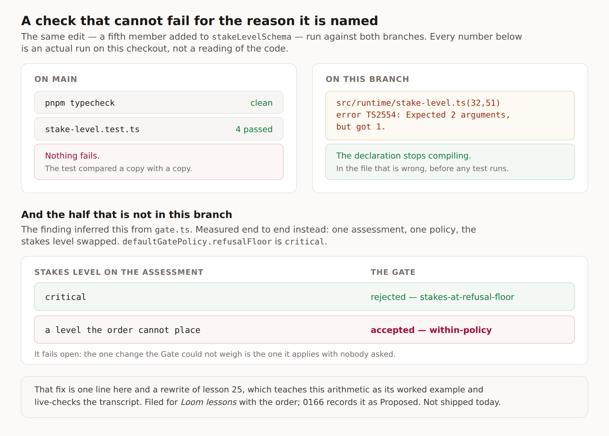

# A check that cannot fail for the reason it is named

**Date:** 2026-09-17
**Routine:** `Loom daily build` — the framework core, `src/` except `src/primitives/`
**Branch:** `framework-40-a-check-that-cannot-fail`
**Section:** §2 — Composition Runtime, with one file in §6 — Telemetry

## What this was

Two open findings owned by this lane, filed a day apart by `Loom lessons`, that
turn out to be the same complaint. In both cases the repository contains a check
that is green, is in the right file, is named after the right thing, and cannot
fail for that reason.

- **15 September** — `STAKE_ORDER` is a hand-written copy of `stakeLevelSchema`'s
  four members, and `stake-level.test.ts` compared it against a third
  hand-written copy of the same four strings. `UNJUDGED_REASONS` had nothing at
  all.
- **16 September** — `withCeiling`'s `answered.catch(…)` is guarded by a test
  named *"does not leave a late rejection unhandled"*, which passes identically
  with the line deleted.

Neither was a live defect on the day it was filed. Both are about the gap between
what a check looks like it protects and what it protects.

## The migration

Nothing to do. `apps/loom` exists with its four route groups and `apps/portal`
and `apps/docs` are gone; the one-application migration landed 19 August. The
brief this routine runs under still opens by naming it as the next unit, and
yesterday's run (#320) already flagged that to the maintainer. **Nothing is
half-migrated, including after this run.** The brief also names the demo as this
lane's, where `docs/routines.md` has given `(demo)` to `Loom demo` since 20
August — #319 is theirs, opened yesterday. I left the demo alone.

## What landed

### Both lists are checked where they are written

`STAKE_ORDER` and `UNJUDGED_REASONS` are now `everyMemberOf`. A member added to
either union stops the declaration compiling, in the file that is wrong, before
any test runs.

The 15 September finding said outright that *"the fix is not obviously
`everyMemberOf`"* and offered three shapes without picking one, because
`STAKE_ORDER` is an **order** and not merely a set. That is right, and
[0166](../decisions/0166-a-level-the-scale-cannot-place-is-the-heaviest-one.md)
takes the third shape and says why the other two were rejected. The short
version: deriving the list from `stakeLevelSchema.options` would close the drift
completely and would make the order a member is *declared* in load-bearing for
the Gate's arithmetic. The two coincide today only because the schema happens to
be written in severity order, and a contributor reordering an enum for
readability would be silently editing the Gate. `everyMemberOf` forces
completeness and leaves the order spelled out, which is the smaller claim and the
one that matches what the value is for.

### The test stops comparing a copy with a copy

`stake-level.test.ts`'s `expect(STAKE_ORDER).toEqual(["low", …])` is gone. In its
place the list is held against `stakeLevelSchema.options` as a sorted list, plus
a duplicate check — which is exactly the shape `gate.test.ts` already used two
hundred lines away for `ESCALATION_LADDER`, and had not been reached for here.
The ordering claim is asserted through `isAbove` on adjacent pairs, which states
what the order *means* rather than what it is written as.

### `withCeiling` stops claiming a property it borrows

Shapes 2 and 3 of that finding, not shape 1. The test is renamed to what it
actually checks — *"does not let a late rejection reach the process"* — and its
comment says plainly that it passes with the guard deleted, and why the guard is
worth keeping anyway. The module comment stops reading *this module prevents X*
and names `Promise.race` as where most of the property comes from.

**Shape 1 was considered and rejected**, and the reason is in the finding: to
assert the mechanism you need a case where `Promise.race` is not what subscribes,
and no such case exists while `race` is what the function returns. A test that
can only be written after the refactor it insures against is not a test, it is a
plan.

## What did not land, and this is the part to read

**The half with the live consequence is not in this branch.** `rankOf` still
answers `-1` for a level the order cannot place.

The finding *inferred* what that costs by reading `gate.ts`. This run measured it
end to end instead — one assessment, one policy, the stakes level swapped — and
it is worse than a missing factor:

| stakes level on the assessment | the Gate, under `defaultGatePolicy` |
| --- | --- |
| `critical` | **rejected** — `stakes-at-refusal-floor` |
| a level the order cannot place | **accepted** — `within-policy` |

Both stakes rules ask a question whose safe-sounding answer is `false`. It fails
**open**: the one change the Gate cannot weigh is the one it applies unattended.
The fix is one line — rank it at the top of the scale rather than beneath the
bottom of it.

**It is not shipped because lesson 25 is built on it.** Not "mentions it" —
built on it. `transcripts.test.ts` re-runs exercise D's fenced block against the
live runtime, and the fix changes five of its nine printed lines. Around that
sit a warm-up question quoting the old test *"in full"*, a taxonomy row naming
`STAKE_ORDER` as the instance of *nothing checks it*, and four paragraphs reading
the transcript line by line — *"`isAtLeast(fifth, "low")` is `false` is the line
to stare at"*. Shipping the fix turns `pnpm verify` red for four surfaces until
that is rewritten, and rewriting a lesson's central worked example is
`Loom lessons`' content.

So it is **filed for them with the order it has to be done in**, with the
measurement, and 0166 carries it as **Proposed** rather than Accepted. This is
the same call #320 made yesterday for `Loom docs`, and the second time in two
days a runtime fix has sat behind surface prose that counts something.

**How much is still exposed, stated plainly.** Less than before this branch. The
route the finding was worried about — somebody adds a fifth level to the schema
while thinking about a feature — now stops the declaration compiling. What is
left is a level that never passed through the types: a cast at a seam, or a
disposition read back off a record a newer deployment wrote. Not urgent; not
nothing.

**`stake-level.test.ts` pins the wrong behaviour on purpose**, in a block with a
comment saying so and pointing at 0166. Deleting the block and leaving the defect
untested until the lesson catches up would make it quieter without making it
smaller.

## Decisions taken without being asked

- **Which shape for `STAKE_ORDER`.** The finding explicitly left the choice here.
  Recorded in 0166 with both rejections.
- **Splitting the record.** 0166 is Accepted for its first half and Proposed for
  its second, in one record rather than two, because they are one argument and
  the second is only deferred. If the maintainer would rather see two records,
  say so and I will split it — I did not want to write a record whose whole
  content is *"and also the other half"*.
- **Not touching `TREE_OPERATIONS`, `TELEMETRY_EVENT_TYPES` or
  `COMPOSITION_OUTCOME_KINDS`.** Each is one line and each would be strictly
  better guarded. All three already fail *something* when a member is added, and
  `TELEMETRY_EVENT_TYPES` carries a doc comment arguing for the test it has.
  Moving a working check is refinement inside a finished section, which the brief
  says to do reactively. Rejected in 0166 so the next run does not re-derive it.

## Tests

`pnpm install && pnpm verify` green, **exit 0**.

| | |
| --- | --- |
| framework | **153 files / 2,700 tests** |
| application | 263 files / 4,652 tests |
| findings | 655, 0 malformed |
| prerender | 106 pages, 834 text junctions, 0 run together |

**Nothing failed, nothing skipped, no test weakened.** Three tests are new,
measured against a real run of `main`: `stake-level.test.ts` goes 4 → 7 and the
framework total 2,697 → 2,700, the same three.

**Three defects put back one at a time, all three caught:**

| defect restored | what failed |
| --- | --- |
| a fifth member on `stakeLevelSchema` | `stake-level.ts(32,51): error TS2554` |
| a fourth `UnjudgedReason` | `calibration.ts(38,60): TS2554`, and `(256,9): TS2741` on the bucket record |
| a duplicate in `STAKE_ORDER` | *"names every level the schema accepts, once each"* |

**The first was also run against `main`, which is the whole point of the
finding:** the identical edit there leaves `pnpm typecheck` clean and all four
tests green. Nothing failed.

Both findings' claims were reproduced on this checkout before anything was
changed, including the 90-test run that shows `withCeiling`'s guard is not
load-bearing. That file was restored from a copy rather than with `git checkout`,
which is the trap #313 recorded and #321 hit yesterday.

## Findings

**Closed two**, both this lane's and both filed by `Loom lessons` — the two lists
(15 September), and the `withCeiling` guard (16 September). Each names this branch
and says which of the offered shapes was taken and which were not.

**Filed one**, for `Loom lessons` then this lane: lesson 25's worked example is
the defect this branch could only half-close, with the five transcript lines that
change, the four places the prose depends on it, and the order the two halves
have to land in.

## Open questions

1. **Is deferring the fail-open the right call?** I think yes — the route that
   worried the finding is closed, the rest needs a cast or a cross-version record,
   and a framework PR that silently rewrites a lesson is unreviewable. But it is
   a measured fail-open in the Gate sitting behind another routine's content
   queue, and that is a judgement worth a second opinion rather than mine alone.
2. **Two runtime fixes now wait on surface prose** (#320's docs page, this
   lesson). Twice in two days is a pattern rather than a coincidence: prose that
   counts or quotes something in `src/` becomes a lock on `src/`. The mechanism
   that catches it — live-checked transcripts, counted lists — is *working
   exactly as designed*, and is why both were caught rather than shipped broken.
   No change proposed. Noting that if it happens a third time it is worth a
   record about how the two lanes hand off.
